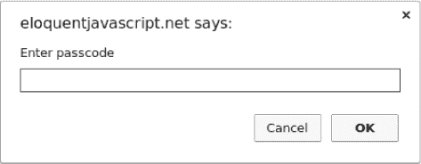
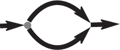
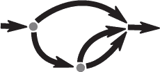

# 第三章：程序结构

在本章中，我们将开始做一些真正可以称之为`编程`的事情。我们将把对JavaScript语言的掌握扩展到名词和我们迄今为止看到的句子片段的范围，达到能够表达有意义的散文的程度。

### 表达式与语句

在第一章中，我们创建了值并将运算符应用于这些值以获得新值。像这样创建值是任何JavaScript程序的主要内容。但这些内容必须框架在一个更大的结构中才能有用。这就是我们在本章中要讨论的内容。

产生一个值的代码片段称为`表达式`。每个字面写出的值（如`22`或`“精神分析”`）都是一个表达式。括号中的表达式也是表达式，二元运算符应用于两个表达式或一元运算符应用于一个表达式也是如此。

这展示了基于语言的接口的部分美妙之处。表达式可以包含其他表达式，这与人类语言中子句嵌套的方式类似——一个子句可以包含它自己的子句，依此类推。这使我们能够构建描述任意复杂计算的表达式。

如果一个表达式对应于一个句子片段，那么JavaScript的`语句`对应于一个完整的句子。一个程序是一系列语句。

最简单的语句是一个表达式，后面跟着一个分号。这是一个程序：

```js
1;
!false;
```

不过，这仍然是一个无用的程序。一个表达式可以满足于仅仅生成一个值，然后该值可以被外部代码使用。然而，一个语句是独立存在的，因此如果它不影响世界，那就是无用的。它可以在屏幕上显示某些内容，比如通过`console.log`，或者以某种方式改变机器的状态，从而影响之后的语句。这些变化被称为`副作用`。前一个示例中的语句仅仅生成值`1`和`true`，然后立即将它们丢弃。这对世界没有任何影响。当你运行这个程序时，没有任何可观察的事情发生。

在某些情况下，JavaScript允许你省略语句末尾的分号。在其他情况下，它必须存在，否则下一行将被视为同一语句的一部分。关于何时可以安全省略分号的规则有些复杂且容易出错。因此在本书中，所有需要分号的语句都会包含一个。我建议你也这样做，至少在你学会了更多关于省略分号的细微之处之前。

### 绑定

程序如何保持内部状态？它是如何记住事物的？我们已经看到如何从旧值生成新值，但这并不会改变旧值，而且新值必须立即使用，否则会再次消散。为了捕捉和保持值，JavaScript提供了一种叫做`绑定`或`变量`的东西。

```js
let caught = 5 * 5;
```

这给了我们第二种语句。特殊词（`关键字`）`let`表示此句将定义一个绑定。它后面跟着绑定的名称，如果我们想立即赋值，则跟着一个`=`运算符和一个表达式。

这个例子创建了一个名为`caught`的绑定，并用它来获取通过将`5`与`5`相乘产生的数字。

在定义一个绑定后，可以将其名称用作表达式。此类表达式的值是绑定当前持有的值。这里有一个例子：

```js
let ten = 10;
console.log(ten * ten);
// → 100
```

当一个绑定指向一个值时，并不意味着它永远与该值绑定。`=`运算符可以随时在现有绑定上使用，以将它们从当前值中断开，并指向一个新值。

```js
let mood = "light";
console.log(mood);
// → light
mood = "dark";
console.log(mood);
// → dark
```

你应该把绑定想象成触手，而不是盒子。它们不`包含`值；它们`抓住`值——两个绑定可以引用同一个值。程序只能访问它仍有引用的值。当你需要记住某些东西时，你要么生长一个触手来保持它，要么将你现有的一个触手重新连接到它。

让我们看看另一个例子。为了记住路易吉还欠你的美元金额，你创建了一个绑定。当他还款`$35`时，你给这个绑定一个新值。

```js
let luigisDebt = 140;
luigisDebt = luigisDebt - 35;
console.log(luigisDebt);
// → 105
```

当你定义一个绑定而不给它赋值时，触手没有任何东西可抓，因此它就空悬了。如果你询问一个空绑定的值，你会得到值`undefined`。

单个`let`语句可以定义多个绑定。定义必须用逗号分隔。

```js
let one = 1, two = 2;
console.log(one + two);
// → 3
```

单词`var`和`const`也可以以类似于`let`的方式创建绑定。

```js
var name = "Ayda";
const greeting = "Hello ";
console.log(greeting + name);
// → Hello Ayda
```

其中第一个，`var`（“变量”的缩写），是在2015年前的JavaScript中声明绑定的方式，当时`let`还不存在。我将在下一章中详细说明它与`let`的具体区别。现在，请记住，它主要执行相同的操作，但我们在本书中很少使用它，因为它在某些情况下的行为奇怪。

单词`const`代表“常量”。它定义了一个常量绑定，该绑定在其存在期间始终指向相同的值。这对于仅将名称赋给某个值的绑定很有用，以便你可以在以后轻松引用它。

### 绑定名称

绑定名称可以是一个或多个字母的任何序列。数字可以是绑定名称的一部分——例如，`catch22`是一个有效名称——但名称不能以数字开头。绑定名称可以包含美元符号（`$`）或下划线（`_`），但不能有其他标点符号或特殊字符。

具有特殊含义的词，如`let`，是`关键字`，不能用作绑定名称。还有一些词是“保留以供未来版本使用”的，这些也不能用作绑定名称。关键字和保留字的完整列表相当长。

```js
break case catch class const continue debugger default
delete do else enum export extends false finally for
function if implements import interface in instanceof let
new package private protected public return static super
switch this throw true try typeof var void while with yield
```

不必担心记住这个列表。当创建绑定产生意外的语法错误时，请检查你是否尝试定义一个保留字。

### 环境

在特定时间存在的绑定及其值的集合称为`环境`。当程序启动时，这个环境并不是空的。它总是包含作为语言标准一部分的绑定，并且大多数时候，它也包含提供与周围系统交互方式的绑定。例如，在浏览器中，有一些函数用于与当前加载的网站进行交互，以及读取鼠标和键盘输入。

### 函数

默认环境中提供的许多值的类型为`函数`。函数是包裹在值中的一段程序。这种值可以被`应用`以运行包裹的程序。例如，在浏览器环境中，绑定`prompt`持有一个函数，该函数显示一个小对话框以请求用户输入。使用方法如下：

```js
prompt("Enter passcode");
```



执行一个函数称为`调用`、`调用`或`应用`它。你可以通过在产生函数值的表达式后加上括号来调用一个函数。通常你会直接使用持有函数的绑定的名称。括号之间的值被传递给函数内部的程序。在示例中，`prompt`函数使用我们提供的字符串作为在对话框中显示的文本。传递给函数的值称为`参数`。不同的函数可能需要不同数量或不同类型的参数。

`prompt`函数在现代网络编程中使用得不多，主要是因为你无法控制生成的对话框的外观，但它在玩具程序和实验中可能会很有帮助。

### `console.log`函数

在示例中，我使用`console.log`输出值。大多数JavaScript系统（包括所有现代网页浏览器和Node.js）提供一个`console.log`函数，将其参数写入`某个`文本输出设备。在浏览器中，输出会出现在JavaScript控制台。这部分浏览器界面默认是隐藏的，但大多数浏览器在你按下`F12`或在Mac上按下`COMMAND-OPTION-I`时会打开它。如果这样不行，可以在菜单中查找名为开发者工具或类似的选项。

尽管绑定名称不能包含句点字符，但`console.log`确实有一个。这是因为`console.log`不是一个简单的绑定，而是一个从`console`绑定持有的值中检索`log`属性的表达式。我们将在第四章中确切了解这意味着什么。

### 返回值

显示对话框或在屏幕上写入文本是一个`副作用`。许多函数因其产生的副作用而变得有用。函数也可以产生值，在这种情况下，它们不需要有副作用才能有用。例如，函数`Math.max`接受任意数量的数字参数并返回最大值。

```js
console.log(Math.max(2, 4));
// → 4
```

当一个函数生成一个值时，称其为`返回`该值。在JavaScript中，任何生成值的东西都是一个表达式，这意味着函数调用可以在更大的表达式中使用。在以下代码中，调用`Math.min`（与`Math.max`相反）作为加法表达式的一部分：

```js
console.log(Math.min(2, 4) + 100);
// → 102
```

第三章将解释如何编写自己的函数。

### `控制流`

当你的程序包含多个语句时，这些语句的执行就像一个故事，从上到下。例如，以下程序有两个语句。第一个请求用户输入一个数字，第二个在第一个之后执行，显示该数字的平方。

```js
let theNumber = Number(prompt("Pick a number"));
console.log("Your number is the square root of " +
            theNumber * theNumber);
```

`Number`函数将一个值转换为数字。我们需要这个转换，因为`prompt`的结果是一个字符串值，而我们想要的是一个数字。还有类似的函数叫做`String`和`Boolean`，它们将值转换为相应的类型。

这里是简单的直线控制流的示意图：


### `条件执行`

并不是所有程序都是直线道路。例如，我们可能希望创建一条分支道路，在这种情况下，程序根据当前情况选择适当的分支。这被称为`条件执行`。



条件执行是在JavaScript中通过`if`关键字创建的。在简单的情况下，我们希望某段代码仅在某个条件成立时执行。例如，我们可能希望仅在输入实际是数字时显示输入的平方。

```js
let theNumber = Number(prompt("Pick a number"));
if (!Number.isNaN(theNumber)) {
  console.log("Your number is the square root of " +
 theNumber * theNumber);
}
```

通过这个修改，如果你输入`鹦鹉`，将不会显示任何输出。

`if`关键字根据布尔表达式的值执行或跳过语句。决定性的表达式写在关键字后面，用括号括起来，后面跟着要执行的语句。

`Number.isNaN`函数是一个标准的JavaScript函数，仅当给定的参数是`NaN`时返回`true`。`Number`函数在你给它一个不表示有效数字的字符串时，恰好返回`NaN`。因此，这个条件可以理解为“除非`theNumber`不是一个数字，否则执行这个操作。”

在这个例子中，`if`后面的语句用大括号（`{`和`}`）包裹起来。大括号可以用来将任意数量的语句组合成一个单一的语句，称为`块`。在这种情况下，你也可以省略它们，因为它们只包含一条语句，但为了避免考虑它们是否需要，大多数JavaScript程序员在每个包裹的语句中都使用它们。在本书中，我们大多数情况下将遵循这个约定，偶尔会有一行代码的情况。

```js
if (1 + 1 == 2) console.log("It's true");
// → It's true
```

你通常不仅会有在条件为真时执行的代码，还有处理其他情况的代码。这个替代路径在图中用第二个箭头表示。你可以使用`else`关键字，与`if`一起创建两个独立的替代执行路径。

```js
let theNumber = Number(prompt("Pick a number"));
if (!Number.isNaN(theNumber)) {
  console.log("Your number is the square root of " +
              theNumber * theNumber);
} else {
  console.log("Hey. Why didn't you give me a number?");
}
```

如果你有超过两个路径可以选择，你可以将多个`if/else`对组合在一起。这里有一个例子：

```js
let num = Number(prompt("Pick a number"));

if (num < 10) {
  console.log("Small");
} else if (num < 100) {
  console.log("Medium");
} else {
  console.log("Large");
}
```

程序将首先检查`num`是否小于10。如果是，它选择那个分支，显示“Small”，并结束。如果不是，它选择`else`分支，该分支本身包含一个第二个`if`。如果第二个条件（`< 100`）成立，这意味着这个数字至少是10，但低于100，显示“Medium”。如果不成立，就选择第二个也是最后的`else`分支。

该程序的框架大致如下：



### `while`和`do`循环

考虑一个输出0到12之间所有偶数的程序。可以这样编写：

```js
console.log(0);
console.log(2);
console.log(4);
console.log(6);
console.log(8);
console.log(10);
console.log(12);
```

这虽然可行，但编写程序的想法是为了减少工作量，而不是增加。如果我们需要所有小于1,000的偶数，这种方法将行不通。我们需要的是一种能多次运行代码的方法。这种控制流的形式称为`循环`。


循环控制流允许我们返回到程序中的某个点，并用当前的程序状态重复执行。如果我们将其与一个计数绑定结合起来，我们可以做到类似于：

```js
let number = 0;
while (number <= 12) {
  console.log(number);
  number = number + 2;
}
// → 0
// → 2
//    ... etcetera
```

以关键字`while`开头的语句会创建一个循环。`while`后面跟着一个括号中的表达式，然后是一个语句，和`if`类似。只要表达式产生一个转换为布尔值时为真值的值，循环就会不断进入该语句。

数字绑定演示了绑定如何跟踪程序的进展。每次循环重复时，`number`会获取比其先前值多2的值。在每次重复的开始，它会与数字`12`进行比较，以决定程序的工作是否完成。

作为一个实际上能做有用事情的例子，我们现在可以编写一个程序来计算并显示`2¹⁰`（2的10次方）的值。我们使用两个绑定：一个用于跟踪结果，另一个用于计数我们将这个结果乘以2的次数。循环测试第二个绑定是否已达到10，如果没有，就更新这两个绑定。

```js
let result = 1;
let counter = 0;
while (counter < 10) {
  result = result * 2;
  counter = counter + 1;
}
console.log(result);
// → 1024
```

计数器也可以从`1`开始，并检查是否`<= 10`，但出于在第四章中显而易见的原因，习惯从`0`开始计数是个好主意。

请注意，JavaScript还有一个用于指数运算的运算符（`2 ** 10`），你可以在实际代码中使用它来计算这一点——但这会破坏示例。

`do`循环是一种控制结构，类似于`while`循环。它的不同之处在于：`do`循环至少会执行其主体一次，只有在第一次执行之后才开始测试是否应该停止。为了反映这一点，测试出现在循环主体之后。

```js
let yourName;
do {
  yourName = prompt("Who are you?");
} while (!yourName);
console.log("Hello " + yourName);
```

该程序将强制你输入一个名称。它会不断询问，直到获得一个非空字符串。使用`!`运算符将值转换为布尔类型后再取反，除了`""`之外的所有字符串都会转换为`true`。这意味着循环将继续，直到你提供一个非空名称。

### `缩进代码`

在示例中，我在某些较大语句的一部分前添加了空格。这些空格不是必需的——计算机没有它们也能正常接受程序。实际上，程序中的换行也是可选的。如果你愿意，可以将程序写成一长行。

在代码块内部的缩进作用是让代码结构对人类读者更明显。在其他块内打开新块的代码中，可能很难看出一个块结束了另一个块开始了。通过适当的缩进，程序的视觉形状与其中的块的形状相对应。我喜欢每个打开的块使用两个空格，但口味各异——有些人使用四个空格，有些人使用制表符。重要的是每个新块添加相同数量的空格。

```js
if (false != true) {
  console.log("That makes sense.");
  if (1 < 2) {
    console.log("No surprise there.");
  }
}
```

大多数代码编辑器程序会自动将新行缩进到适当的位置。

### `for`循环

许多循环遵循`while`示例中展示的模式。首先创建一个“计数器”绑定，以跟踪循环的进度。然后是一个`while`循环，通常带有一个测试表达式，以检查计数器是否已达到其结束值。在循环体结束时，计数器会更新以跟踪进度。

由于这种模式非常常见，JavaScript和类似语言提供了一种稍短且更全面的形式，即`for`循环。

```js
for (let number = 0; number <= 12; number = number + 2) {
  console.log(number);
}
// → 0
// → 2
//    ... etcetera
```

该程序与之前的偶数打印示例完全相同（见第30页）。唯一的变化是与循环的`状态`相关的所有语句都在`for`之后分组在一起。

`for`关键字后的括号必须包含两个分号。第一个分号之前的部分`初始化`循环，通常通过定义一个绑定来实现。第二部分是`检查`循环是否应该继续的表达式。最后一部分在每次迭代后`更新`循环的状态。在大多数情况下，这比`while`结构更简洁明了。

这是使用`for`循环而非`while`循环计算`2¹⁰`的代码：

```js
let result = 1;
for (let counter = 0; counter < 10; counter = counter + 1) {
  result = result * 2;
}
console.log(result);
// → 1024
```

### `跳出循环`

使循环条件产生`false`不是循环结束的唯一方式。`break`语句的作用是立即跳出所包围的循环。其用法在以下程序中演示，该程序找出第一个大于或等于`20`且能被`7`整除的数字。

```js
for (let current = 20; ; current = current + 1) {
  if (current % 7 == 0) {
    console.log(current);
    break;
  }
}
// → 21
```

使用余数（`%`）运算符是测试一个数字是否能被另一个数字整除的简单方法。如果能，二者相除的余数就是零。

示例中的`for`构造没有检查循环结束的部分。这意味着循环永远不会停止，除非执行内部的`break`语句。

如果你删除那个`break`语句，或者不小心写了一个始终为真的结束条件，你的程序将陷入`*无限循环*`。被困在无限循环中的程序永远不会完成运行，这通常是个坏事。

`continue`关键字与`break`类似，它会影响循环的进度。当在循环体内遇到`continue`时，控制权会跳出该体，并继续进行循环的下一次迭代。

### 简洁地更新绑定。

特别是在循环中，程序通常需要“更新”绑定，以基于该绑定的先前值保持一个值。

```js
counter = counter + 1;
```

`JavaScript`为此提供了一个快捷方式。

```js
counter += 1;
```

对于许多其他运算符，类似的快捷方式也有效，例如`result *= 2`用于将`result`加倍，或`counter -= 1`用于向下计数。

这使我们能够进一步缩短计数示例。

```js
for (let number = 0; number <= 12; number += 2) {
  console.log(number);
}
```

对于`counter += 1`和`counter -= 1`，还有更短的等效形式：`counter++`和`counter--`。

### 使用`switch`根据值调度。

代码看起来像这样并不少见：

```js
if (x == "value1") action1();
else if (x == "value2") action2();
else if (x == "value3") action3();
else defaultAction();
```

有一种构造叫做`switch`，旨在以更直接的方式表达这样的“调度”。不幸的是，`JavaScript`使用的语法（它从C/Java编程语言继承而来）有些笨拙——一系列`if`语句可能看起来更好。以下是一个示例：

```js
switch (prompt("What is the weather like?")) {
  case "rainy":
    console.log("Remember to bring an umbrella.");
    break;
  case "sunny":
    console.log("Dress lightly.");
  case "cloudy":
    console.log("Go outside.");
    break;
  default:
    console.log("Unknown weather type!");
    break;
}
```

你可以在`switch`打开的块内放置任意数量的`case`标签。程序将从与给定`switch`值相对应的标签开始执行，如果没有匹配值，则从`default`开始。它将继续执行，甚至跨越其他标签，直到达到`break`语句。在某些情况下，例如示例中的“晴天”情况，可以用来在不同的情况之间共享一些代码（它建议在晴天和阴天都出去）。但要小心——很容易忘记这样的`break`，这将导致程序执行你不希望执行的代码。

### 大写。

绑定名称不能包含空格，但使用多个词清晰描述绑定所代表的内容通常是有帮助的。以下是编写包含多个单词的绑定名称的选择：

```js
fuzzylittleturtle
fuzzy_little_turtle
FuzzyLittleTurtle
fuzzyLittleTurtle
```

第一种风格可能难以阅读。我比较喜欢下划线的样子，尽管这种风格有点难打。标准的`JavaScript`函数和大多数`JavaScript`程序员遵循最后一种风格——它们将每个单词的首字母大写，除了第一个。适应这样的细节并不难，而混合命名风格的代码可能会让人阅读不畅，所以我们遵循这一惯例。

在少数情况下，例如数字函数，绑定的首字母也会大写。这是为了将该函数标记为构造函数。在第六章中会明确说明构造函数是什么。现在，重要的是不要被这种明显的不一致所困扰。

### 注释。

通常，原始代码无法传达程序希望传达给人类读者的所有信息，或者以一种人们可能无法理解的方式传达。有时，你可能只是想在程序中包含一些相关的想法。这就是`*注释*`的作用。

注释是一段程序的一部分，但计算机完全忽略它。`JavaScript`有两种写注释的方法。要编写单行注释，可以使用两个斜杠字符（`//`），然后在后面写上注释文本。

```js
let accountBalance = calculateBalance(account);
// It's a green hollow where a river sings
accountBalance.adjust();
// Madly catching white tatters in the grass.
let report = new Report();
// Where the sun on the proud mountain rings:
addToReport(accountBalance, report);
// It's a little valley, foaming like light in a glass.
```

`//`注释只到行尾。位于`/*`和`*/`之间的文本段落将完全被忽略，无论是否包含换行。这对于添加关于文件或程序块的信息块是很有用的。

```js
/*
  I first found this number scrawled on the back of an old
  notebook. Since then, it has often dropped by, showing up in
  phone numbers and the serial numbers of products that I've
  bought. It obviously likes me, so I've decided to keep it.
*/
const myNumber = 11213;
```

### 摘要。

你现在知道程序是由语句构成的，而这些语句有时又包含更多的语句。语句往往包含表达式，而这些表达式可以由更小的表达式构建而成。

将语句一个接一个放置，构成一个从上到下执行的程序。你可以通过使用条件语句（`if`、`else`和`switch`）和循环语句（`while`、`do`和`for`）引入控制流中的干扰。

绑定可以用来将数据片段归档到一个名称下，它们对于跟踪程序状态是有用的。环境是定义的绑定集合。`JavaScript`系统总是将一些有用的标准绑定放入你的环境中。

函数是封装了一段程序的特殊值。你可以通过编写`functionName(argument1, argument2)`来调用它们。这样的函数调用是一个表达式，可能会产生一个值。

### 练习。

如果你不确定如何测试练习的解决方案，请参考引言。

每个练习以问题描述开始。阅读这个描述并尝试解决练习。如果遇到问题，可以考虑阅读书末的提示。你可以在`*[`eloquentjavascript.net/code#2`](https://eloquentjavascript.net/code#2)*`找到练习的完整解决方案。如果你想从练习中学到东西，我建议在你解决了练习之后，或者至少在你努力攻克它到头痛的程度后，再查看解决方案。

#### `*循环三角形*`

编写一个循环，使其调用`console.log`七次，以输出以下三角形：

```js
#
##
###
####
#####
######
#######
```

了解如何通过在字符串后写`.length`来获取字符串的长度可能会很有用。

```js
let abc = "abc";
console.log(abc.length);
// → 3
```

#### `*FizzBuzz*`

编写一个程序，使用`console.log`打印从1到100的所有数字，有两个例外。对于能被3整除的数字，打印`“Fizz”`代替数字，而对于能被5整除（且不能被3整除）的数字，打印`“Buzz”`代替。

当你实现这个功能后，修改你的程序以打印`“FizzBuzz”`，用于那些同时能被3和5整除的数字（同时仍然打印`“Fizz”`或`“Buzz”`用于仅能被其中一个整除的数字）。

（这实际上是一个面试问题，据说可以筛选出相当一部分程序员候选人。所以如果你解决了这个问题，你的劳动力市场价值就上升了。）

#### `*棋盘*`

编写一个程序，创建一个表示8×8网格的字符串，使用换行符分隔行。在网格的每个位置上都有一个空格或一个`“#”`字符。这些字符应该形成一个棋盘。

将这个字符串传递给`console.log`应该显示类似这样的内容：

```js
 # # # #
# # # # 
 # # # #
# # # # 
 # # # #
# # # # 
 # # # #
# # # #
```

当你有一个生成这个图案的程序时，定义一个绑定`size = 8`，并修改程序使其适用于任意大小，输出给定宽度和高度的网格。

`*人们认为计算机科学是天才的艺术，但实际上情况正好相反，只是许多人在做相互积累的事情，就像一堵迷你石头墙。*`

—唐纳德·克努斯

``
