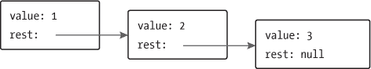

# 第五章：数据结构：`对象`和`数组`

数字、布尔值和字符串是构建数据结构的基本元素。然而，许多类型的信息需要多个元素。`对象`使我们能够将值（包括其他对象）分组，以构建更复杂的结构。

到目前为止，我们构建的程序受到限制，因为它们只处理简单数据类型。在本章学习了数据结构的基础知识后，你将足够了解如何开始编写有用的程序。

本章将通过一个或多或少现实的编程示例，逐步介绍相关概念。示例代码通常会基于本书前面介绍的函数和绑定进行构建。

本书的在线编码沙箱（*[`eloquentjavascript.net/code`](https://eloquentjavascript.net/code)）提供了一种在特定章节上下文中运行代码的方法。如果你决定在其他环境中进行示例练习，请务必首先从沙箱页面下载本章的完整代码。

### 变成松鼠

不时，通常在晚上`8`点到`10`点之间，雅克发现自己变成了一只小毛茸茸的啮齿动物，长着蓬松的尾巴。

一方面，雅克很高兴自己并没有经典的狼人症。变成松鼠比变成狼所造成的问题要少。他不必担心意外吃掉邻居（`那样就尴尬了`

但是雅克更希望完全摆脱这种状态。转变的不规则发生让他怀疑它们可能是由某种因素触发的。起初，他认为只有在靠近橡树的日子才会发生这种情况。然而，避开橡树并没有解决问题。

切换到更科学的方法，雅克开始记录他每天所做的事情以及是否发生了变化。凭借这些数据，他希望缩小触发转变的条件。

他需要的第一件事是一个数据结构来存储这些信息。

### `数据集`

要处理一块数字数据，我们首先需要找到一种在计算机内存中表示它的方法。假设我们想表示一组数字：`2`、`3`、`5`、`7`和`11`。

我们可以用字符串来创造性地表示——毕竟，字符串可以有任意长度，因此我们可以将大量数据放入其中，并使用`"2 3 5 7 11"`作为我们的表示。但这样做很尴尬。我们必须以某种方式提取数字并将其转换回数字才能访问它们。

幸运的是，JavaScript 提供了一种特定的数据类型，用于存储值的序列。它被称为`数组`，并以方括号中的值列表表示，值之间用逗号分隔。

```js
let listOfNumbers = [2, 3, 5, 7, 11];
console.log(listOfNumbers[2]);
// → 5
console.log(listOfNumbers[0]);
// → 2
console.log(listOfNumbers[2 - 1]);
// → 3
```

获取数组内部元素的表示法也使用方括号。紧随表达式之后的一对方括号，内部包含另一个表达式，将查找左侧表达式中与方括号中给出的`索引`对应的元素。

数组的第一个索引是`零`，而不是`一`，因此第一个元素可以通过`listOfNumbers[0]`来获取。零基计数在技术中有着悠久的传统，并在某些方面很有道理，但这需要一些适应。可以将索引视为从数组开始处跳过的项数。

### `属性`

在之前的章节中，我们见过一些表达式，比如`myString.length`（获取字符串的长度）和`Math.max`（最大函数）。这些表达式访问某个值的`属性`。在第一个例子中，我们访问`myString`中值的长度属性。在第二个例子中，我们访问`Math`对象中的名为`max`的属性（它是一个与数学相关的常量和函数的集合）。

几乎所有 JavaScript 值都有属性。例外的是`null`和`undefined`。如果你试图访问这些非值之一的属性，你会得到一个错误。

```js
null.length;
// → TypeError: null has no properties
```

在 JavaScript 中访问属性的两种主要方式是使用点和方括号。`value.x`和`value[x]`都访问`value`上的一个属性——但不一定是同一个属性。两者的区别在于`x`的解释。当使用点时，点后的单词是属性的字面名称。当使用方括号时，括号内的表达式会被`评估`以获取属性名称。`value.x`获取名为`"x"`的`value`属性，而`value[x]`则获取名为`x`的变量的值，并将其转换为字符串作为属性名称。

如果你知道你感兴趣的属性名为`color`，那么你可以使用`value.color`。如果你想提取由绑定`i`中的值命名的属性，你可以使用`value[i]`。属性名称是字符串。它们可以是任何字符串，但点表示法仅对看起来像有效绑定名称的名称有效——以字母或下划线开头，仅包含字母、数字和下划线。如果你想访问名为`2`或`John Doe`的属性，你必须使用方括号：`value[2]`或`value["John Doe"]`。

数组中的元素作为数组的属性存储，使用数字作为属性名。因为你不能用点符号与数字一起使用，并且通常想要使用一个绑定来持有索引，所以你必须使用括号表示法来访问它们。

就像字符串一样，数组也有一个`长度`属性，用于告诉我们数组中有多少个元素。

### `方法`

字符串和数组值除了`length`属性外，还包含多个保存函数值的属性。

```js
let doh = "Doh";
console.log(typeof doh.toUpperCase);
// → function
console.log(doh.toUpperCase());
// → DOH
```

每个字符串都有一个`toUpperCase`属性。当调用时，它将返回一个副本，其中所有字母都被转换为大写。还有一个`toLowerCase`，反向操作。

有趣的是，尽管对`toUpperCase`的调用没有传递任何参数，但这个函数以某种方式可以访问字符串`"Doh"`，这是我们调用其属性的值。你将在`第六章`中了解这如何运作。

包含函数的属性通常被称为它们所属值的`方法`，比如“`toUpperCase`是字符串的`方法`。”

这个示例演示了两种可以用来操作数组的方法。

```js
let sequence = [1, 2, 3];
sequence.push(4);
sequence.push(5);
console.log(sequence);
// → [1, 2, 3, 4, 5]
console.log(sequence.pop());
// → 5
console.log(sequence);
// → [1, 2, 3, 4]
```

`push`方法将值添加到数组的末尾。`pop`方法则相反，移除数组中的最后一个值并返回它。

这些有点傻的名称是对`栈`操作的传统术语。在编程中，栈是一种数据结构，允许你将值推入其中并按相反顺序弹出它们，因此最后添加的东西最先被移除。栈在编程中很常见——你可能还记得上一章中的函数调用栈，它是同一思想的一个实例。

### `对象`

回到人狼松鼠。每日日志条目可以表示为一个数组，但条目不仅仅由数字或字符串组成——每个条目需要存储一系列活动和一个布尔值，以指示雅克是否变成了松鼠。理想情况下，我们希望将这些信息组合成一个单一的值，然后将这些组合值放入日志条目的数组中。

类型为`object`的值是任意属性的集合。创建对象的一种方法是将花括号作为表达式使用。

```js
let day1 = {
  squirrel: false,
  events: ["work", "touched tree", "pizza", "running"]
};
console.log(day1.squirrel);
// → false
console.log(day1.wolf);
// → undefined
day1.wolf = false;
console.log(day1.wolf);
// → false
```

在花括号内，你写一个用逗号分隔的属性列表。每个属性都有一个名称，后面跟着一个冒号和一个值。当一个对象分多行书写时，像这个示例中那样缩进有助于可读性。名称不是有效绑定名称或有效数字的属性必须加上引号。

```js
let descriptions = {
  work: "Went to work",
  "touched tree": "Touched a tree"
};
```

这意味着花括号在 JavaScript 中有`两`种含义。在语句的开始，它们开始一个语句块。在其他位置，它们描述一个对象。幸运的是，几乎没有必要在语句开头使用花括号中的对象，因此这两者之间的歧义并不是问题。唯一的例外是，当你想从简写箭头函数中返回一个对象时——你不能写`n => {prop: n}`，因为花括号会被解释为函数体。相反，你必须在对象周围加一组括号，以明确它是一个表达式。

读取一个不存在的属性将返回值`undefined`。

可以使用`=`运算符将值分配给属性表达式。如果属性已存在，这将替换该属性的值；如果不存在，则在对象上创建一个新属性。

简要回到我们的触手绑定模型——属性绑定是类似的。它们`抓取`值，但其他绑定和属性可能会握住那些相同的值。你可以将对象视为具有任意数量触手的章鱼，每个触手上都有一个名字。

`delete`运算符就像切断章鱼的触手。它是一个一元运算符，当应用于对象属性时，会从对象中移除指定属性。这并不是常见的操作，但它是可能的。

```js
let anObject = {left: 1, right: 2};
console.log(anObject.left);
// → 1
delete anObject.left;
console.log(anObject.left);
// → undefined
console.log("left" in anObject);
// → false
console.log("right" in anObject);
// → true
```

二元的`in`运算符，当应用于字符串和对象时，会告诉你该对象是否具有该名称的属性。将属性设置为`undefined`和实际删除它之间的区别在于，在第一种情况下，对象仍然`拥有`该属性（它只是不具有非常有趣的值），而在第二种情况下，该属性不再存在，因此返回`false`。

要找出一个对象有哪些属性，可以使用`Object.keys`函数。给这个函数一个对象，它将返回一个字符串数组——对象的属性名称。

```js
console.log(Object.keys({x: 0, y: 0, z: 2}));
// → ["x", "y", "z"]
```

有一个`Object.assign`函数，可以将一个对象的所有属性复制到另一个对象中。

```js
let objectA = {a: 1, b: 2};
Object.assign(objectA, {b: 3, c: 4});
console.log(objectA);
// → {a: 1, b: 3, c: 4}
```

数组本质上是一种专门用于存储事物序列的对象。如果你评估`typeof []`，它会返回`"object"`。你可以将数组视为长长的、扁平的章鱼，所有的触手整齐排列，标记上数字。

`雅克`将他保持的日记表示为对象数组。

```js
let journal = [
  {events: ["work", "touched tree", "pizza",
            "running", "television"],
   squirrel: false},
  {events: ["work", "ice cream", "cauliflower",
            "lasagna", "touched tree", "brushed teeth"],
   squirrel: false},
  {events: ["weekend", "cycling", "break", "peanuts",
            "beer"],
   squirrel: true},
  /* And so on... */
];
```

### 可变性

我们很快就会进入实际编程，但首先，还有一个理论部分需要理解。

我们看到对象值是可以修改的。前几章讨论的值类型，如数字、字符串和布尔值，都是`不可变的`——无法更改这些类型的值。你可以将它们组合并推导出新值，但当你获得一个特定的字符串值时，该值将始终保持不变。它内部的文本无法更改。如果你有一个包含`"cat"`的字符串，其他代码无法更改你的字符串中的某个字符使其拼成`"rat"`。

对象的工作方式不同。你`可以`更改它们的属性，导致同一个对象值在不同时间具有不同的内容。

当我们有两个数字，`120`和`120`时，我们可以将它们视为完全相同的数字，无论它们是否引用相同的物理位。对于对象来说，拥有对同一对象的两个引用与拥有两个不同的对象（它们包含相同的属性）之间是有区别的。考虑以下代码：

```js
let object1 = {value: 10};
let object2 = object1;
let object3 = {value: 10};

console.log(object1 == object2);
// → true
console.log(object1 == object3);
// → false

object1.value = 15;
console.log(object2.value);
// → 15
console.log(object3.value);
// → 10
```

`object1`和`object2`绑定指向`同一个`对象，这就是为什么更改`object1`也会更改`object2`的值。它们被称为具有相同的`身份`。绑定`object3`指向一个不同的对象，最初包含与`object1`相同的属性，但过着独立的生活。

绑定可以是可变的或常量的，但这与它们的值的行为是分开的。尽管数字值不会改变，你可以使用`let`绑定来跟踪一个通过改变绑定指向的值而变化的数字。同样，尽管`const`绑定的对象本身无法更改并将继续指向同一对象，但该对象的`内容`可能会发生变化。

```js
const score = {visitors: 0, home: 0};
// This is OK
score.visitors = 1;
// This isn't allowed
score = {visitors: 1, home: 1};
```

当你使用 JavaScript 的`==`运算符比较对象时，它按身份进行比较：只有当两个对象的值完全相同时，它才会返回`true`。比较不同的对象将返回`false`，即使它们具有相同的属性。JavaScript 中没有内置的“深度”比较操作，可以按内容比较对象，但你可以自己编写这个操作（这也是本章末尾的一个练习）。

### 《狼人日志》

`雅克`启动了他的 JavaScript 解释器，并设置了他记录日记所需的环境。

```js
let journal = [];

function addEntry(events, squirrel) {
  journal.push({events, squirrel});
}
```

注意，添加到日记中的对象看起来有点奇怪。它不是像`events: events`这样声明属性，而只是给出了一个属性名称：`events`。这是一种简写方式，意思是相同的——如果大括号表示法中的属性名称后面没有值，则它的值来自同名的绑定。

每天晚上`10`点——有时是第二天早晨，从书架的顶层下来的时候——`雅克`会记录当天的事情。

```js
addEntry(["work", "touched tree", "pizza", "running",
          "television"], false);
addEntry(["work", "ice cream", "cauliflower", "lasagna",
          "touched tree", "brushed teeth"], false);
addEntry(["weekend", "cycling", "break", "peanuts",
          "beer"], true);
```

一旦他收集到足够的数据点，他打算利用统计学找出哪些事件可能与松鼠化相关。

`相关性`是统计变量之间依赖关系的度量。统计变量与编程变量并不完全相同。在统计学中，通常有一组`测量值`，每个变量针对每个测量值进行测量。变量之间的相关性通常以一个介于`–1`和`1`之间的值表示。零相关性意味着变量之间没有关系。相关性为`1`表示两者完全相关——如果你知道一个，你也知道另一个。负`1`也意味着变量之间完全相关，但它们是相反的——当一个为真时，另一个为假。

要计算两个布尔变量之间的相关性度量，我们可以使用`phi 系数`（`φ`）。这是一个公式，其输入是一个频率表，包含不同变量组合被观察到的次数。公式的输出是一个介于`–1`和`1`之间的数字，用于描述相关性。

我们可以将吃披萨的事件放入一个频率表中，每个数字表示这种组合在我们的测量中出现的次数。

``

如果我们称该表为`n`，我们可以使用以下公式计算`φ`：

``

（如果在这一点上你放下书本，专注于对十年级数学课的可怕回忆——等等！我并不打算用无尽的神秘符号折磨你——现在就只有这个公式。即便如此，我们所做的只是把它转化为 JavaScript。）

表示法`n[01]`表示测量次数，其中第一个变量（松鼠性）为假（`0`），第二个变量（披萨）为真（`1`）。在披萨表中，`n[01]`是`9`。

值`n[1•]`指的是第一个变量为真时所有测量的总和，在示例表中是`5`。同样，`n[•0]`指的是第二个变量为假时的测量总和。

所以对于披萨表，分割线以上的部分（被除数）是`1 × 76 − 4 × 9 = 40`，而以下的部分（除数）是`5 × 85 × 10 × 80`的平方根，或者 ``。结果是`φ ≈ 0.069`，这个值很小。吃披萨似乎对变换没有影响。

### 计算相关性

我们可以用一个四元素数组在 JavaScript 中表示一个二乘二表（`[76, 9, 4, 1]`）。我们也可以使用其他表示方式，例如包含两个二元素数组的数组 (`[[76, 9], [4, 1]]`)，或者属性名为`"11"`和`"01"`的对象，但平面数组简单且访问表的表达式简洁明了。我们将数组的索引解释为两位二进制数，其中最左边（最重要）的数字指的是松鼠变量，最右边（最不重要）的数字指的是事件变量。例如，二进制数`10`指的是`Jacques`变成松鼠但事件（比如`"披萨"`）没有发生的情况。这种情况发生了四次。由于二进制`10`在十进制中是`2`，因此我们将在数组的索引`2`存储这个数字。

这是一个计算此类数组中`φ`系数的函数：

```js
function phi(table) {
  return (table[3] * table[0] - table[2] * table[1]) /
    Math.sqrt((table[2] + table[3]) *
              (table[0] + table[1]) *
              (table[1] + table[3]) *
              (table[0] + table[2]));
}

console.log(phi([76, 9, 4, 1]));
// → 0.068599434
```

这是`φ`公式直接转化为 JavaScript 的形式。`Math.sqrt`是平方根函数，由标准 JavaScript 环境中的`Math`对象提供。我们必须从表中添加两个字段以获取`n[1•]`这样的字段，因为行或列的总和并没有直接存储在我们的数据结构中。

`Jacques`记录他的日记三个月。生成的数据集可以在本章的编码沙盒中找到 (`*[`eloquentjavascript.net/code#4`](https://eloquentjavascript.net/code#4)*），存储在`JOURNAL`绑定中，并且可以下载。

要从日志中提取特定事件的二维表格，我们必须遍历所有条目，并统计该事件与松鼠变身相关的出现次数。

```js
function tableFor(event, journal) {
  let table = [0, 0, 0, 0];
  for (let i = 0; i < journal.length; i++) {
    let entry = journal[i], index = 0;
    if (entry.events.includes(event)) index += 1;
    if (entry.squirrel) index += 2;
    table[index] += 1;
  }
  return table;
}

console.log(tableFor("pizza", JOURNAL));
// → [76, 9, 4, 1]
```

数组有一个`includes`方法，可以检查给定值是否存在于数组中。该函数利用这个方法来判断它感兴趣的事件名称是否属于某一天的事件列表。

`tableFor`循环的主体通过检查每个日志条目是否包含感兴趣的特定事件，以及该事件是否发生在与松鼠事件同时，来确定每个日志条目对应表格中的哪个框。然后，循环会将`1`加到表格中的正确框内。

现在我们拥有计算个别相关性的工具。剩下的唯一一步是为记录的每种事件类型找到相关性，并查看是否有什么特别之处。

### 数组循环

在`tableFor`函数中，有一个这样的循环：

```js
for (let i = 0; i < JOURNAL.length; i++) {
  let entry = JOURNAL[i];
  // Do something with entry
}
```

这种循环在经典 JavaScript 中很常见——逐个遍历数组元素是一种常见操作，为此，你需要在数组的长度上运行一个计数器，并依次挑选出每个元素。

在现代 JavaScript 中，有一种更简单的方法来编写这样的循环。

```js
for (let entry of JOURNAL) {
  console.log(`${entry.events.length} events.`);
}
```

当`for`循环在变量定义后使用`of`这个词时，它将遍历在`of`后面给出的值中的元素。这不仅适用于数组，也适用于字符串和其他一些数据结构。我们将在第六章中讨论`它是如何工作的`。

### 最终分析

我们需要为数据集中发生的每种事件类型计算相关性。为此，我们首先需要`找到`每种事件类型。

```js
function journalEvents(journal) {
  let events = [];
  for (let entry of journal) {
    for (let event of entry.events) {
      if (!events.includes(event)) {
        events.push(event);
      }
    }
  }
  return events;
}

console.log(journalEvents(JOURNAL));
// → ["carrot", "exercise", "weekend", "bread", ...]
```

通过将任何不在其中的事件名称添加到事件数组中，该函数收集每种类型的事件。

使用那个函数，我们可以看到所有的相关性。

```js
for (let event of journalEvents(JOURNAL)) {
  console.log(event + ":", phi(tableFor(event, JOURNAL)));
}
// → carrot:   0.0140970969
// → exercise: 0.0685994341
// → weekend:  0.1371988681
// → bread:   -0.0757554019
// → pudding: -0.0648203724
// And so on...
```

大多数相关性似乎接近零。吃胡萝卜、面包或布丁显然不会引发松鼠变身。变身`似乎`在周末更常发生。让我们过滤结果，只显示相关性大于`0.1`或小于`-0.1`的情况。

```js
for (let event of journalEvents(JOURNAL)) {
  let correlation = phi(tableFor(event, JOURNAL));
  if (correlation > 0.1 || correlation < -0.1) {
    console.log(event + ":", correlation);
  }
}
// → weekend:        0.1371988681
// → brushed teeth: -0.3805211953
// → candy:          0.1296407447
// → work:          -0.1371988681
// → spaghetti:      0.2425356250
// → reading:        0.1106828054
// → peanuts:        0.5902679812
```

啊哈！有两个因素的相关性明显强于其他因素。吃花生对变成松鼠的几率有很强的正面影响，而刷牙则有显著的负面影响。

有趣。让我们试试：

```js
for (let entry of JOURNAL) {
  if (entry.events.includes("peanuts") &&
     !entry.events.includes("brushed teeth")) {
    entry.events.push("peanut teeth");
  }
}
console.log(phi(tableFor("peanut teeth", JOURNAL)));
// → 1
```

这是一个强烈的结果。这种现象恰恰发生在雅克吃花生而没刷牙的时候。如果他在牙齿卫生方面不是如此邋遢，他甚至可能不会注意到自己的病症。

知道这一点后，雅克完全不再吃花生，发现他的变身停止了。

但他只花了几个月就注意到，这种完全人类的生活方式缺少了一些东西。没有他的野外冒险，雅克几乎感觉不到生命的存在。他决定宁愿成为一只全职的野生动物。在森林中建造一个漂亮的小树屋，并配备一个花生酱分配器和十年的花生酱供应后，他最后一次改变形态，过上了短暂而充满活力的松鼠生活。

### 深入数组学

在结束这一章之前，我想向你介绍几个与对象相关的概念。我将从一些普遍有用的数组方法开始。

我们在本章早些时候看到了`push`和`pop`，它们分别在数组的末尾添加和移除元素。对应于在数组开头添加和移除元素的方法称为`unshift`和`shift`。

```js
let todoList = [];
function remember(task) {
  todoList.push(task);
}
function getTask() {
  return todoList.shift();
}
function rememberUrgently(task) {
  todoList.unshift(task);
}
```

这个程序管理一个任务队列。你通过调用`remember("groceries")`将任务添加到队列的末尾，当你准备好执行某个任务时，你可以调用`getTask()`从队列中获取（并移除）最前面的项目。`rememberUrgently`函数也添加一个任务，但它将任务添加到队列的前面，而不是后面。

要搜索特定值，数组提供了`indexOf`方法。该方法从数组的开始到结束进行搜索，并返回请求值找到时的索引——如果未找到则返回`-1`。要从末尾而不是从开头进行搜索，还有一个类似的方法叫做`lastIndexOf`。

```js
console.log([1, 2, 3, 2, 1].indexOf(2));
// → 1
console.log([1, 2, 3, 2, 1].lastIndexOf(2));
// → 3
```

`indexOf`和`lastIndexOf`都接受一个可选的第二个参数，用于指示从哪里开始搜索。

另一个基本的数组方法是`slice`，它接受起始和结束索引，并返回一个只包含它们之间元素的数组。起始索引是包含的，结束索引是不包含的。

```js
console.log([0, 1, 2, 3, 4].slice(2, 4));
// → [2, 3]
console.log([0, 1, 2, 3, 4].slice(2));
// → [2, 3, 4]
```

当没有提供结束索引时，切片将获取起始索引之后的所有元素。你也可以省略起始索引，以复制整个数组。

`concat`方法可用于将数组连接在一起，以创建一个新的数组，这与`+`运算符对字符串的作用类似。

以下示例展示了`concat`和`slice`的实际应用。它接受一个数组和一个索引，并返回一个新的数组，该数组是原始数组的副本，给定索引处的元素被移除。

```js
function remove(array, index) {
  return array.slice(0, index)
    .concat(array.slice(index + 1));
}
console.log(remove(["a", "b", "c", "d", "e"], 2));
// → ["a", "b", "d", "e"]
```

如果你向`concat`传递一个不是数组的参数，该值将被当作一个单元素数组添加到新数组中。

### 字符串及其属性

我们可以从字符串值中读取像`length`和`toUpperCase`这样的属性。但是如果我们尝试添加一个新属性，它不会生效。

```js
let kim = "Kim";
kim.age = 88;
console.log(kim.age);
// → undefined
```

字符串、数字和布尔值的值不是对象，尽管语言不会抱怨你尝试在它们上设置新属性，但实际上并不会存储这些属性。如前所述，这些值是不可变的，无法更改。

但这些类型确实有内置属性。每个字符串值都有许多方法。一些非常有用的方法是`slice`和`indexOf`，它们与数组的同名方法类似。

```js
console.log("coconuts".slice(4, 7));
// → nut
console.log("coconut".indexOf("u"));
// → 5
```

一个不同之处在于字符串的`indexOf`可以搜索包含多个字符的字符串，而对应的数组方法仅查找单个元素。

```js
console.log("one two three".indexOf("ee"));
// → 11
```

`trim`方法从字符串的开始和结束移除空白字符（空格、换行符、制表符及类似字符）。

```js
console.log("  okay \n ".trim());
// → okay
```

上一章中的`zeroPad`函数也作为一个方法存在。它被称为`padStart`，并接受所需的长度和填充字符作为参数。

```js
console.log(String(6).padStart(3, "0"));
// → 006
```

你可以通过`split`在每个出现的另一个字符串上拆分一个字符串，然后用`join`再次连接它。

```js
let sentence = "Secretarybirds specialize in stomping";
let words = sentence.split(" ");
console.log(words);
// → ["Secretarybirds", "specialize", "in", "stomping"]
console.log(words.join(". "));
// → Secretarybirds. specialize. in. stomping
```

字符串可以通过`repeat`方法重复，它创建一个包含多个原始字符串副本的新字符串，将它们粘合在一起。

```js
console.log("LA".repeat(3));
// → LALALA
```

我们已经看到字符串类型的长度属性。访问字符串中的单个字符看起来就像访问数组元素（有一个复杂性，我们将在第五章中讨论）。

```js
let string = "abc";
console.log(string.length);
// → 3
console.log(string[1]);
// → b
```

### `剩余参数`

对于一个函数接受任意数量的参数是非常有用的。例如，`Math.max`计算它所给的`所有`参数中的最大值。要编写这样的函数，你在函数最后一个参数前加上三个点，如下所示：

```js
function max(...numbers) {
  let result = -Infinity;
  for (let number of numbers) {
    if (number > result) result = number;
  }
  return result;
}
console.log(max(4, 1, 9, -2));
// → 9
```

当调用这样的函数时，`剩余参数`被绑定到一个包含所有后续参数的数组。如果它之前有其他参数，它们的值不属于那个数组。当它像`max`一样是唯一的参数时，它将包含所有参数。

你可以使用类似的三个点符号来`调用`一个带有参数数组的函数。

```js
let numbers = [5, 1, 7];
console.log(max(...numbers));
// → 7
```

这会将数组“展开”到函数调用中，将其元素作为单独的参数传递。可以将这样的数组与其他参数一起包含，例如`max(9, ...numbers, 2)`。

方括号数组符号同样允许三点操作符将另一个数组展开到新数组中。

```js
let words = ["never", "fully"];
console.log(["will", ...words, "understand"]);
// → ["will", "never", "fully", "understand"]
```

这在花括号对象中也有效，它将另一个对象的所有属性添加进来。如果一个属性被多次添加，最后添加的值将胜出。

```js
let coordinates = {x: 10, y: 0};
console.log({...coordinates, y: 5, z: 1});
// → {x: 10, y: 5, z: 1}
```

### `Math`对象

正如我们所见，`Math`是一个包含数字相关实用函数的集合，例如`Math.max`（最大值）、`Math.min`（最小值）和`Math.sqrt`（平方根）。

`Math`对象被用作一个容器，以分组一堆相关的功能。只有一个`Math`对象，它几乎从来没有作为一个值有用。相反，它提供了一个`命名空间`，使所有这些函数和值不必是全局绑定。

过多的全局绑定会“污染”命名空间。被占用的名称越多，你越可能意外覆盖某些现有绑定的值。例如，在你的某个程序中，你可能会想将某个东西命名为`max`。由于JavaScript内置的`max`函数安全地嵌套在`Math`对象中，你不必担心覆盖它。

许多语言会阻止你，或者至少会警告你，当你定义一个已经被占用的名称的绑定时。JavaScript对使用`let`或`const`声明的绑定这样做，但——反而——对标准绑定或使用`var`或`function`声明的绑定不这样做。

回到`Math`对象。如果你需要进行三角函数运算，`Math`可以提供帮助。它包含`cos`（余弦）、`sin`（正弦）和`tan`（正切），以及它们的反函数`acos`、`asin`和`atan`。数字`π`（圆周率）——或者至少是适合`JavaScript`数字的最接近的近似值——可以通过`Math.PI`获取。旧有的编程传统是将常量的名称全部用大写字母书写。

```js
function randomPointOnCircle(radius) {
  let angle = Math.random() * 2 * Math.PI;
  return {x: radius * Math.cos(angle),
          y: radius * Math.sin(angle)};
}
console.log(randomPointOnCircle(2));
// → {x: 0.3667, y: 1.966}
```

如果你对正弦和余弦不熟悉，别担心。我会在第十四章中解释它们的用法。

上一个例子使用了`Math.random`。这是一个每次调用都会返回一个在0（包含）和1（不包含）之间的新伪随机数的函数。

```js
console.log(Math.random());
// → 0.36993729369714856
console.log(Math.random());
// → 0.727367032552138
console.log(Math.random());
// → 0.40180766698904335
```

尽管计算机是确定性的机器——如果给定相同的输入，它们总是以相同的方式反应——但它们可以生成看似随机的数字。为此，计算机保持一些隐藏值，每当你请求一个新的随机数时，它会对这个隐藏值进行复杂的计算以生成新值。它存储一个新值并返回从中派生出的某个数字。这样，它就可以以`看似`随机的方式生成不断新的、难以预测的数字。

如果我们想要一个整数随机数而不是小数，我们可以对`Math.random`的结果使用`Math.floor`（向下舍入到最接近的整数）。

```js
console.log(Math.floor(Math.random() * 10));
// → 2
```

将随机数乘以10会得到一个大于或等于0并且小于10的数字。由于`Math.floor`向下舍入，这个表达式将以相等的概率生成0到9之间的任何数字。

还有一些函数，如`Math.ceil`（“向上取整”，将数字向上舍入到最接近的整数）、`Math.round`（舍入到最接近的整数）和`Math.abs`，它返回一个数的绝对值，这意味着它将负值取反，但保持正值不变。

### `解构`

让我们暂时回到`phi`函数。

```js
function phi(table) {
  return (table[3] * table[0] - table[2] * table[1]) /
    Math.sqrt((table[2] + table[3]) *
              (table[0] + table[1]) *
              (table[1] + table[3]) *
              (table[0] + table[2]));
}
```

这个函数难以阅读的一个原因是我们有一个指向数组的绑定，但我们更希望有指向数组`元素`的绑定——也就是说，`let n00 = table[0]`等等。幸运的是，`JavaScript`中有一种简洁的方法可以做到这一点。

```js
function phi([n00, n01, n10, n11]) {
  return (n11 * n00 - n10 * n01) /
    Math.sqrt((n10 + n11) * (n00 + n01) *
              (n01 + n11) * (n00 + n10));
}
```

这对于使用`let`、`var`或`const`创建的绑定同样有效。如果你知道你正在绑定的值是一个数组，你可以使用方括号“查看”该值的内部，绑定其内容。

对于对象，可以使用花括号而不是方括号进行类似的操作。

```js
let {name} = {name: "Faraji", age: 23};
console.log(name);
// → Faraji
```

请注意，如果你尝试解构`null`或`undefined`，你会得到一个错误，就像你直接尝试访问这些值的属性时一样。

### `可选属性访问`

当你不确定某个值是否会生成对象，但仍然希望在它确实生成对象时读取其属性时，可以使用一种点表示法的变体：`object?.property`。

```js
function city(object) {
  return object.address?.city;
}
console.log(city({address: {city: "Toronto"}}));
// → Toronto
console.log(city({name: "Vera"}));
// → undefined
```

表达式`a?.b`与`a.b`的意思相同，前提是`a`不为`null`或`undefined`。当它为`null`或`undefined`时，则评估为`undefined`。这在像示例中不确定某个属性是否存在或某个变量可能持有`undefined`值时是非常方便的。

类似的表示法可以与方括号访问结合使用，甚至可以通过在括号或方括号前放置`?.`来使用函数调用。

```js
console.log("string".notAMethod?.());
// → undefined
console.log({}.arrayProp?.[0]);
// → undefined
```

### `JSON`

由于属性抓取其值而不是包含它，因此对象和数组在计算机内存中以持有`地址`（内存中的位置）的比特序列存储。一个包含另一个数组的数组至少由一个内存区域用于内部数组，另一个内存区域用于外部数组，后者包含（除了其他内容）表示内部数组地址的数字。

如果你想将数据保存到文件中以备后用或通过网络发送到另一台计算机，你必须以某种方式将这些内存地址的纠结转换为可以存储或发送的描述。我想你`可以`连同你感兴趣的值的地址一起发送整个计算机内存，但这似乎不是最佳方法。

我们可以做的是`序列化`数据。这意味着它被转换为一种扁平描述。一种流行的序列化格式称为`JSON`（发音为“杰森”），代表`JavaScript`对象表示法。它在网络上广泛用作数据存储和通信格式，甚至在`JavaScript`以外的语言中也使用。

`JSON`的书写方式与`JavaScript`的数组和对象相似，但有一些限制。所有属性名称必须用双引号括起来，且仅允许简单的数据表达式——不允许函数调用、绑定或涉及实际计算的内容。`JSON`中不允许注释。

日志条目在作为`JSON`数据表示时可能看起来像这样：

```js
{
  "squirrel": false,
  "events": ["work", "touched tree", "pizza", "running"]
}
```

`JavaScript`提供了`JSON.stringify`和`JSON.parse`函数，用于在这种格式之间转换数据。第一个函数接受一个`JavaScript`值并返回一个`JSON`编码的字符串。第二个函数接受这样的字符串并将其转换为它编码的值。

```js
let string = JSON.stringify({squirrel: false,
                             events: ["weekend"]});
console.log(string);
// → {"squirrel":false,"events":["weekend"]}
console.log(JSON.parse(string).events);
// → ["weekend"]
```

### `摘要`

对象和数组提供了将多个值组合为单个值的方法。这允许我们将一堆相关的事物放入一个袋子中，然后拿着袋子四处走，而不是试图单独抱住所有个别事物。

大多数`JavaScript`值都有属性，唯一的例外是`null`和`undefined`。属性通过`value.prop`或`value["prop"]`来访问。对象通常使用名称作为其属性，并存储一组或多组固定的属性。而数组则通常包含数量不等的概念上相同的值，并使用数字（从0开始）作为其属性的名称。

数组中`确实`有一些命名属性，例如`length`和一些方法。方法是存在于属性中的函数，并且（通常）对其属性的值进行操作。

你可以使用一种特殊的`for`循环遍历数组：`for (let element of array)`。

### `练习`

#### `范围的总和`

本书的引言提到以下内容作为计算一系列数字总和的好方法：

```js
console.log(sum(range(1, 10)));
```

编写一个范围函数，该函数接受两个参数，`start`和`end`，并返回一个包含从`start`到包括`end`的所有数字的数组。

接下来，编写一个`sum`函数，接受一个数字数组并返回这些数字的总和。运行示例程序，查看它是否确实返回55。

作为额外作业，修改你的范围函数，使其接受一个可选的第三个参数，指示构建数组时使用的“步长”值。如果未给出步长，元素应该以1的增量增加，对应于旧行为。函数调用`range(1, 10, 2)`应该返回`[1, 3, 5, 7, 9]`。确保这也适用于负步长值，以便`range(5, 2, -1)`生成`[5, 4, 3, 2]`。

#### `反转数组`

数组有一个反转方法，通过反转元素出现的顺序来改变数组。对于这个练习，请编写两个函数：`reverseArray`和`reverseArrayInPlace`。第一个`reverseArray`应该以数组作为参数，并生成一个`新的`数组，包含相同元素但顺序相反。第二个`reverseArrayInPlace`应该执行反转方法所做的事情：`修改`作为参数传入的数组，反转其元素。两者均不得使用标准反转方法。

回想一下前一章关于副作用和纯函数的笔记，你认为哪种变体在更多情况下会有用？哪一个运行得更快？

#### `一个列表`

作为通用的值块，对象可以用来构建各种数据结构。一种常见的数据结构是`列表`（不要与数组混淆）。列表是一个嵌套的对象集合，第一个对象持有对第二个对象的引用，第二个对象持有对第三个对象的引用，依此类推。

```js
let list = {
  value: 1,
  rest: {
    value: 2,
    rest: {
      value: 3,
      rest: null
    }
 }
};
```

结果对象形成一条链，如下图所示：



列表的一个优点是它们可以共享部分结构。例如，如果我创建两个新值`{value: 0, rest: list}`和`{value: -1, rest: list}`（其中`list`指的是之前定义的绑定），它们都是独立的列表，但共享组成其最后三个元素的结构。原始列表仍然是一个有效的三元素列表。

编写一个函数`arrayToList`，当给定`[1, 2, 3]`作为参数时，构建出如所示的列表结构。还要编写一个`listToArray`函数，它可以从列表中生成一个数组。添加辅助函数`prepend`，该函数接收一个元素和一个列表，并创建一个新的列表，将元素添加到输入列表的前面；以及`nth`，该函数接收一个列表和一个数字，并返回列表中给定位置的元素（零表示第一个元素），如果没有这样的元素则返回`undefined`。

如果你还没有这样做，也要编写`nth`的递归版本。

#### `深度比较`

`==`操作符通过身份比较对象，但有时你可能更希望比较它们实际属性的值。

编写一个函数`deepEqual`，它接收两个值，仅当它们是相同的值或是具有相同属性的对象时返回`true`，其中属性的值在使用`deepEqual`的递归调用时比较相等。

要确定值是否应该直接比较（使用`===`操作符）或比较其属性，你可以使用`typeof`操作符。如果它对两个值都返回“object”，那么你应该进行深度比较。但你必须考虑一个愚蠢的例外：由于历史原因，`typeof null`也会返回“object”。

当你需要遍历对象的属性进行比较时，`Object.keys`函数会很有用。

`构建软件设计有两种方式：一种是将其简化到明显没有缺陷，另一种是将其复杂化到没有明显缺陷。`

—C.A.R. Hoare，`1980 ACM 图灵奖演讲`


