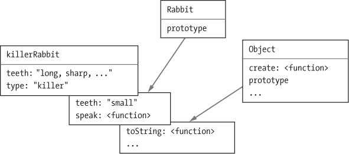

# 第七章：对象的秘密生活

第四章介绍了JavaScript中的对象作为持有其他数据的容器。在编程文化中，`面向对象编程`是一套以对象为程序组织核心原则的技术。

尽管没有人真正同意它的确切定义，面向对象编程已经塑造了许多编程语言的设计，包括JavaScript。本章描述了这些思想如何应用于JavaScript。

### 抽象数据类型

面向对象编程的主要思想是将对象，或者更确切地说是`对象类型`，作为程序组织的单元。将程序设置为多个严格分离的对象类型提供了一种思考其结构的方式，从而实施某种纪律，防止所有内容交织在一起。

这样做的方法是将对象视为电动搅拌机或其他消费电器。设计和组装搅拌机的人需要进行专业工作，要求材料科学和电力知识。他们将所有这些都隐藏在光滑的塑料外壳中，这样只想搅拌煎饼面糊的人就不必担心这些——他们只需理解搅拌机可以操作的几个旋钮。

类似地，`抽象数据类型`或`对象类`是一个子程序，可能包含任意复杂的代码，但暴露出一组有限的方法和属性，供与之合作的人使用。这允许大型程序由多个电器类型构建，限制了这些不同部分交织的程度，要求它们仅以特定方式相互作用。

如果在某个对象类中发现问题，通常可以修复或甚至完全重写，而不会影响程序的其他部分。更好的是，可能在多个不同的程序中使用对象类，避免了从头开始重建其功能的需要。你可以将JavaScript的内置数据结构，如数组和字符串，视为这样的可重用抽象数据类型。

每个抽象数据类型都有一个`接口`，这是外部代码可以对其执行的操作集合。超出该接口的任何细节都是`封装`的，视为该类型的内部内容，对程序的其他部分无关紧要。

甚至像数字这样的基本事物也可以被视为一个抽象数据类型，其接口允许我们对其进行加法、乘法、比较等操作。实际上，在经典的面向对象编程中，将单个`对象`作为主要组织单元的执着是有些不幸的，因为有用的功能片段通常涉及不同对象类紧密合作的情况。

### 方法

在JavaScript中，方法不过是持有函数值的属性。这是一个简单的方法：

```js
function speak(line) {
  console.log(`The ${this.type} rabbit says '${line}'`);
}
let whiteRabbit = {type: "white", speak};
let hungryRabbit = {type: "hungry", speak};

whiteRabbit.speak("Oh my fur and whiskers");
// → The white rabbit says 'Oh my fur and whiskers'
hungryRabbit.speak("Got any carrots?");
// → The hungry rabbit says 'Got any carrots?'
```

通常，一个方法需要对其被调用的对象执行某些操作。当一个函数被作为方法调用时——作为属性查找并立即调用，如`object.method()`——在其主体内被称为`this`的绑定自动指向其被调用的对象。

你可以把这看作是以不同于常规参数的方式传递给函数的额外参数。如果你想明确提供它，可以使用函数的`call`方法，该方法将`this`值作为第一个参数，并将后续参数视为常规参数。

```js
speak.call(whiteRabbit, "Hurry");
// → The white rabbit says 'Hurry'
```

由于每个函数都有自己的`this`绑定，其值取决于调用的方式，因此在用`function`关键字定义的常规函数中，你无法引用包装作用域的`this`。

箭头函数是不同的——它们不会绑定自己的`this`，但可以看到周围作用域的`this`绑定。因此，你可以执行如下代码，其中在局部函数内部引用了`this`：

```js
let finder = {
  find(array) {
    return array.some(v => v == this.value);
  },
  value: 5
};
console.log(finder.find([4, 5]));
// → true
```

在对象表达式中，像`find(array)`这样的属性是定义方法的一种简写方式。它创建了一个名为`find`的属性，并将一个函数作为其值。

如果我用`function`关键字为某个参数编写了代码，那么这段代码将无法工作。

### 原型

创建一个带有说话方法的兔子对象类型的一种方法是创建一个助手函数，该函数将兔子类型作为参数，并返回一个将其作为类型属性的对象，并在其说话属性中包含我们的说话函数。

所有兔子共享相同的方法。尤其对于具有多个方法的类型，如果能够以某种方式将类型的方法集中在一个地方，而不是逐个添加到每个对象中，那就太好了。

在JavaScript中，`原型`是实现这一点的方法。对象可以链接到其他对象，以神奇的方式获取其他对象所具有的所有属性。使用`{}`表示法创建的普通对象链接到一个名为`Object.prototype`的对象。

```js
let empty = {};
console.log(empty.toString);
// → function toString(){...}
console.log(empty.toString());
// → [object Object]
```

看起来我们只是从一个空对象中提取了一个属性。但实际上，`toString`是存储在`Object.prototype`中的方法，意味着它在大多数对象中都是可用的。

当一个对象请求它没有的属性时，将会搜索其原型。如果原型中没有该属性，则会继续搜索`原型的`原型，依此类推，直到找到一个没有原型的对象（`Object.prototype`就是这样的对象）。

```js
console.log(Object.getPrototypeOf({}) == Object.prototype);
// → true
console.log(Object.getPrototypeOf(Object.prototype));
// → null
```

正如你所猜的，`Object.getPrototypeOf`返回一个对象的原型。

许多对象并不直接以`Object.prototype`作为它们的原型，而是拥有另一个提供不同默认属性集的对象。函数源自`Function.prototype`，数组源自`Array.prototype`。

```js
console.log(Object.getPrototypeOf(Math.max) ==
            Function.prototype);
// → true
console.log(Object.getPrototypeOf([]) == Array.prototype);
// → true
```

这样的原型对象本身也将拥有一个原型，通常是`Object.prototype`，这样它仍然间接提供像`toString`这样的函数。

你可以使用`Object.create`来创建一个具有特定原型的对象。

```js
let protoRabbit = {
  speak(line) {
    console.log(`The ${this.type} rabbit says '${line}'`);
  }
};
let blackRabbit = Object.create(protoRabbit);
blackRabbit.type = "black";
blackRabbit.speak("I am fear and darkness");
// → The black rabbit says 'I am fear and darkness'
```

“proto”兔子作为所有兔子共享属性的容器。个别兔子对象，如黑兔，包含仅适用于它自己的属性——在这种情况下是它的类型——并从其原型继承共享属性。

### 类

JavaScript的原型系统可以被解释为一种自由形式的抽象数据类型或类。`类`定义了一种对象的形状——它具有哪些方法和属性。这样的对象称为该类的`实例`。

原型对于定义所有类实例共享相同值的属性非常有用。每个实例不同的属性，例如我们的兔子的类型属性，需要直接存储在对象本身中。

要创建给定类的实例，你必须生成一个从适当原型派生的对象，但你`还`需要确保该对象本身具有此类实例应该具备的属性。这就是`构造函数`的作用。

```js
function makeRabbit(type) {
  let rabbit = Object.create(protoRabbit);
  rabbit.type = type;
  return rabbit;
}
```

JavaScript的类语法使定义这种类型的函数以及原型对象变得更容易。

```js
class Rabbit {
  constructor(type) {
    this.type = type;
  }
  speak(line) {
    console.log(`The ${this.type} rabbit says '${line}'`);
  }
}
```

`class`关键字开始一个类声明，这使我们能够一起定义构造函数和一组方法。声明的花括号内可以编写任意数量的方法。这段代码的效果是定义一个名为`Rabbit`的绑定，持有一个运行构造函数代码的函数，并具有一个持有`speak`方法的原型属性。

这个函数不能像普通函数那样调用。在JavaScript中，构造函数通过在前面加上关键字`new`来调用。这样做会创建一个新的实例对象，其原型是来自函数的原型属性的对象，然后运行该函数，将`this`绑定到新对象，最后返回该对象。

```js
let killerRabbit = new Rabbit("killer");
```

实际上，类是在2015年版JavaScript中引入的。任何函数都可以用作构造函数，而在2015年之前，定义类的方法是编写一个常规函数，然后操作其原型属性。

```js
function ArchaicRabbit(type) {
  this.type = type;
}
ArchaicRabbit.prototype.speak = function(line) {
 console.log(`The ${this.type} rabbit says '${line}'`);
};
let oldSchoolRabbit = new ArchaicRabbit("old school");
```

因此，所有非箭头函数都以一个持有空对象的原型属性开头。

按照惯例，构造函数的名称首字母大写，以便能够与其他函数轻松区分。

理解原型与构造函数之间的关联方式（通过其原型属性）以及对象`拥有`原型的方式（可以通过`Object.getPrototypeOf`找到）之间的区别非常重要。构造函数的实际原型是`Function.prototype`，因为构造函数是函数。构造函数的原型`属性`保存通过它创建的实例所使用的原型。

```js
console.log(Object.getPrototypeOf(Rabbit) ==
            Function.prototype);
// → true
console.log(Object.getPrototypeOf(killerRabbit) ==
            Rabbit.prototype);
// → true
```

构造函数通常会向此添加一些每个实例的属性。也可以在类声明中直接声明属性。与方法不同，这些属性是添加到实例对象中，而不是原型中。

```js
class Particle {
  speed = 0;
  constructor(position) {
    this.position = position;
  }
}
```

类似于函数，类可以在语句和表达式中使用。当作为表达式使用时，它不会定义绑定，而只是将构造函数作为值生成。你可以在类表达式中省略类名。

```js
let object = new class { getWord() { return "hello"; } };
console.log(object.getWord());
// → hello
```

### 私有属性

类通常会定义一些内部使用的属性和方法，这些不是它们接口的一部分。这些被称为`私有`属性，而与之相对的是`公共`属性，它们是对象外部接口的一部分。

要声明一个私有方法，在其名称前加一个`#`号。这样的函数只能在定义它们的类声明内部调用。

```js
class SecretiveObject {
  #getSecret() {
    return "I ate all the plums";
  }
  interrogate() {
    let shallISayIt = this.#getSecret();
    return "never";
  }
}
```

当一个类没有声明构造函数时，它将自动获得一个空的构造函数。

如果你试图从类外调用`#getSecret`，会出现错误。它的存在完全隐藏在类声明内部。

要使用私有实例属性，必须先声明它们。常规属性可以通过简单的赋值创建，但私有属性`必须`在类声明中声明，才能被使用。

该类实现了一种获取小于给定最大数的随机整数的工具。它只有一个公共属性：`getNumber`。

```js
class RandomSource {
  #max;
  constructor(max) {
    this.#max = max;
  }
  getNumber() {
    return Math.floor(Math.random() * this.#max);
  }
}
```

### 重写派生属性

当你向一个对象添加属性时，无论它是否存在于原型中，该属性都会添加到对象`本身`。如果原型中已经有一个同名属性，那么这个属性将不再影响对象，因为它现在被对象自己的属性隐藏了。

```js
Rabbit.prototype.teeth = "small";
console.log(killerRabbit.teeth);
// → small
killerRabbit.teeth = "long, sharp, and bloody";
console.log(killerRabbit.teeth);
// → long, sharp, and bloody
console.log((new Rabbit("basic")).teeth);
// → small
console.log(Rabbit.prototype.teeth);
// → small
```

以下图示描绘了这段代码运行后的情况。兔子和对象原型作为背景存在于`killerRabbit`后面，未在对象本身中找到的属性可以在这里查找。



重写存在于原型中的属性是一个有用的操作。正如兔子牙齿的例子所示，重写可以用来表达更通用对象类实例中的特殊属性，同时让非特殊对象从其原型中获取标准值。

重写还用于给标准函数和数组原型提供不同于基本对象原型的`toString`方法。

```js
console.log(Array.prototype.toString ==
            Object.prototype.toString);
// → false
console.log([1, 2].toString());
// → 1,2
```

在数组上调用`toString`的结果类似于调用`.join(",")`，它在数组中的值之间放置逗号。直接在数组上调用`Object.prototype.toString`会生成不同的字符串。该函数并不知道数组，因此它只是将单词`object`和类型名称放在方括号之间。

```js
console.log(Object.prototype.toString.call([1, 2]));
// → [object Array]
```

### 映射

我们在前一章中看到单词`映射`用于通过将函数应用于元素来转换数据结构的操作。虽然令人困惑，在编程中同样的词用于一个相关但不同的概念。

`映射`（名词）是一种将值（键）与其他值关联的数据结构。例如，你可能想将名字映射到年龄。这是可以使用对象来实现的。

```js
let ages = {
  Boris: 39,
  Liang: 22,
  Júlia: 62
};

console.log(`Júlia is ${ages["Júlia"]}`);
// → Júlia is 62
console.log("Is Jack's age known?", "Jack" in ages);
// → Is Jack's age known? false
console.log("Is toString's age known?", "toString" in ages);
// → Is toString's age known? true
```

在这里，对象的属性名称是人名，属性值是他们的年龄。但我们确实没有在映射中列出任何名为`toString`的人。然而，由于普通对象继承自`Object.prototype`，看起来这个属性是存在的。

出于这个原因，使用普通对象作为映射是危险的。有几种可能的方法可以避免这个问题。首先，你可以创建`没有`原型的对象。如果你将`null`传递给`Object.create`，生成的对象将不继承自`Object.prototype`，可以安全地用作映射。

```js
console.log("toString" in Object.create(null));
// → false
```

对象属性名称必须是字符串。如果你需要一个键无法轻易转换为字符串的映射——例如对象——你就无法使用对象作为映射。

幸运的是，JavaScript 提供了一个名为`Map`的类，正是为这个目的而编写。它存储一个映射，并允许任何类型的键。

```js
let ages = new Map();
ages.set("Boris", 39);
ages.set("Liang", 22);
ages.set("Júlia", 62);

console.log(`Júlia is ${ages.get("Júlia")}`);
// → Júlia is 62
console.log("Is Jack's age known?", ages.has("Jack"));
// → Is Jack's age known? false
console.log(ages.has("toString"));
// → false
```

`set`、`get`和`has`方法是`Map`对象接口的一部分。编写一个可以快速更新和搜索大量值的数据结构并不容易，但我们不必担心这个。有人为我们做了这件事，我们可以通过这个简单的接口使用他们的工作。

如果你确实有一个普通对象，出于某种原因需要将其视为映射，知道`Object.keys`仅返回对象的`自有`键，而不返回原型中的键是很有用的。作为`in`运算符的替代，你可以使用`Object.hasOwn`函数，它会忽略对象的原型。

```js
console.log(Object.hasOwn({x: 1}, "x"));
// → true
console.log(Object.hasOwn({x: 1}, "toString"));
// → false
```

### 多态

当你在对象上调用`String`函数（将值转换为字符串）时，它将调用该对象的`toString`方法以尝试从中创建一个有意义的字符串。我提到过，某些标准原型定义了自己的`toString`版本，以便创建一个包含比“[object Object]”更有用信息的字符串。你也可以自己做到这一点。

```js
Rabbit.prototype.toString = function() {
  return `a ${this.type} rabbit`;
};

console.log(String(killerRabbit));
// → a killer rabbit
```

这是一个强大理念的简单实例。当一段代码被编写用于处理具有特定接口的对象—在这种情况下是`toString`方法—任何恰好支持此接口的对象都可以插入代码中并能够与其一起工作。

这种技术被称为`多态`。多态代码可以与不同形状的值一起工作，只要它们支持它所期望的接口。

一个广泛使用的接口示例是数组类对象，它们具有一个包含数字的`length`属性和每个元素的编号属性。数组和字符串都支持这个接口，还有其他各种对象，其中一些我们将在关于浏览器的章节中看到。我们在第五章中的`forEach`实现可以在任何提供此接口的对象上工作。实际上，`Array.prototype.forEach`也是如此。

```js
Array.prototype.forEach.call({
  length: 2,
  0: "A",
  1: "B"
}, elt => console.log(elt));
// → A
// → B
```

### 获取器、设置器和静态方法

接口通常包含普通属性，而不仅仅是方法。例如，`Map`对象有一个`大小`属性，它告诉你存储了多少个键。

这样的对象不必直接在实例中计算和存储这样的属性。即使是直接访问的属性也可能隐藏一个方法调用。这种方法称为`getter`，通过在对象表达式或类声明中的方法名前加上`get`来定义。

```js
let varyingSize = {
  get size() {
    return Math.floor(Math.random() * 100);
  }
};

console.log(varyingSize.size);
// → 73
console.log(varyingSize.size);
// → 49
```

每当有人读取这个对象的`大小`属性时，相关的方法就会被调用。当属性被写入时，你可以做类似的事情，使用一个`setter`。

```js
class Temperature {
  constructor(celsius) {
    this.celsius = celsius;
  }
  get fahrenheit() {
    return this.celsius * 1.8 + 32;
  }
  set fahrenheit(value) {
    this.celsius = (value - 32) / 1.8;
  }

  static fromFahrenheit(value) {
    return new Temperature((value - 32) / 1.8);
  }
}

let temp = new Temperature(22);
console.log(temp.fahrenheit);
// → 71.6
temp.fahrenheit = 86;
console.log(temp.celsius);
// → 30
```

`Temperature`类允许你以摄氏度或华氏度读取和写入温度，但内部只存储摄氏度，并在华氏度的`getter`和`setter`中自动进行摄氏度之间的转换。

有时你希望将某些属性直接附加到构造函数上，而不是附加到原型上。这种方法将无法访问类实例，但可以例如用于提供创建实例的其他方式。

在类声明内部，方法或属性前面写有`static`的会存储在构造函数上。例如，`Temperature`类允许你使用`Temperature.fromFahrenheit(100)`来创建一个以华氏度表示的温度。

```js
let boil = Temperature.fromFahrenheit(212);
console.log(boil.celsius);
// → 100
```

### 符号

我在第四章中提到过，`for/of`循环可以遍历几种数据结构。这是多态性的另一个例子——这样的循环期望数据结构暴露特定的接口，而数组和字符串做到了。我们也可以将这个接口添加到我们自己的对象上！但在我们做到这一点之前，我们需要简要了解一下符号类型。

多个接口可以为不同的事物使用相同的属性名称是可能的。例如，在类似数组的对象上，`length`指的是集合中元素的数量。但描述徒步路线的对象接口可以使用`length`来提供路线的米数。一个对象不可能同时符合这两个接口。

一个试图成为路由和类似数组的对象（也许是为了枚举它的途径点）有些牵强，而这种问题在实践中并不常见。不过，对于像迭代协议这样的内容，语言设计者需要一种`真的`不会与其他属性冲突的属性。因此，在 2015 年，`符号`被添加到语言中。

大多数属性，包括我们迄今为止看到的所有属性，都是用字符串命名的。但也可以使用符号作为属性名。符号是通过`Symbol`函数创建的值。与字符串不同，新创建的符号是唯一的——你不能创建同样的符号两次。

```js
let sym = Symbol("name");
console.log(sym == Symbol("name"));
// → false
Rabbit.prototype[sym] = 55;
console.log(killerRabbit[sym]);
// → 55
```

传递给`Symbol`的字符串在转换为字符串时包含在内，并且可以在例如在控制台中显示时更容易识别符号。但除此之外没有其他意义——多个符号可能具有相同的名称。

符号既唯一又可用作属性名，使其适合定义可以与其他属性和平共存的接口，无论其他属性的名称是什么。

```js
const length = Symbol("length");
Array.prototype[length] = 0;

console.log([1, 2].length);
// → 2
console.log([1, 2][length]);
// → 0
```

通过在属性名称周围使用方括号，可以在对象表达式和类中包含符号属性。这会导致方括号之间的表达式被求值以生成属性名称，类似于方括号属性访问表示法。

```js
let myTrip = {
  length: 2,
  0: "Lankwitz",
  1: "Babelsberg",
  [length]: 21500
};
console.log(myTrip[length], myTrip.length);
// → 21500 2
```

### 迭代器接口

提供给`for/of`循环的对象预期是`可迭代的`。这意味着它有一个以`Symbol.iterator`符号命名的方法（这是一个由语言定义的符号值，存储为`Symbol`函数的属性）。

当被调用时，该方法应该返回一个提供第二个接口的对象，`迭代器`。这实际上就是进行迭代的东西。它有一个`next`方法，返回下一个结果。该结果应该是一个具有`value`属性的对象，提供下一个值（如果有的话），以及一个`done`属性，当没有更多结果时为`true`，否则为`false`。

请注意，`next`、`value`和`done`属性名是普通字符串，而不是符号。只有`Symbol.iterator`可能会被添加到许多不同对象中，是一个实际的符号。

我们可以直接使用这个接口。

```js
let okIterator = "OK"[Symbol.iterator]();
console.log(okIterator.next());
// → {value: "O", done: false}
console.log(okIterator.next());
// → {value: "K", done: false}
console.log(okIterator.next());
// → {value: undefined, done: true}
```

让我们实现一个类似于第四章练习中链表的可迭代数据结构。这次我们将把列表写成一个类。

```js
class List {
  constructor(value, rest) {
    this.value = value;
    this.rest = rest;
  }

  get length() {
    return 1 + (this.rest ? this.rest.length : 0);
  }

  static fromArray(array) {
    let result = null;
    for (let i = array.length - 1; i >= 0; i--) {
      result = new this(array[i], result);
    }
    return result;
  }
}
```

请注意，在静态方法中，这指向的是类的构造函数，而不是实例——在调用静态方法时没有实例存在。

遍历列表应该从头到尾返回所有列表元素。我们将为迭代器编写一个单独的类。

```js
class ListIterator {
  constructor(list) {
    this.list = list;
  }

  next() {
    if (this.list == null) {
      return {done: true};
    }
    let value = this.list.value;
    this.list = this.list.rest;
    return {value, done: false};
  }
}
```

该类通过更新其列表属性来跟踪迭代列表的进度，以便在返回一个值时移动到下一个列表对象，并在该列表为空（`null`）时报告已完成。

让我们设置`List`类以便可以迭代。在本书中，我会偶尔使用事后原型操作来向类添加方法，以便各个代码片段保持小且自包含。在常规程序中，如果不需要将代码拆分成小片段，则可以直接在类中声明这些方法。

```js
List.prototype[Symbol.iterator] = function() {
  return new ListIterator(this);
};
```

我们现在可以使用`for/of`循环遍历列表。

```js
let list = List.fromArray([1, 2, 3]);
for (let element of list) {
  console.log(element);
}
// → 1
// → 2
// → 3
```

数组表示法和函数调用中的`...`语法同样适用于任何可迭代对象。例如，你可以使用`[...value]`来创建一个包含任意可迭代对象中元素的数组。

```js
console.log([..."PCI"]);
// → ["P", "C", "I"]
```

### 继承

想象一下，我们需要一个与之前看到的`List`类非常相似的列表类型，但因为我们将一直请求它的长度，所以我们不希望每次都扫描它的其他部分。相反，我们希望在每个实例中存储长度以实现高效访问。

`JavaScript`的原型系统使得创建一个`新`类成为可能，这个新类与旧类类似，但某些属性的定义不同。新类的原型源自旧原型，但为例如长度`getter`添加了新的定义。

在面向对象编程术语中，这被称为`继承`。新类从旧类继承属性和行为。

```js
class LengthList extends List {
  #length;

  constructor(value, rest) {
    super(value, rest);
    this.#length = super.length;
  }

 get length() {
    return this.#length;
  }
}

console.log(LengthList.fromArray([1, 2, 3]).length);
// → 3
```

使用`extends`这个词表明这个类不应该直接基于默认的`Object`原型，而应该基于其他类。这被称为`超类`。派生类是`子类`。

要初始化一个`LengthList`实例，构造函数通过`super`关键字调用其超类的构造函数。这是必要的，因为如果这个新对象要（大致上）像一个`List`行为，它需要列表所具有的实例属性。

然后构造函数将列表的长度存储在一个私有属性中。如果我们在那里写`this.length`，类自己的`getter`将被调用，但这还不能

继承使我们能够在现有数据类型的基础上构建稍微不同的数据类型，工作量相对较小。它是面向对象传统的一个基本部分，与封装和多态并列。但虽然后两者现在通常被认为是很好的想法，继承则更具争议。

封装和多态可以用来`分离`代码片段，减少整个程序的复杂度，而继承则根本上将类联系在一起，造成`更多`的纠缠。当从一个类继承时，你通常需要了解它的工作原理，比简单使用它时知道的要多。继承可以是使某些类型的程序更简洁的有用工具，但它不应该是你首先使用的工具，而且你可能不应该主动寻找构建类层次结构（类的家族树）的机会。

### `instanceof`操作符

有时了解一个对象是否是从特定类派生出来的很有用。为此，`JavaScript`提供了一个名为`instanceof`的二元操作符。

```js
console.log(new LengthList(1, null) instanceof LengthList);
// → true
console.log(new LengthList(2, null) instanceof List);
// → true
console.log(new List(3, null) instanceof LengthList);
// → false
console.log([1] instanceof Array);
// → true
```

操作符能够透视继承类型，因此`LengthList`是`List`的一个实例。该操作符也可以应用于像`Array`这样的标准构造函数。几乎每个对象都是`Object`的一个实例。

### 摘要

对象不仅仅是持有自己的属性。它们还有原型，原型是其他对象。只要它们的原型具有该属性，它们就会表现得像拥有那个属性一样。简单对象的原型是`Object.prototype`。

构造函数是名称通常以大写字母开头的函数，可以与`new`操作符一起使用来创建新对象。新对象的原型将是构造函数的原型属性中找到的对象。您可以通过将所有给定类型的值共享的属性放入其原型来充分利用这一点。还有一种类的表示法，提供了一种清晰的方式来定义构造函数及其原型。

您可以定义`getters`和`setters`，在每次访问对象的属性时秘密调用方法。静态方法是存储在类的构造函数中的方法，而不是其原型中的方法。

`instanceof`操作符可以根据一个对象和一个构造函数，告诉您该对象是否是该构造函数的实例。

处理对象时一个有用的做法是为它们指定一个接口，并告诉大家应该只通过该接口与您的对象交互。构成您对象的其余细节现在被`封装`，隐藏在接口之后。您可以使用私有属性将对象的一部分隐藏于外部世界。

多于一种类型可以实现相同的接口。为使用接口编写的代码自动知道如何处理任何数量的提供该接口的不同对象。这被称为`多态`。

在实现多个仅在某些细节上有所不同的类时，将新类作为现有类的`子类`编写，`继承`其部分行为可能会很有帮助。

### 练习

#### `向量类型`

编写一个类`Vec`，表示二维空间中的向量。它接受`x`和`y`参数（数字），并将其保存到同名属性中。

给`Vec`原型添加两个方法，`plus`和`minus`，接受另一个向量作为参数，并返回一个新向量，该向量的`x`和`y`值是两个向量（当前向量和参数向量）之和或之差。

向原型添加一个`getter`属性`length`，用于计算向量的长度——即点(`x`, `y`)到原点(0, 0)的距离。

#### `组`

标准`JavaScript`环境提供了另一种数据结构，称为`Set`。像`Map`的实例一样，`Set`保存一组值。与`Map`不同的是，它不将其他值与这些值关联——它仅跟踪哪些值是该集合的一部分。一个值在集合中只能出现一次——再次添加不会有任何效果。

编写一个名为`Group`的类（因为`Set`已经被占用了）。像`Set`一样，它具有`add`、`delete`和`has`方法。它的构造函数创建一个空的组，`add`方法将一个值添加到组中（但仅在该值不是成员时），`delete`方法从组中移除其参数（如果它是成员的话），而`has`方法返回一个布尔值，指示其参数是否是组的成员。

使用`===`运算符或其他等效的方法，例如`indexOf`，来判断两个值是否相同。

给这个类添加一个静态`from`方法，该方法以可迭代对象作为参数，并创建一个包含通过迭代该对象生成的所有值的组。

#### `可迭代组`

使前一个练习中的`Group`类可迭代。如果你对接口的确切形式不清楚，请参考第107页上的“迭代器接口”。

如果你使用数组来表示组的成员，不要仅仅返回通过调用数组的`Symbol.iterator`方法创建的迭代器。这虽然可行，但违背了本练习的目的。

如果你的迭代器在迭代过程中修改组时表现得很奇怪，也是可以的。

`机器是否能够思考的问题与潜艇是否能够游泳的问题一样相关。`

—`埃兹杰·迪克斯特拉`，`计算机科学的威胁`


