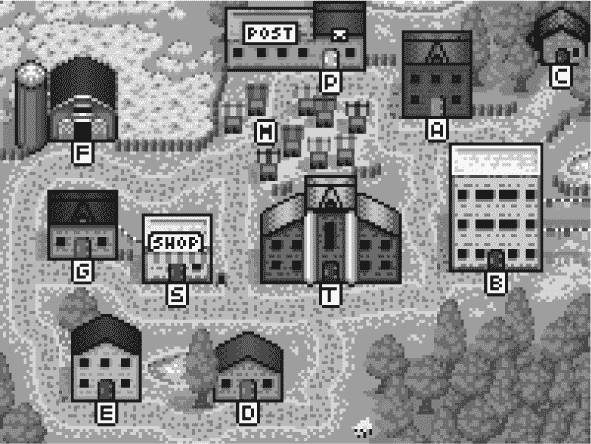

# 第八章：项目：一个机器人

在“项目

本章的项目是构建一个自动机，一个在虚拟世界中执行任务的小程序。我们的自动机会是一个邮件投递机器人，负责拾取和投递包裹。

### `Meadowfield`

`Meadowfield`村不大。它由`11`个地点和`14`条道路组成。可以用以下道路数组进行描述：

```js
const roads = [
  "Alice's House-Bob's House",   "Alice's House-Cabin",
  "Alice's House-Post Office",   "Bob's House-Town Hall",
  "Daria's House-Ernie's House", "Daria's House-Town Hall",
  "Ernie's House-Grete's House", "Grete's House-Farm",
  "Grete's House-Shop",          "Marketplace-Farm",
  "Marketplace-Post Office",     "Marketplace-Shop",
  "Marketplace-Town Hall",       "Shop-Town Hall"
];
```



村庄中的道路网络形成一个`图`。`图`是一个点（村庄中的地点）和它们之间的线（道路）的集合。这个`图`将是我们的机器人移动的世界。

字符串数组的处理并不容易。我们感兴趣的是从给定地点可以到达的目的地。让我们将道路列表转换为一个数据结构，该结构为每个地点提供可以从那里到达的地点。

```js
function buildGraph(edges) {
  let graph = Object.create(null);
  function addEdge(from, to) {
    if (from in graph) {
      graph[from].push(to);
    } else {
      graph[from] = [to];
    }
  }
  for (let [from, to] of edges.map(r => r.split("-"))) {
    addEdge(from, to);
    addEdge(to, from);
  }
  return graph;
}

const roadGraph = buildGraph(roads);
```

给定一组边，`buildGraph`创建一个地图对象，为每个节点存储一个连接节点的数组。它使用`split`方法将道路字符串（形式为`Start-End`）转换为包含起始和结束的两个元素数组。

### 任务

我们的机器人将在村庄中移动。各处有包裹，每个包裹都寄往其他地方。当机器人遇到包裹时，它会拾取并在到达目的地时投递。

自动机必须在每个时刻决定下一步该去哪里。当所有包裹都送达后，它的任务就完成了。

为了能够模拟这个过程，我们必须定义一个能够描述它的虚拟世界。该模型告诉我们机器人在哪里，以及包裹在哪里。当机器人决定移动时，我们需要更新模型以反映新情况。

如果你在考虑面向对象编程，你的第一反应可能是为世界中的各种元素定义对象：为机器人定义一个类，为包裹定义一个类，可能还有一个为地点定义的类。这样可以持有描述其当前状态的属性，比如某个地点的包裹堆，这可以在更新世界时进行更改。

这是错误的。至少，通常是如此。某物听起来像对象并不意味着它应该在你的程序中成为对象。反射性地为应用程序中的每个概念编写类，往往会让你拥有一组相互关联的对象，每个对象都有其内部的、变化的状态。这类程序通常难以理解，因此容易出错。

相反，让我们将村庄的状态简化为定义它的最小值集合。这里包括机器人的当前位置和未投递包裹的集合，每个包裹都有当前位置和目的地地址。就这些。

在这个过程中，让我们确保在机器人移动时不`改变`这个状态，而是为移动后的情况计算一个`新`状态。

```js
class VillageState {
  constructor(place, parcels) {
    this.place = place;
    this.parcels = parcels;
  }

  move(destination) {
    if (!roadGraph[this.place].includes(destination)) {
      return this;
    } else {
      let parcels = this.parcels.map(p => {
        if (p.place != this.place) return p;
        return {place: destination, address: p.address};
      }).filter(p => p.place != p.address);
      return new VillageState(destination, parcels);
    }
 }
}
```

移动方法是动作发生的地方。它首先检查从当前位置到目的地是否有道路，如果没有，则返回旧状态，因为这不是一个有效的移动。

接下来，该方法创建一个新的状态，将目的地设为机器人的新位置。它还需要创建一组新的包裹——机器人携带的（位于机器人当前位置的）包裹需要移动到新位置。而寄往新位置的包裹需要被投递——也就是说，它们需要从未投递包裹的集合中移除。调用`map`处理移动，调用`filter`处理投递。

包裹对象在移动时不会被改变，而是被重新创建。移动方法给我们一个新的村庄状态，但完全保留了旧状态。

```js
let first = new VillageState(
  "Post Office",
  [{place: "Post Office", address: "Alice's House"}]
);
let next = first.move("Alice's House");

console.log(next.place);
// → Alice's House
console.log(next.parcels);
// → []
console.log(first.place);
// → Post Office
```

这个移动使得包裹被投递，这在下一个状态中得以反映。但初始状态仍然描述了机器人位于邮局且包裹未投递的情况。

### 持久数据

不会改变的数据结构称为`不可变`或`持久`。它们的行为与字符串和数字很相似，即它们始终保持原样，而不是在不同时间包含不同的内容。

在`JavaScript`中，几乎所有东西都`可以`被改变，因此处理应保持不变的值需要一些克制。有一个名为`Object.freeze`的函数，可以改变一个对象，使对其属性的写入被忽略。如果你想小心的话，可以使用它来确保你的对象不会被改变。冻结确实需要计算机进行一些额外的工作，而被忽视的更新与执行错误的操作几乎同样可能会让人困惑。我通常更喜欢直接告诉人们某个对象不应该被修改，并希望他们能记住。

```js
let object = Object.freeze({value: 5});
object.value = 10;
console.log(object.value);
// → 5
```

我为什么要特别避免改变对象，尽管语言显然期待我这么做？因为这有助于我理解我的程序。这再次涉及复杂性管理。当我系统中的对象是固定、稳定的事物时，我可以孤立地考虑对它们的操作——从给定的起始状态移动到`爱丽丝`的家总是产生相同的新状态。当对象随时间变化时，这会给这种推理增加全新的复杂性维度。

对于我们在本章构建的小型系统来说，我们可以处理这点额外的复杂性。但限制我们能构建什么样系统的最重要因素是我们能理解多少。任何使你的代码更容易理解的东西，都能让你构建出更具雄心的系统。

不幸的是，尽管理解建立在持久数据结构上的系统更容易，`设计`一个系统，尤其是在你的编程语言没有帮助的情况下，可能会更困难。我们将在本书中寻找使用持久数据结构的机会，但我们也会使用可变数据结构。

### 模拟

送货机器人观察世界并决定它想朝哪个方向移动。因此，我们可以说，机器人是一个接受`VillageState`对象并返回附近地点名称的函数。

因为我们希望机器人能够记住事物，以便它们可以制定和执行计划，所以我们也将它们的记忆传递给它们，并允许它们返回一个新的记忆。因此，机器人返回的东西是一个包含它想要移动的方向和一个记忆值的对象，该值将在下次调用时返回给它。

```js
function runRobot(state, robot, memory) {
  for (let turn = 0;; turn++) {
    if (state.parcels.length == 0) {
      console.log(`Done in ${turn} turns`);
      break;
    }
    let action = robot(state, memory);
    state = state.move(action.direction);
    memory = action.memory;
    console.log(`Moved to ${action.direction}`);
  }
}
```

考虑一下机器人需要做些什么才能“解决”给定的状态。它必须通过访问每个有包裹的地点来收集所有包裹，然后通过访问每个包裹的地址来送递它们，但只能在收集完包裹后进行送递。

什么是可能有效的最笨拙策略？机器人可以在每次转弯时随机走一个方向。这意味着，它很可能最终会遇到所有的包裹，并在某个时刻到达包裹应该被送达的地方。

这可能看起来是这样的：

```js
function randomPick(array) {
  let choice = Math.floor(Math.random() * array.length);
  return array[choice];
}

function randomRobot(state) {
  return {direction: randomPick(roadGraph[state.place])};
}
```

请记住，`Math.random()`返回一个介于`0`和`1`之间的数字——但总是小于`1`。将这样的数字乘以数组的长度，然后应用`Math.floor`，便可以得到数组的随机索引。

由于这个机器人不需要记住任何东西，它忽略了第二个参数（记住，`JavaScript`函数可以在没有负面影响的情况下使用额外参数调用），并在返回的对象中省略了记忆属性。

要让这个复杂的机器人开始工作，我们首先需要一种方法来创建一个带有一些包裹的新状态。一个静态方法（在这里通过直接向构造函数添加属性来编写）是放置该功能的好地方。

```js
VillageState.random = function(parcelCount = 5) {
  let parcels = [];
  for (let i = 0; i < parcelCount; i++) {
    let address = randomPick(Object.keys(roadGraph));
    let place;
    do {
      place = randomPick(Object.keys(roadGraph));
    } while (place == address);
    parcels.push({place, address});
  }
  return new VillageState("Post Office", parcels);
};
```

我们不希望包裹从它们被寄往的地方发送出去。因此，当获取到一个与地址相等的地方时，`do`循环会持续选择新的地点。

让我们启动一个虚拟世界。

```js
runRobot(VillageState.random(), randomRobot);
// → Moved to Marketplace
// → Moved to Town Hall
// → ...
// → Done in 63 turns
```

机器人送递包裹需要经过很多次转弯，因为它的规划不够充分。我们会很快解决这个问题。

### 邮件卡车的路线

我们应该能够比随机机器人做得更好。一个简单的改进是借鉴现实世界邮递的工作方式。如果我们找到一条经过村庄所有地点的路线，机器人可以沿着这条路线运行两次，这样它就一定能完成任务。这是一条这样的路线（从邮局出发）：

```js
const mailRoute = [
  "Alice's House", "Cabin", "Alice's House", "Bob's House",
  "Town Hall", "Daria's House", "Ernie's House",
  "Grete's House", "Shop", "Grete's House", "Farm",
  "Marketplace", "Post Office"
];
```

为了实现跟随路线的机器人，我们需要利用机器人的记忆。机器人将其路线的其余部分保存在记忆中，并在每次转弯时丢弃第一个元素。

```js
function routeRobot(state, memory) {
  if (memory.length == 0) {
    memory = mailRoute;
  }
  return {direction: memory[0], memory: memory.slice(1)};
}
```

这个机器人已经快得多。它最多会经过`26`次转弯（两次`13`步的路线），但通常会更少。

### 寻路

不过，我并不认为盲目跟随固定路线是一种智能行为。如果机器人能根据实际需要做出的工作来调整自己的行为，它的工作效率将会更高。

为此，它必须能够有意识地朝着特定的包裹或需要投递包裹的地点移动。即使目标距离超过一步，这样做也需要某种寻路功能。

通过图找到一条路线的问题是一个典型的`搜索问题`。我们可以判断给定的解决方案（路线）是否有效，但我们不能像计算`2 + 2`那样直接计算出解决方案。相反，我们必须不断创建潜在的解决方案，直到找到一个有效的。

通过图的可能路线是无限的。但在从`A`到`B`寻找路线时，我们只关注从`A`开始的路线。我们也不关心那些访问同一地点两次的路线——因为那些绝对不是任何地方的最高效路线。这就减少了寻路器需要考虑的路线数量。

事实上，由于我们主要关注`最短`路线，我们希望确保先查看短路线，再查看较长的路线。一个好的方法是“从起始点生长”路线，探索每一个尚未访问的可达地点，直到找到到达目标的路线。这样，我们只会探索那些潜在有趣的路线，而且我们知道找到的第一条路线是最短的路线（如果有多条路线，它就是其中之一）。

这里有一个实现这个功能的函数：

```js
function findRoute(graph, from, to) {
  let work = [{at: from, route: []}];
  for (let i = 0; i < work.length; i++) {
    let {at, route} = work[i];
    for (let place of graph[at]) {
      if (place == to) return route.concat(place);
      if (!work.some(w => w.at == place)) {
        work.push({at: place, route: route.concat(place)});
      }
    }
  }
}
```

探索必须按正确的顺序进行——首先到达的地方必须首先被探索。我们不能在到达一个地方后立即探索，因为那意味着从`那里`到达的地方也会立即被探索，依此类推，尽管可能还有其他尚未探索的更短路径。

因此，该函数保持一个`工作列表`。这是一个包含接下来应探索地点的数组，以及到达那里的路线。它从起始位置和一个空路线开始。

搜索过程通过取出列表中的下一个项目并进行探索来进行，这意味着它查看从该地点出发的所有道路。如果其中一条是目标，则可以返回一条完成的路线。否则，如果我们之前没有查看过这个地点，就会将一个新项目添加到列表中。如果我们之前查看过，由于我们优先查看短路线，我们要么找到了一条更长的路线，要么找到了一条正好和现有路线一样长的路线，因此我们不需要再进行探索。

你可以将其可视化为从起始位置爬出的已知路线网络，均匀向各侧扩展（但绝不会回头缠绕在一起）。一旦第一条线程到达目标位置，该线程就会被追踪回起点，从而给我们提供路线。

我们的代码没有处理工作列表上没有更多工作项的情况，因为我们知道我们的图是`连通的`，这意味着每个位置都可以从所有其他位置到达。我们总是能够在两点之间找到一条路线，搜索不会失败。

```js
function goalOrientedRobot({place, parcels}, route) {
  if (route.length == 0) {
    let parcel = parcels[0];
    if (parcel.place != place) {
      route = findRoute(roadGraph, place, parcel.place);
    } else {
      route = findRoute(roadGraph, place, parcel.address);
    }
  }
  return {direction: route[0], memory: route.slice(1)};
}
```

这个机器人使用它的内存值作为移动方向的列表，就像跟踪路线的机器人一样。每当这个列表为空时，它必须找出接下来该做什么。它取出未交付包裹中的第一个，如果那个包裹还没有被取走，就为其规划一条路线。如果包裹`已经`被取走，它仍然需要被交付，因此机器人会创建一条前往交付地址的路线。

这个机器人通常在大约16次回合内完成交付5个包裹的任务。这比`routeRobot`略好，但仍然显然不是最优的。我们将在接下来的练习中继续改进它。

### 练习

#### `测量机器人`

仅仅让机器人解决几个场景很难客观比较它们。也许某个机器人碰巧得到了一些较简单的任务或它擅长的任务，而另一个则没有。

编写一个`compareRobots`函数，接受两个机器人（及其初始内存）。它应该生成100个任务，并让这两个机器人解决每一个任务。完成后，它应输出每个机器人每个任务所用的平均步骤数。

为了公平起见，请确保将每个任务都交给两个机器人，而不是为每个机器人生成不同的任务。

#### `机器人效率`

你能写一个比目标导向机器人更快完成交付任务的机器人吗？如果你观察那个机器人的行为，它做了哪些显然愚蠢的事情？这些可以如何改进？

如果你解决了之前的练习，你可能想用你的`compareRobots`函数来验证你是否改善了机器人。

#### `持久性组`

在标准的JavaScript环境中，大多数数据结构并不太适合持久性使用。数组有`slice`和`concat`方法，这使我们能够轻松创建新的数组而不损坏旧的数组。但例如，`Set`没有用于添加或移除项以创建新集合的方法。

编写一个新的类`PGroup`，类似于第六章中的`Group`类，存储一组值。像`Group`一样，它具有`add`、`delete`和`has`方法。然而，它的`add`方法应该返回一个`新的` `PGroup`实例，添加给定成员，同时保留旧实例不变。同样，`delete`应该创建一个没有给定成员的新实例。

这个类应该适用于任何类型的值，而不仅仅是字符串。当处理大量值时，它`不必`高效。

构造函数不应该是类接口的一部分（尽管你肯定希望在内部使用它）。相反，有一个空实例`PGroup.empty`，可以用作起始值。

你为什么只需要一个`PGroup.empty`值，而不是每次都创建一个新的空映射的函数？

`调试的难度是编写代码难度的两倍。因此，如果你尽可能聪明地编写代码，那么，从定义上讲，你就不够聪明去调试它。`

—布赖恩·肯尼汉和P.J.普劳杰，`程序设计风格元素`


