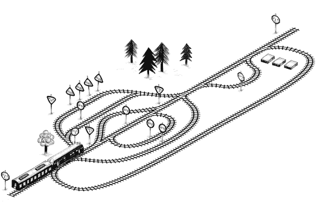

# 第九章：漏洞和错误

计算机程序中的缺陷通常被称为`漏洞`。程序员常常觉得将它们想象成一些偶然爬入我们工作的“小东西”会让人感觉良好。但实际上，当然是我们自己把它们放进去的。

如果程序是凝结的思维，我们可以大致将漏洞分为由于思维混乱引起的漏洞和在将思维转换为代码时引入的错误。前者通常比后者更难以诊断和修复。

### 语言

如果计算机对我们正在尝试做的事情了解得足够多，许多错误可以被自动指出。但在这里，JavaScript的宽松性反而成了障碍。它对绑定和属性的概念模糊到几乎无法在程序运行之前捕捉到拼写错误。即便如此，它仍然允许你在没有抱怨的情况下做一些显然无意义的事情，比如计算`true * "monkey"`。

JavaScript会对一些事情进行抱怨。编写一个不符合语言语法的程序会立即导致计算机发出警告。其他事情，例如调用非函数的东西或在未定义值上查找属性，都会在程序尝试执行该操作时引发错误。

然而，通常情况下，你的无意义计算会仅仅产生`NaN`（不是一个数字）或未定义值，而程序则会愉快地继续运行，确信自己在做一些有意义的事情。这个错误只有在虚假值经过多个函数后才会显现出来。它可能根本不会触发错误，但会默默导致程序的输出错误。找到此类问题的源头可能会很困难。

查找程序中错误（漏洞）的过程称为`调试`。

### 严格模式

JavaScript可以通过启用`严格模式`变得`稍微`严格。这可以通过在文件或函数体的顶部放置字符串`"use strict"`来实现。以下是一个示例：

```js
function canYouSpotTheProblem() {
  "use strict";
  for (counter = 0; counter < 10; counter++) {
    console.log("Happy happy");
  }
}

canYouSpotTheProblem();
// → ReferenceError: counter is not defined
```

`类`和`模块`中的代码（我们将在第十章中讨论）是自动严格的。旧的非严格行为仍然存在，只是因为某些旧代码可能依赖于此，语言设计者努力避免破坏任何现有程序。

通常情况下，当你忘记在绑定前加`let`时，比如示例中的`counter`，JavaScript会静默地创建一个全局绑定并使用它。在严格模式下，则会报告错误。这是非常有帮助的。但需要注意的是，当相关的绑定已经在作用域中存在时，这种方法将不起作用。在这种情况下，循环仍然会静默地覆盖绑定的值。

严格模式的另一个变化是，`this`绑定在未作为方法调用的函数中保持未定义值。当在非严格模式下进行这样的调用时，`this`引用全局作用域对象，该对象的属性是全局绑定。因此，如果你在严格模式下错误地调用了一个方法或构造函数，JavaScript会在尝试从`this`读取内容时产生错误，而不是高兴地写入全局作用域。

例如，考虑以下代码，它在没有`new`关键字的情况下调用构造函数，因此它的`this`将`不`引用新构造的对象：

```js
function Person(name) { this.name = name; }
let ferdinand = Person("Ferdinand"); // Oops
console.log(name);
// → Ferdinand
```

对`Person`的虚假调用成功了，但返回了未定义的值，并创建了全局绑定名称。在严格模式下，结果是不同的。

```js
"use strict";
function Person(name) { this.name = name; }
let ferdinand = Person("Ferdinand"); // Forgot new
// → TypeError: Cannot set property 'name' of undefined
```

我们会立即被告知某些地方出了问题。这很有帮助。幸运的是，使用`class`语法创建的构造函数如果没有`new`被调用时总会抱怨，即使在非严格模式下，这也减少了问题的发生。

严格模式还做了一些其他事情。它不允许给函数多个相同名称的参数，并完全移除某些有问题的语言特性（例如`with`语句，由于错误严重而未在本书中进一步讨论）。

简而言之，在程序顶部放置`"use strict"`通常不会造成伤害，反而可能帮助你发现问题。

### 类型

一些语言希望在运行程序之前知道所有绑定和表达式的类型。当类型以不一致的方式使用时，它们会立即告诉你。JavaScript只在实际运行程序时考虑类型，即使在那时也常常尝试隐式地将值转换为它所期望的类型，因此并没有太大帮助。

尽管如此，类型提供了一个有用的框架来讨论程序。许多错误源于对输入或输出的值类型的混淆。如果你把这些信息写下来，你就不容易混淆。

你可以在上一章的`findRoute`函数之前添加如下注释，以描述它的类型：

```js
// (graph: Object, from: string, to: string) => string[]
function findRoute(graph, from, to) {
  // ...
}
```

有多种不同的约定用于用类型注解JavaScript程序。

关于类型的一点是，它们需要引入自己的复杂性，以能够描述足够的代码以便有用。你认为返回数组中随机元素的`randomPick`函数的类型会是什么？你需要引入一个`类型变量`，`T`，它可以代表任何类型，以便你可以为`randomPick`赋予类似`(T[]) → T`的类型（从一个`T`数组到一个`T`的函数）。

当程序的类型已知时，计算机可以为你`检查`这些类型，指出在程序运行前的错误。有几种JavaScript方言为语言添加了类型并进行检查。其中最流行的是`TypeScript`。如果你有兴趣为你的程序增加更多严谨性，我建议你试一试。

在本书中，我们将继续使用原始的、危险的、无类型的JavaScript代码。

### 测试

如果语言不会在很大程度上帮助我们找到错误，我们就必须通过运行程序

手动一次又一次地这样做是个很糟糕的主意。这不仅令人烦恼，而且往往效率低下，因为每次修改时要全面测试所有内容需要花费太多时间。

计算机擅长重复性任务，而测试就是理想的重复性任务。自动化测试是编写一个测试另一个程序的程序的过程。编写测试比手动测试需要多一点工作，但一旦你完成它，你就获得了一种超能力：你只需几秒钟就能验证你的程序在你编写测试的所有情况下仍然表现正常。当你破坏了某些东西时，你会立即注意到，而不是在之后的某个时刻偶然发现。

测试通常以小型标记程序的形式出现，用于验证代码的某些方面。例如，针对（标准的，可能已经被其他人测试过的）`toUpperCase`方法的一组测试可能如下所示：

```js
function test(label, body) {
  if (!body()) console.log(`Failed: ${label}`);
}

test("convert Latin text to uppercase", () => {
  return "hello".toUpperCase() == "HELLO";
});
test("convert Greek text to uppercase", () => {
  return "Χαίρετε".toUpperCase() == "ΧΑΙΡΕΤΕ";
});
test("don't convert case-less characters", () => {
  return "مرحبا".toUpperCase() == "مرحبا";
});
```

像这样编写测试往往会产生相当重复和笨拙的代码。幸运的是，有一些软件可以帮助你构建和运行测试集合（`测试套件`），通过提供一种适合表达测试的语言（以函数和方法的形式）以及在测试失败时输出有用信息。这些通常被称为`测试运行器`。

一些代码比其他代码更容易测试。一般来说，代码与外部对象的交互越多，设置测试上下文就越困难。前一章中展示的编程风格，使用自包含的持久值而不是可变对象，往往更容易测试。

### 调试

一旦你注意到程序出现了问题，因为它表现不当或产生错误，下一步就是找出`是什么`问题。

有时这很明显。错误信息会指向程序的特定行，如果你查看错误描述和那行代码，通常能看到问题所在。

但并不总是如此。有时触发问题的行仅仅是一个地方，在那里一个不稳定的值以无效的方式被使用。如果你在前面的章节中解决过练习，你可能已经经历过这样的情况。

以下示例程序试图将一个整数转换为给定基数（十进制、二进制等）的字符串，通过反复提取最后一位数字，然后除以该数字以去掉这位数字。但它目前产生的奇怪输出表明它存在缺陷。

```js
function numberToString(n, base = 10) {
  let result = "", sign = "";
  if (n < 0) {
    sign = "-";
    n = -n;
  }
  do {
    result = String(n % base) + result;
    n /= base;
  } while (n > 0);
  return sign + result;
}
console.log(numberToString(13, 10));
// → 1.5e-3231.3e-3221.3e-3211.3e-3201.3e-3191.3e-3181.3...
```

即使你已经看到问题，暂时假装你没有。我们知道我们的程序出现了故障，我们想找出原因。

在这里，你必须抵制随机更改代码的冲动，以看看这样是否会改善程序。相反，`思考`。分析发生了什么，并提出一个可能的理论来解释它。然后进行额外的观察以测试这个理论——或者，如果你还没有理论，进行额外的观察来帮助你形成一个。

在程序中放置一些战略性的`console.log`调用是获取程序正在做的事情的额外信息的好方法。在这种情况下，我们希望`n`依次取值`13`、`1`，然后`0`。让我们在循环开始时写出它的值。

```js
13
1.3
0.13
0.013
...
1.5e-323
```

`对的`。将`13`除以`10`不会产生一个整数。我们实际上想要的是`n = Math.floor(n / base)`，而不是`n /= base`，这样数字才能正确“向右移动”。

使用`console.log`来窥探程序行为的替代方法是使用浏览器的`调试器`功能。浏览器具有在代码的特定行上设置`断点`的能力。当程序执行到包含断点的行时，它会暂停，你可以检查此时绑定的值。我不会详细说明，因为不同浏览器的调试器各不相同，但可以查看浏览器的开发者工具或在网上搜索说明。

另一种设置断点的方法是在你的程序中包含一个调试器语句（仅由该关键字组成）。如果浏览器的开发者工具处于活动状态，程序将在遇到此类语句时暂停。

### 错误传播

不幸的是，并不是所有问题都能由程序员预防。如果你的程序以任何方式与外部世界通信，就有可能收到格式不正确的输入、过载工作量，或者网络失败。

如果你只是为自己编程，你可以选择忽略这些问题直到它们发生。但如果你构建的东西将被其他人使用，通常希望程序比单纯崩溃做得更好。有时正确的做法是坦然接受错误输入并继续运行。在其他情况下，最好是向用户报告发生了什么错误，然后放弃。在这两种情况下，程序必须积极响应问题。

假设你有一个函数`promptNumber`，它询问用户一个数字并返回它。如果用户输入“橙子”，它应该返回什么？

一种选择是让它返回一个特殊值。常见的选择包括`null`、`undefined`或`-1`。

```js
function promptNumber(question) {
  let result = Number(prompt(question));
  if (Number.isNaN(result)) return null;
  else return result;
}

console.log(promptNumber("How many trees do you see?"));
```

现在，任何调用`promptNumber`的代码都必须检查是否读取到了实际的数字，如果没有，则必须以某种方式进行恢复——也许是再次询问，或者填入一个默认值。或者它可以再次返回一个特殊值给`它`的调用者，以指示它未能完成请求的操作。

在许多情况下，尤其是在错误常见且调用者应明确考虑这些错误时，返回一个特殊值是指示错误的好方法。然而，这也有其缺点。首先，如果函数已经可以返回每种可能的值怎么办？在这样的函数中，你需要做一些像将结果包装在对象中，以便能够区分成功和失败的事情，正如迭代器接口的下一个方法所做的那样。

```js
function lastElement(array) {
  if (array.length == 0) {
    return {failed: true};
  } else {
    return {value: array[array.length - 1]};
  }
}
```

返回特殊值的第二个问题是，它可能导致尴尬的代码。如果一段代码调用`promptNumber` 10次，它必须检查10次是否返回了`null`。如果它发现`null`的反应只是简单地返回`null`本身，那么调用这个函数的代码也将必须进行检查，依此类推。

### 异常

当一个函数无法正常进行时，我们通常`希望`做的就是停止我们正在做的事情，并立即跳转到一个知道如何处理该问题的地方。这就是`异常处理`所做的。

异常是一种机制，使得在代码遇到问题时可以`引发`（或`抛出`）异常。异常可以是任何值。引发异常有点类似于函数的超级返回：它不仅跳出当前函数，还跳出所有调用它的函数，一直返回到开始当前执行的第一个调用。这被称为`展开栈`。你可能还记得在第三章提到的函数调用栈。异常在这个栈中快速向下移动，抛弃它遇到的所有调用上下文。

如果异常总是直接向下快速传递到栈底，它们就没有太大用处。它们只会提供一种新颖的方式来使你的程序崩溃。它们的强大在于你可以在栈上设置“障碍”，以`捕获`在下落过程中发生的异常。一旦你捕获了异常，就可以处理它以解决问题，然后继续运行程序。

这里有一个例子：

```js
function promptDirection(question) {
  let result = prompt(question);
  if (result.toLowerCase() == "left") return "L";
  if (result.toLowerCase() == "right") return "R";
  throw new Error("Invalid direction: " + result);
}

function look() {
  if (promptDirection("Which way?") == "L") {
    return "a house";
  } else {
    return "two angry bears";
  }
}

try {
  console.log("You see", look());
} catch (error) {
  console.log("Something went wrong: " + error);
}
```

`throw`关键字用于引发异常。捕获异常是通过将一段代码包装在`try`块中，然后跟上关键字`catch`来实现的。当`try`块中的代码引发异常时，`catch`块将被评估，括号中的名称绑定到异常值上。在`catch`块完成后——或者如果`try`块没有问题地完成——程序将在整个`try/catch`语句下继续执行。

在这种情况下，我们使用`Error`构造函数创建我们的异常值。这是一个标准的 JavaScript 构造函数，用于创建一个具有消息属性的对象。`Error`的实例还收集了在创建异常时存在的调用栈的信息，所谓的`栈追踪`。这些信息存储在`stack`属性中，在尝试调试问题时非常有用：它告诉我们问题发生的函数以及哪些函数进行了失败的调用。

请注意，`look`函数完全忽略了`prompt Direction`可能出现错误的情况。这就是异常的重大优势：错误处理代码仅在错误发生的点和处理的点才是必要的。而中间的函数可以完全不再考虑这个问题。

好吧，几乎是这样……

### 异常后的清理

异常的效果是一种控制流。每个可能引发异常的动作，几乎每个函数调用和属性访问，都可能导致控制突然离开你的代码。

这意味着当代码有多个副作用时，即使其“常规”控制流看起来总会发生这些副作用，异常可能会阻止其中某些副作用的发生。

这里有一些非常糟糕的银行代码：

```js
const accounts = {
  a: 100,
 b: 0,
  c: 20
};

function getAccount() {
  let accountName = prompt("Enter an account name");
  if (!Object.hasOwn(accounts, accountName)) {
    throw new Error(`No such account: ${accountName}`);
  }
  return accountName;
}

function transfer(from, amount) {
  if (accounts[from] < amount) return;
  accounts[from] -= amount;
  accounts[getAccount()] += amount;
}
```

转账函数将一笔资金从一个指定账户转移到另一个账户，并在此过程中询问另一个账户的名称。如果给出无效的账户名称，`getAccount`将抛出异常。

但是转账`首先`从账户中移走资金，然后`再`调用`getAccount`，才将其添加到另一个账户。如果在这一点上被异常中断，资金就会消失。

这段代码本可以写得更聪明一些，例如在开始转移资金之前先调用`getAccount`。但这样的错误往往以更微妙的方式出现。即使是看似不会抛出异常的函数，在特殊情况下或因程序员的失误也可能会抛出异常。

解决这一问题的一种方法是减少副作用。同样，计算新值而不是更改现有数据的编程风格有助于减少问题。如果一段代码在创建新值的过程中中途停止运行，就不会破坏任何现有的数据结构，从而使恢复变得更容易。

由于这并不总是实际可行，`try`语句还有另一个特性：它们可以被`finally`块跟随，作为`catch`块的替代或补充。`finally`块表示“无论发生`什么`，在尝试运行`try`块中的代码后运行这段代码。”

```js
function transfer(from, amount) {
  if (accounts[from] < amount) return;
  let progress = 0;
  try {
    accounts[from] -= amount;
    progress = 1;
    accounts[getAccount()] += amount;
    progress = 2;
  } finally {
    if (progress == 1) {
 accounts[from] += amount;
    }
  }
}
```

这个版本的函数跟踪其进度，如果在离开时发现它在创建不一致的程序状态时被中止，它会修复所造成的损害。

请注意，即使在`try`块中抛出异常时，`finally`代码仍会运行，但这并不会干扰异常。在`finally`块运行后，堆栈继续展开。

编写即使在意外情况下也能可靠运行的程序是很困难的。许多人根本不在意，因为异常通常是为特殊情况保留的，所以问题可能发生得非常少，以至于根本不会被注意到。这是好事还是坏事，取决于软件失败时造成的损害程度。

### 选择性捕获

当异常一路传递到底部而未被捕获时，它会被环境处理。这在不同环境中意味着不同的事情。在浏览器中，错误描述通常会写入 JavaScript 控制台（可以通过浏览器的工具或开发者菜单访问）。Node.js（我们将在第二十章中讨论的无浏览器 JavaScript 环境）对数据损坏更加谨慎。当发生未处理异常时，它会中止整个进程。

对于程序员的错误，通常允许错误通过是你能做的最好的选择。未处理异常是指示程序出现故障的一种合理方式，现代浏览器的 JavaScript 控制台会为你提供一些关于问题发生时调用栈上哪些函数的信息。

对于在日常使用中`预期`会发生的问题，崩溃并伴随未处理异常是一种糟糕的策略。

对语言的无效使用，例如引用一个不存在的绑定、在`null`上查找属性或调用非函数的东西，也会导致异常被抛出。这些异常也可以被捕获。

当进入`catch`体时，我们所知道的只是我们的`try`体中的`某些东西`导致了异常。但我们并不知道`是什么`造成了异常，或者`是哪一个`异常。

`JavaScript`（在一个相当明显的遗漏中）并未提供选择性捕获异常的直接支持：要么捕获所有异常，要么一个都不捕获。这使得`假设`你获得的异常正是你在编写`catch`块时所考虑的异常变得很诱人。

但这可能并非如此。某些其他假设可能被违反，或者你可能引入了导致异常的错误。以下是一个`尝试`持续调用`promptDirection`直到得到有效答案的示例：

```js
for (;;) {
  try {
    let dir = promtDirection("Where?"); // ← Typo!
    console.log("You chose ", dir);
    break;
  } catch (e) {
    console.log("Not a valid direction. Try again.");
  }
}
```

`for (;;)`结构是一种故意创建不会自行终止的循环的方法。我们仅在给出有效方向时才会跳出循环。不幸的是，我们拼写错误了`promptDirection`，这将导致“未定义变量”错误。由于`catch`块完全忽略了其异常值（`e`），假设它知道问题出在哪里，因此错误地将绑定错误视为输入不正确。这不仅导致了无限循环，还“埋没”了关于拼写错误绑定的有用错误信息。

一般来说，除非是为了“路由”异常到某处（例如，通过网络告知另一个系统我们的程序崩溃了），否则不要随意捕获异常。即便如此，也要仔细考虑你可能隐藏的信息。

我们希望捕获`特定`类型的异常。我们可以通过在`catch`块中检查捕获的异常是否是我们感兴趣的类型，如果不是，就重新抛出它。但我们如何识别异常呢？

我们可以将其消息属性与我们预期的错误消息进行比较。但这是一种不可靠的写代码方式——我们将使用旨在供人类理解的信息（消息）来做出程序决策。一旦有人更改（或翻译）消息，代码将停止工作。

相反，让我们定义一个新的错误类型，并使用`instanceof`来识别它。

```js
class InputError extends Error {}

function promptDirection(question) {
  let result = prompt(question);
  if (result.toLowerCase() == "left") return "L";
  if (result.toLowerCase() == "right") return "R";
  throw new InputError("Invalid direction: " + result);
}
```

新的错误类扩展了`Error`。它没有定义自己的构造函数，这意味着它继承了`Error`的构造函数，该构造函数期望一个字符串消息作为参数。实际上，它什么都没有定义——这个类是空的。`InputError`对象的行为类似于`Error`对象，除了它们有一个不同的类，我们可以通过这个类来识别它们。

现在循环可以更仔细地捕捉这些错误。

```js
for (;;) {
  try {
    let dir = promptDirection("Where?");
    console.log("You chose ", dir);
    break;
  } catch (e) {
    if (e instanceof InputError) {
      console.log("Not a valid direction. Try again.");
    } else {
      throw e;
    }
  }
}
```

这将仅捕获`InputError`的实例，并让不相关的异常通过。如果你重新引入拼写错误，将正确报告未定义绑定错误。

### 断言

`断言`是在程序内部进行的检查，用于验证某件事情是否如预期那样。它们的使用不是为了处理在正常操作中可能出现的情况，而是为了发现程序员的错误。

例如，如果`firstElement`被描述为一个不应在空数组上调用的函数，我们可能会这样写：

```js
function firstElement(array) {
  if (array.length == 0) {
    throw new Error("firstElement called with []");
  }
  return array[0];
}
```

现在，当你错误使用它时，这将使你的程序立刻崩溃，而不是静默地返回`undefined`（当读取一个不存在的数组属性时得到的结果）。这降低了此类错误被忽视的可能性，并使得发生时更容易找到它们的原因。

我不建议尝试为每种可能的错误输入编写断言。那会是一项巨大的工作，并且会导致代码非常嘈杂。你应该将断言保留给那些容易犯的错误（或者是你发现自己经常犯的错误）。

### 概述

编程的重要部分是发现、诊断和修复错误。如果你有一个自动化测试套件或在程序中添加断言，问题可能会变得更容易被注意到。

由程序控制之外的因素引起的问题通常应该积极规划。有时，当问题可以在本地处理时，特殊返回值是跟踪它们的好方法。否则，异常可能更为合适。

抛出异常会导致调用栈被展开，直到下一个封闭的`try/catch`块或者栈底。异常值将被传递给捕获它的`catch`块，该块应该验证它实际上是预期的异常类型，然后对其进行处理。为了帮助解决异常引起的不可预测的控制流，可以使用`finally`块以确保在块结束时某段代码`总是`执行。

### 练习

#### `重试`

假设你有一个函数`primitiveMultiply`，在20%的情况下会乘以两个数字，而在其他80%的情况下会抛出类型为`MultiplicatorUnitFailure`的异常。编写一个函数来封装这个笨拙的函数，持续尝试直到调用成功，之后返回结果。

确保你只处理你试图处理的异常。

#### `锁定的盒子`

考虑以下（相当人为的）对象：

```js
const box = new class {
  locked = true;
  #content = [];

  unlock() { this.locked = false; }
  lock() { this.locked = true; }
  get content() {
    if (this.locked) throw new Error("Locked!");
    return this.#content;
  }
};
```

这是一个带锁的盒子。盒子里有一个数组，但只有在盒子解锁时才能访问。

编写一个名为`withBoxUnlocked`的函数，接受一个函数值作为参数，解锁盒子，运行该函数，然后确保在返回之前盒子再次上锁，无论参数函数是正常返回还是抛出异常。

为了额外加分，确保当调用`withBoxUnlocked`时，如果盒子已经解锁，盒子保持解锁状态。

`一些人在面对问题时，会想“我知道，我会使用正则表达式。”现在他们有两个问题。`

—杰米·扎温斯基


