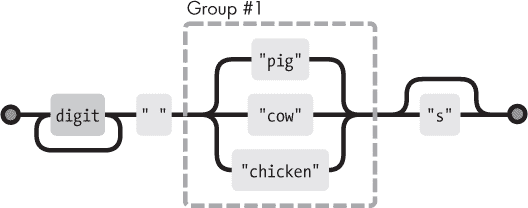
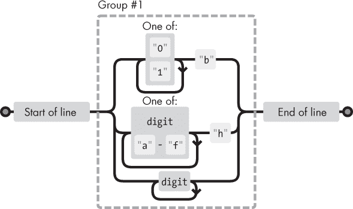
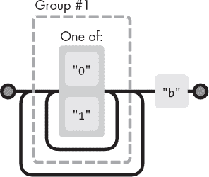

# 第十章：正则表达式

编程工具和技术以一种混乱的进化方式生存和传播。并不是最佳或最聪明的工具获胜，而是那些在正确的细分市场中足够有效或恰好与其他成功技术整合的工具。

在本章中，我将讨论这样一个工具，`正则表达式`。正则表达式是一种描述字符串数据模式的方法。它们形成了一种小而独立的语言，属于 JavaScript 以及许多其他语言和系统。

正则表达式既十分笨拙又极其有用。它们的语法晦涩，而 JavaScript 为它们提供的编程接口又笨重。但它们是检查和处理字符串的强大工具。正确理解正则表达式将使你成为更有效的程序员。

### 创建正则表达式

正则表达式是一种对象。它可以通过`RegExp`构造函数构造，或通过用正斜杠（`/`）字符括起模式来作为文字值书写。

```js
let re1 = new RegExp("abc");
let re2 = /abc/;
```

这两个正则表达式对象表示相同的模式：一个`a`字符后跟一个`b`，再后跟一个`c`。

使用`RegExp`构造函数时，模式被写成普通字符串，因此反斜杠的通常规则适用。

第二种记法中，模式出现在斜杠字符之间，对反斜杠的处理

```js
let aPlus = /A\+/;
```

### 匹配测试

正则表达式对象有许多方法。最简单的方法是`test`。如果你传递给它一个字符串，它将返回一个布尔值，告诉你该字符串是否包含模式的匹配。

```js
console.log(/abc/.test("abcde"));
// → true
console.log(/abc/.test("abxde"));
// → false
```

仅由非特殊字符组成的正则表达式简单地表示该字符序列。如果`abc`出现在我们测试的字符串中的任何位置（不仅仅是在开始处），测试将返回`true`。

### 字符集

检查一个字符串是否包含`abc`也可以通过调用`indexOf`来完成。正则表达式之所以有用，是因为它们允许我们描述更复杂的模式。

假设我们想匹配任何数字。在正则表达式中，将一组字符放在方括号之间，使得该部分表达式匹配方括号中的任何字符。

以下两个表达式匹配所有包含数字的字符串：

```js
console.log(/[0123456789]/.test("in 1992"));
// → true
console.log(/[0-9]/.test("in 1992"));
// → true
```

在方括号内，两个字符之间的连字符（`-`）可以用来表示字符范围，其顺序由字符的 Unicode 编号决定。字符 0 到 9 在这个排序中彼此相邻（编码 48 到 57），因此`[0-9]`包含了所有数字，并且匹配任何数字。

一些常见的字符组有其自己的内置快捷方式。数字就是其中之一：`\d`的含义与`[0-9]`相同。

|`\d`| 任何数字字符 |
| --- | --- |
|`\w`| 一个字母数字字符（“单词字符”） |
|`\s`| 任何空白字符（空格、制表符、换行符等） |
|`\D`| 一个`不是`数字的字符 |
|`\W`| 一个非字母数字字符 |
|`\S`| 一个非空白字符 |
|`.`| 除换行符外的任何字符 |

你可以用以下表达式匹配日期和时间格式，如`01-30-2003 15:20`：

```js
let dateTime = /\d\d-\d\d-\d\d\d\d \d\d:\d\d/;
console.log(dateTime.test("01-30-2003 15:20"));
// → true
console.log(dateTime.test("30-jan-2003 15:20"));
// → false
```

那个正则表达式看起来完全糟糕，不是吗？其中一半是反斜杠，产生的背景噪声使得实际表达的模式很难被识别。稍后我们会看到这个表达式的稍微改进版本。

这些反斜杠代码也可以在方括号内使用。例如，`[\d.]`表示任何数字或句点字符。句点本身在方括号中失去了特殊含义。其他特殊字符也是如此，例如加号`(+)`。

要`反转`一组字符——即表达你想匹配任何`除了`该组中的字符外的字符——可以在开括号后写一个插入符号（`^`）。

```js
let nonBinary = /[⁰¹]/;
console.log(nonBinary.test("1100100010100110"));
// → false
console.log(nonBinary.test("0111010112101001"));
// → true
```

### 国际字符

由于 JavaScript 最初的简单实现以及这种简单方法后来被视为标准行为，JavaScript 的正则表达式在处理不出现在英语中的字符时显得相当愚蠢。例如，在 JavaScript 的正则表达式看来，“单词字符”仅是拉丁字母表中的 26 个字符（大小写皆可）、十进制数字，以及出于某种原因的下划线字符。像`é`或`β`这样的字符，虽然绝对是单词字符，却不会匹配`\w`（而且会匹配大写的`\W`，即非单词类别）。

由于一个奇怪的历史偶然，`\s`（空白符）没有这个问题，它匹配 Unicode 标准认为的所有空白字符，包括不换行空格和蒙古元音分隔符等。

在正则表达式中可以使用`\p`来匹配 Unicode 标准赋予特定属性的所有字符。这使我们能够以更广泛的方式匹配字母。然而，由于与原始语言标准的兼容性，只有在正则表达式后面加上`u`字符（表示 Unicode）时，这些字符才能被识别。

|`\p{L}`| 任何字母 |
| --- | --- |
|`\p{N}`| 任何数字字符 |
|`\p{P}`| 任何标点符号字符 |
|`\P{L}`| 任何非字母（大写`P`表示反转） |
|`\p{Script=Hangul}`| 给定脚本中的任何字符（参见 第五章） |

使用`\w`进行文本处理，可能需要处理非英语文本（甚至包含借用词如`cliché`的英语文本）是一种风险，因为它不会将像`é`这样的字符视为字母。尽管它们通常更冗长，但`\p`属性组更加稳健。

```js
console.log(/\p{L}/u.test("α"));
// → true
console.log(/\p{L}/u.test("!"));
// → false
console.log(/\p{Script=Greek}/u.test("α"));
// → true
console.log(/\p{Script=Arabic}/u.test("α"));
// → false
```

另一方面，如果你是为了对数字执行某些操作而匹配数字，通常确实需要`\d`来匹配数字，因为将任意数字字符转换为 JavaScript 数字并不是像`Number`这样的函数能为你做到的。

### 重复模式的部分

现在我们知道如何匹配单个数字。如果我们想匹配一个完整的数字——一个或多个数字的序列呢？

当你在正则表达式中在某个内容后加上加号`(+)`时，表示该元素可以重复多次。因此，`/\d+/`匹配一个或多个数字字符。

```js
console.log(/'\d+'/.test("'123'"));
// → true
console.log(/'\d+'/.test("''"));
// → false
console.log(/'\d*'/.test("'123'"));
// → true
console.log(/'\d*'/.test("''"));
// → true
```

星号`(*)`的含义类似，但也允许模式零次匹配。后面带有星号的内容不会阻止模式匹配——如果找不到任何合适的文本匹配，它只会匹配零个实例。

问号`(?)`使模式的部分`可选`，意味着它可以出现零次或一次。在下面的示例中，`u`字符可以出现，但当它缺失时，模式仍然匹配：

```js
let neighbor = /neighbou?r/;
console.log(neighbor.test("neighbour"));
// → true
console.log(neighbor.test("neighbor"));
// → true
```

要表示模式应该出现的精确次数，可以使用大括号。在元素后面加上`{4}`，例如，要求它恰好出现四次。也可以通过这种方式指定范围：`{2,4}`意味着元素必须至少出现两次，最多四次。

这是日期和时间模式的另一个版本，允许单个和双个数字的天、月和小时。它也略微更易于解读。

```js
let dateTime = /\d{1,2}-\d{1,2}-\d{4} \d{1,2}:\d{2}/;
console.log(dateTime.test("1-30-2003 8:45"));
// → true
```

使用大括号时，可以通过省略逗号后的数字来指定开放范围。例如，`{5,}`意味着五次或更多次。

### 子表达式分组

要在多个元素上同时使用`*`或`+`这样的运算符，必须使用括号。被括号包围的正则表达式的一部分在后续运算符的考虑下算作一个单一元素。

```js
let cartoonCrying = /boo+(hoo+)+/i;
console.log(cartoonCrying.test("Boohoooohoohooo"));
// → true
```

第一个和第二个`+`字符仅适用于`boo`和`hoo`中的第二个`o`。第三个`+`适用于整个组`(hoo+)`，匹配一个或多个这样的序列。

示例中表达式末尾的`i`使该正则表达式对大小写不敏感，即使模式本身全部为小写，也允许匹配输入字符串中的大写`B`。

### 匹配和分组

`test`方法是匹配正则表达式的最简单方式。它只告诉你是否匹配，而没有其他信息。正则表达式还有一个`exec`（执行）方法，如果未找到匹配项，则返回`null`，否则返回一个包含匹配信息的对象。

```js
let match = /\d+/.exec("one two 100");
console.log(match);
// → ["100"]
console.log(match.index);
// → 8
```

从`exec`返回的对象有一个`index`属性，告诉我们*匹配*在字符串中开始的位置。除此之外，该对象看起来（实际上也是）是一个字符串数组，其中第一个元素是匹配的字符串。在前面的例子中，这就是我们要寻找的数字序列。

字符串值有一个`match`方法，其行为类似。

```js
console.log("one two 100".match(/\d+/));
// → ["100"]
```

当正则表达式包含用括号分组的子表达式时，匹配这些组的文本也会出现在数组中。整个匹配总是第一个元素。下一个元素是第一个组（即开括号在表达式中最先出现的那个）的匹配部分，然后是第二组，以此类推。

```js
let quotedText = /'([^']*)'/;
console.log(quotedText.exec("she said 'hello'"));
// → ["'hello'", "hello"]
```

当一个组根本没有被匹配时（例如，后面跟着问号），其在输出数组中的位置将是`undefined`。当一个组被多次匹配时（例如，后面跟着`+`），只有最后一次匹配会出现在数组中。

```js
console.log(/bad(ly)?/.exec("bad"));
// → ["bad", undefined]
console.log(/(\d)+/.exec("123"));
// → ["123", "3"]
```

如果你想单纯将括号用于分组，而不希望它们出现在匹配的数组中，可以在开括号后加上`?:`。

```js
console.log(/(?:na)+/.exec("banana"));
// → ["nana"]
```

组对于提取字符串的一部分是很有用的。如果我们不仅想验证一个字符串是否包含日期，还想提取它并构建一个表示它的对象，我们可以在数字模式周围加上括号，并直接从`exec`的结果中提取日期。

但首先我们将简要讨论 JavaScript 中表示日期和时间值的内置方法。

### 日期类

JavaScript 有一个标准的日期类用于表示日期，或者更准确地说，表示时间点。如果你仅仅使用`new`创建一个日期对象，你将获得当前的日期和时间。

```js
console.log(new Date());
// → Fri Feb 02 2024 18:03:06 GMT+0100 (CET)
```

你也可以为特定时间创建一个对象。

```js
console.log(new Date(2009, 11, 9));
// → Wed Dec 09 2009 00:00:00 GMT+0100 (CET)
console.log(new Date(2009, 11, 9, 12, 59, 59, 999));
// → Wed Dec 09 2009 12:59:59 GMT+0100 (CET)
```

JavaScript 使用一种约定，即月份编号从零开始（所以 12 月是 11），而日期编号从一开始。这让人感到困惑和愚蠢。请小心。

最后四个参数（小时、分钟、秒和毫秒）是可选的，未给定时默认为零。

时间戳以自 1970 年开始的毫秒数存储，使用 UTC 时区。这遵循了“Unix 时间”设定的约定，该约定大约在那个时候被发明。对于 1970 年之前的时间，可以使用负数。日期对象上的`getTime`方法返回这个数字。它的数值很大，可以想象。

```js
console.log(new Date(2013, 11, 19).getTime());
// → 1387407600000
console.log(new Date(1387407600000));
// → Thu Dec 19 2013 00:00:00 GMT+0100 (CET)
```

如果你给`Date`构造函数一个单一的参数，那么该参数会被视为这样的毫秒计数。你可以通过创建一个新的`Date`对象并调用`getTime`来获取当前的毫秒计数，或者通过调用`Date.now`函数。

日期对象提供了`getFullYear`、`getMonth`、`getDate`、`getHours`、`getMinutes`和`getSeconds`等方法来提取它们的组成部分。除了`getFullYear`外，还有`getYear`，它返回的是年份减去 1900（如 98 或 125），这个方法大多无用。

将感兴趣的表达式部分用括号括起来后，我们现在可以从字符串创建日期对象。

```js
function getDate(string) {
  let [_, month, day, year] =
    /(\d{1,2})-(\d{1,2})-(\d{4})/.exec(string);
  return new Date(year, month - 1, day);
}
console.log(getDate("1-30-2003"));
// → Thu Jan 30 2003 00:00:00 GMT+0100 (CET)
```

下划线(`_`)绑定被忽略，仅用于跳过`exec`返回的数组中的完整匹配元素。

### 边界和前瞻

不幸的是，`getDate`也会愉快地从字符串`“100-1 -30000”`中提取日期。匹配可以发生在字符串的任何地方，因此在这种情况下，它会从第二个字符开始，到倒数第二个字符结束。

如果我们想要强制匹配必须覆盖整个字符串，可以添加标记`^`和`$`。插入符号匹配输入字符串的开头，而美元符号匹配结尾。因此，`/^\d+$/`匹配一个完全由一个或多个数字组成的字符串，`/^!/`匹配任何以感叹号开头的字符串，而`/x^/`则不匹配任何字符串（字符串开头不能有`x`）。

还有一个`\b`标记，匹配*单词边界*，即一侧是单词字符而另一侧是非单词字符的位置。不幸的是，这些标记与`\w`使用相同的简单概念，因此并不可靠。

注意，这些边界标记并不匹配任何实际字符。它们只是确保在出现位置满足特定条件。

*前瞻*测试做了类似的事情。它们提供一个模式，如果输入不匹配该模式，则使匹配失败，但实际上并不向前移动匹配位置。它们是在`(?=`和`)`之间编写的。

```js
console.log(/a(?=e)/.exec("braeburn"));
// → ["a"]
console.log(/a(?! )/.exec("a b"));
// → null
```

第一个示例中的`e`是匹配所必需的，但不是匹配字符串的一部分。`(?! )`符号表示*负向*前瞻。只有在括号内的模式*不*匹配时，它才会匹配，从而导致第二个示例只匹配后面没有空格的字符。

### 选择模式

假设我们想知道一段文本是否不仅包含一个数字，还包含一个数字后面跟着单词`pig`、`cow`或`chicken`，或者它们的复数形式。

我们可以编写三个正则表达式并依次测试，但有一种更好的方法。管道字符（`|`）表示其左侧模式和右侧模式之间的选择。我们可以在这样的表达式中使用它：

```js
let animalCount = /\d+ (pig|cow|chicken)s?/;
console.log(animalCount.test("15 pigs"));
// → true
console.log(animalCount.test("15 pugs"));
// → false
```

可以使用括号来限制管道操作符适用的模式部分，你可以将多个这样的操作符并排放置，以表达两种以上选项之间的选择。

### 匹配机制

从概念上讲，当你使用`exec`或`test`时，正则表达式引擎会通过尝试首先从字符串的开头开始匹配表达式，然后从第二个字符开始，依此类推，直到找到匹配项或到达字符串的末尾。它将返回找到的第一个匹配项，或者根本找不到任何匹配。

为了进行实际的匹配，引擎将正则表达式视作一个流程图。这是前一个示例中牲畜表达式的图示：



如果我们能够找到一条从图左侧到右侧的路径，我们的表达式就匹配。我们在字符串中保持一个当前位置，每当我们穿过一个框时，我们会验证当前位置之后的字符串部分是否与该框匹配。

### 回溯

正则表达式`/^([01]+b|[\da-f]+h|\d+)$/`可以匹配一个后面跟着`b`的二进制数字、一个后面跟着`h`的十六进制数字（即基数 16，字母`a`到`f`表示数字 10 到 15），或者一个没有后缀字符的常规十进制数字。这是相应的图示：



在匹配这个表达式时，顶部的（二进制）分支通常会被进入，即使输入实际上并不包含二进制数字。例如，在匹配字符串`“103”`时，只有在字符 3 处才明确我们在错误的分支中。该字符串*确实*匹配表达式，只是我们当前所在的分支不匹配。

因此，匹配器*回溯*。进入一个分支时，它会记住当前的位置（在这种情况下，位于字符串的开始，刚好在图中的第一个边界框后面），以便在当前分支不成功时可以返回并尝试另一个分支。对于字符串`“103”`，在遇到字符 3 后，匹配器开始尝试十六进制数字的分支，但由于数字后没有`h`，因此再次失败。接着它尝试十进制数字的分支。这个分支匹配成功，最终报告了匹配结果。

匹配器在找到完整匹配后立即停止。这意味着如果多个分支可能匹配一个字符串，只有第一个（按分支在正则表达式中出现的顺序）会被使用。

回溯也发生在重复操作符如`+`和`*`上。如果你用`/^.*x/`来匹配`“abcxe”`，`.*`部分会首先尝试消耗整个字符串。引

可以编写会进行*大量*回溯的正则表达式。当一个模式可以以多种不同方式匹配输入的一部分时，就会出现这个问题。例如，如果在编写二进制数字正则表达式时感到困惑，可能会不小心写出类似`/([01]+)+b/`的东西。



如果

### `replace`方法。

字符串值具有一个可以用来将字符串的一部分替换为另一个字符串的`replace`方法。

```js
console.log("papa".replace("p", "m"));
// → mapa
```

第一个参数也可以是一个正则表达式，在这种情况下，正则表达式的第一次匹配将被替换。当在正则表达式后添加`g`选项（表示**全局**）时，字符串中的**所有**匹配项都会被替换，而不仅仅是第一个。

```js
console.log("Borobudur".replace(/[ou]/, "a"));
// → Barobudur
console.log("Borobudur".replace(/[ou]/g, "a"));
// → Barabadar
```

使用正则表达式与`replace`结合的真正强大之处在于我们可以在替换字符串中引用匹配的组。例如，假设我们有一个包含人名的大字符串，每行一个名字，格式为`Lastname, Firstname`。如果我们想交换这些名字并移除逗号以获得`Firstname Lastname`格式，我们可以使用以下代码：

```js
console.log(
  "Liskov, Barbara\nMcCarthy, John\nMilner, Robin"
    .replace(/(\p{L}+), (\p{L}+)/gu, "$2 $1"));
// → Barbara Liskov
//    John McCarthy
//    Robin Milner
```

替换字符串中的`$1`和`$2`引用模式中的括号组。`$1`被替换为与第一个组匹配的文本，`$2`被替换为第二个，依此类推，直到`$9`。整个匹配可以通过`$&`引用。

可以将一个函数而不是字符串作为第二个参数传递给`replace`。对于每一个替换，函数将被调用，并传入匹配的组（以及整个匹配项）作为参数，其返回值将插入到新字符串中。

这是一个例子：

```js
let stock = "1 lemon, 2 cabbages, and 101 eggs";
function minusOne(match, amount, unit) {
  amount = Number(amount) - 1;
  if (amount == 1) { // Only one left, remove the 's'
    unit = unit.slice(0, unit.length - 1);
  } else if (amount == 0) {
    amount = "no";
  }
  return amount + " " + unit;
}
console.log(stock.replace(/(\d+) (\p{L}+)/gu, minusOne));
// → no lemon, 1 cabbage, and 100 eggs
```

这段代码获取一个字符串，查找所有后跟一个字母数字单词的数字出现次数，并返回一个每个数量少一个的字符串。

`(\d+)`组最终作为函数的数量参数，`(\p{L}+)`组绑定到单位。函数将数量转换为数字——这总是有效的，因为它之前匹配了`\d+`——并进行一些调整，以防只有一个或零个剩余。

### **贪婪**

我们可以使用`replace`来编写一个函数，从一段JavaScript代码中移除所有注释。这是第一次尝试：

```js
function stripComments(code) {
  return code.replace(/\/\/.*|\/\*[^]*\*\//g, "");
}
console.log(stripComments("1 + /* 2 */3"));
// → 1 + 3
console.log(stripComments("x = 10;// ten!"));
// → x = 10;
console.log(stripComments("1 /* a */+/* b */ 1"));
// → 1  1
```

| 操作符前面的部分匹配两个斜杠字符后跟任意数量的非换行字符。多行注释的部分更复杂。我们使用`[^]`（不在空字符集中的任何字符）作为匹配任意字符的方式。我们不能在这里简单地使用一个句点，因为块注释可能会在新行上继续，而句点字符无法匹配换行字符。

但是最后一行的输出似乎出错了。为什么？

表达式的`[^]*`部分，如我在回溯部分所述，首先会匹配尽可能多的内容。如果这导致模式的下一部分失败，匹配器会回退一个字符并从那里重新尝试。在这个例子中，匹配器首先尝试匹配字符串的其余部分，然后从那里回退。它会在回退四个字符后找到一个`*/`的出现，并进行匹配。这并不是我们想要的——我们的意图是匹配单个注释，而不是一直到代码的末尾去找到最后一个块注释的结束。

正因为这种行为，我们称重复运算符（`+`，`*`，`?`，和`{}`）为**贪婪的**，意思是它们尽可能多地匹配，然后从那里回溯。如果在它们后面加上问号（`+?`，`*?`，`??`，`{}?`），它们就会变成非贪婪的，并尽量匹配尽可能少的内容，只有在剩余模式不适合较小匹配时才会匹配更多。

而这正是我们在这种情况下想要的。通过让星号匹配最小的字符范围，使我们到达一个`*/`，我们消耗了一个块注释，而没有更多。

```js
function stripComments(code) {
  return code.replace(/\/\/.*|\/\*[^]*?\*\//g, "");
}
console.log(stripComments("1 /* a */+/* b */ 1"));
// → 1 + 1
```

正则表达式程序中的许多错误可以追溯到无意中使用了贪婪运算符，而非贪婪运算符会更好。当使用重复运算符时，优先选择非贪婪变体。

### 动态创建`RegExp`对象。

在某些情况下，当你编写代码时，可能不知道需要匹配的确切模式。比如说，你想在一段文本中测试用户的名字。你可以构建一个字符串，并在此基础上使用`RegExp`构造函数。

```js
let name = "harry";
let regexp = new RegExp("(^|\\s)" + name + "($|\\s)", "gi");
console.log(regexp.test("Harry is a dodgy character."));
// → true
```

在创建字符串的`\s`部分时，我们必须使用两个反斜杠，因为我们是在正常字符串中编写它们，而不是在斜杠封闭的正则表达式中。`RegExp`构造函数的第二个参数包含正则表达式的选项——在这种情况下，“gi”表示全局匹配和不区分大小写。

但如果名字是“dea+hl[]rd”，因为我们的用户是一个书呆子青少年呢？这会导致一个毫无意义的正则表达式，实际上无法匹配用户的名字。

为了解决这个问题，我们可以在任何具有特殊含义的字符前添加反斜杠。

```js
let name = "dea+hl[]rd";
let escaped = name.replace(/[\\[.+*?(){|^$]/g, "\\$&");
let regexp = new RegExp("(^|\\s)" + escaped + "($|\\s)", "gi");
let text = "This dea+hl[]rd guy is super annoying.";
console.log(regexp.test(text));
// → true
```

### `search`方法。

虽然字符串的`indexOf`方法不能用正则表达式调用，但还有另一种方法`search`，它确实需要一个正则表达式。像`indexOf`一样，它返回表达式找到的第一个索引，或者在未找到时返回-1。

```js
console.log("  word".search(/\S/));
// → 2
console.log("    ".search(/\S/));
// → -1
```

不幸的是，没有办法指示匹配应从给定偏移量开始（就像我们可以用`indexOf`的第二个参数一样），这在很多情况下会非常有用。

### `lastIndex`属性。

`exec`方法同样没有提供从给定位置开始搜索的方便方式。但它提供了一种**不**方便的方式。

正则表达式对象有属性。其中一个属性是`source`，它包含创建该表达式时使用的字符串。另一个属性是`lastIndex`，它在某些有限情况下控制下一个匹配的起始位置。

这些有限情况是正则表达式必须启用全局(`g`)或粘性(`y`)选项，并且匹配必须通过`exec`方法发生。再说一次，较少混淆的解决方案是允许将额外参数传递给`exec`，但混淆是JavaScript正则表达式接口的一个基本特征。

```js
let pattern = /y/g;
pattern.lastIndex = 3;
let match = pattern.exec("xyzzy");
console.log(match.index);
// → 4
console.log(pattern.lastIndex);
// → 5
```

如果匹配成功，对`exec`的调用会自动更新`lastIndex`属性，使其指向匹配之后的位置。如果没有找到匹配，`lastIndex`会被重置为0，这也是新构建的正则表达式对象的初始值。

全局选项和粘性选项之间的区别在于，当启用粘性时，匹配只会在`lastIndex`直接开始时成功，而全局匹配则会向前搜索可以开始匹配的位置。

```js
let global = /abc/g;
console.log(global.exec("xyz abc"));
// → ["abc"]
let sticky = /abc/y;
console.log(sticky.exec("xyz abc"));
// → null
```

在对多个`exec`调用使用共享的正则表达式值时，这些对`lastIndex`属性的自动更新可能会引发问题。你的正则表达式可能会意外地从上一次调用留下的索引开始。

```js
let digit = /\d/g;
console.log(digit.exec("here it is: 1"));
// → ["1"]
console.log(digit.exec("and now: 1"));
// → null
```

全局选项的另一个有趣效果是它改变了字符串上`match`方法的工作方式。当使用全局表达式调用时，`match`不会返回与`exec`返回的数组类似的结果，而是会找到字符串中模式的**所有**匹配，并返回一个包含匹配字符串的数组。

```js
console.log("Banana".match(/an/g));
// → ["an", "an"]
```

因此，请谨慎使用全局正则表达式。它们必要的情况——调用`replace`和希望显式使用`lastIndex`的地方——通常是你想使用它们的唯一情况。

常见的做法是查找字符串中正则表达式的所有匹配。我们可以通过使用`matchAll`方法来实现。

```js
let input = "A string with 3 numbers in it... 42 and 88.";
let matches = input.matchAll(/\d+/g);
for (let match of matches) {
  console.log("Found", match[0], "at", match.index);
}
// → Found 3 at 14
//    Found 42 at 33
//    Found 88 at 40
```

该方法返回一个匹配数组的数组。传递给`matchAll`的正则表达式**必须**启用`g`选项。

### 解析`INI`文件。

为了结束这一章，我们将看一个需要正则表达式的问题。假设我们正在编写一个程序，以自动从互联网上收集有关我们敌人的信息。（我们在这里不会实际编写那个程序，只是读取配置文件的部分。抱歉。）配置文件看起来像这样：

```js
searchengine=https://duckduckgo.com/?q=$1
spitefulness=9.7
; Comments are preceded by a semicolon...
; Each section concerns an individual enemy
[larry]
fullname=Larry Doe
type=kindergarten bully
website=http://www.geocities.com/CapeCanaveral/11451

[davaeorn]
fullname=Davaeorn
type=evil wizard
outputdir=/home/marijn/enemies/davaeorn
```

这种格式的确切规则——它是一种广泛使用的文件格式，通常称为`INI`文件——如下所示：

+   空行和以分号开头的行会被忽略。

+   用`[`和`]`包裹的行开始一个新节。

+   包含字母数字标识符后跟`=`字符的行会为当前节添加一个设置。

+   其他任何情况都是无效的。

我们的任务是将像这样的字符串转换为一个对象，该对象的属性包含在第一个节标题之前写的设置字符串，而子对象则用于节，其中这些子对象包含该节的设置。

由于格式必须逐行处理，将文件拆分成单独的行是一个良好的开始。我们在第四章中看到了`split`方法。然而，一些操作系统不仅使用换行符来分隔行，还使用回车符后跟换行符（“\r\n”）。考虑到`split`方法也允许使用正则表达式作为参数，我们可以使用像`/\r?\n/`这样的正则表达式，以便在行之间支持“\n”和“\r\n”。

```js
function parseINI(string) {
  // Start with an object to hold the top-level fields
  let result = {};
  let section = result;
  for (let line of string.split(/\r?\n/)) {
    let match;
    if (match = line.match(/^(\w+)=(.*)$/)) {
      section[match[1]] = match[2];
    } else if (match = line.match(/^\[(.*)\]$/)) {
      section = result[match[1]] = {};
    } else if (!/^\s*(;|$)/.test(line)) {
      throw new Error("Line '" + line + "' is not valid.");
    }
  };
  return result;
}

console.log(parseINI(`
name=Vasilis
[address]
city=Tessaloniki`));
// → {name: "Vasilis", address: {city: "Tessaloniki"}}
```

代码遍历文件的行并构建一个对象。顶部的属性直接存储到该对象中，而在节中找到的属性则存储在单独的节对象中。节绑定指向当前节的对象。

有两种重要的行——节标题或属性行。当一行是常规属性时，它存储在当前节中。当它是节标题时，会创建一个新的节对象，并将节设置为指向它。

注意`^`和`$`的重复使用，以确保表达式匹配整行，而不仅仅是部分内容。省略这些将导致代码在大多数情况下工作，但对于某些输入表现得很奇怪，这可能是一个难以追踪的错误。

模式`if (match = *string*.match(...))`利用赋值表达式（=）的值是被赋值的事实。你通常不能确定你的`match`调用是否会成功，因此你只能在测试此的`if`语句内部访问结果对象。为了不打破愉快的`else if`形式的链，我们将匹配结果分配给一个绑定，并立即将该赋值作为`if`语句的测试。

如果一行不是节标题或属性，函数会使用表达式`/^\s*(;|$)/`检查它是否是注释或空行，以匹配仅包含空白或空白后跟分号的行（使该行的其余部分成为注释）。当一行不匹配任何预期形式时，函数会抛出异常。

### 代码单元和字符

在JavaScript正则表达式中，一个被标准化的设计错误是，默认情况下，像`.`或`?`这样的运算符是作用于代码单元（如第五章所讨论），而不是实际字符。这意味着由两个代码单元组成的字符表现得很奇怪。

```js
console.log(/{3}/.test(""));
// → false
console.log(/<.>/.test("<>"));
// → false
console.log(/<.>/u.test("<>"));
// → true
```

问题是，第一行中的``被视为两个代码单元，而`{3}`仅应用于第二个单元。类似地，点只匹配单个代码单元，而不是组成玫瑰表情的两个代码单元。

你必须在正则表达式中添加`u`（Unicode）选项，以使其正确处理此类字符。

```js
console.log(/{3}/u.test(""));
// → true
```

### 摘要

正则表达式是表示字符串中模式的对象。它们使用自己的语言来表达这些模式。

| `/abc/` | 一串字符 |
| --- | --- |
| `/[abc]/` | 字符集中的任意字符 |
| `/[^abc]/` | 不在字符集中的任意字符 |
| `/[0-9]/` | 范围内的任意字符 |
| `/x+/` | `x`模式的一个或多个出现 |
| `/x+?/` | 一个或多个出现，非贪婪 |
| `/x*/` | 零个或多个出现 |
| `/x?/` | 零个或一个出现 |
| `/x{2,4}/` | 两到四个出现 |
| `/(abc)/` | 一个分组 |
| `/a|b|c/` | 几个模式中的任意一个 |
| `/\d/` | 任意数字字符 |
| `/\w/` | 一个字母数字字符（“单词字符”） |
| `/\s/` | 任意空白字符 |
| `/./` | 除换行符外的任意字符 |
| `/\p{L}/u` | 任意字母字符 |
| `/^/` | 输入的开始 |
| `$/` | 输入的结束 |
| `/(?=a)/` | 前瞻测试 |

正则表达式有一个`test`方法用于测试给定字符串是否与其匹配。还有一个`exec`方法，当找到匹配时返回一个包含所有匹配组的数组。这样的数组有一个`index`属性，指示匹配开始的位置。

字符串具有一个`匹配`方法，可以将其与正则表达式进行匹配，还有一个`搜索`方法用于查找匹配，只返回匹配的起始位置。它们的`替换`方法可以将模式的匹配替换为一个替换字符串或函数。

正则表达式可以有选项，这些选项在关闭斜杠后书写。`i`选项使匹配不区分大小写。`g`选项使表达式`全局`，这意味着替换方法将替换所有实例，而不仅仅是第一个。`y`选项使表达式具有粘性，这意味着在寻找匹配时不会向前搜索并跳过字符串的一部分。`u`选项启用Unicode模式，允许使用`\p`语法，并修复了一些关于处理占用两个代码单元的字符的问题。

正则表达式是一个锐利的工具，使用起来却有些笨拙。它们极大地简化了一些任务，但在应用于复杂问题时，很快就会变得难以管理。了解如何使用它们的一部分是抵制将无法清晰表达的内容强行塞入其中的冲动。

### 练习

在进行这些练习时，你几乎无法避免会对某些正则表达式的莫名行为感到困惑和沮丧。有时候，将你的表达式输入到一个像`[`www.debuggex.com`]()的在线工具中，可以帮助你查看其可视化效果是否与你的意图一致，并尝试它对各种输入字符串的响应。

#### `正则表达式高尔夫`

`代码高尔夫`是一个术语，用于描述尽可能少字符表达特定程序的游戏。同样，`正则表达式高尔夫`是一种实践，旨在写出尽可能小的正则表达式以匹配给定模式，并且`仅`匹配该模式。

对于以下每一项，写一个正则表达式来测试给定模式是否出现在字符串中。正则表达式应该只匹配包含该模式的字符串。当你的表达式工作时，看看能否让它更小。

1.  `车`和`猫`

1.  `流行`和`道具`

1.  `雪貂`、`渡船`和`法拉利`

1.  任何以`ious`结尾的单词

1.  一个空白字符后跟一个句号、逗号、冒号或分号

1.  一个超过六个字母的单词

1.  一个不包含字母`e`（或`E`）的单词

参考章节总结中的表格以获得帮助。用几个测试字符串测试每个解决方案。

#### `引号风格`

想象一下，你写了一篇故事，并且在整个故事中使用单引号来标记对话的片段。现在你想将所有对话的引号替换为双引号，同时保留在缩写中使用的单引号，比如`aren’t`。

想出一个模式来区分这两种引号的用法，并编写一个调用替换方法的代码来进行正确的替换。

#### `数字再谈`

写一个只匹配JavaScript风格数字的表达式。它必须支持在数字前的可选负号`或`正号，十进制点，以及指数表示法——`5e-3`或`1E10`——同样在指数前也有可选符号。另外，请注意，点前后不需要有数字，但数字不能仅仅是一个点。也就是说，`.5`和`5.`是有效的JavaScript数字，但一个孤立的点不是。

`编写易于删除的代码，而不是易于扩展的代码。`

—Tef，`编程是可怕的`

``
