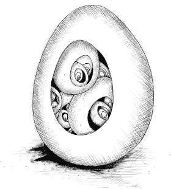

# 第十二章：异步编程

计算机的核心部分，即执行构成我们程序的各个步骤的部分，被称为`处理器`。到目前为止我们看到的程序将在它们完成工作之前一直占用`处理器`。像处理数字的循环那样的操作执行速度几乎完全依赖于计算机的`处理器`和内存的速度。

但许多程序与处理器外部的事物进行交互。例如，它们可能通过计算机网络进行通信，或请求硬盘上的数据——这比从内存获取数据要慢得多。

当这种情况发生时，让`处理器`闲置将是一个遗憾——在此期间可能还有其他工作可以完成。这部分由你的操作系统处理，它会在多个运行中的程序之间切换`处理器`。但当我们希望一个`单一`程序在等待网络请求时仍能进展时，这并没有帮助。

### 异步性

在`同步`编程模型中，事情是一个接一个发生的。当你调用一个执行长时间运行的操作的函数时，它只有在操作完成并能返回结果时才会返回。这会在操作所需时间内停止你的程序。

`异步`模型允许多个事情同时发生。当你启动一个操作时，你的程序会继续运行。当操作完成时，程序会收到通知并访问结果（例如，从磁盘读取的数据）。

我们可以通过一个小例子来比较同步和异步编程：一个程序在网络上发出两个请求，然后合并结果。

在同步环境中，请求函数在完成工作之前不会返回，因此执行此任务的最简单方法是一个接一个地发出请求。这有一个缺点，即第二个请求只有在第一个请求完成后才会启动。总耗时至少是两个响应时间的总和。

在同步系统中，解决这个问题的方法是启动额外的控制线程。一个`线程`是另一个正在运行的程序，它的执行可能与操作系统中的其他程序交错进行——由于大多数现代计算机包含多个`处理器`，因此多个`线程`甚至可以在不同的`处理器`上同时运行。第二个`线程`可以启动第二个请求，然后两个`线程`等待结果返回，之后它们重新同步以合并结果。

在下图中，粗线代表程序正常运行所花费的时间，细线代表等待网络的时间。在同步模型中，网络所需的时间是特定控制线程的时间线的`一部分`。在异步模型中，启动网络操作允许程序继续运行，同时进行网络通信，并在完成时通知程序。

同步，单线程控制


同步，两条控制线程


异步


描述这种差异的另一种方式是，在同步模型中，等待操作完成是`隐式`的，而在异步模型中，它是`显式`的——在我们的控制之下。

异步性有双重作用。它使表达不符合直线控制模型的程序变得更容易，但它也可能使表达遵循直线的程序变得更为笨拙。我们将在本章稍后看到一些减少这种笨拙感的方法。

两大主要JavaScript编程平台——浏览器和Node.js——使可能需要一段时间的操作异步，而不是依赖线程。由于使用线程编程`notoriously hard`（理解一个程序的行为在它同时执行多个任务时更加困难），这通常被认为是一件好事。

### 回调

一种异步编程的方法是让需要等待某些事情的函数接受一个额外的参数，即`回调函数`。异步函数启动一个进程，设置好当进程完成时调用`回调函数`的条件，然后返回。

作为一个例子，`setTimeout`函数在Node.js和浏览器中都可用，它等待给定的毫秒数，然后调用一个函数。

```js
setTimeout(() => console.log("Tick"), 500);
```

等待通常不是重要的工作，但当你需要安排某件事情在特定时间发生或检查某个操作是否比预期耗时更长时，这可以非常有用。

另一个常见异步操作的例子是从设备存储中读取文件。想象一下，你有一个函数`readTextFile`，它将文件的内容读取为字符串并传递给`回调函数`。

```js
readTextFile("shopping_list.txt", content => {
  console.log(`Shopping List:\n${content}`);
});
// → Shopping List:
// → Peanut butter
// → Bananas
```

`readTextFile`函数不是标准JavaScript的一部分。我们将在后面的章节中看到如何在浏览器和Node.js中读取文件。

使用回调在一系列异步操作中执行多个操作意味着你必须不断传递新的函数来处理在这些操作之后计算的继续。一个比较两个文件并生成一个布尔值，指示它们的内容是否相同的异步函数可能看起来像这样：

```js
function compareFiles(fileA, fileB, callback) {
  readTextFile(fileA, contentA => {
    readTextFile(fileB, contentB => {
 callback(contentA == contentB);
    });
  });
}
```

这种编程风格是可行的，但每进行一次异步操作，缩进级别就会增加，因为你进入了另一个函数。进行更复杂的操作，比如将异步操作包装在循环中，可能会变得很尴尬。

从某种意义上说，异步性是`具有传染性的`。任何调用异步函数的函数本身必须是异步的，使用回调或类似机制来传递结果。调用`回调`比简单返回值更复杂且容易出错，因此需要以这种方式结构化程序的较大部分并不好。

### 承诺

构建异步程序的另一种稍微不同的方法是让异步函数返回一个表示其（未来）结果的对象，而不是传递回调函数。这样，这些函数实际上返回一些有意义的东西，程序的结构与同步程序更为相似。

这就是标准类`Promise`的用途。`承诺`是表示可能尚不可用的值的收据。它提供了一个`then`方法，允许你注册一个在它等待的操作完成时应被调用的函数。当承诺被`解析`时，即其值变得可用，这些函数（可能有多个）会被调用并传入结果值。可以在已经解析的承诺上调用`then`——你的函数仍然会被调用。

创建承诺的最简单方法是调用`Promise.resolve`。这个函数确保你提供的值被包装在一个承诺中。如果它已经是一个承诺，则直接返回。否则，你将得到一个新的承诺，它立即以你的值作为结果解析。

```js
let fifteen = Promise.resolve(15);
fifteen.then(value => console.log(`Got ${value}`));
// → Got 15
```

要创建一个不会立即解析的承诺，可以使用`Promise`作为构造函数。它的接口有些奇怪：构造函数期望一个函数作为参数，并立即调用它，传递一个可以用来解析承诺的函数。

例如，这就是如何为`readTextFile`函数创建一个基于承诺的接口：

```js
function textFile(filename) {
  return new Promise(resolve => {
    readTextFile(filename, text => resolve(text));
  });
}

textFile("plans.txt").then(console.log);
```

注意，与回调风格的函数相比，这个异步函数返回了一个有意义的值——一个承诺，承诺在未来某个时刻提供文件的内容。

`then`方法的一个有用之处在于，它本身返回另一个承诺。这个承诺解析为回调函数返回的值，或者如果该返回值是一个承诺，则解析为该承诺所解析的值。因此，你可以将多个对`then`的调用“链式”连接在一起，以建立一系列异步操作。

这个函数读取一个包含文件名的文件，并返回该列表中随机文件的内容，展示了这种异步承诺管道：

```js
function randomFile(listFile) {
  return textFile(listFile)
    .then(content => content.trim().split("\n"))
    .then(ls => ls[Math.floor(Math.random() * ls.length)])
    .then(filename => textFile(filename));
}
```

该函数返回这一系列`then`调用的结果。初始`promise`以字符串形式获取文件列表。第一次`then`调用将该字符串转换为行数组，从而产生一个新的`promise`。第二次`then`调用从中随机选择一行，产生一个返回单个文件名的第三个`promise`。最终的`then`调用读取这个文件，因此该函数的整体结果是一个返回随机文件内容的`promise`。

在这段代码中，前两个`then`调用中使用的函数返回一个常规值，该值将在函数返回时立即传递给`then`返回的`promise`。最后一次`then`调用返回一个`promise`（`textFile(filename)`），使其成为一个实际的异步步骤。

也可以在单个`then`回调中执行所有这些步骤，因为实际上只有最后一步是异步的。但那种仅执行某些同步数据转换的`then`包装器通常是有用的，例如，当你想返回一个生成某些异步结果处理版本的`promise`时。

```js
function jsonFile(filename) {
  return textFile(filename).then(JSON.parse);
}

jsonFile("package.json").then(console.log);
```

通常，将`promise`视为一种设备是有益的，它使代码可以忽略值何时到达的问题。正常值必须在我们引用它之前实际存在。承诺的值是一个`可能`已经存在或者可能在未来某个时刻出现的值。通过将它们与`then`调用连接在一起定义的基于`promise`的计算，随着输入变得可用而异步执行。

### 失败

常规的`JavaScript`计算可能通过抛出异常而失败。异步计算通常需要类似的机制。网络请求可能失败，文件可能不存在，或者某个属于异步计算的代码可能抛出异常。

回调风格的异步编程面临的最紧迫问题之一是，它使得确保失败正确报告给回调变得极其困难。

一个常见的约定是使用回调的第一个参数来指示操作失败，第二个参数用来传递操作成功时产生的值。

```js
someAsyncFunction((error, value) => {
  if (error) handleError(error);
  else processValue(value);
});
```

这样的回调函数必须始终检查是否收到异常，并确保它们引起的任何问题，包括它们调用的函数抛出的异常，都被捕获并传递给正确的函数。

`Promises`使这变得更简单。它们可以被解决（操作成功完成）或被拒绝（失败）。解决处理程序（如通过`then`注册的）仅在操作成功时调用，而拒绝会传播到`then`返回的新`promise`。当处理程序抛出异常时，这会自动导致其`then`调用生成的`promise`被拒绝。如果异步操作链中的任何元素失败，整个链的结果将被标记为拒绝，并且在失败点之后不会调用任何成功处理程序。

就像解析承诺提供一个值一样，拒绝承诺也提供一个值，通常称为拒绝的`原因`。当处理程序函数中的异常导致拒绝时，异常值被用作`原因`。同样，当处理程序返回一个被拒绝的承诺时，该拒绝会流入下一个承诺。有一个`Promise.reject`函数，可以创建一个新的、立即被拒绝的承诺。

为了显式处理这样的拒绝，承诺有一个`catch`方法，用于注册在承诺被拒绝时调用的处理程序，类似于`then`处理程序处理正常解析的方式。它也非常像`then`，因为它返回一个新的承诺，该承诺在原承诺正常解析时解析为原承诺的值，而在其他情况下解析为`catch`处理程序的结果。如果`catch`处理程序抛出错误，新的承诺也会被拒绝。

作为一种简写，`then`也接受一个拒绝处理程序作为第二个参数，因此你可以在一次方法调用中安装两种类型的处理程序：`.then(acceptHandler, rejectHandler)`。

传递给`Promise`构造函数的函数接收第二个参数，除了`resolve`函数外，它可以用来拒绝新的承诺。

当我们的`readTextFile`函数遇到问题时，它将错误作为第二个参数传递给回调函数。我们的`textFile`包装器实际上应该检查该参数，以确保失败导致返回的承诺被拒绝。

```js
function textFile(filename) {
  return new Promise((resolve, reject) => {
    readTextFile(filename, (text, error) => {
      if (error) reject(error);
      else resolve(text);
    });
  });
}
```

通过调用`then`和`catch`创建的承诺值链形成了一条管道，异步值或失败通过这条管道传递。由于这样的链是通过注册处理程序创建的，因此每个链接都有一个成功处理程序或拒绝处理程序（或两者都有）。不匹配结果类型（成功或失败）的处理程序会被忽略。匹配的处理程序会被调用，其结果决定了接下来是什么样的值——当它们返回非承诺值时为成功，当它们抛出异常时为拒绝，而当它们返回一个承诺时则为承诺的结果。

```js
new Promise((_, reject) => reject(new Error("Fail")))
  .then(value => console.log("Handler 1:", value))
  .catch(reason => {
    console.log("Caught failure " + reason);
    return "nothing";
  })
  .then(value => console.log("Handler 2:", value));
// → Caught failure Error: Fail
// → Handler 2: nothing
```

第一个`then`处理程序函数没有被调用，因为在管道的那个点上，承诺持有一个拒绝。`catch`处理程序处理该拒绝并返回一个值，该值被传递给第二个`then`处理程序函数。

就像未捕获的异常由环境处理一样，`JavaScript`环境可以检测到承诺拒绝未被处理的情况，并将其报告为错误。

### 卡拉

在柏林是一个阳光明媚的日子。废弃机场的跑道上挤满了骑自行车和滑轮滑的运动员。在一个垃圾容器附近的草地上，一群乌鸦吵闹地聚在一起，试图说服一群游客放弃他们的三明治。

一只乌鸦十分显眼——一只毛发蓬乱的大雌鸟，右翅膀上有几根白色羽毛。她用一种技巧和自信吸引人们，似乎已经做了很长时间。当一位老年人被另一只乌鸦的`antics`分散注意力时，她悄然俯冲而下，从他手中抢走半个吃剩的面包，飞走了。

与其他看似乐于在这里消磨时间的鸟儿不同，这只大乌鸦显得目标明确。她带着战利品，径直飞向机库的屋顶，消失在通风口中。

在大楼内部，你可以听到一种奇怪的敲击声——柔和而持续。声音来自一个未完工楼梯间屋顶下的狭小空间。乌鸦坐在那里，周围是一堆偷来的零食，半打智能手机（其中几部已经开机），以及一堆电缆。她用嘴快速敲击其中一部手机的屏幕。字词正在上面出现。如果你不太了解，你可能会认为她在打字。

这只乌鸦在同伴中被称为“`cāāw-krö`”。但由于这些声音不适合人类的声带，我们就称她为卡拉。

卡拉是一只有些特别的乌鸦。年轻时，她对人类语言着迷，常常偷听人们的谈话，直到她很好地掌握了他们在说什么。后来，她的兴趣转向了人类技术，开始偷手机来研究。她目前的项目是学习编程。她在隐秘实验室中输入的文本实际上是一段异步`JavaScript`代码。

### 破门而入

卡拉喜欢上网。令人烦恼的是，她正在使用的手机即将耗尽预付数据。大楼内有无线网络，但需要密码才能访问。

幸运的是，大楼里的无线网络路由器已有 20 年历史，并且安全性差。经过一些研究，卡拉发现网络认证机制有一个她可以利用的漏洞。当加入网络时，设备必须发送正确的六位数密码。接入点会根据提供的密码是否正确来回复成功或失败的消息。然而，当发送部分密码（例如，仅三个数字）时，响应会根据这些数字是否为密码的正确开头而不同。发送错误的数字会立即返回失败消息。发送正确的数字时，接入点会等待更多的数字。

这使得大大加快猜测数字的速度成为可能。卡拉可以通过逐个尝试每个数字来找到第一个数字，直到找到一个不会立即返回失败的数字。得知一个数字后，她可以用同样的方法找到第二个数字，依此类推，直到她知道整个密码。

假设`Carla`有一个`joinWifi`函数。给定网络名称和密码（作为字符串），该函数尝试加入网络，返回一个如果成功则解析的`Promise`，如果身份验证失败则拒绝的`Promise`。她需要的第一件事是一个包装`Promise`的方法，以便在耗时过长后自动拒绝，这样如果接入点没有响应，程序就能迅速继续。

```js
function withTimeout(promise, time) {
  return new Promise((resolve, reject) => {
    promise.then(resolve, reject);
    setTimeout(() => reject("Timed out"), time);
  });
}
```

这利用了`Promise`只能被解析或拒绝一次的事实。如果作为参数传入的`Promise`先解析或拒绝，那么该结果将是`withTimeout`返回的`Promise`的结果。另一方面，如果`setTimeout`先触发并拒绝了`Promise`，那么任何进一步的解析或拒绝调用都会被忽略。

为了找到整个密码，程序需要通过尝试每个数字来反复寻找下一个数字。如果身份验证成功，我们知道找到了我们要找的。如果立即失败，我们知道该数字是错误的，必须尝试下一个数字。如果请求超时，我们找到了另一个正确的数字，必须继续添加另一个数字。

因为你不能在`for`循环内等待一个`Promise`，卡拉使用一个递归函数来驱动这个过程。在每次调用中，这个函数获取当前已知的代码以及要尝试的下一个数字。根据发生的情况，它可能返回一个完成的代码，或者再次调用自己，开始破解代码的下一个位置，或用另一个数字重试。

```js
function crackPasscode(networkID) {
  function nextDigit(code, digit) {
    let newCode = code + digit;
    return withTimeout(joinWifi(networkID, newCode), 50)
      .then(() => newCode)
      .catch(failure => {
        if (failure == "Timed out") {
          return nextDigit(newCode, 0);
        } else if (digit < 9) {
          return nextDigit(code, digit + 1);
        } else {
          throw failure;
        }
      });
  }
  return nextDigit("", 0);
}
```

接入点通常在大约`20`毫秒内响应错误的身份验证请求，因此为了安全起见，该函数在请求超时前等待`50`毫秒。

```js
crackPasscode("HANGAR 2").then(console.log);
// → 555555
```

`Carla`侧着头叹气。如果代码再难一些，她会觉得更满意。

### `async`函数

即使有了`Promise`，这种异步代码依然令人厌烦。`Promise`通常需要以冗长且看似任意的方式连接在一起。为了创建一个异步循环，`Carla`被迫引入了递归函数。

破解函数实际上做的事情是完全线性的——它总是等待上一个操作完成后再开始下一个。这在同步编程模型中会非常简单地表达。

好消息是`JavaScript`允许你编写伪同步代码来描述异步计算。`async`函数隐式返回一个`Promise`，并且可以在其主体中以`看似`同步的方式等待其他`Promise`。

我们可以像这样重写`crackPasscode`：

```js
async function crackPasscode(networkID) {
  for (let code = "";;) {
    for (let digit = 0;; digit++) {
      let newCode = code + digit;
      try {
        await withTimeout(joinWifi(networkID, newCode), 50);
        return newCode;
      } catch (failure) {
        if (failure == "Timed out") {
          code = newCode;
          break;
        } else if (digit == 9) {
          throw failure;
        }
      }
    }
  }
}
```

这个版本更清楚地展示了函数的双重循环结构（内循环尝试数字`0`到`9`，外循环向密码中添加数字）。

一个异步函数通过在函数关键字前加上`async`来标记。方法也可以通过在其名称前加上`async`来变为异步。当这样的函数或方法被调用时，它返回一个`promise`。只要函数返回某个值，该`promise`就会被解决。如果函数体抛出异常，`promise`将被拒绝。

在异步函数内部，单词`await`可以放在一个表达式前面，以等待`promise`解决，然后再继续执行函数。如果`promise`被拒绝，则在`await`点会引发异常。

这样的函数不再像常规`JavaScript`函数那样从开始到结束一次性运行。相反，它可以在任何有`await`的点被冻结，并在稍后的时间恢复执行。

对于大多数异步代码，这种记法比直接使用`promises`更方便。你仍然需要理解`promises`，因为在许多情况下你仍会直接与它们交互。但在将它们组合在一起时，`async`函数通常比一连串的`then`调用更容易编写。

### 生成器

函数被暂停然后重新恢复的能力并不是异步函数所独有的。`JavaScript`还有一个称为`生成器`函数的特性。这些函数类似，但没有`promises`。

当你用`function*`定义一个函数（在单词`function`后加上星号）时，它变成一个生成器。当你调用生成器时，它返回一个迭代器，这在第六章中我们已经看到了。

```js
function* powers(n) {
  for (let current = n;; current *= n) {
    yield current;
  }
}

for (let power of powers(3)) {
  if (power > 50) break;
  console.log(power);
}
// → 3
// → 9
// → 27
```

最初，当你调用`powers`时，函数在开始时被冻结。每次你在迭代器上调用`next`时，函数会运行直到遇到一个`yield`表达式，这会暂停它，并使得`yield`的值成为迭代器产生的下一个值。当函数返回时（示例中的函数从未返回），迭代器完成。

当你使用生成器函数时，编写迭代器通常要容易得多。`Group`类的迭代器（来自第六章的练习）可以用这个生成器来编写：

```js
Group.prototype[Symbol.iterator] = function*() {
  for (let i = 0; i < this.members.length; i++) {
 yield this.members[i];
  }
};
```

不再需要创建一个对象来保存迭代状态——生成器会在每次`yield`时自动保存它们的局部状态。

这样的`yield`表达式只能直接出现在生成器函数本身，而不能在你在其中定义的内部函数中。生成器在`yield`时保存的状态只是它的`局部`环境和它`yield`的那个位置。

异步函数是一种特殊类型的生成器。它在被调用时产生一个`promise`，当它返回（完成）时，该`promise`被解决，当它抛出异常时，该`promise`被拒绝。每当它`yield`（`await`）一个`promise`时，该`promise`的结果（值或抛出的异常）就是`await`表达式的结果。

### 一个科维德艺术项目

一天早上，`卡拉`被机库外面陌生的噪音吵醒。她跳到屋顶边缘，看到人们正在为某个活动做准备。周围有很多电缆，一个舞台，还有一些正在搭建的巨大黑墙。

作为一只好奇的乌鸦，`卡拉`仔细观察这面墙。它似乎由许多大型带玻璃前面的设备组成，并连接到电缆上。设备背面标示着`LedTec SIG-5030`。

一次快速的网络搜索找到了这些设备的用户手册。它们似乎是交通标志，配有可编程的琥珀色`LED`灯矩阵。人类的意图可能是在事件期间在上面显示某种信息。有趣的是，这些屏幕可以通过无线网络进行编程。它们是否连接到了建筑的本地网络？

网络上的每个设备都有一个`IP 地址`，其他设备可以用它来向其发送消息。我们在第十三章中对此进行了更多讨论。`卡拉`注意到她自己的手机都获得了像`10.0.0.20`或`10.0.0.33`这样的地址。尝试向所有这些地址发送消息，看看是否有一个响应手册中描述的接口，可能值得一试。

第十八章展示了如何在真实网络上发出真实请求。在这一章中，我们将使用一个名为`request`的简化虚拟函数进行网络通信。该函数接受两个参数——一个网络地址和一条消息，消息可以是任何可以作为JSON发送的内容——并返回一个承诺，要么解析为来自给定地址的机器的响应，要么在出现问题时拒绝。

根据手册，通过向`SIG-5030`标志发送内容为`{"command": "display", "data": [0, 0, 3, ...]}`的消息，可以改变显示的内容，其中数据为每个 LED 点提供一个数字，表示其亮度——`0`表示关闭，`3`表示最大亮度。每个标志宽`50`个灯，高`30`个灯，因此更新命令应该发送`1,500`个数字。

这段代码向本地网络上的所有地址发送显示更新消息，以查看哪个有效。IP 地址中的每个数字可以在`0`到`255`之间变化。在它发送的数据中，激活与网络地址最后一个数字对应的多个灯光。

```js
for (let addr = 1; addr < 256; addr++) {
  let data = [];
  for (let n = 0; n < 1500; n++) {
    data.push(n < addr ? 3 : 0);
  }
  let ip = `10.0.0.${addr}`;
  request(ip, {command: "display", data})
    .then(() => console.log(`Request to ${ip} accepted`))
    .catch(() => {});
}
```

由于大多数这些地址不存在或不接受此类消息，捕捉调用确保网络错误不会使程序崩溃。所有请求立即发送，而不等待其他请求完成，以免在某些机器未响应时浪费时间。

扫描网络后，`卡拉`回到外面查看结果。令她高兴的是，所有屏幕的左上角都显示了一条光带。它们`确实`在本地网络上，并且`确实`接受命令。她迅速记录下每个屏幕上显示的数字。有九个屏幕，排列成三行三列。它们的网络地址如下：

```js
const screenAddresses = [
  "10.0.0.44", "10.0.0.45", "10.0.0.41",
  "10.0.0.31", "10.0.0.40", "10.0.0.42",
  "10.0.0.48", "10.0.0.47", "10.0.0.46"
];
```

现在这为各种捣蛋行为打开了可能性。她可以在墙上用巨大的字母展示“乌鸦统治，人类流口水”。但这感觉有点粗糙。相反，她计划在晚上展示一段飞翔的乌鸦视频，覆盖所有屏幕。

`Carla`找到了一段合适的视频剪辑，其中可以重复一秒半的镜头，以创建一个循环视频，展示乌鸦的翅膀拍打。为了适应九个屏幕（每个屏幕可以显示`50*×*30`像素），`Carla`裁剪并调整视频大小，得到一系列`150*×*90`的图像，每秒10帧。然后将这些图像切割成九个矩形，并进行处理，使视频中的黑暗区域（乌鸦所在处）显示明亮的光，而光亮区域（没有乌鸦）保持黑暗，这应该能产生乌鸦在黑色背景下飞翔的琥珀色效果。

她已设置`clipImages`变量，以保存一个帧的数组，其中每一帧由九组像素数组表示——每个屏幕一组——以所需的格式表示。

为了显示视频的单个帧，`Carla`需要同时向所有屏幕发送请求。但她还需要等待这些请求的结果，以便在当前帧正确发送之前不开始发送下一帧，并注意请求何时失败。

`Promise`有一个静态方法`all`，可以将一个`promise`数组转换为一个解析为结果数组的单一`promise`。这提供了一种方便的方式，使一些异步操作能够并行进行，等待它们全部完成，然后对它们的结果进行处理（或者至少等待它们以确保它们不会失败）。

```js
function displayFrame(frame) {
  return Promise.all(frame.map((data, i) => {
    return request(screenAddresses[i], {
      command: "display",
      data
    });
  }));
}
```

这映射了帧中的图像（这是一个显示数据数组的数组），以创建一个请求`promise`的数组。然后它返回一个组合所有这些`promise`的`promise`。

为了能够停止正在播放的视频，该过程被封装在一个类中。这个类有一个异步的播放方法，返回一个仅在通过停止方法再次停止播放时才会解析的`promise`。

```js
function wait(time) {
  return new Promise(accept => setTimeout(accept, time));
}

class VideoPlayer {
  constructor(frames, frameTime) {
    this.frames = frames;
    this.frameTime = frameTime;
    this.stopped = true;
  }

  async play() {
    this.stopped = false;
    for (let i = 0; !this.stopped; i++) {
      let nextFrame = wait(this.frameTime);
      await displayFrame(this.frames[i % this.frames.length]);
      await nextFrame;
    }
  }

  stop() {
    this.stopped = true;
 }
}
```

`wait`函数将`setTimeout`包装在一个`promise`中，该`promise`在给定的毫秒数后解析。这对于控制播放速度非常有用。

```js
let video = new VideoPlayer(clipImages, 100);
video.play().catch(e => {
  console.log("Playback failed: " + e);
});
setTimeout(() => video.stop(), 15000);
```

在屏幕墙存在的整个星期，每晚，当天黑时，一个巨大的发光橙色鸟神秘地出现在上面。

### 事件循环

一个异步程序通过运行其主脚本开始，这通常会设置回调以便稍后调用。该主脚本以及回调会以一整块完成，不会被打断。但它们之间，程序可能会处于闲置状态，等待某些事情发生。

因此，回调并不是由调度它们的代码直接调用。如果我在一个函数中调用`setTimeout`，那么在回调函数被调用时，该函数将已经返回。当回调返回时，控制权不会返回到调度它的函数。

异步行为发生在它自己空的函数调用栈上。这是没有`promise`时，跨异步代码管理异常如此困难的原因之一。由于每个回调开始时栈几乎是空的，当它们抛出异常时，你的`catch`处理程序不会在栈上。

```js
try {
  setTimeout(() => {
    throw new Error("Woosh");
  }, 20);
} catch (e) {
  // This will not run
  console.log("Caught", e);
}
```

无论事件——如超时或传入请求——发生得多么紧密，JavaScript 环境一次只能运行一个程序。你可以把它看作是在你的程序周围运行一个大循环，称为`事件循环`。当没有事情可做时，该循环会暂停。但是随着事件的到来，它们会被添加到队列中，代码会一个接一个地执行。因为没有两个事情可以同时运行，运行缓慢的代码可能会延迟处理其他事件。

这个例子设置了一个超时，但随后拖延，直到超时预定的时间点之后，导致超时变得迟到。

```js
let start = Date.now();
setTimeout(() => {
  console.log("Timeout ran at", Date.now() - start);
}, 20);
while (Date.now() < start + 50) {}
console.log("Wasted time until", Date.now() - start);
// → Wasted time until 50
// → Timeout ran at 55
```

`Promise`总是作为一个新事件解析或拒绝。即使一个`promise`已经被解析，等待它也会导致你的回调在当前脚本完成后运行，而不是立即运行。

```js
Promise.resolve("Done").then(console.log);
console.log("Me first!");
// → Me first!
// → Done
```

在后面的章节中，我们将看到在事件循环上运行的各种其他类型的事件。

### 异步错误

当你的程序同步运行时，一次性完成，除了程序自身进行的状态变化之外，没有其他状态变化。对于异步程序来说，这种情况不同——它们在执行过程中可能会有`空隙`，其他代码可以在这些空隙中运行。

让我们看一个例子。这是一个尝试报告数组中每个文件大小的函数，确保同时读取它们，而不是按顺序读取。

```js
async function fileSizes(files) {
  let list = "";
  await Promise.all(files.map(async fileName => {
    list += fileName + ": " +
      (await textFile(fileName)).length + "\n";
  }));
  return list;
}
```

`async fileName =>`部分展示了如何通过在箭头函数前面加上`async`关键字来使箭头函数也变为异步。

代码乍一看并没有什么可疑之处……它对名称数组映射异步箭头函数，创建一个`promises`数组，然后使用`Promise.all`等待所有这些，才返回它们构建的列表。

但这个程序完全有问题。它总是只返回一行输出，列出读取时间最长的文件。

你能找出原因吗？

问题出在`+=`操作符上，它在语句开始执行时取`list`的`当前`值，然后在`await`完成时，将`list`绑定设置为该值加上添加的字符串。

但在语句开始执行和结束之间，有一个异步的空隙。映射表达式在列表中添加任何内容之前就运行，因此每个`+=`操作符都是从一个空字符串开始，最后在存储检索完成时，将`list`设置为将其行添加到空字符串的结果。

这本可以通过返回映射`promises`的行并在`Promise.all`的结果上调用`join`来轻松避免，而不是通过更改绑定来构建列表。像往常一样，计算新值比更改现有值更不易出错。

```js
async function fileSizes(files) {
  let lines = files.map(async fileName => {
    return fileName + ": " +
      (await textFile(fileName)).length;
  });
  return (await Promise.all(lines)).join("\n");
}
```

像这样的错误很容易出现，特别是在使用`await`时，你应该意识到代码中的漏洞所在。JavaScript的`显式`异步性（无论是通过回调、`Promise`还是`await`）的一大优点是，发现这些漏洞相对简单。

### 摘要

异步编程使得在不冻结整个程序的情况下，表达对长时间运行操作的等待成为可能。JavaScript环境通常使用回调实现这种编程风格，即在操作完成时调用的函数。事件循环会调度这些回调在合适的时候依次调用，以确保它们的执行不会重叠。

`Promise`使得异步编程变得更简单，`Promise`是代表可能在未来完成的操作的对象，而异步函数则允许你像同步程序一样编写异步程序。

### 练习

#### `安静的时光`

卡拉实验室附近有一台通过运动传感器激活的监控摄像头。它连接到网络并在激活时开始发送视频流。因为她不想被发现，卡拉建立了一个系统，可以注意到这种无线网络流量，并在外面有活动时在她的巢穴中打开灯，以便她知道什么时候保持安静。

她还记录了摄像头被触发的时间一段时间，并希望利用这些信息来可视化一周内哪些时段通常比较安静，哪些时段则比较繁忙。日志存储在每行包含一个时间戳数字（由`Date.now()`返回）的文件中。

```js
1695709940692
1695701068331
1695701189163
```

`camera_logs.txt`文件保存了日志文件的列表。编写一个异步函数`activityTable(day)`，该函数为给定的星期几返回一个包含 24 个数字的数组，每个数字对应一天中的每个小时，表示该小时内观察到的摄像头网络流量。星期几通过数字标识，使用`Date.getDay`的方法，其中星期天是 0，星期六是 6。

`activityGraph`函数，由沙盒提供，将这样的表汇总为一个字符串。

要读取文件，请使用前面定义的`textFile`函数——给定一个文件名，它返回一个解析为文件内容的`Promise`。记住，`new Date(*timestamp*)`会为该时间创建一个`Date`对象，该对象有`getDay`和`getHours`方法，分别返回星期几和小时。

两种类型的文件——日志文件列表和日志文件本身——每一条数据都在自己的行上，通过换行符（`\n`）分隔。

#### `真实的 Promise`

重写之前练习中的函数，不使用`async/await`，使用普通的`Promise`方法。

在这种风格下，使用`Promise.all`会比尝试对日志文件建模的循环更方便。在异步函数中，简单地在循环中使用`await`更为简单。如果读取文件需要一些时间，哪种方法运行所需的时间最少？

如果文件列表中的某个文件有拼写错误，导致读取失败，这个失败是如何反映到你的函数返回的`Promise`对象中的？

#### `构建 Promise.all`

正如我们所看到的，给定一个承诺数组，`Promise.all`返回一个承诺，等待数组中所有承诺完成。它然后成功，返回一个结果值数组。如果数组中的一个承诺失败，所有的承诺返回的承诺也会失败，并传递失败承诺的失败原因。

自己实现类似的功能，作为一个名为`Promise_all`的常规函数。

请记住，在一个承诺成功或失败后，它无法再次成功或失败，对其解析的函数的进一步调用将被忽略。这可以简化你处理承诺失败的方式。

`评估器，用于确定编程语言中表达式的含义，仅仅是另一个程序。`

—哈尔·阿贝尔森和杰拉尔德·萨斯曼，《计算机程序的结构与解释》


