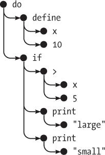

# 第十三章：项目：一种编程语言

构建自己的编程语言出乎意料地简单（只要你不追求太高的目标），而且非常有启发性。

我在这一章中想要展示的主要内容是，构建编程语言并没有什么神秘之处。我常常觉得某些人类发明如此聪明复杂，以至于我永远无法理解它们。但经过一点阅读和实验，它们往往显得相当平凡。

我们将构建一种名为`Egg`的编程语言。它将是一个小而简单的语言——但足够强大，能够表达你能想到的任何计算。它将允许基于函数的简单抽象。

### 解析

编程语言最明显的部分是它的*语法*或符号。*解析器*是一个读取文本并生成反映该文本中程序结构的数据结构的程序。如果文本未形成有效的程序，解析器应该指出错误。

我们的语言将拥有简单且统一的语法。在`Egg`中，一切都是表达式。表达式可以是绑定的名称、数字、字符串或*应用*。应用用于函数调用，也用于如`if`或`while`等结构。

为了保持解析器的简单性，`Egg`中的字符串不支持反斜杠转义之类的功能。字符串只是一个不包含双引号的字符序列，用双引号括起来。数字是一个数字字符的序列。绑定名称可以由任何非空白字符组成，并且在语法中没有特殊含义。

应用的写法与`JavaScript`相同，在表达式后放置括号，并在这些括号之间放入任意数量的参数，用逗号分隔。

```js
do(define(x, 10),
   if(>(x, 5),
      print("large"),
      print("small")))
```

`Egg`语言的统一性意味着`JavaScript`中的运算符（如`>`）在该语言中是普通绑定，与其他函数一样被应用。由于语法没有块的概念，我们需要一个`do`结构来表示顺序执行多个操作。

解析器将用来描述程序的数据结构由表达式对象组成，每个对象都有一个类型属性，指示它是哪种表达式，以及其他属性来描述其内容。

类型为“值”的表达式表示字面字符串或数字。它们的值属性包含它们所表示的字符串或数字值。类型为“单词”的表达式用于标识符（名称）。这样的对象有一个名称属性，作为字符串保存标识符的名称。最后，“应用”表达式代表应用。它们有一个操作符属性，指向被应用的表达式，以及一个`args`属性，保存一个参数表达式的数组。

前一个程序中的`>(x, 5)`部分将表示为：

```js
{
  type: "apply",
  operator: {type: "word", name: ">"},
  args: [
    {type: "word", name: "x"},
    {type: "value", value: 5}
  ]
}
```

这样的数据结构被称为*语法树*。如果你想象这些对象为点，而它们之间的链接为这些点之间的线，如下图所示，结构呈现树状形状。表达式包含其他表达式，而这些表达式又可能包含更多的表达式，这类似于树枝的分叉和再分叉的方式。



将其与我们在第九章中为配置文件格式编写的解析器进行对比，该解析器结构简单：它将输入分割成行，并逐行处理。允许每行的形式仅有几种简单的类型。

在这里，我们必须找到一种不同的方法。表达式不是按行分隔的，而且它们具有递归结构。应用表达式*包含*其他表达式。

幸运的是，这个问题可以通过编写一个递归的解析函数来很好地解决，反映出语言的递归特性。

我们定义了一个函数`parseExpression`，它接受一个字符串作为输入。它返回一个包含字符串开头表达式的数据结构的对象，以及解析完该表达式后剩余的字符串部分。在解析子表达式（例如应用的参数）时，可以再次调用该函数，从而得到参数表达式以及剩余的文本。该文本可能包含更多的参数，或者可能是结束参数列表的右括号。

这是解析器的第一部分：

```js
function parseExpression(program) {
  program = skipSpace(program);
  let match, expr;
  if (match = /^"([^"]*)"/.exec(program)) {
    expr = {type: "value", value: match[1]};
  } else if (match = /^\d+\b/.exec(program)) {
    expr = {type: "value", value: Number(match[0])};
  } else if (match = /^[^\s(),#"]+/.exec(program)) {
    expr = {type: "word", name: match[0]};
  } else {
    throw new SyntaxError("Unexpected syntax: " + program);
  }

  return parseApply(expr, program.slice(match[0].length));
}

function skipSpace(string) {
  let first = string.search(/\S/);
  if (first == -1) return "";
  return string.slice(first);
}
```

因为`Egg`（像`JavaScript`一样）允许元素之间有任意数量的空白，我们必须反复从程序字符串的开头去掉空白。`skipSpace`函数对此提供了帮助。

跳过任何前导空格后，`parseExpression`使用三个正则表达式来识别`Egg`支持的三种基本元素：字符串、数字和单词。解析器根据匹配的表达式构造不同类型的数据结构。如果输入不符合这三种形式之一，则不是有效表达式，解析器会抛出错误。我们在这里使用`SyntaxError`构造函数。这是一个由标准定义的异常类，类似于`Error`，但更加具体。

然后我们从程序字符串中截去匹配的部分，并将其与表达式对象一起传递给`parseApply`，后者检查该表达式是否为应用。如果是，它将解析一个括号内的参数列表。

```js
function parseApply(expr, program) {
  program = skipSpace(program);
  if (program[0] != "(") {
    return {expr: expr, rest: program};
  }

  program = skipSpace(program.slice(1));
  expr = {type: "apply", operator: expr, args: []};
  while (program[0] != ")") {
    let arg = parseExpression(program);
    expr.args.push(arg.expr);
    program = skipSpace(arg.rest);
    if (program[0] == ",") {
      program = skipSpace(program.slice(1));
    } else if (program[0] != ")") {
      throw new SyntaxError("Expected ',' or ')'");
    }
  }
  return parseApply(expr, program.slice(1));
}
```

如果程序中的下一个字符不是左括号，这就不是一个应用，`parseApply`返回它所给出的表达式。否则，它会跳过左括号，并为这个应用表达式创建语法树对象。然后，它递归调用`parseExpression`以解析每个参数，直到找到右括号。递归是间接的，通过`parseApply`和`parseExpression`相互调用。

因为应用表达式本身可以被应用（例如在`multiplier(2)(1)`中），所以`parseApply`在解析完一个应用后必须再次调用自身，以检查是否跟随另一个括号。

这就是解析`Egg`所需的一切。我们将其包装在一个方便的解析函数中，该函数在解析表达式后验证是否已经到达输入字符串的末尾（一个`Egg`程序是一个单一的表达式），这为我们提供了程序的数据结构。

```js
function parse(program) {
  let {expr, rest} = parseExpression(program);
  if (skipSpace(rest).length > 0) {
    throw new SyntaxError("Unexpected text after program");
  }
  return expr;
}

console.log(parse("+(a, 10)"));
// → {type: "apply",
//    operator: {type: "word", name: "+"},
//    args: [{type: "word", name: "a"},
//           {type: "value", value: 10}]}
```

它有效！当它失败时并没有提供非常有用的信息，也没有存储每个表达式开始时的行和列，这在稍后报告错误时可能会很有帮助，但对于我们的目的来说已经足够了。

### 求值器

我们可以用程序的语法树做什么？当然是运行它！这就是求值器所做的。你给它一个语法树和一个将名称与值关联的作用域对象，它将评估树所代表的表达式并返回产生的值。

```js
const specialForms = Object.create(null);

function evaluate(expr, scope) {
  if (expr.type == "value") {
    return expr.value;
  } else if (expr.type == "word") {
    if (expr.name in scope) {
      return scope[expr.name];
    } else {
      throw new ReferenceError(
        `Undefined binding: ${expr.name}`);
    }
 } else if (expr.type == "apply") {
    let {operator, args} = expr;
    if (operator.type == "word" &&
        operator.name in specialForms) {
      return specialFormsoperator.name;
    } else {
      let op = evaluate(operator, scope);
      if (typeof op == "function") {
        return op(...args.map(arg => evaluate(arg, scope)));
      } else {
        throw new TypeError("Applying a non-function.");
      }
    }
  }
}
```

求值器为每种表达式类型都有代码。字面值表达式产生其值。（例如，表达式`100`评估为数字`100`。）对于绑定，我们必须检查它是否在作用域中实际定义，如果是，则获取绑定的值。

应用程序更复杂。如果它们是特殊形式，例如`if`，我们不评估任何内容——我们只是将参数表达式与作用域一起传递给处理此形式的函数。如果它是普通调用，我们评估运算符，验证它是一个函数，然后用评估后的参数调用它。

我们使用普通的`JavaScript`函数值来表示`Egg`的函数值。当定义特殊形式`fun`时我们会再回来讨论这一点。

求值的递归结构类似于解析器的结构，两者都反映了语言本身的结构。将解析器和求值器合并为一个函数并在解析过程中进行求值也是可能的，但这样拆分使程序更清晰、更灵活。

这实际上就是解释`Egg`所需的一切。就是这么简单。但如果不定义一些特殊形式并向环境中添加一些有用的值，你在这个语言中也做不了多少。

### 特殊形式

`specialForms`对象用于在`Egg`中定义特殊语法。它将词与评估这些形式的函数关联。目前它是空的。让我们添加`if`。

```js
specialForms.if = (args, scope) => {
  if (args.length != 3) {
    throw new SyntaxError("Wrong number of args to if");
  } else if (evaluate(args[0], scope) !== false) {
    return evaluate(args[1], scope);
  } else {
 return evaluate(args[2], scope);
  }
};
```

`Egg`的`if`构造期待恰好三个参数。它将评估第一个，如果结果不是值`false`，则将评估第二个。否则，评估第三个。这个`if`形式更类似于`JavaScript`的三元运算符`?:`而不是`JavaScript`的`if`。它是一个表达式，而不是语句，并且产生一个值——即第二或第三个参数的结果。

`Egg`在处理`if`的条件值时也与`JavaScript`不同。它只会将值`false`视为`false`，而不是像零或空字符串这样的东西。

我们需要将`if`表示为特殊形式而不是普通函数的原因是，所有函数的参数在调用函数之前都会被评估，而`if`应该只评估它的第二个或第三个参数，这取决于第一个参数的值。

`while`形式类似。

```js
specialForms.while = (args, scope) => {
  if (args.length != 2) {
    throw new SyntaxError("Wrong number of args to while");
  }
  while (evaluate(args[0], scope) !== false) {
    evaluate(args[1], scope);
  }

  // Since undefined does not exist in Egg, we return false,
  // for lack of a meaningful result
  return false;
};
```

另一个基本构建块是`do`，它从上到下执行所有参数。它的值是最后一个参数产生的值。

```js
specialForms.do = (args, scope) => {
  let value = false;
  for (let arg of args) {
    value = evaluate(arg, scope);
  }
  return value;
};
```

为了能够创建绑定并给它们赋予新值，我们还创建了一个叫做`define`的形式。它的第一个参数期望一个单词，第二个参数期望一个产生赋值给该单词的表达式。由于`define`和其他所有内容一样，是一个表达式，因此它必须返回一个值。我们将使它返回被赋予的值（就像`JavaScript`的`=`操作符）。

```js
specialForms.define = (args, scope) => {
  if (args.length != 2 || args[0].type != "word") {
    throw new SyntaxError("Incorrect use of define");
  }
  let value = evaluate(args[1], scope);
  scope[args[0].name] = value;
  return value;
};
```

### 环境

`evaluate`接受的作用域是一个对象，其中的属性名对应于绑定名称，而属性值对应于这些绑定所绑定的值。让我们定义一个对象来表示全局作用域。

为了能够使用我们刚定义的`if`构造，我们必须能够访问布尔值。由于只有两个布尔值，我们不需要为它们提供特殊的语法。我们简单地将两个名称绑定到值`true`和`false`，并使用它们。

```js
const topScope = Object.create(null);

topScope.true = true;
topScope.false = false;
```

现在我们可以评估一个简单的表达式，它对布尔值取反。

```js
let prog = parse(`if(true, false, true)`);
console.log(evaluate(prog, topScope));
// → false
```

为了提供基本的算术和比较运算符，我们还会将一些函数值添加到作用域中。为了保持代码简洁，我们将使用`Function`在一个循环中合成一组运算符函数，而不是单独定义它们。

```js
for (let op of ["+", "-", "*", "/", "==", "<", ">"]) {
  topScope[op] = Function("a, b", `return a ${op} b;`);
}
```

也很有用的是有一种输出值的方法，因此我们将`console.log`包裹在一个函数中并将其命名为`print`。

```js
topScope.print = value => {
  console.log(value);
  return value;
};
```

这给了我们足够的基本工具来编写简单的程序。下面的函数提供了一种方便的方式来解析程序并在新的作用域中运行它：

```js
function run(program) {
  return evaluate(parse(program), Object.create(topScope));
}
```

我们将使用对象原型链来表示嵌套作用域，以便程序可以向其局部作用域添加绑定，而不改变顶层作用域。

```js
run(`
do(define(total, 0),
   define(count, 1),
   while(<(count, 11),
         do(define(total, +(total, count)),
            define(count, +(count, 1)))),
   print(total))
`);
// → 55
```

这是我们之前多次看到的程序，它计算从`1`到`10`的数字之和，用`Egg`表达。显然，它比等效的`JavaScript`程序更丑陋，但对于一个实现少于`150`行代码的语言来说，这并不算坏。

### 函数

没有函数的编程语言确实是个糟糕的编程语言。幸运的是，添加一个函数构造并不困难，它将最后一个参数视为函数体，并使用之前的所有参数作为函数参数的名称。

```js
specialForms.fun = (args, scope) => {
  if (!args.length) {
    throw new SyntaxError("Functions need a body");
  }
  let body = args[args.length - 1];
  let params = args.slice(0, args.length - 1).map(expr => {
    if (expr.type != "word") {
      throw new SyntaxError("Parameter names must be words");
    }
    return expr.name;
  });

  return function(...args) {
    if (args.length != params.length) {
      throw new TypeError("Wrong number of arguments");
 }
    let localScope = Object.create(scope);
    for (let i = 0; i < args.length; i++) {
      localScope[params[i]] = args[i];
    }
    return evaluate(body, localScope);
  };
};
```

`Egg`中的函数有自己的局部作用域。由`fun`形式产生的函数创建这个局部作用域，并将参数绑定添加到其中。然后，它在这个作用域中评估函数体并返回结果。

```js
run(`
do(define(plusOne, fun(a, +(a, 1))),
   print(plusOne(10)))
`);
// → 11

run(`
do(define(pow, fun(base, exp,
   if(==(exp, 0),
      1,
      *(base, pow(base, -(exp, 1)))))),
   print(pow(2, 10)))
`);
// → 1024
```

### 编译

我们构建的是一个解释器。在评估过程中，它直接作用于解析器生成的程序表示。

`编译`是指在解析和运行程序之间增加另一步的过程，它将程序转换为可以更高效地评估的东西，尽可能多地提前完成工作。例如，在设计良好的语言中，每次使用绑定时，引用的绑定是显而易见的，而无需实际运行程序。这可以用来避免每次访问时通过名称查找绑定，而是直接从某个预定的内存位置获取。

传统上，编译涉及将程序转换为机器代码，这是计算机处理器可以执行的原始格式。但任何将程序转换为不同表示的过程都可以视为编译。

有可能为`Egg`编写一种替代评估策略，首先将程序转换为`JavaScript`程序，使用`Function`来调用`JavaScript`编译器，并运行结果。做到这一点的话，`Egg`将运行得非常快，同时实现起来也相当简单。

如果你对这个主题感兴趣并愿意花一些时间去研究，我鼓励你尝试实现一个这样的编译器作为练习。

### `作弊`

当我们定义`if`和`while`时，你可能注意到它们更多的是围绕`JavaScript`自身的`if`和`while`的简单封装。类似地，`Egg`中的值只是常规的`JavaScript`值。将其桥接到更原始的系统，例如处理器所理解的机器代码，需要更多的努力，但其工作方式与我们在这里所做的相似。

虽然本章中的玩具语言在`JavaScript`中可以做得更好，但在某些情况下，编写小语言确实有助于完成实际工作。

这种语言不必类似于典型的编程语言。例如，如果`JavaScript`没有提供正则表达式，你可以为正则表达式编写自己的解析器和评估器。

或者想象你正在构建一个程序，使得通过提供语言的逻辑描述可以快速创建解析器。你可以为此定义一种特定的符号表示法，并编写一个将其编译为解析器程序的编译器。

```js
expr = number | string | name | application

number = digit+

name = letter+

string = '"' (! '"')* '"'

application = expr '(' (expr (',' expr)*)? ')'
```

这通常被称为`领域特定语言`，是一种旨在表达狭窄知识领域的语言。这种语言比通用语言更具表现力，因为它专门设计用来准确描述该领域内需要描述的内容，而不是其他任何东西。

### `练习`

#### `数组`

通过向顶层作用域添加以下三个函数来为`Egg`添加数组支持：`array(...values)`用于构造一个包含参数值的数组，`length(array)`用于获取数组的长度，以及`element(array, n)`用于从数组中获取第`n`个元素。

#### `闭包`

我们定义函数的方式允许`Egg`中的函数引用周围的作用域，使得函数体可以使用在函数定义时可见的局部值，就像`JavaScript`函数一样。

下面的程序说明了这一点：函数`f`返回一个函数，该函数将其参数与`f`的参数相加，这意味着它需要访问`f`内部的局部作用域，以便能够使用绑定`a`。

```js
run(`
do(define(f, fun(a, fun(b, +(a, b)))),
   print(f(4)(5)))
`);
// → 9
```

返回到`fun`形式的定义，解释是什么机制使其起作用。

#### `注释`

如果我们能在`Egg`中写注释，那就太好了。例如，每当我们发现一个井号（`#`）时，可以将该行的其余部分视为注释并忽略它，类似于`JavaScript`中的`//`。

我们不需要对解析器进行任何重大修改来支持这个功能。我们只需将`skipSpace`更改为像跳过空格一样跳过注释，这样所有调用`skipSpace`的地方现在也将跳过注释。进行此更改。

#### `修复作用域`

目前，赋予绑定一个值的唯一方法是定义。这个构造既可以定义新的绑定，也可以为现有绑定赋予一个新值。

这种模糊性造成了问题。当你尝试给非局部绑定赋予一个新值时，最终会定义一个具有相同名称的局部绑定。一些语言本身就是这样设计的，但我总觉得这种处理作用域的方式很尴尬。

添加一个特殊的形式集，类似于定义，赋予绑定一个新值，如果在内部作用域中不存在该绑定，则更新外部作用域中的绑定。如果绑定根本未定义，则抛出`ReferenceError`（另一种标准错误类型）。

将作用域表示为简单对象的技术，虽然到目前为止让事情变得方便，但此时会有点妨碍你。你可能想使用`Object.getPrototypeOf`函数，它返回一个对象的原型。同时记得可以使用`Object.hasOwn`来判断给定对象是否具有某个属性。
