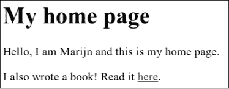

# 第十四章：`JAVASCRIPT`与浏览器

本书的下一章节将讨论网页浏览器。没有浏览器，就没有`JavaScript`——或者即使有，也不会有人关注它。

网络技术从一开始就是去中心化的，不仅在技术上如此，在其发展方式上也是如此。各种浏览器供应商以临时和有时考虑不周的方式添加了新功能，这些功能有时被其他人采纳，最终形成标准。

这既是祝福也是诅咒。一方面，系统不被中央机构控制，而是通过不同方松散合作（或偶尔公开敌对）来改进，这是令人振奋的。另一方面，网络的发展方式杂乱无章，导致最终的系统并不完全是一个内部一致性的典范。其中一些部分令人困惑且设计糟糕。

### 网络与互联网

计算机网络自`1950`年代以来就存在。如果你在两台或多台计算机之间连接电缆，并允许它们通过这些电缆来回发送数据，你就可以做各种精彩的事情。

如果在同一栋大楼中连接两台机器可以让我们做出精彩的事情，那么连接遍布全球的机器应该会更好。实现这一愿景的技术是在`1980`年代开发的，结果形成的网络被称为`互联网`。它实现了自己的承诺。

计算机可以使用这个网络向另一台计算机发送比特。要想从这种比特发送中产生有效的通信，双方的计算机必须知道这些比特所表示的内容。任何给定比特序列的含义完全取决于它试图表达的事物类型以及所使用的编码机制。

`网络协议`描述了网络上的一种通信方式。存在用于发送电子邮件、获取电子邮件、共享文件，甚至控制那些被恶意软件感染的计算机的协议。

`超文本传输协议（HTTP）`是用于检索命名资源（信息块，如网页或图片）的协议。它规定发出请求的一方应以类似这样的行开始，命名所请求的资源及其试图使用的协议版本：

```js
GET /index.xhtml HTTP/1.1
```

关于请求者如何在请求中包含更多信息，以及返回资源的另一方如何打包其内容，还有许多更多规则。我们将在第十八章中详细讨论`HTTP`。

大多数协议都是建立在其他协议之上的。`HTTP`将网络视为一个流式设备，你可以将比特放入其中，并确保它们以正确的顺序到达正确的目的地。在网络提供的原始数据发送之上提供这些保证已经是一个相当棘手的问题。

`传输控制协议（TCP）`是解决此问题的协议。所有连接到互联网的设备都“使用”它，大多数互联网通信都是基于此构建的。

TCP连接的工作方式如下：一台计算机必须处于等待状态，或`监听`，以便其他计算机开始与之通信。为了能够在同一台机器上同时监听不同类型的通信，每个监听器都有一个与之关联的数字（称为`端口`）。大多数协议指定了默认应使用的端口。例如，当我们希望使用SMTP协议发送电子邮件时，发送电子邮件的机器应该在端口`25`上进行监听。

另一台计算机可以通过使用正确的端口号连接到目标机器来建立连接。如果目标机器可以访问并在该端口上监听，则连接成功建立。监听的计算机称为`服务器`，而连接的计算机称为`客户端`。

这样的连接充当了一个双向管道，数据位可以在其中流动——两端的机器都可以向其中输入数据。一旦数据位成功传输，另一侧的机器就可以再次读取。这是一个方便的模型。可以说，`TCP`提供了网络的抽象。

### 网络

`万维网`（不要与整体互联网混淆）是一组允许我们在浏览器中访问网页的协议和格式。`Web`一词指的是这些页面可以轻松相互链接，从而连接成一个庞大的网络，用户可以在其中移动。

要成为网络的一部分，你只需将一台机器连接到互联网，并让它在端口`80`上使用`HTTP`协议进行监听，以便其他计算机可以请求文档。

网络上的每个文档都有一个`统一资源定位符（URL）`，看起来像这样：

```js
  http://eloquentjavascript.net/13_browser.xhtml
 |      |                      |               |
 protocol       server               path
```

URL的第一部分告诉我们该URL使用`HTTP`协议（与加密的`HTTP`，例如`https://`相对）。接下来是标识我们请求文档的服务器的部分。最后是一个路径字符串，标识我们感兴趣的文档（或`资源`）。

连接到互联网的机器会获得一个`IP 地址`，这是一个可用于向该机器发送消息的数字，看起来像`149.210.142.219`或`2001:4860:4860::8888`。由于随意的数字组合很难记住且输入不便，你可以注册一个`域名`来指向一个地址或一组地址。我注册了`eloquent javascript.net`，以指向我控制的机器的`IP 地址`，从而可以使用该域名来提供网页。

如果你在浏览器的地址栏中输入这个URL，浏览器将尝试检索并显示该URL处的文档。首先，你的浏览器必须找出`eloquentjavascript.net`指的是什么地址。然后，使用`HTTP`协议，它将与该地址的服务器建立连接，并请求资源`/13_browser.xhtml`。如果一切顺利，服务器会返回一个文档，浏览器随后在你的屏幕上显示该文档。

### HTML

`HTML`，即超文本标记语言，是用于网页的文档格式。一个 HTML 文档包含文本以及`*标签*`，这些标签为文本提供结构，描述诸如链接、段落和标题等内容。

一个简短的 HTML 文档可能如下所示：

```js
<!doctype html>
<html>
  <head>
 <meta charset="utf-8">
    <title>My home page</title>
  </head>
  <body>
    <h1>My home page</h1>
    <p>Hello, I am Marijn and this is my home page.</p>
    <p>I also wrote a book! Read it
      <a href="http://eloquentjavascript.net">here</a>.</p>
  </body>
</html>
```

在浏览器中，这样的文档可能看起来像这样：



标签用尖括号（`<`和`>`，分别表示“小于”和“大于”）包裹，提供有关文档结构的信息。其他文本则只是纯文本。

文档以`<!doctype html>`开始，这告诉浏览器将页面解释为`*现代*` HTML，而不是过去使用的过时样式。

HTML 文档有一个头部和一个主体。头部包含有关文档的信息`*about*`，而主体包含文档本身。在这个例子中，头部声明该文档的标题是“My home page”，并且使用 UTF-8 编码，这是一种将 Unicode 文本编码为二进制数据的方法。文档的主体包含一个标题（`<h1>`，意为“标题 1”——`<h2>`到`<h6>`产生子标题）和两个段落（`<p>`）。

标签有多种形式。一个元素，例如主体、段落或链接，是由一个`*开标签*`开始的，例如`<p>`，并由一个`*闭标签*`结束，例如`</p>`。一些开标签，例如链接的标签（`<a>`），包含以`name="value"`形式表示的额外信息。这些称为`*属性*`。在这种情况下，链接的目标通过`href="http://eloquentjavascript.net"`指示，其中`href`代表“超文本引用”。

某些类型的标签不包含任何内容，因此不需要闭合。元数据标签`<meta charset="utf-8">`就是一个例子。

为了能够在文档的文本中包含尖括号，尽管它们在 HTML 中有特殊含义，还需要引入另一种特殊表示法。一个普通的开尖括号写作`&lt;`（“小于”），而闭括号写作`&gt;`（“大于”）。在 HTML 中，一个与名称或字符代码和分号（`;`）相连的`&`字符称为`*实体*`，它将被替换为它所编码的字符。

这类似于反斜杠在 JavaScript 字符串中的用法。由于此机制也使得`&`字符具有特殊含义，因此它们需要被转义为`&amp;`。在用双引号包裹的属性值中，可以使用`&quot;`来插入字面上的引号字符。

HTML 以一种非常容错的方式进行解析。当应该存在的标签缺失时，浏览器会自动添加它们。这个过程已经标准化，你可以依赖所有现代浏览器以相同的方式来执行。

以下文档将像之前显示的文档一样处理：

```js
<!doctype html>

<meta charset=utf-8>
<title>My home page</title>

<h1>My home page</h1>
<p>Hello, I am Marijn and this is my home page.
<p>I also wrote a book! Read it
  <a href=http://eloquentjavascript.net>here</a>.
```

`<html>`、`<head>`和`<body>`标签完全消失。浏览器知道`<meta>`和`<title>`属于头部，而`<h1>`表示正文已经开始。此外，我不再明确关闭段落，因为打开新段落或结束文档会隐式关闭它们。属性值周围的引号也消失了。

本书通常会在示例中省略`<html>`、`<head>`和`<body>`标签，以保持简洁并避免杂乱。不过，我会关闭标签并在属性周围包含引号。

我通常还会省略`doctype`和`charset`声明。不要把这当作鼓励在 HTML 文档中去掉这些的理由。当你忘记这些时，浏览器往往会做出荒谬的事情。即使在示例中没有实际显示，`doctype`和`charset`元数据也应被视为隐式存在。

### HTML 和 JavaScript

在本书的上下文中，最重要的 HTML 标签是`<script>`，它允许我们在文档中包含一段 JavaScript。

```js
<h1>Testing alert</h1>
<script>alert("hello!");</script>
```

这样的脚本将在浏览器读取 HTML 时遇到`<script>`标签时立即运行。打开此页面时将弹出一个对话框——`alert`函数类似于`prompt`，它会弹出一个小窗口，但只显示消息而不要求输入。

直接在 HTML 文档中包含大型程序通常不切实际。`<script>`标签可以设置一个`src`属性，从 URL 中获取一个脚本文件（包含 JavaScript 程序的文本文件）。

```js
<h1>Testing alert</h1>
<script src="code/hello.js"></script>
```

这里包含的`code/hello.js`文件包含相同的程序——`alert("hello！")`。当 HTML 页面引用其他 URL 作为其一部分时，例如图像文件或脚本，网络浏览器会立即检索它们并将其包含在页面中。

脚本标签必须始终以`</script>`关闭，即使它引用的是脚本文件并且不包含任何代码。如果你忘记这一点，页面的其余部分将被解释为脚本的一部分。

你可以通过给`<script>`标签添加`type="module"`属性在浏览器中加载 ES 模块（见第十章）。这样的模块可以通过在导入声明中使用相对于自身的 URL 作为模块名称来依赖其他模块。

一些属性也可以包含 JavaScript 程序。`<button>`标签（显示为按钮）支持`onclick`属性。每当按钮被点击时，属性的值将被执行。

```js
<button onclick="alert('Boom!');">DO NOT PRESS</button>
```

注意，我必须在`onclick`属性的字符串中使用单引号，因为双引号已经用来引用整个属性。我也可以使用`&quot;`来转义内部引号。

### 在`沙盒`中

从互联网上下载的程序潜在地危险。你对大多数你访问的网站背后的人知之甚少，他们并不一定有好的意图。运行恶意行为者的程序就是让你的计算机感染病毒、数据被盗和账户被黑的方式。

然而，网络的吸引力在于你可以浏览它，而不必信任你访问的所有页面。这就是为什么浏览器对`JavaScript`程序能做的事情限制得非常严格：它不能查看你电脑上的文件，也不能修改与其嵌入的网页无关的任何内容。

以这种方式隔离编程环境称为`沙箱`，其理念是程序在`沙箱`中无害地进行操作。但你应该想象这种`沙箱`是有厚钢栏杆围住的，以便在其中玩耍的程序无法真正逃脱。

`沙箱`技术的难点在于为程序提供足够的空间以保持其有用性，同时限制其进行任何危险操作。许多有用的功能，比如与其他服务器通信或读取剪贴板的内容，也可能被用于问题性和侵犯隐私的目的。

时不时会有人提出新的方法，绕过浏览器的限制并做一些有害的事情，从泄露小的私人信息到接管运行浏览器的整个机器。浏览器开发者们会通过修补漏洞来回应，事情又恢复正常——直到下一个问题被发现，并希望这次是公开的，而不是被某个政府机构或犯罪组织秘密利用。

### 兼容性和浏览器战争

在网络的早期阶段，一款名为`Mosaic`的浏览器主导了市场。几年后，市场的平衡转向了`Netscape`，随后又被微软的`Internet Explorer`大部分取代。在单一浏览器占据主导地位的时期，该浏览器的供应商往往觉得有权单方面为网络发明新功能。由于大多数用户使用最受欢迎的浏览器，网站便开始简单地使用这些功能——而不考虑其他浏览器。

这是一段兼容性黑暗时代，通常被称为`浏览器战争`。网页开发者们面临的不是一个统一的网络，而是两个或三个不兼容的平台。更糟糕的是，2003年左右使用的浏览器都有很多漏洞，当然每个浏览器的漏洞也各不相同。为网页编写代码的人们的生活非常艰难。

`Mozilla Firefox`是`Netscape`的一个非营利分支，在2000年代末挑战了`Internet Explorer`的市场地位。因为微软当时并不特别关注保持竞争力，`Firefox`从其手中夺走了大量市场份额。与此同时，`谷歌`推出了`Chrome`浏览器，`苹果`的`Safari`浏览器也开始受到欢迎，导致市场上出现了四大主要玩家，而非只有一个。

新的参与者对标准和工程实践持有更加严肃的态度，从而减少了不兼容性和漏洞。微软看到其市场份额急剧下降，开始采纳这些态度，在其取代`Internet Explorer`的`Edge`浏览器中实施。如果你今天开始学习网络开发，可以认为自己很幸运。主要浏览器的最新版本表现得相当一致，且相对较少出现漏洞。

不幸的是，随着`Firefox`的市场份额越来越小，而`Edge`在2018年仅仅成为`Chrome`内核的外壳，这种统一性可能再次变成单一供应商——这次是`谷歌`——在浏览器市场上拥有足够的控制权，将其对网络的看法强加于世界其他地方。

这一系列历史事件和偶然事故造就了我们今天所拥有的网络平台。在接下来的章节中，我们将为其编写程序。

`真可惜！老调重弹！一旦你建好了房子，你会发现自己意外学到了一些你本该在开始之前就知道的东西。`

—弗里德里希·尼采，`超越善恶`


