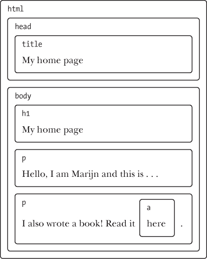
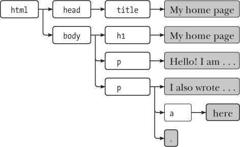
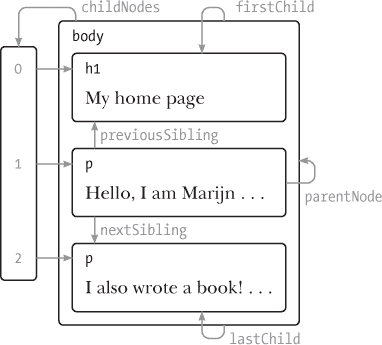
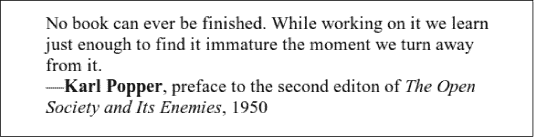
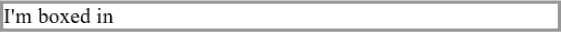
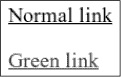
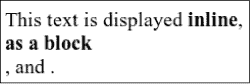
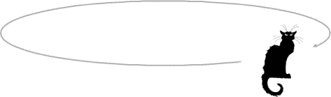
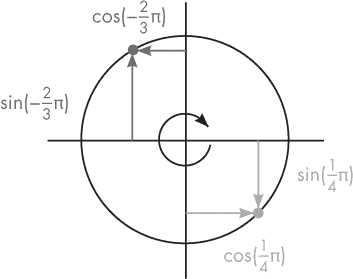
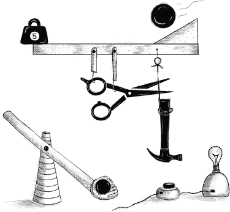

# 第十五章：文档对象模型

当你打开一个网页时，浏览器检索页面的 HTML 文本并解析它，就像我们在`第十二章`中的解析器解析程序一样。浏览器构建文档结构的模型，并使用该模型在屏幕上绘制页面。

文档的这种表示形式是 JavaScript 程序在其沙盒中可用的玩具之一。这是一个你可以读取或修改的数据结构。它作为一个`实时`数据结构运作：当它被修改时，屏幕上的页面会更新以反映这些更改。

### 文档结构

你可以将 HTML 文档想象成一组嵌套的框。像`<body>`和`</body>`这样的标签包围其他标签，这些标签又包含其他标签或文本。以下是上一章的示例文档：

```js
<!doctype html>
<html>
  <head>
    <title>My home page</title>
  </head>
  <body>
 <h1>My home page</h1>
    <p>Hello, I am Marijn and this is my home page.</p>
    <p>I also wrote a book! Read it
      <a href="http://eloquentjavascript.net">here</a>.</p>
  </body>
</html>
```

本页面具有以下结构：



浏览器用来表示文档的数据结构遵循这种形状。对于每个框，存在一个对象，我们可以与之交互以了解它表示什么 HTML 标签以及它包含哪些框和文本。这种表示被称为`文档对象模型`，简称`DOM`。

全局绑定文档使我们可以访问这些对象。其`documentElement`属性指向表示`<html>`标签的对象。由于每个 HTML 文档都有头和主体，因此它也具有指向这些元素的`head`和`body`属性。

### 树

回想一下`第十二章`的语法树。它们的结构与浏览器文档的结构惊人地相似。每个`节点`可能引用其他节点，即`子节点`，而这些子节点又可能有自己的子节点。这种形状是嵌套结构的典型特征，其中元素可以包含与自己相似的子元素。

当数据结构具有分支结构，没有循环（一个节点不能直接或间接包含自身）并且有一个单一、明确的`根`时，我们称其为`树`。在 DOM 的情况下，`document.documentElement`充当根节点。

树在计算机科学中经常出现。除了表示递归结构（如 HTML 文档或程序）外，它们还常用于维护排序的数据集，因为在树中查找或插入元素通常比在平面数组中更有效。

一个典型的树具有不同类型的节点。`Egg`语言的语法树有标识符、值和应用节点。应用节点可以有子节点，而标识符和值则是`叶子`，或没有子节点的节点。

DOM 也是如此。`元素`的节点代表 HTML 标签，决定文档的结构。这些节点可以有子节点。一个这样的节点的例子是`document.body`。这些子节点中有些可以是`叶子`节点，例如文本片段或注释节点。

每个 DOM 节点对象都有一个`nodeType`属性，其中包含一个代码（数字），用以标识节点的类型。元素的代码为`1`，这也被定义为常量属性`Node.ELEMENT_NODE`。表示文档中一段文本的文本节点的代码为`3`（`Node.TEXT_NODE`）。评论的代码为`8`（`Node.COMMENT_NODE`）。

另一种可视化文档树的方法如下：



`叶子`是文本节点，箭头表示节点之间的父子关系。

### 标准

使用晦涩的数字代码来表示节点类型并不是一个非常 JavaScript 风格的做法。本章后面我们将看到，DOM 接口的其他部分也感觉笨重且陌生。这是因为 DOM 接口并不是专为 JavaScript 设计的。相反，它试图成为一个语言中立的接口，可以在其他系统中使用——不仅仅是 HTML，还包括 XML，后者是一种具有 HTML 类似语法的通用数据格式。

这很不幸。标准通常是有用的。但在这种情况下，优势（跨语言的一致性）并不是特别令人信服。拥有一个与所使用语言良好集成的接口，比在多种语言中拥有一个熟悉的接口能节省更多时间。

作为这种不佳集成的一个例子，考虑 DOM 中元素节点拥有的`childNodes`属性。该属性持有一个类数组对象，具有一个`length`属性和用数字标记的属性以访问子节点。但它是`NodeList`类型的实例，而不是一个真正的数组，因此没有像`slice`和`map`这样的函数。

然后还有一些问题是由于设计不佳造成的。例如，没有办法创建一个新节点并立即添加子节点或属性。相反，你必须先创建它，然后逐个添加子节点和属性，使用副作用。与 DOM 密切互动的代码往往变得冗长、重复且难以维护。

但这些缺陷并不是致命的。由于 JavaScript 允许我们创建自己的抽象，因此可以设计改进的方法来表达我们正在执行的操作。许多用于浏览器编程的库都提供了这样的工具。

### 在树中移动

DOM 节点包含大量链接到其他邻近节点的信息。以下图表对此进行了说明：



尽管图表仅显示了每种类型的一个链接，但每个节点都有一个`parentNode`属性，指向它所属的节点（如果有的话）。同样，每个元素节点（节点类型`1`）都有一个`childNodes`属性，指向一个类数组对象，包含它的子节点。

理论上，您可以仅使用这些父节点和子节点链接在树中任意移动。但是`JavaScript`还为您提供了许多其他方便的链接。`firstChild`和`lastChild`属性指向第一个和最后一个子元素，或者对于没有子元素的节点，其值为`null`。类似地，`previousSibling`和`nextSibling`指向相邻节点，即与节点本身具有相同父级并立即在其前后出现的节点。对于第一个子节点，`previousSibling`将为`null`，对于最后一个子节点，`nextSibling`将为`null`。

还有一个`children`属性，类似于`childNodes`，但仅包含元素（类型 1）子节点，而不包括其他类型的子节点。当您不关心文本节点时，这可能非常有用。

当处理像这样的嵌套数据结构时，递归函数通常很有用。以下函数扫描文档以查找包含给定字符串的文本节点，并在找到时返回`true`：

```js
function talksAbout(node, string) {
  if (node.nodeType == Node.ELEMENT_NODE) {
    for (let child of node.childNodes) {
      if (talksAbout(child, string)) {
        return true;
      }
    }
    return false;
  } else if (node.nodeType == Node.TEXT_NODE) {
    return node.nodeValue.indexOf(string) > -1;
  }
}

console.log(talksAbout(document.body, "book"));
// → true
```

文本节点的`nodeValue`属性保存它所表示的文本字符串。

### 查找元素

在父节点、子节点和兄弟节点之间导航链接通常很有用。但是，如果我们想在文档中找到特定的节点，通过从`document.body`开始并遵循固定的属性路径来达到这个目的是一个不好的主意。这样做会在我们的程序中固化关于文档精确结构的假设，而这个结构以后可能会更改。另一个复杂因素是，即使是节点之间的空格也会创建文本节点。示例文档的`<body>`标签不仅有三个子节点（`<h1>`和两个`<p>`元素），而是有七个：这三个，加上它们之间的空格及其前后。

如果我们想要获取文档中链接的`href`属性，我们不希望说像“获取文档主体的第六个子节点的第二个子节点”。最好的方式是说“获取文档中的第一个链接”。我们可以这样做。

```js
let link = document.body.getElementsByTagName("a")[0];
console.log(link.href);
```

所有元素节点都有一个`getElementsByTagName`方法，该方法收集该节点的所有后代（直接或间接子节点）中具有给定标签名的元素，并将它们作为类似数组的对象返回。

要找到一个特定的`单个`节点，可以给它一个`id`属性，然后使用`document.getElementById`。

```js
<p>My ostrich Gertrude:</p>
<p></p>

<script>
  let ostrich = document.getElementById("gertrude");
  console.log(ostrich.src);
</script>
```

第三个类似的方法是`getElementsByClassName`，它类似于`getElementsByTagName`，通过元素节点的内容搜索，并检索其类属性中包含给定字符串的所有元素。

### 更改文档

几乎可以更改`DOM`数据结构的所有内容。可以通过更改父子关系来修改文档树的形状。节点具有`remove`方法可以从当前父节点中删除它们。要将子节点添加到元素节点中，可以使用`appendChild`将其放在子节点列表的末尾，或者使用`insertBefore`将给定的第一个参数节点插入到给定的第二个参数节点之前。

```js
<p>One</p>
<p>Two</p>
<p>Three</p>

<script>
  let paragraphs = document.body.getElementsByTagName("p");
  document.body.insertBefore(paragraphs[2], paragraphs[0]);
</script>
```

一个节点只能在文档中存在一个位置。因此，在段落`One`前插入段落`Three`将首先从文档末尾移除它，然后插入到前面，结果将是`Three`/`One`/`Two`。所有将节点插入某处的操作都会作为副作用使其从当前位置移除（如果它有位置的话）。

`replaceChild`方法用于用另一个节点替换子节点。它接受两个节点作为参数：一个新节点和要被替换的节点。被替换的节点必须是调用该方法的元素的子节点。请注意，`replaceChild`和`insertBefore`都期望`新`节点作为它们的第一个参数。

### 创建节点

假设我们想编写一个脚本，将文档中的所有图像（``标签）替换为它们`alt`属性中包含的文本，`alt`属性指定图像的替代文本表示。这不仅涉及移除图像，还需要添加一个新的文本节点来替代它们。

```js
<p>The  in the
  .</p>

<p><button onclick="replaceImages()">Replace</button></p>

<script>
  function replaceImages() {
    let images = document.body.getElementsByTagName("img");
    for (let i = images.length - 1; i >= 0; i--) {
      let image = images[i];
      if (image.alt) {
        let text = document.createTextNode(image.alt);
        image.parentNode.replaceChild(text, image);
      }
    }
  }
</script>
```

给定一个字符串，`createTextNode`会给我们一个文本节点，我们可以将其插入到文档中以使其在屏幕上显示。

遍历图像的循环从列表的末尾开始。这是必要的，因为像`getElementsByTagName`（或像`childNodes`这样的属性）返回的节点列表是`实时的`。也就是说，它会随着文档的变化而更新。如果我们从前面开始，移除第一个图像会导致列表失去第一个元素，因此在循环第二次重复时（当`i`为 1 时），它会停止，因为集合的长度现在也变为 1。

如果你想要一个`固态`的节点集合，而不是一个实时的集合，你可以通过调用`Array.from`将集合转换为一个真正的数组。

```js
let arrayish = {0: "one", 1: "two", length: 2};
let array = Array.from(arrayish);
console.log(array.map(s => s.toUpperCase()));
// → ["ONE", "TWO"]
```

要创建元素节点，可以使用`document.createElement`方法。该方法接受一个标签名并返回一个给定类型的新空节点。

以下示例定义了一个工具函数`elt`，该函数创建一个元素节点并将其余参数视为该节点的子节点。然后使用这个函数为引文添加归属。

```js
<blockquote id="quote">
  No book can ever be finished. While working on it we learn
  just enough to find it immature the moment we turn away
  from it.
</blockquote>

<script>
  function elt(type, ...children) {
    let node = document.createElement(type);
    for (let child of children) {
      if (typeof child != "string") node.appendChild(child);
      else node.appendChild(document.createTextNode(child));
    }
    return node;
  }

  document.getElementById("quote").appendChild(
    elt("footer", "--",
        elt("strong", "Karl Popper"),
        ", preface to the second edition of ",
        elt("em", "The Open Society and Its Enemies"),
        ", 1950"));
</script>
```

这就是生成的文档的样子：



### 属性

一些元素属性，比如链接的`href`，可以通过元素DOM对象上同名的属性访问。这是大多数常用标准属性的情况。

HTML允许你在节点上设置任何你想要的属性。这很有用，因为它允许你在文档中存储额外的信息。要读取或更改自定义属性（这些属性在常规对象属性中不可用），你必须使用`getAttribute`和`setAttribute`方法。

```js
<p data-classified="secret">The launch code is 00000000.</p>
<p data-classified="unclassified">I have two feet.</p>

<script>
  let paras = document.body.getElementsByTagName("p");
 for (let para of Array.from(paras)) {
    if (para.getAttribute("data-classified") == "secret") {
      para.remove();
    }
  }
</script>
```

建议将这些虚构属性的名称以`data-`为前缀，以确保它们不会与其他属性冲突。

有一个常用的属性`class`，这是JavaScript语言中的一个关键字。由于历史原因——一些旧的JavaScript实现无法处理与关键字匹配的属性名——用于访问此属性的属性被称为`className`。你也可以通过`getAttribute`和`setAttribute`方法以其真实名称“class”访问它。

### 布局

你可能注意到不同类型的元素布局方式不同。一些元素，如段落（`<p>`）或标题（`<h1>`），占据文档的整个宽度，并在单独的行上渲染。这些被称为`*块*`元素。其他元素，如链接（`<a>`）或`<strong>`元素，则与其周围文本在同一行上渲染。这些元素被称为`*内联*`元素。

对于任何给定的文档，浏览器能够计算一个布局，根据元素的类型和内容为每个元素提供大小和位置。然后，这个布局被用于实际绘制文档。

元素的大小和位置可以通过JavaScript访问。`offsetWidth`和`offsetHeight`属性告诉你元素在`*像素*`中占据的空间。像素是浏览器中的基本测量单位。它传统上对应于屏幕能够绘制的最小点，但在现代显示器上，它可以绘制`*非常*`小的点，这可能不再是事实，并且浏览器像素可能跨越多个显示点。

类似地，`clientWidth`和`clientHeight`给你提供`*内部*`空间的大小，忽略边框宽度。

```js
<p style="border: 3px solid red">
  I'm boxed in
</p>

<script>
  let para = document.body.getElementsByTagName("p")[0];
  console.log("clientHeight:", para.clientHeight);
  // → 19
  console.log("offsetHeight:", para.offsetHeight);
  // → 25
</script>
```

给段落添加边框会在其周围绘制一个矩形。



找到元素在屏幕上精确位置的最有效方法是`getBoundingClientRect`方法。它返回一个对象，包含顶部、底部、左侧和右侧属性，指示元素相对于屏幕左上角的边缘的像素位置。如果你想要相对于整个文档的像素位置，你必须加上当前的滚动位置，可以在`pageXOffset`和`pageYOffset`绑定中找到。

布局一个文档可能需要相当多的工作。为了提高速度，浏览器引擎不会在每次更改文档时立即重新布局，而是尽可能长时间地等待。在更改文档的JavaScript程序运行结束后，浏览器将不得不计算一个新布局，以将更改后的文档绘制到屏幕上。当程序`*请求*`通过读取`offsetHeight`属性或调用`getBoundingClientRect`来获取某个元素的位置或大小时，提供该信息也需要计算布局。

一个不断在读取DOM布局信息和更改DOM之间交替进行的程序会迫使进行大量布局计算，因此运行会非常缓慢。以下代码就是一个例子。它包含两个不同的程序，构建一行2,000像素宽的`*X*`字符，并测量每个程序所需的时间。

```js
<p><span id="one"></span></p>
<p><span id="two"></span></p>

<script>
  function time(name, action) {
    let start = Date.now(); // Current time in milliseconds
    action();
    console.log(name, "took", Date.now() - start, "ms");
  }

  time("naive", () => {
    let target = document.getElementById("one");
    while (target.offsetWidth < 2000) {
      target.appendChild(document.createTextNode("X"));
    }
  });
  // → naive took 32 ms

  time("clever", function() {
    let target = document.getElementById("two");
    target.appendChild(document.createTextNode("XXXXX"));
    let total = Math.ceil(2000 / (target.offsetWidth / 5));
    target.firstChild.nodeValue = "X".repeat(total);
 });
  // → clever took 1 ms
</script>
```

### 样式

我们已经看到不同的HTML元素有不同的绘制方式。有些显示为块，有些则内联。有些添加样式——`<strong>`会使其内容变为粗体，而`<a>`会使其变为蓝色并加下划线。

``标签如何显示图像或`<a>`标签如何在点击时跟随链接，与元素类型密切相关。但我们可以更改与元素关联的样式，例如文本颜色或下划线。这里是一个使用样式属性的示例：

```js
<p><a href=".">Normal link</a></p>
<p><a href="." style="color: green">Green link</a></p>
```

第二个链接将显示为绿色，而不是默认链接颜色。



样式属性可以包含一个或多个`*声明*`，声明是属性（如颜色）后跟冒号和一个值（如绿色）。当有多个声明时，它们必须用分号分隔，如“`color: red; border: none`”。

文档的许多方面都可以受到样式的影响。例如，`display`属性控制一个元素是作为块级元素还是内联元素显示。

```js
This text is displayed <strong>inline</strong>,
<strong style="display: block">as a block</strong>, and
<strong style="display: none">not at all</strong>.
```

块标签最终会单独占据一行，因为块级元素不会与周围文本内联显示。最后一个标签根本不显示——`display: none`阻止元素在屏幕上显示。这是一种隐藏元素的方法。通常，这种方式比将它们完全从文档中删除更可取，因为这使得以后再次显示它们变得简单。



JavaScript代码可以通过元素的样式属性直接操作元素的样式。此属性保存一个对象，该对象具有所有可能样式属性的属性。这些属性的值是字符串，我们可以通过写入它们来更改元素样式的特定方面。

```js
<p id="para" style="color: purple">
  Nice text
</p>

<script>
  let para = document.getElementById("para");
  console.log(para.style.color);
  para.style.color = "magenta";
</script>
```

一些样式属性名称包含连字符，例如`font-family`。由于这样的属性名称在 JavaScript 中处理起来很麻烦（你必须这样写`style["font-family"]`），因此此类属性在样式对象中的名称去掉了连字符，并将其后面的字母大写（`style.fontFamily`）。

### 层叠样式

HTML 的样式系统称为`CSS`，即`层叠样式表`。`样式表`是一组关于如何为文档中的元素添加样式的规则。它可以放在`<style>`标签内。

```js
<style>
  strong {
    font-style: italic;
    color: gray;
  }
</style>
<p>Now <strong>strong text</strong> is italic and gray.</p>
```

名称中的`层叠`指的是多个此类规则结合以产生元素的最终样式。在这个例子中，`<strong>`标签的默认样式（使其`font-weight: bold`）被`<style>`标签中的规则覆盖，后者添加了`font-style`和`color`。

当多个规则为同一属性定义值时，最近读取的规则优先级更高并获胜。例如，如果`<style>`标签中的规则包含`font-weight: normal`，与默认的`font-weight`规则相矛盾，文本将显示为正常的，`而不是`粗体。直接应用于节点的样式属性具有最高优先级，总是获胜。

在`CSS`规则中，可以针对除标签名以外的其他东西。规则`.abc`应用于所有类属性中包含“abc”的元素。规则`#xyz`应用于具有 id 属性“xyz”的元素（在文档中应该是唯一的）。

```js
.subtle {
  color: gray;
 font-size: 80%;
}
#header {
  background: blue;
  color: white;
}
/* p elements with id main and with classes a and b */
p#main.a.b {
  margin-bottom: 20px;
}
```

优先级规则偏向于最近定义的规则，仅在规则具有相同的`特异性`时适用。规则的特异性是衡量其描述匹配元素的精确程度，取决于它所要求的元素方面的数量和种类（标签、类或 ID）。例如，针对`p.a`的规则比针对`p`或仅`.a`的规则更具特异性，因此将优先于它们。

记号`p > a {...}`将给定的样式应用于所有直接子元素为`<p>`标签的`<a>`标签。类似地，`p a {...}`将应用于所有位于`<p>`标签内部的`<a>`标签，无论它们是直接还是间接子元素。

### 查询选择器

在本书中我们不会频繁使用样式表。理解样式表在浏览器编程时是有帮助的，但它们足够复杂，值得单独成书。我引入`选择器`语法（样式表中用于确定一组样式适用哪些元素的记号）的主要原因是，我们可以使用这个相同的迷你语言作为有效的方式来查找 DOM 元素。

`querySelectorAll`方法在文档对象和元素节点上都被定义，它接受一个选择器字符串并返回一个包含所有匹配元素的`NodeList`。

```js
<p>And if you go chasing
  <span class="animal">rabbits</span></p>
<p>And you know you're going to fall</p>
<p>Tell 'em a <span class="character">hookah smoking
  <span class="animal">caterpillar</span></span></p>
<p>Has given you the call</p>

<script>
  function count(selector) {
    return document.querySelectorAll(selector).length;
  }
  console.log(count("p"));           // All <p> elements
  // → 4
  console.log(count(".animal"));     // Class animal
  // → 2
 console.log(count("p .animal"));   // Animal inside of <p>
  // → 2
  console.log(count("p > .animal")); // Direct child of <p>
  // → 1
</script>
```

与`getElementsByTagName`等方法不同，`querySelectorAll`返回的对象是`非活跃`的。它在文档更改时不会变化。不过，它仍然不是一个真正的数组，因此如果你想将其视为数组，需要调用`Array.from`。

`querySelector`方法（没有`All`部分）以类似的方式工作。如果你想要特定的单个元素，这个方法很有用。它只会返回第一个匹配的元素，或者在没有匹配元素时返回`null`。

### 定位与动画

`position`样式属性以强大的方式影响布局。其默认值为`static`，意味着元素在文档中的正常位置。当设置为`relative`时，元素仍然占据文档中的空间，但现在可以使用`top`和`left`样式属性相对于正常位置移动它。当`position`设置为`absolute`时，元素从正常文档流中移除——即它不再占据空间，并可能与其他元素重叠。其`top`和`left`属性可以用于相对于最近的包围元素的左上角进行绝对定位（该元素的`position`属性不能为`static`），或者如果没有这样的包围元素，则相对于文档进行定位。

我们可以用这个来创建动画。以下文档显示了一只在椭圆形轨道上移动的猫的图像：

```js
<p style="text-align: center">
  
</p>
<script>
  let cat = document.querySelector("img");
  let angle = Math.PI / 2;
  function animate(time, lastTime) {
    if (lastTime != null) {
      angle += (time - lastTime) * 0.001;
    }
    cat.style.top = (Math.sin(angle) * 20) + "px";
    cat.style.left = (Math.cos(angle) * 200) + "px";
    requestAnimationFrame(newTime => animate(newTime, time));
  }
  requestAnimationFrame(animate);
</script>
```

灰色箭头显示了图像移动的路径。



我们的图片居中显示在页面上，并设置为相对定位。我们将不断更新该图片的`顶部`和`左侧`样式以使其移动。

脚本使用`requestAnimationFrame`来安排`animate`函数在浏览器准备好重新绘制屏幕时运行。`animate`函数本身再次调用`requestAnimationFrame`以安排下一次更新。当浏览器窗口（或标签页）处于活动状态时，这将导致以每秒大约`60`次的速率进行更新，从而产生良好的动画效果。

如果我们在一个循环中仅更新 DOM，页面将会冻结，屏幕上什么都不会显示。浏览器在 JavaScript 程序运行时不会更新显示，也不允许与页面进行任何交互。这就是我们需要`requestAnimationFrame`的原因——它让浏览器知道我们暂时完成了，浏览器可以继续进行其应做的事情，例如更新屏幕和响应用户操作。

动画函数接收当前时间作为参数。为了确保猫的运动在每毫秒内是稳定的，它根据当前时间与上次函数运行时间之间的差异来确定角度变化的速度。如果它只是以固定的量每步移动角度，当例如计算机上另一个繁重的任务阻止函数运行时，运动会出现卡顿。

圆周运动是通过三角函数`Math.cos`和`Math.sin`实现的。对于那些不熟悉这些函数的人，我将简要介绍一下，因为我们在本书中会偶尔使用它们。

`Math.cos`和`Math.sin`对于查找围绕点(0, 0)半径为1的圆上的点非常有用。这两个函数将它们的参数解释为圆上的位置，其中0表示圆的最右侧点，顺时针方向直到`2*π`（大约6.28）使我们走完整个圆。`Math.cos`告诉你与给定位置对应的点的x坐标，而`Math.sin`则返回y坐标。大于`2*π`或小于0的位置（或角度）都是有效的——旋转会重复，因此`a + 2*π`表示与`a`相同的角度。

用于测量角度的单位称为弧度——一个完整的圆是`2*π`弧度，类似于用度数测量时为360度。常数`π`在JavaScript中可以用`Math.PI`表示。



猫动画代码保持一个计数器`angle`，用于表示当前动画的角度，并在每次调用`animate`函数时递增。然后可以利用这个角度来计算图像元素的当前位置。顶部样式是通过`Math.sin`计算得出，并乘以20，这是我们椭圆的垂直半径。左侧样式则基于`Math.cos`，并乘以200，使得椭圆的宽度远大于高度。

注意，样式通常需要`单位`。在这种情况下，我们必须在数字后附加“px”，以告诉浏览器我们是在以像素为单位计数（而不是厘米、“ems”或其他单位）。这一点容易被忘记。使用没有单位的数字会导致你的样式被忽略——除非这个数字是0，因为无论单位是什么，0总是意味着同样的东西。

### 概述

JavaScript程序可以通过一个称为`DOM`的数据结构检查和干扰浏览器正在显示的文档。这个数据结构代表了浏览器对文档的模型，JavaScript程序可以修改它以更改可见文档。

`DOM`的组织结构像一棵树，元素根据文档的结构以层级方式排列。表示元素的对象具有父节点和子节点等属性，可以用来遍历这棵树。

文档的显示方式可以通过`样式`进行影响，包括直接将样式附加到节点以及定义匹配某些节点的规则。样式属性有很多种，例如颜色或显示。JavaScript代码可以通过其样式属性直接操作元素的样式。

### 练习

#### `构建一个表格`

HTML表格是通过以下标签结构构建的：

```js
<table>
  <tr>
 <th>name</th>
    <th>height</th>
    <th>place</th>
  </tr>
  <tr>
    <td>Kilimanjaro</td>
    <td>5895</td>
    <td>Tanzania</td>
  </tr>
</table>
```

对于每个`行`，`<table>`标签包含一个`<tr>`标签。在这些`<tr>`标签内部，我们可以放置单元格元素：可以是表头单元格（`<th>`）或常规单元格（`<td>`）。

给定一个包含名称、高度和地点属性的山脉数据集，生成一个`DOM`结构的表格来列出这些对象。每个键对应一列，每个对象对应一行，并在顶部有一个包含`<th>`元素的标题行，列出列名。

这样编写，以便列自动从对象中派生，通过提取数据中第一个对象的属性名称。

通过将生成的表格附加到具有`id`属性为“mountains”的元素中，显示结果表格。

一旦你实现了这一点，通过将其`style.textAlign`属性设置为“right”，使包含数字值的单元格右对齐。

#### `按标签名称获取元素`

`document.getElementsByTagName`方法返回具有给定标签名的所有子元素。实现你自己的版本作为一个函数，该函数接受一个节点和一个字符串（标签名）作为参数，并返回一个包含所有具有给定标签名的后代元素节点的数组。你的函数应遍历文档本身。它可能不使用像`querySelectorAll`这样的方式来完成工作。

要找到元素的标签名，可以使用其`nodeName`属性。但请注意，这将返回全大写的标签名。可以使用`toLowerCase`或`toUpperCase`字符串方法来进行补偿。

#### `猫的帽子`

扩展之前定义的猫的动画，使得猫和他的帽子（``）在椭圆的两侧绕行。

或者让帽子围绕猫转动。或者以其他有趣的方式改变动画。

为了更方便地定位多个对象，你可能需要切换到绝对定位。这意味着顶部和左侧的位置是相对于文档的左上角计算的。为了避免使用负坐标，这会导致图像移动到可见页面之外，你可以在位置值中添加一个固定的像素值。

`你对自己的思想拥有掌控权——而不是外部事件。认识到这一点，你将找到力量。`

—马库斯·奥勒留，`《沉思录》`


