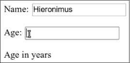

# 第十六章：处理事件

一些程序处理直接的用户输入，例如鼠标和键盘操作。这种输入无法提前以良好组织的数据结构获取——它是实时逐步到达的，程序必须在发生时对此作出反应。

### 事件处理程序

想象一个界面，唯一知道键盘上的某个键是否被按下的方法是读取该键的当前状态。要能够对按键反应，你必须不断读取该键的状态，以便在其再次释放之前捕捉到它。进行其他耗时的计算是危险的，因为你可能会错过一个按键。

一些原始机器以这种方式处理输入。更高级的做法是让硬件或操作系统注意到按键并将其放入队列。然后程序可以定期检查队列中的新事件，并对所找到的事件作出反应。

当然，程序必须记得查看队列，并且要经常查看，因为在按键被按下和程序注意到事件之间的任何时间都会导致软件感觉无响应。这种方法称为`轮询`。大多数程序员倾向于避免它。

更好的机制是让系统在事件发生时主动通知代码。浏览器通过允许我们注册函数作为特定事件的`处理程序`来做到这一点。

```js
<p>Click this document to activate the handler.</p>
<script>
  window.addEventListener("click", () => {
    console.log("You knocked?");
  });
</script>
```

窗口绑定是浏览器提供的一个内置对象。它代表包含文档的浏览器窗口。调用它的`addEventListener`方法会注册第二个参数，以便在第一个参数描述的事件发生时被调用。

### 事件与DOM节点

每个浏览器事件处理程序在一个上下文中注册。在前面的例子中，我们在窗口对象上调用`addEventListener`来注册整个窗口的处理程序。这样的一个方法也可以在DOM元素和其他类型的对象上找到。事件监听器仅在事件发生在其注册对象的上下文中时被调用。

```js
<button>Click me</button>
<p>No handler here.</p>
<script>
  let button = document.querySelector("button");
  button.addEventListener("click", () => {
    console.log("Button clicked.");
  });
</script>
```

该示例将一个处理程序附加到按钮节点上。点击按钮会导致该处理程序运行，但点击文档的其他部分则不会。

给节点一个`onclick`属性有类似的效果。这适用于大多数类型的事件——你可以通过名称为事件名称并在前面加上`on`的属性来附加处理程序。

但是一个节点只能有一个`onclick`属性，因此你只能通过这种方式为每个节点注册一个处理程序。`addEventListener`方法允许你添加任意数量的处理程序，这意味着即使元素上已经有另一个处理程序，也可以安全地添加新的处理程序。

`removeEventListener`方法与`addEventListener`的参数类似，用于移除一个处理程序。

```js
<button>Act-once button</button>
<script>
  let button = document.querySelector("button");
  function once() {
 console.log("Done.");
    button.removeEventListener("click", once);
  }
  button.addEventListener("click", once);
</script>
```

传递给`removeEventListener`的函数必须是传递给`addEventListener`的同一个函数值。当你需要注销一个处理程序时，你会想给处理程序函数一个名称（在示例中只需一次），以便能够将相同的函数值传递给这两个方法。

### 事件对象

尽管我们到目前为止忽略了这一点，事件处理函数会接收一个参数：`事件对象`。这个对象包含关于事件的附加信息。例如，如果我们想知道`哪个`鼠标按钮被按下，我们可以查看事件对象的`button`属性。

```js
<button>Click me any way you want</button>
<script>
  let button = document.querySelector("button");
  button.addEventListener("mousedown", event => {
    if (event.button == 0) {
      console.log("Left button");
    } else if (event.button == 1) {
      console.log("Middle button");
    } else if (event.button == 2) {
      console.log("Right button");
    }
  });
</script>
```

存储在事件对象中的信息因事件类型而异。（我们将在本章后面讨论不同的类型。）对象的`type`属性始终保存一个字符串，用于标识事件（例如`“click”`或`“mousedown”`）。

### 传播

对于大多数事件类型，在具有子节点的节点上注册的处理程序也会接收子节点发生的事件。如果段落内部的按钮被点击，段落上的事件处理程序也会看到点击事件。

但是如果段落和按钮都有处理程序，更具体的处理程序——按钮上的那个——将优先执行。事件被称为从发生的节点`传播`到该节点的父节点，再到文档的根节点。最后，在特定节点上注册的所有处理程序轮流执行后，注册在整个窗口上的处理程序也会有机会响应该事件。

在任何时刻，事件处理程序都可以在事件对象上调用`stopPropagation`方法，以防止更高层的处理程序接收该事件。这在某些情况下是有用的，例如，当你在另一个可点击元素内部有一个按钮时，你不希望按钮的点击激活外部元素的点击行为。

以下示例在按钮和周围的段落上注册`“mousedown”`处理程序。当用右键点击时，按钮的处理程序调用`stopPropagation`，这将防止段落上的处理程序运行。当用其他鼠标按钮点击按钮时，两个处理程序都会运行。

```js
<p>A paragraph with a <button>button</button>.</p>
<script>
  let para = document.querySelector("p");
  let button = document.querySelector("button");
  para.addEventListener("mousedown", () => {
    console.log("Handler for paragraph.");
  });
  button.addEventListener("mousedown", event => {
    console.log("Handler for button.");
    if (event.button == 2) event.stopPropagation();
  });
</script>
```

大多数事件对象都有一个指向其来源节点的`target`属性。你可以使用这个属性确保你不会意外处理来自不想处理的节点的传播事件。

也可以使用`target`属性对特定类型的事件进行广泛捕获。例如，如果你有一个包含长列表按钮的节点，注册一个点击处理程序在外部节点上可能更方便，并使用`target`属性来判断是否点击了某个按钮，而不是在所有按钮上注册单独的处理程序。

```js
<button>A</button>
<button>B</button>
<button>C</button>
<script>
  document.body.addEventListener("click", event => {
    if (event.target.nodeName == "BUTTON") {
      console.log("Clicked", event.target.textContent);
    }
  });
</script>
```

### 默认行为

许多事件都有默认行为。如果你点击一个链接，你将被带到链接的目标。如果你按下向下箭头，浏览器会向下滚动页面。如果你右键单击，你将获得一个上下文菜单。等等。

对于大多数类型的事件，JavaScript 事件处理程序在默认行为发生`之前`被调用。如果处理程序不希望发生这种正常行为，通常是因为它已经处理了事件，可以在事件对象上调用`preventDefault`方法。

这可以用来实现你自己的键盘快捷键或上下文菜单。它也可以用来干扰用户期望的行为。例如，这里有一个无法被点击的链接：

```js
<a href="https://developer.mozilla.org/">MDN</a>
<script>
  let link = document.querySelector("a");
  link.addEventListener("click", event => {
    console.log("Nope.");
    event.preventDefault();
  });
</script>
```

尽量不要在没有充分理由的情况下这样做。当预期的行为被打破时，这会让使用你页面的人感到不愉快。

根据浏览器的不同，有些事件根本无法被拦截。在 Chrome 中，例如，关闭当前标签页的键盘快捷键（`CTRL-W`或`COMMAND-W`）无法通过 JavaScript 处理。

### 键事件

当键盘上的一个键被按下时，你的浏览器会触发一个`"keydown"`事件。当它被释放时，你会得到一个`"keyup"`事件。

```js
<p>This page turns violet when you hold the V key.</p>
<script>
  window.addEventListener("keydown", event => {
    if (event.key == "v") {
      document.body.style.background = "violet";
    }
  });
  window.addEventListener("keyup", event => {
    if (event.key == "v") {
      document.body.style.background = "";
    }
  });
</script>
```

尽管名称如此，`"keydown"`不仅在键被物理按下时触发。当一个键被按下并保持时，该事件会在每次键`重复`时再次触发。有时你需要对此格外小心。例如，如果你在按下键时向 DOM 添加一个按钮，并在释放键时将其移除，可能在按住键的过程中意外添加数百个按钮。

上一个示例查看事件对象的`key`属性，以了解该事件是关于哪个键的。该属性保存一个字符串，对于大多数键，对应于按下该键时会输入的内容。对于特殊键，如`ENTER`，它保存一个字符串来命名该键（在本例中为`"Enter"`）。如果你在按下键时同时按住`SHIFT`，这可能也会影响键的名称——`"v"`变为`"V"`，而`"1"`可能变为`"!"`（如果按`SHIFT-1`时你键盘上产生这样的结果）。

修饰键，如`SHIFT`、`CTRL`、`ALT`和`META`（在 Mac 上为`COMMAND`），生成的键事件与普通键一样。当查找键组合时，你也可以通过查看键盘和鼠标事件的`shiftKey`、`ctrlKey`、`altKey`和`metaKey`属性来了解这些键是否被按下。

```js
<p>Press Control-Space to continue.</p>
<script>
  window.addEventListener("keydown", event => {
    if (event.key == " " && event.ctrlKey) {
      console.log("Continuing!");
    }
  });
</script>
```

键事件来源的 DOM 节点取决于按下键时哪个元素具有焦点。大多数节点无法获得焦点，除非你给它们一个`tabindex`属性，但像链接、按钮和表单字段这样的元素可以获得焦点。我们将在第十八章中再次讨论表单字段。当没有特别的元素获得焦点时，`document.body`会作为键事件的目标节点。

当用户输入文本时，使用键事件来判断正在输入的内容是有问题的。一些平台，尤其是安卓手机上的虚拟键盘，不会触发键事件。但即使你使用的是传统键盘，有些类型的文本输入也不会简单地与按键相匹配，例如`输入法编辑器（IME）`软件，它用于那些脚本无法在键盘上完全适配的人，其中多个按键组合以创建字符。

为了注意到何时输入了内容，可以输入的元素，如`<input>`和`<textarea>`标签，每当用户更改其内容时会触发`"input"`事件。要获取实际输入的内容，最好直接从聚焦的字段中读取，我们在第十八章中讨论了这一点。

### 指针事件

目前有两种广泛使用的指向屏幕上事物的方式：鼠标（包括像触控板和轨迹球等起到鼠标作用的设备）和触摸屏。这些设备会产生不同类型的事件。

#### `鼠标点击`

按下鼠标按钮会触发多个事件。`"mousedown"`和`"mouseup"`事件类似于`"keydown"`和`"keyup"`，分别在按钮按下和释放时触发。这些事件发生在事件发生时位于鼠标指针正下方的 DOM 节点上。

在`"mouseup"`事件之后，会在包含按钮按下和释放的最具体节点上触发一个`"click"`事件。例如，如果我在一个段落上按下鼠标按钮，然后将指针移动到另一个段落并释放按钮，`"click"`事件将发生在包含这两个段落的元素上。

如果两个点击发生得很接近，会触发一个`"dblclick"`（双击）事件，发生在第二次点击事件之后。

要获取关于鼠标事件发生位置的精确信息，可以查看其`clientX`和`clientY`属性，这些属性包含事件相对于窗口左上角的坐标（以像素为单位），或者`pageX`和`pageY`，这些是相对于整个文档左上角的坐标（当窗口滚动时可能不同）。

以下程序实现了一个原始的绘图应用程序。每次你点击文档时，它会在你的鼠标指针下添加一个点。

```js
<style>
  body {
    height: 200px;
    background: beige;
  }
  .dot {
    height: 8px; width: 8px;
    border-radius: 4px; /* Rounds corners */
    background: teal;
    position: absolute;
  }
</style>
<script>
  window.addEventListener("click", event => {
    let dot = document.createElement("div");
    dot.className = "dot";
    dot.style.left = (event.pageX - 4) + "px";
    dot.style.top = (event.pageY - 4) + "px";
    document.body.appendChild(dot);
  });
</script>
```

我们将在第十九章中创建一个不那么原始的绘图应用程序。

#### `鼠标运动`

每当鼠标指针移动时，都会触发`"mousemove"`事件。此事件可以用于跟踪鼠标的位置。这在实现某种形式的鼠标拖动功能时特别有用。

作为一个示例，以下程序显示了一个条，并设置了事件处理程序，以便在该条上向左或向右拖动时使其变窄或变宽：

```js
<p>Drag the bar to change its width:</p>
<div style="background: orange; width: 60px; height: 20px">
</div>
<script>
  let lastX; // Tracks the last observed mouse X position
  let bar = document.querySelector("div");
  bar.addEventListener("mousedown", event => {
    if (event.button == 0) {
      lastX = event.clientX;
      window.addEventListener("mousemove", moved);
      event.preventDefault(); // Prevent selection
    }
  });

  function moved(event) {
    if (event.buttons == 0) {
      window.removeEventListener("mousemove", moved);
    } else {
      let dist = event.clientX - lastX;
      let newWidth = Math.max(10, bar.offsetWidth + dist);
      bar.style.width = newWidth + "px";
      lastX = event.clientX;
    }
  }
</script>
```

最终页面看起来是这样的：

``

请注意，`"mousemove"`处理程序注册在整个窗口上。即使在调整大小时鼠标移出条的范围，只要按钮被按住，我们仍然希望更新其大小。

我们必须在鼠标按钮释放时停止调整条的大小。为此，我们可以使用`buttons`属性（注意复数形式），它告诉我们当前被按下的按钮。当值为`0`时，表示没有按钮被按下。当按钮被按下时，`buttons`属性的值是这些按钮代码的总和——左键的代码是`1`，右键是`2`，中间键是`4`。例如，当左键和右键同时按下时，`buttons`的值将为`3`。

请注意，这些代码的顺序与`button`使用的顺序不同，在那里中间按钮在右边按钮之前。如前所述，一致性并不是浏览器编程接口的强项。

#### `触摸事件`

我们使用的图形浏览器样式是在触摸屏较为稀少的时代，以鼠标接口为设计理念的。为了使早期触摸屏手机上的网页“工作”，这些设备的浏览器在一定程度上假装触摸事件是鼠标事件。如果你轻触屏幕，会触发“mousedown”、“mouseup”和“click”事件。

但这种错觉并不是很稳健。触摸屏的工作方式与鼠标不同：它没有多个按钮，当手指不在屏幕上时，你无法追踪手指（以模拟“mousemove”），而且允许多个手指同时在屏幕上。

鼠标事件仅在简单情况下覆盖触摸交互——如果你为按钮添加“点击”处理程序，触摸用户仍然可以使用它。但像前面示例中的可调整大小条在触摸屏上则无法工作。

触摸交互会触发特定的事件类型。当手指开始接触屏幕时，你会收到一个“touchstart”事件。当手指在触摸时移动时，会触发“touchmove”事件。最后，当手指停止接触屏幕时，你会看到一个“touchend”事件。

由于许多触摸屏可以同时检测多个手指，因此这些事件没有与之相关联的单一坐标集。相反，它们的事件对象具有一个`touches`属性，该属性包含一个类似数组的点对象，每个点都有自己的`clientX`、`clientY`、`pageX`和`pageY`属性。

你可以做这样的事情，在每个触摸的手指周围显示红色圆圈：

```js
<style>
  dot { position: absolute; display: block;
        border: 2px solid red; border-radius: 50px;
        height: 100px; width: 100px; }
</style>
<p>Touch this page</p>
<script>
  function update(event) {
    for (let dot; dot = document.querySelector("dot");) {
      dot.remove();
    }
    for (let i = 0; i < event.touches.length; i++) {
      let {pageX, pageY} = event.touches[i];
      let dot = document.createElement("dot");
 dot.style.left = (pageX - 50) + "px";
      dot.style.top = (pageY - 50) + "px";
      document.body.appendChild(dot);
    }
  }
  window.addEventListener("touchstart", update);
  window.addEventListener("touchmove", update);
  window.addEventListener("touchend", update);
</script>
```

你通常会希望在触摸事件处理程序中调用`preventDefault`，以覆盖浏览器的默认行为（可能包括在滑动时滚动页面），并防止触发鼠标事件，对于这些事件你也可能有一个处理程序。

### `滚动事件`

每当一个元素滚动时，都会在其上触发“scroll”事件。这有多种用途，例如了解用户当前正在查看的内容（用于禁用屏幕外动画或向你邪恶的总部发送间谍报告）或显示某种进度指示（通过突出显示部分目录或显示页码）。

以下示例在文档上方绘制一个进度条，并在你向下滚动时更新它以填满：

```js
<style>
  #progress {
    border-bottom: 2px solid blue;
    width: 0;
    position: fixed;
    top: 0; left: 0;
  }
</style>
<div id="progress"></div>
<script>
  // Create some content
  document.body.appendChild(document.createTextNode(
    "supercalifragilisticexpialidocious ".repeat(1000)));

  let bar = document.querySelector("#progress");
  window.addEventListener("scroll", () => {
    let max = document.body.scrollHeight - innerHeight;
    bar.style.width = `${(pageYOffset / max) * 100}%`;
  });
</script>
```

将一个元素的定位设置为固定的位置与绝对位置的效果类似，但也防止其与文档的其他部分一起滚动。其效果是使我们的进度条停留在顶部。其宽度会根据当前进度进行调整。我们在设置宽度时使用`%`而不是`px`作为单位，这样元素的大小相对于页面宽度。

全局的`innerHeight`绑定给出了窗口的高度，我们必须从总可滚动高度中减去这一数值——当你到达文档底部时，无法继续滚动。窗口宽度还有`innerWidth`。通过将当前滚动位置`pageYOffset`除以最大滚动位置并乘以`100`，我们得到进度条的百分比。

在滚动事件上调用`preventDefault`并不会阻止滚动的发生。事实上，事件处理程序仅在滚动发生后被调用。

### `聚焦事件`

当一个元素获得焦点时，浏览器会在其上触发“focus”事件。当它失去焦点时，该元素会收到“blur”事件。

与之前讨论的事件不同，这两个事件不会传播。父元素上的处理程序不会在子元素获得或失去焦点时被通知。

以下示例为当前具有焦点的文本字段显示帮助文本：

```js
<p>Name: <input type="text" data-help="Your full name"></p>
<p>Age: <input type="text" data-help="Your age in years"></p>
<p id="help"></p>

<script>
  let help = document.querySelector("#help");
  let fields = document.querySelectorAll("input");
  for (let field of Array.from(fields)) {
    field.addEventListener("focus", event => {
      let text = event.target.getAttribute("data-help");
      help.textContent = text;
    });
    field.addEventListener("blur", event => {
      help.textContent = "";
    });
  }
</script>
```

该截图显示了年龄字段的帮助文本：



当用户在显示文档的浏览器标签或窗口之间切换时，窗口对象会接收“focus”和“blur”事件。

### `加载事件`

当页面加载完成时，“load”事件会在窗口和文档主体对象上触发。这通常用于安排需要整个文档构建完成后才能执行的初始化操作。请记住，`<script>`标签中的内容在遇到标签时会立即执行。这可能来得太早——例如，当脚本需要处理在`<script>`标签之后出现的文档部分时。

像图片和加载外部文件的`<script>`标签这样的元素也有一个“load”事件，表示它们所引用的文件已加载。与聚焦相关的事件一样，加载事件不会传播。

当你关闭页面或离开它（例如，通过点击链接）时，会触发一个“beforeunload”事件。这个事件的主要用途是防止用户通过关闭文档意外丢失工作。如果你在这个事件上阻止默认行为并将事件对象的`returnValue`属性设置为一个字符串，浏览器将向用户显示一个对话框，询问他们是否真的想离开页面。该对话框可能包含你的字符串，但由于一些恶意网站试图利用这些对话框来混淆人们，以使他们留在页面上观看可疑的减肥广告，大多数浏览器不再显示这些对话框。

### `事件与事件循环`

在第十一章讨论的事件循环的上下文中，浏览器事件处理程序的行为类似于其他异步通知。它们在事件发生时被调度，但必须等待正在运行的其他脚本完成后才能获得执行机会。

事件只能在没有其他操作运行时处理，这意味着如果事件循环被其他工作占用，与页面的任何交互（通过事件发生）将会延迟，直到有时间处理它。因此，如果你调度了过多的工作，无论是使用长时间运行的事件处理程序还是大量短时间运行的事件处理程序，页面将变得缓慢和笨重。

在某些情况下，如果你`确实`想在后台执行一些耗时的操作而不冻结页面，浏览器提供了一种称为`网络工作者`的东西。工作者是一个JavaScript进程，它与主脚本并行运行，拥有自己的时间线。

想象一下，平方一个数字是一个耗时的长时间计算，我们希望在单独的线程中执行。我们可以编写一个名为`code/squareworker.js`的文件，它通过计算平方并发送消息返回来响应消息。

```js
addEventListener("message", event => {
  postMessage(event.data * event.data);
});
```

为了避免多个线程同时访问相同数据的问题，工作线程不与主脚本的环境共享它们的全局作用域或其他任何数据。相反，你必须通过发送消息来进行通信。

这段代码生成一个运行该脚本的工作者，发送几个消息，并输出响应。

```js
let squareWorker = new Worker("code/squareworker.js");
squareWorker.addEventListener("message", event => {
  console.log("The worker responded:", event.data);
});
squareWorker.postMessage(10);
squareWorker.postMessage(24);
```

`postMessage`函数发送消息，这将导致接收方触发一个`“message”`事件。创建工作者的脚本通过`Worker`对象发送和接收消息，而工作者则通过直接在其全局作用域上发送和监听，与创建它的脚本进行通信。只有可以表示为JSON的值才能作为消息发送——另一方将接收到它们的`副本`，而不是值本身。

### 定时器

我们在第十一章中看到的`setTimeout`函数会在给定的毫秒数后调度另一个函数被调用。有时你需要取消已经调度的函数。你可以通过存储`setTimeout`返回的值，并在其上调用`clearTimeout`来实现。

```js
let bombTimer = setTimeout(() => {
  console.log("BOOM!");
}, 500);

if (Math.random() < 0.5) { // 50% chance
  console.log("Defused.");
  clearTimeout(bombTimer);
}
```

`cancelAnimationFrame`函数的工作方式与`clearTimeout`相同。对`requestAnimationFrame`返回的值调用它将取消该帧（假设它尚未被调用）。

一组类似的函数`setInterval`和`clearInterval`用于设置每`X`毫秒重复的计时器。

```js
let ticks = 0;
let clock = setInterval(() => {
  console.log("tick", ticks++);
  if (ticks == 10) {
    clearInterval(clock);
    console.log("stop.");
 }
}, 200);
```

### `防抖`

某些类型的事件可能会迅速连续触发多次，例如`“mousemove”`和`“scroll”`事件。在处理这些事件时，必须小心不要执行任何耗时的操作，否则你的处理程序会占用过多时间，从而使与文档的交互感觉缓慢。

如果你确实需要在这样的处理程序中做一些复杂的事情，可以使用`setTimeout`来确保不会过于频繁地执行。这通常被称为`防抖`事件。对此有几种稍微不同的方法。

例如，假设我们想在用户输入时做出反应，但不想在每次输入事件中立即执行。用户快速输入时，我们只想等到出现暂停再处理。我们在事件处理程序中设置一个超时，而不是立即执行某个操作。我们还会清除之前的超时（如果有的话），这样当事件发生得很接近（比我们的超时延迟更近）时，前一个事件的超时将被取消。

```js
<textarea>Type something here...</textarea>
<script>
  let textarea = document.querySelector("textarea");
  let timeout;
  textarea.addEventListener("input", () => {
    clearTimeout(timeout);
    timeout = setTimeout(() => console.log("Typed!"), 500);
  });
</script>
```

将未定义的值传递给`clearTimeout`或在已经触发的超时上调用它不会产生任何效果。因此，我们不需要小心何时调用它，我们可以简单地对每个事件都调用它。

如果我们希望响应之间的间隔至少有一定时间，但又想在一系列事件`发生期间`触发响应，我们可以使用稍微不同的模式。例如，我们可能希望通过显示当前鼠标坐标来响应`“mousemove”`事件，但每250毫秒才响应一次。

```js
<script>
  let scheduled = null;
  window.addEventListener("mousemove", event => {
    if (!scheduled) {
      setTimeout(() => {
        document.body.textContent =
          `Mouse at ${scheduled.pageX}, ${scheduled.pageY}`;
        scheduled = null;
      }, 250);
 }
    scheduled = event;
  });
</script>
```

### 总结

事件处理程序使我们能够检测和响应在网页上发生的事件。`addEventListener`方法用于注册这样的处理程序。

每个事件都有一个类型（`“keydown”`、`“focus”`等），用于标识它。大多数事件是在特定的DOM元素上调用，然后传播到该元素的祖先，从而允许与这些元素关联的处理程序进行处理。

当事件处理程序被调用时，它会传递一个事件对象，包含有关事件的额外信息。该对象还有允许我们停止进一步传播（`stopPropagation`）和防止浏览器默认处理事件（`preventDefault`）的方法。

按下一个键会触发`“keydown”`和`“keyup”`事件。按下鼠标按钮会触发`“mousedown”`、`“mouseup”`和`“click”`事件。移动鼠标会触发`“mousemove”`事件。触摸屏交互会导致`“touchstart”`、`“touchmove”`和`“touchend”`事件。

可以通过`“scroll”`事件检测滚动，焦点变化可以通过`“focus”`和`“blur”`事件检测。当文档加载完成时，窗口会触发一个`“load”`事件。

### 练习

#### `气球`

编写一个页面，显示一个气球（使用气球表情符号，``）。当你按上箭头时，它应膨胀（增长）10%。当你按下箭头时，它应缩小（收缩）10%。

你可以通过在其父元素上设置字体大小的CSS属性（`style.fontSize`）来控制文本（表情符号也是文本）的大小。记得在值中包含单位，例如像素（`10px`）。

箭头键的关键名称是“`ArrowUp`”和“`ArrowDown`”。确保这些键只改变气球，而不会滚动页面。

一旦你完成了这项工作，添加一个功能：如果你将气球膨胀到某个大小，它将“爆炸”。在这种情况下，爆炸意味着它被替换为一个``表情符号，并且事件处理程序被移除（这样你就无法再膨胀或缩小爆炸效果）。

#### `鼠标拖尾`

在JavaScript的早期，正值华丽主页大量动画图像的高峰期，人们想出了许多真正鼓舞人心的使用该语言的方法。其中之一是`鼠标拖尾`——一系列元素将在你移动鼠标时跟随鼠标指针。

在这个练习中，我希望你实现一个鼠标拖尾。使用绝对定位的`<div>`元素，固定大小和背景颜色（请参阅第241页“鼠标点击”部分的代码示例）。创建一堆这些元素，并在鼠标移动时，跟随鼠标指针显示它们。

这里有多种可能的方法。你可以根据需要简化或复杂化你的拖尾。一个简单的起始解决方案是保持固定数量的拖尾元素，并在每次发生“`mousemove`”事件时，将下一个元素移动到鼠标的当前位置。

#### `标签`

标签面板在用户界面中很常见。它们允许你通过选择在元素上方“突出的”多个标签中的一个来选择界面面板。

实现一个简单的标签界面。编写一个函数`asTabs`，该函数接受一个DOM节点，并创建一个标签界面，显示该节点的子元素。它应在节点顶部插入一个按钮元素列表，每个按钮对应一个子元素，文本来自子元素的`data-tabname`属性。除一个外，所有原始子元素都应隐藏（设置为`display: none`）。通过点击按钮可以选择当前可见的节点。

当这能正常工作时，扩展功能，使当前选中的标签的按钮样式不同，以便明显显示哪个标签被选中。

`所有现实都是一场游戏。`

—伊恩·班克斯，`游戏玩家`

``
