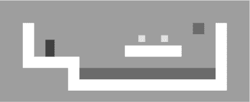
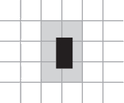
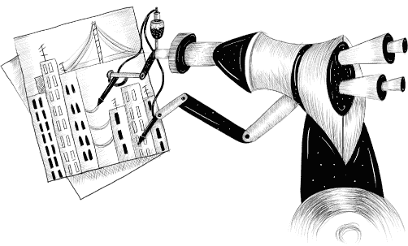

# 第十七章：项目：一个平台游戏

我最初对计算机的迷恋，如同许多宅男孩童一样，源于电脑游戏。我被那些我可以操控的小型模拟世界吸引，故事（某种程度上）在其中展开——我想，这更多是因为我将想象投射到这些世界中，而不是因为它们实际提供的可能性。

我不希望任何人走上游戏编程的职业道路。与音乐产业一样，渴望从事这一行业的年轻人数量与实际需求之间的差异，创造了一个相当不健康的环境。但为了乐趣而编写游戏是令人愉快的。

本章将介绍一个小型平台游戏的实现。平台游戏（或称“跳跃跑动”游戏）是指玩家需要在一个通常为二维且从侧面观看的世界中移动角色，同时跳跃越过或登上物体的游戏。

### 游戏

我们的游戏将大致基于托马斯·帕雷夫的《深蓝》 (`*[www.lessmilk.com/dark-blue/](https://www.lessmilk.com/dark-blue/)*`)。我选择这个游戏是因为它既有趣又简约，并且可以在不需要过多代码的情况下构建。它的样子如下：

``

黑色方框代表玩家，其任务是在避开红色物体（熔岩）的同时收集黄色方框（硬币）。当所有硬币被收集后，关卡就完成了。

玩家可以使用左箭头和右箭头键走动，并可以用上箭头键跳跃。跳跃是这个游戏角色的特长。它可以达到自身高度的几倍，并且可以在空中改变方向。这可能并不完全现实，但它帮助玩家感受到对屏幕上角色的直接控制。

游戏由一个静态背景构成，背景呈网格布局，移动元素叠加在该背景上。网格上的每个格子要么是空的，要么是固体，要么是熔岩。移动元素包括玩家、硬币和某些熔岩块。这些元素的位置不受网格的限制——它们的坐标可以是小数，从而实现平滑的移动。

### 技术

我们将使用浏览器的`DOM`来显示游戏，并通过处理键盘事件来读取用户输入。

与屏幕和键盘相关的代码只是我们构建这个游戏所需工作的一小部分。由于一切看起来像是彩色方框，因此绘制非常简单：我们创建`DOM`元素，并使用样式为它们设置背景色、大小和位置。

我们可以将背景表示为一个表格，因为它是一个不变的方格网。可以使用绝对定位的元素叠加自由移动的元素。

在需要动画图形并对用户输入做出快速响应的游戏和其他程序中，效率非常重要。尽管`DOM`最初并不是为了高性能图形设计的，但它在这方面实际上表现得比你想象的要好。你在第十四章中看到了某些动画。在现代计算机上，即使我们不太关心优化，这样简单的游戏运行也很好。

在下一章中，我们将探索另一种浏览器技术，`<canvas>`标签，它提供了一种更传统的绘制图形的方式，以形状和像素为单位，而不是`DOM`元素。

### 级别

我们希望有一种人类可读且可编辑的方式来指定级别。由于一切都可以从网格开始，我们可以使用大字符串，其中每个字符表示一个元素——要么是背景网格的一部分，要么是移动元素。

小级别的计划可能看起来是这样的：

```js
let simpleLevelPlan = `
......................
..#................#..
..#..............=.#..
..#.........o.o....#..
..#.@......#####...#..
..#####............#..
......#++++++++++++#..
......##############..
......................`;
```

句号表示空白，井号 (`#`) 字符表示墙，加号表示熔岩。玩家的起始位置是`@`符号。每个`O`字符是一个金币，而顶部的等号 (`=`) 是一个水平往返移动的熔岩块。

我们将支持两种额外类型的移动熔岩：管道字符 (`|`) 创建垂直移动的水滴，`v`表示`*滴落*`熔岩——垂直移动的熔岩，它不会前后弹跳，而是仅向下移动，当它碰到地面时跳回起始位置。

整个游戏由多个级别组成，玩家必须完成这些级别。当所有金币都被收集时，级别即被视为完成。如果玩家碰到熔岩，当前级别将恢复到其起始位置，玩家可以重新尝试。

### 读取级别

以下类存储一个级别对象。它的参数应该是定义级别的字符串。

```js
class Level {
  constructor(plan) {
    let rows = plan.trim().split("\n").map(l => [...l]);
    this.height = rows.length;
    this.width = rows[0].length;
    this.startActors = [];

 this.rows = rows.map((row, y) => {
      return row.map((ch, x) => {
        let type = levelChars[ch];
        if (typeof type != "string") {
          let pos = new Vec(x, y);
          this.startActors.push(type.create(pos, ch));
          type = "empty";
        }
        return type;
      });
    });
  }
}
```

`trim`方法用于去除计划字符串开头和结尾的空白。这允许我们的示例计划以换行符开头，以便所有行直接相互对齐。剩余的字符串在换行符上进行分割，每一行被展开成一个数组，从而生成字符数组。

所以行保存了一个字符的数组数组，即计划的行。我们可以从中推导出级别的宽度和高度。但我们仍然需要将移动元素与背景网格分开。我们将移动元素称为`*演员*`。它们将存储在一个对象数组中。背景将是一个字符串的数组数组，包含“空”、“墙”或“熔岩”等字段类型。

要创建这些数组，我们需要遍历行，然后遍历它们的内容。记住，`map`会将数组索引作为第二个参数传递给映射函数，这样我们就能知道给定字符的`x`和`y`坐标。游戏中的位置将以坐标对的形式存储，左上角为`(0, 0)`，每个背景方块的高宽均为1个单位。

为了解释计划中的字符，`Level`构造函数使用`levelChars`对象，该对象为每个在关卡描述中使用的字符存储一个字符串（如果是背景类型）和一个类（如果生成一个演员）。当类型是演员类时，它的静态`create`方法用于创建一个对象，该对象被添加到`startActors`中，映射函数为这个背景方块返回“空”。

演员的位置存储为一个```Vec```对象。这是一个二维向量，一个具有```x```和```y```属性的对象，如第六章的练习中所示。

随着游戏的进行，演员将最终出现在不同的位置，甚至完全消失（如硬币被收集时）。我们将使用一个```State```类来跟踪正在运行的游戏的状态。

```js
class State {
  constructor(level, actors, status) {
    this.level = level;
    this.actors = actors;
    this.status = status;
  }
 static start(level) {
    return new State(level, level.startActors, "playing");
  }

  get player() {
    return this.actors.find(a => a.type == "player");
  }
}
```

当游戏结束时，```status```属性将切换为“lost”或“won”。

这再次是一个持久的数据结构——更新游戏状态会创建一个新状态并保持旧状态不变。

### 演员

演员对象表示我们游戏中给定移动元素（玩家、硬币或流动熔岩）的当前位置和状态。所有演员对象遵循相同的接口。它们具有```size```和```pos```属性，分别保存表示该演员的矩形的大小和左上角的坐标，以及一个更新方法。

这种更新方法用于计算在给定时间步长后它们的新状态和位置。它模拟了演员所做的事情——根据玩家的箭头键移动，以及熔岩的来回反弹——并返回一个新的、更新的演员对象。

```type```属性包含一个字符串，用于识别演员的类型——“player”、“coin”或“lava”。这在绘制游戏时非常有用——为演员绘制的矩形的外观基于其类型。

演员类具有一个静态```create```方法，由```Level```构造函数用于从关卡计划中的字符创建演员。它接收字符的坐标和字符本身，这是必要的，因为```Lava```类处理多种不同的字符。

这是我们将用于二维值的```Vec```类，例如演员的位置和大小。

```js
class Vec {
  constructor(x, y) {
    this.x = x; this.y = y;
  }
  plus(other) {
    return new Vec(this.x + other.x, this.y + other.y);
  }
  times(factor) {
    return new Vec(this.x * factor, this.y * factor);
  }
}
```

```times```方法通过给定的数字缩放向量。当我们需要将速度向量乘以时间间隔以获得在该时间内行驶的距离时，它将非常有用。

不同类型的演员拥有各自的类，因为它们的行为非常不同。让我们定义这些类。稍后我们将介绍它们的更新方法。

玩家类具有一个```speed```属性，用于存储其当前速度，以模拟动量和重力。

```js
class Player {
  constructor(pos, speed) {
    this.pos = pos;
    this.speed = speed;
  }

  get type() { return "player"; }

  static create(pos) {
    return new Player(pos.plus(new Vec(0, -0.5)),
                      new Vec(0, 0));
  }
}

Player.prototype.size = new Vec(0.8, 1.5);
```

由于玩家的高度为一个半方块，因此其初始位置设置为在```@```字符出现的位置上方半个方块。这样，它的底部与出现的方块底部对齐。

```size```属性对于所有```Player```的实例都是相同的，因此我们将其存储在原型上而不是实例本身。我们可以像```type```一样使用getter，但这样做会每次读取属性时创建并返回一个新的```Vec```对象，这是浪费的。（字符串是不可变的，因此不必每次评估时重新创建它们。）

在构建熔岩角色时，我们需要根据其基础字符的不同进行对象的初始化。动态熔岩以当前速度移动，直到碰到障碍物为止。在那一点上，如果它有一个重置属性，它将跳回起始位置（滴落）。如果没有，它将反转速度并沿另一方向继续移动（弹跳）。

```create```方法检查```Level```构造函数传递的字符，并创建相应的熔岩角色。

```js
class Lava {
  constructor(pos, speed, reset) {
    this.pos = pos;
    this.speed = speed;
    this.reset = reset;
  }

 get type() { return "lava"; }

  static create(pos, ch) {
    if (ch == "=") {
      return new Lava(pos, new Vec(2, 0));
    } else if (ch == "|") {
      return new Lava(pos, new Vec(0, 2));
    } else if (ch == "v") {
      return new Lava(pos, new Vec(0, 3), pos);
    }
  }
}

Lava.prototype.size = new Vec(1, 1);
```

硬币角色相对简单。它们大多数时间只是呆在原地。但为了稍微活跃一下游戏，它们被赋予了“摇晃”，即轻微的垂直来回运动。为了跟踪这一点，硬币对象存储了一个基础位置以及一个追踪弹跳运动相位的```wobble```属性。这些属性共同决定了硬币的实际位置（存储在```pos```属性中）。

```js
class Coin {
  constructor(pos, basePos, wobble) {
    this.pos = pos;
    this.basePos = basePos;
    this.wobble = wobble;
  }

  get type() { return "coin"; }

  static create(pos) {
    let basePos = pos.plus(new Vec(0.2, 0.1));
    return new Coin(basePos, basePos,
                    Math.random() * Math.PI * 2);
  }
}

Coin.prototype.size = new Vec(0.6, 0.6);
```

在第十四章中，我们看到```Math.sin```给出了圆上点的```y```坐标。随着我们沿着圆移动，该坐标在一个平滑的波形中来回移动，这使得正弦函数在建模波动运动时非常有用。

为了避免所有硬币同步上下移动的情况，每个硬币的起始相位被随机化。```Math.sin```波的周期，即它产生的波的宽度，是```2*π*```。我们将```Math.random```返回的值乘以该数字，以在波上为硬币赋予一个随机的起始位置。

我们现在可以定义```levelChars```对象，将平面字符映射到背景网格类型或角色类别。

```js
const levelChars = {
  ".": "empty", "#": "wall", "+": "lava",
  "@": Player, "o": Coin,
  "=": Lava, "|": Lava, "v": Lava
};
```

这给了我们创建```Level```实例所需的所有部分。

```js
let simpleLevel = new Level(simpleLevelPlan);
console.log(`${simpleLevel.width} by ${simpleLevel.height}`);
// → 22 by 9
```

接下来的任务是在屏幕上显示这些关卡，并在其中模拟时间和运动。

### 绘制

在下一章中，我们将以不同的方式显示同一款游戏。为了实现这一点，我们将绘图逻辑放在一个接口后面，并将其作为参数传递给游戏。这样，我们可以用不同的新显示模块来使用同一个游戏程序。

游戏显示对象绘制给定的关卡和状态。我们将其构造函数传递给游戏以允许替换它。我们在本章中定义的显示类称为```DOMDisplay```，因为它使用DOM元素来显示关卡。

我们将使用样式表来设置组成游戏的元素的实际颜色和其他固定属性。当创建它们时，也可以直接赋值给元素的```style```属性，但这会产生更冗长的程序。

下面的辅助函数提供了一种简洁的方法来创建一个元素，并为其添加一些属性和子节点：

```js
function elt(name, attrs, ...children) {
  let dom = document.createElement(name);
  for (let attr of Object.keys(attrs)) {
    dom.setAttribute(attr, attrs[attr]);
  }
  for (let child of children) {
    dom.appendChild(child);
  }
  return dom;
}
```

显示元素是通过给它一个父元素来创建的，应该将其附加到该父元素上，并传入一个级别对象。

```js
class DOMDisplay {
  constructor(parent, level) {
    this.dom = elt("div", {class: "game"}, drawGrid(level));
    this.actorLayer = null;
    parent.appendChild(this.dom);
  }

  clear() { this.dom.remove(); }
}
```

级别的背景网格是一次绘制的，并且不会改变。演员在每次更新显示时都会被重新绘制，更新时会给定状态。```actorLayer```属性将用于跟踪持有演员的元素，以便能够轻松地移除和替换它们。

我们的坐标和大小以网格单位进行追踪，其中1的大小或距离表示一个网格块。在设置像素大小时，我们必须将这些坐标放大——在每个方块只有一个像素的情况下，游戏中的一切都会显得极其微小。比例常数表示一个单位在屏幕上占用的像素数。

```js
const scale = 20;

function drawGrid(level) {
  return elt("table", {
    class: "background",
    style: `width: ${level.width * scale}px`
  }, ...level.rows.map(row =>
    elt("tr", {style: `height: ${scale}px`},
        ...row.map(type => elt("td", {class: type})))
  ));
}
```

`<table>`元素的形式与级别的行属性结构相对应——网格的每一行都被转化为表格行（`<tr>`元素）。网格中的字符串用作表格单元格（`<td>`元素）的类名。代码使用扩展（三个点）操作符将子节点数组作为单独的参数传递给`elt`。

以下CSS使表格看起来像我们想要的背景：

```js
.background    { background: rgb(52, 166, 251);
                 table-layout: fixed;
                 border-spacing: 0;              }
.background td { padding: 0;                     }
.lava          { background: rgb(255, 100, 100); }
.wall          { background: white;              }
```

其中一些（`table-layout`、`border-spacing`和`padding`）用于抑制不必要的默认行为。我们不希望表格的布局依赖于单元格的内容，也不希望单元格之间或内部有空间。

背景规则设置背景颜色。CSS允许颜色以单词（例如：白色）或使用格式如`rgb(*R*, *G*, *B*)`来指定，其中红、绿和蓝的颜色分量被分为从0到255的三个数字。在`rgb(52, 166, 251)`中，红色分量是52，绿色是166，蓝色是251。由于蓝色分量最大，结果颜色将偏蓝。在`.lava`规则中，第一个数字（红色）是最大的。

我们通过为每个演员创建一个DOM元素，并根据演员的属性设置该元素的位置和大小来绘制每个演员。数值必须乘以比例，以从游戏单位转换为像素。

```js
function drawActors(actors) {
  return elt("div", {}, ...actors.map(actor => {
    let rect = elt("div", {class: `actor ${actor.type}`});
    rect.style.width = `${actor.size.x * scale}px`;
    rect.style.height = `${actor.size.y * scale}px`;
    rect.style.left = `${actor.pos.x * scale}px`;
    rect.style.top = `${actor.pos.y * scale}px`;
    return rect;
  }));
}
```

要给一个元素添加多个类名，我们用空格分隔类名。在以下CSS代码中，`actor`类为演员提供了绝对位置。它们的类型名称作为额外的类来给它们上色。我们不需要重新定义`lava`类，因为我们在之前定义的`lava`网格方块中重用了该类。

```js
.actor  { position: absolute;            }
.coin   { background: rgb(241, 229, 89); }
.player { background: rgb(64, 64, 64);   }
```

`syncState`方法用于使显示显示给定状态。它首先移除旧的演员图形（如果有的话），然后在新位置重新绘制演员。尽管尝试重用演员的DOM元素可能很诱人，但为了使其工作，我们需要大量额外的管理，以将演员与DOM元素关联，并确保在演员消失时移除元素。由于游戏中通常只有少数演员，重新绘制它们并不昂贵。

```js
DOMDisplay.prototype.syncState = function(state) {
  if (this.actorLayer) this.actorLayer.remove();
  this.actorLayer = drawActors(state.actors);
  this.dom.appendChild(this.actorLayer);
  this.dom.className = `game ${state.status}`;
  this.scrollPlayerIntoView(state);
};
```

通过将当前级别的状态作为类名添加到包装器中，当游戏获胜或失败时，我们可以稍微不同地为玩家角色设置样式，添加一个仅在玩家具有特定类的祖先元素时生效的CSS规则。

```js
.lost .player {
  background: rgb(160, 64, 64);
}
.won .player {
  box-shadow: -4px -7px 8px white, 4px -7px 8px white;
}
```

在接触熔岩后，玩家变成深红色，暗示着灼烧。当最后一枚硬币被收集后，我们添加两个模糊的白色阴影——一个在左上方，一个在右上方——以创建白色光环效果。

我们不能假设级别总是适合`视口`，即我们绘制游戏的元素。这就是我们需要`scrollPlayerIntoView`调用的原因：它确保如果级别超出视口，我们会滚动视口，以确保玩家位于其中心附近。以下CSS为游戏的包装DOM元素设置了最大大小，并确保任何超出元素框的部分不可见。我们还为其设置了相对位置，以便其中的角色相对于级别的左上角进行定位。

```js
.game {
  overflow: hidden;
  max-width: 600px;
  max-height: 450px;
  position: relative;
}
```

在`scrollPlayerIntoView`方法中，我们找到播放器的位置并更新包装元素的滚动位置。当播放器太靠近边缘时，我们通过操作该元素的`scrollLeft`和`scrollTop`属性来改变滚动位置。

```js
DOMDisplay.prototype.scrollPlayerIntoView = function(state) {
  let width = this.dom.clientWidth;
  let height = this.dom.clientHeight;
  let margin = width / 3;

  // The viewport
  let left = this.dom.scrollLeft, right = left + width;
  let top = this.dom.scrollTop, bottom = top + height;

  let player = state.player;
  let center = player.pos.plus(player.size.times(0.5))
                         .times(scale);
 if (center.x < left + margin) {
    this.dom.scrollLeft = center.x - margin;
  } else if (center.x > right - margin) {
    this.dom.scrollLeft = center.x + margin - width;
  }
  if (center.y < top + margin) {
    this.dom.scrollTop = center.y - margin;
  } else if (center.y > bottom - margin) {
    this.dom.scrollTop = center.y + margin - height;
  }
};
```

玩家中心的寻找方式展示了我们的`Vec`类型上的方法如何允许以相对可读的方式编写与对象的计算。要找到角色的中心，我们将其位置（左上角）和其大小的一半相加。那是在级别坐标中的中心，但我们需要它在像素坐标中，因此我们接着将结果向量乘以我们的显示比例。

接下来，一系列检查验证玩家的位置是否在允许范围内。请注意，有时这会设置低于零或超出元素可滚动区域的无意义滚动坐标。这是可以的——DOM会将它们限制在可接受的值。将`scrollLeft`设置为-10会使其变为0。

虽然始终尝试将玩家滚动到视口中心会稍微简单一些，但这会产生一种相当刺耳的效果。当你跳跃时，视图会不断上下移动。在屏幕中间有一个“中立”区域，可以在不引起任何滚动的情况下自由移动，会更加愉快。

我们现在能够显示我们的微小级别。

```js
<link rel="stylesheet" href="css/game.css">

<script>
  let simpleLevel = new Level(simpleLevelPlan);
  let display = new DOMDisplay(document.body, simpleLevel);
  display.syncState(State.start(simpleLevel));
</script>
```



当使用`rel="stylesheet"`的`<link>`标签时，它是一种将CSS文件加载到页面中的方式。文件`game.css`包含我们游戏所需的样式。

### 运动与碰撞

现在我们可以开始添加运动了。大多数这类游戏采用的基本方法是将时间分割成小步，并在每一步中，根据速度与时间步长的乘积移动角色。我们将时间以秒为单位进行测量，因此速度以每秒的单位表示。

移动物体是简单的。困难的部分是处理元素之间的相互作用。当玩家撞到墙壁或地板时，他们不应该简单地穿过它。游戏必须注意到某个运动导致一个物体撞上另一个物体，并作出相应反应。对于墙壁，运动必须被停止。当撞到硬币时，必须收集该硬币。当触碰到岩浆时，游戏应该结束。

解决一般情况是一个重大任务。你可以找到通常称为`物理引擎`的库，它们模拟二维或三维物体之间的交互。在这一章中，我们将采取更为谦逊的方法，仅处理矩形物体之间的碰撞，并以相对简单的方式处理它们。

在移动玩家或一块岩浆之前，我们测试运动是否会使其进入墙内。如果是这样，我们就简单地取消整个运动。对这种碰撞的反应取决于参与者的类型——玩家会停止，而岩浆块则会反弹。

这种方法要求我们的时间步长相对较小，因为这会导致运动在物体实际接触之前停止。如果时间步长（因此运动步长）过大，玩家将会悬浮在离地面明显的高度。另一种更复杂的、更好的方法是找到确切的碰撞点并移动到那里。我们将采取简单的方法，并通过确保动画以小步推进来掩盖其问题。

该方法告诉我们一个矩形（由位置和大小指定）是否接触到给定类型的网格元素。

```js
Level.prototype.touches = function(pos, size, type) {
  let xStart = Math.floor(pos.x);
  let xEnd = Math.ceil(pos.x + size.x);
  let yStart = Math.floor(pos.y);
  let yEnd = Math.ceil(pos.y + size.y);

  for (let y = yStart; y < yEnd; y++) {
    for (let x = xStart; x < xEnd; x++) {
      let isOutside = x < 0 || x >= this.width ||
                      y < 0 || y >= this.height;
      let here = isOutside ? "wall" : this.rows[y][x];
      if (here == type) return true;
    }
  }
  return false;
};
```

该方法通过对物体的坐标使用`Math.floor`和`Math.ceil`来计算物体重叠的网格方块集合。请记住，网格方块的大小为 1 x 1 单位。通过将盒子的边缘向上和向下取整，我们得到盒子接触的背景方块范围。



我们遍历通过四舍五入坐标找到的网格方块，当找到匹配的方块时返回`true`。关卡外的方块总是被视为“墙”，以确保玩家无法离开世界，并且我们不会意外尝试读取超出行数组边界的内容。

状态更新方法使用接触来判断玩家是否接触到熔岩。

```js
State.prototype.update = function(time, keys) {
  let actors = this.actors
    .map(actor => actor.update(time, this, keys));
  let newState = new State(this.level, actors, this.status);

  if (newState.status != "playing") return newState;

  let player = newState.player;
  if (this.level.touches(player.pos, player.size, "lava")) {
    return new State(this.level, actors, "lost");
  }

  for (let actor of actors) {
    if (actor != player && overlap(actor, player)) {
      newState = actor.collide(newState);
    }
  }
  return newState;
};
```

方法接收一个时间步长和一个数据结构，告知它哪些按键被按下。它首先在所有参与者上调用更新方法，生成一个更新后的参与者数组。参与者还会获得时间步长、按键和状态，以便它们可以基于这些信息进行更新。只有玩家会实际读取按键，因为只有玩家是由键盘控制的参与者。

如果游戏已经结束，则不需要进一步处理（游戏在失败后无法获胜，反之亦然）。否则，该方法会测试玩家是否接触到背景熔岩。如果是，游戏就失败了，我们结束了。最后，如果游戏确实仍在进行中，它会检查是否有其他角色与玩家重叠。

通过重叠函数检测角色之间的重叠。它接受两个角色对象，当它们相碰时返回真——这发生在它们在 x 轴和 y 轴上都重叠时。

```js
function overlap(actor1, actor2) {
  return actor1.pos.x + actor1.size.x > actor2.pos.x &&
         actor1.pos.x < actor2.pos.x + actor2.size.x &&
         actor1.pos.y + actor1.size.y > actor2.pos.y &&
         actor1.pos.y < actor2.pos.y + actor2.size.y;
}
```

如果任何角色发生重叠，其碰撞方法有机会更新状态。接触熔岩角色会将游戏状态设置为“失败”。当你触碰到硬币时，它们会消失，并在它们是关卡的最后一枚硬币时将状态设置为“胜利”。

```js
Lava.prototype.collide = function(state) {
  return new State(state.level, state.actors, "lost");
};

Coin.prototype.collide = function(state) {
  let filtered = state.actors.filter(a => a != this);
  let status = state.status;
  if (!filtered.some(a => a.type == "coin")) status = "won";
  return new State(state.level, filtered, status);
};
```

### 角色更新

角色对象的更新方法接受时间步长、状态对象和键对象作为参数。熔岩角色类型的更新方法会忽略键对象。

```js
Lava.prototype.update = function(time, state) {
  let newPos = this.pos.plus(this.speed.times(time));
  if (!state.level.touches(newPos, this.size, "wall")) {
    return new Lava(newPos, this.speed, this.reset);
  } else if (this.reset) {
    return new Lava(this.reset, this.speed, this.reset);
  } else {
    return new Lava(this.pos, this.speed.times(-1));
  }
};
```

这个更新方法通过将时间步长与当前速度的乘积添加到其旧位置来计算新位置。如果没有障碍物阻挡新位置，它将移动到那里。如果有障碍物，行为将取决于熔岩块的类型——滴落的熔岩有一个重置位置，当它碰到某物时会跳回到该位置。反弹的熔岩通过将速度乘以`-1`来反转速度，使其开始朝相反的方向移动。

硬币使用其更新方法进行摇晃。它们忽略与网格的碰撞，因为它们只是摇晃在自己方块内。

```js
const wobbleSpeed = 8, wobbleDist = 0.07;

Coin.prototype.update = function(time) {
  let wobble = this.wobble + time * wobbleSpeed;
  let wobblePos = Math.sin(wobble) * wobbleDist;
  return new Coin(this.basePos.plus(new Vec(0, wobblePos)),
                  this.basePos, wobble);
};
```

摇晃属性会递增以跟踪时间，然后用作`Math.sin`的参数，以找到波上的新位置。硬币的当前位置则根据其基础位置和基于此波的偏移量进行计算。

这就涉及到玩家本身。玩家的运动在每个轴上单独处理，因为碰到地面不应该阻止水平运动，而碰到墙壁不应该停止下落或跳跃运动。

```js
const playerXSpeed = 7;
const gravity = 30;
const jumpSpeed = 17;

Player.prototype.update = function(time, state, keys) {
  let xSpeed = 0;
  if (keys.ArrowLeft) xSpeed -= playerXSpeed;
  if (keys.ArrowRight) xSpeed += playerXSpeed;
  let pos = this.pos;
  let movedX = pos.plus(new Vec(xSpeed * time, 0));
  if (!state.level.touches(movedX, this.size, "wall")) {
    pos = movedX;
  }

  let ySpeed = this.speed.y + time * gravity;
  let movedY = pos.plus(new Vec(0, ySpeed * time));
  if (!state.level.touches(movedY, this.size, "wall")) {
    pos = movedY;
  } else if (keys.ArrowUp && ySpeed > 0) {
    ySpeed = -jumpSpeed;
  } else {
    ySpeed = 0;
 }
  return new Player(pos, new Vec(xSpeed, ySpeed));
};
```

水平运动是基于左箭头和右箭头键的状态进行计算的。当没有墙壁阻挡这个运动所创造的新位置时，就使用这个新位置。否则，保持旧位置不变。

垂直运动以类似的方式工作，但必须模拟跳跃和重力。玩家的垂直速度（`ySpeed`）首先会被加速，以考虑重力的影响。

我们再次检查墙壁。如果没有碰到任何墙，新位置将被使用。如果`有`墙壁，则有两种可能的结果。当上箭头被按下`并且`我们正在向下移动（这意味着我们碰到的东西在我们下面），速度会被设置为相对较大的负值。这会导致玩家跳跃。如果情况不是这样，玩家只是碰到了什么东西，速度则被设置为零。

游戏中的重力强度、跳跃速度和其他常量是通过尝试一些数字并观察哪种感觉合适来确定的。你可以尝试进行实验。

### 追踪键

对于这样的游戏，我们不希望键在每次按下时只生效一次。相反，我们希望它们的效果（移动玩家角色）在按住时保持有效。

我们需要设置一个键处理程序，存储左、右和上箭头键的当前状态。我们还希望对这些键调用`preventDefault`，以防止它们滚动页面。

以下函数在给定一个键名数组时，将返回一个跟踪这些键当前状态的对象。它为`keydown`和`keyup`事件注册事件处理程序，并在事件中的键代码存在于它所跟踪的代码集中时，更新该对象。

```js
function trackKeys(keys) {
  let down = Object.create(null);
  function track(event) {
    if (keys.includes(event.key)) {
      down[event.key] = event.type == "keydown";
      event.preventDefault();
    }
  }
  window.addEventListener("keydown", track);
  window.addEventListener("keyup", track);
  return down;
}

const arrowKeys =
  trackKeys(["ArrowLeft", "ArrowRight", "ArrowUp"]);
```

同一个处理程序函数用于这两种事件类型。它查看事件对象的`type`属性，以确定键状态是应该更新为`true`（`keydown`）还是`false`（`keyup`）。

### 运行游戏

`requestAnimationFrame`函数，如我们在第十四章中看到的，提供了一种很好的方式来动画游戏。但它的接口相当原始——使用它需要我们跟踪上一次调用函数的时间，并在每一帧之后再次调用`requestAnimationFrame`。

让我们定义一个助手函数，将这些内容封装在一个方便的接口中，并允许我们简单地调用`runAnimation`，传入一个期望时间差作为参数并绘制单帧。当帧函数返回`false`时，动画停止。

```js
function runAnimation(frameFunc) {
  let lastTime = null;
  function frame(time) {
    if (lastTime != null) {
      let timeStep = Math.min(time - lastTime, 100) / 1000;
      if (frameFunc(timeStep) === false) return;
    }
    lastTime = time;
    requestAnimationFrame(frame);
  }
  requestAnimationFrame(frame);
}
```

我将最大帧步长设置为`100`毫秒（十分之一秒）。当带有我们页面的浏览器标签或窗口被隐藏时，`requestAnimationFrame`调用将被暂停，直到标签或窗口再次显示。在这种情况下，`lastTime`和`time`之间的差值将是页面被隐藏的整个时间。一次性将游戏推进如此之多看起来会很傻，并可能导致奇怪的副作用，例如玩家掉落到地面下。

该函数还将时间步长转换为秒，这比毫秒更容易理解。

`runLevel`函数接受一个`Level`对象和一个显示构造函数，并返回一个`Promise`。它在`document.body`中显示关卡，并让用户进行游戏。当关卡结束（失败或胜利）时，`runLevel`等待一秒钟（让用户看到发生了什么），然后清除显示，停止动画，并将`Promise`解析为游戏的结束状态。

```js
function runLevel(level, Display) {
  let display = new Display(document.body, level);
  let state = State.start(level);
  let ending = 1;
  return new Promise(resolve => {
 runAnimation(time => {
      state = state.update(time, arrowKeys);
      display.syncState(state);
      if (state.status == "playing") {
        return true;
      } else if (ending > 0) {
        ending -= time;
        return true;
      } else {
        display.clear();
        resolve(state.status);
        return false;
      }
    });
  });
}
```

游戏是一个关卡的序列。每当玩家死亡时，当前关卡会重启。当一个关卡完成时，我们会进入下一个关卡。这可以通过以下函数表达，该函数接受一个关卡计划（字符串）数组和一个显示构造函数：

```js
async function runGame(plans, Display) {
  for (let level = 0; level < plans.length;) {
    let status = await runLevel(new Level(plans[level]),
                                Display);
    if (status == "won") level++;
  }
  console.log("You've won!");
}
```

因为我们让`runLevel`返回一个`Promise`，`runGame`可以使用`async`函数来编写，如在第十一章中所示。它返回另一个`Promise`，当玩家完成游戏时会被解析。

本章沙盒中的`GAME_LEVELS`绑定提供了一组关卡计划（`[eloquentjavascript.net/code#16](https://eloquentjavascript.net/code#16)`）。该页面将它们传递给`runGame`，启动实际的游戏。

```js
<link rel="stylesheet" href="css/game.css">

<body>
  <script>
    runGame(GAME_LEVELS, DOMDisplay);
  </script>
</body>
```

### 练习

#### `游戏结束`

平台游戏通常让玩家从有限的`生命`开始，每次死亡时减去一条生命。当玩家没有生命时，游戏从头开始。

调整`runGame`来实现生命值。让玩家从三条生命开始。每当关卡开始时，输出当前的生命值（使用`console.log`）。

#### `暂停游戏`

通过按`ESC`键使游戏能够暂停（挂起）和恢复。你可以通过更改`runLevel`函数来设置一个键盘事件处理程序，当按下`ESC`时中断或恢复动画。

`runAnimation`接口乍一看可能不适合这个，但如果你重新安排`runLevel`调用它的方式，它就适合了。

当你完成这个后，还有其他可以尝试的事情。我们注册键盘事件处理程序的方式有些问题。`arrowKeys`对象当前是一个全局绑定，即使没有游戏在运行，其事件处理程序也会被保留。你可以说它们在我们的系统中`泄漏`了。扩展`trackKeys`提供一种注销其处理程序的方法，然后更改`runLevel`以在开始时注册其处理程序，在结束时注销它们。

#### `一个怪物`

对于平台游戏来说，传统上有敌人可以通过从上方跳跃来击败。这个练习要求你将这样的角色类型添加到游戏中。

我们称这个角色为怪物。怪物只能水平移动。你可以让它们朝玩家的方向移动，像水平熔岩一样来回反弹，或者采用你想要的任何其他移动模式。这个类不需要处理下落，但应该确保怪物不会穿过墙壁。

当怪物触碰到玩家时，效果取决于玩家是否在它们的上方跳跃。你可以通过检查玩家的底部是否靠近怪物的顶部来近似判断。如果是这种情况，怪物就会消失。如果不是，游戏就结束了。

`绘画是一种欺骗。`

—M.C. 艾舍，由布鲁诺·恩斯特在`M.C. 艾舍的魔镜`中引用


