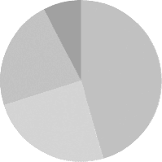

# 第十八章：在`画布`上绘图

浏览器为我们提供了几种显示图形的方式。最简单的方法是使用样式来定位和着色常规`DOM`元素。正如上一章中的游戏所示，这可以使我们走得很远。通过向节点添加部分透明的背景图像，我们可以使它们看起来完全符合我们的要求。甚至可以使用变换样式来旋转或倾斜节点。

但是我们将使用`DOM`做一些它最初并未设计的事情。有些任务，例如在任意点之间绘制一条线，使用常规`HTML`元素来完成非常笨拙。

有两种选择。第一种是基于`DOM`，但使用`可缩放矢量图形（SVG）`而不是`HTML`。可以将`SVG`视为一种文档标记方言，专注于形状而非文本。您可以直接在`HTML`文档中嵌入`SVG`文档，或使用``标签将其包含。

第二种选择被称为`画布`。`画布`是一个单一的`DOM`元素，用于封装一幅图像。它提供了一个编程接口，可以在节点占用的空间上绘制形状。`画布`和`SVG`图像之间的主要区别在于，在`SVG`中，形状的原始描述被保留，因此可以随时移动或调整大小。而`画布`则在绘制形状后立即将其转换为像素（光栅上的彩色点），并不记住这些像素代表什么。要在`画布`上移动一个形状，唯一的方法是清空`画布`（或清空形状周围的`画布`部分），然后在新的位置重新绘制该形状。

### `SVG`

本书不会详细讲解`SVG`，但我会简要说明它的工作原理。在本章结束时，我会回到在决定适合特定应用程序的绘图机制时必须考虑的权衡。

这是一个包含简单`SVG`图像的`HTML`文档：

```js
<p>Normal HTML here.</p>
<svg >
  <circle r="50" cx="50" cy="50" fill="red"/>
  <rect x="120" y="5" width="90" height="90"
        stroke="blue" fill="none"/>
</svg>
```

`xmlns`属性将元素（及其子元素）更改为不同的`XML 命名空间`。这个由`URL`标识的命名空间指定了我们当前所使用的方言。`<circle>`和`<rect>`标签在`HTML`中不存在，但在`SVG`中具有意义——它们使用其属性指定的样式和位置绘制形状。

文档的显示效果如下：


这些标签创建了`DOM`元素，就像`HTML`标签一样，脚本可以与之互动。例如，这将`<circle>`元素的颜色改为青色：

```js
let circle = document.querySelector("circle");
circle.setAttribute("fill", "cyan");
```

### `画布`元素

`画布`图形可以绘制到`<canvas>`元素上。您可以为此类元素设置宽度和高度属性，以确定其在像素中的大小。

一个新的`画布`是空的，这意味着它完全透明，因此在文档中显示为空白区域。

`<canvas>`标签旨在允许不同的绘图样式。要访问实际的绘图接口，我们首先需要创建一个`上下文`，这是一个对象，其方法提供绘图接口。目前有三种广泛支持的绘图样式：“2d”用于二维图形，“webgl”通过`OpenGL`接口用于三维图形，以及“webgpu”，这是一个更现代和灵活的`WebGL`替代方案。

本书不会讨论`WebGL`或`WebGPU`——我们将专注于二维。不过，如果你对三维图形感兴趣，我鼓励你了解`WebGPU`。它提供了一个直接访问图形硬件的接口，并允许你高效地使用`JavaScript`渲染复杂场景。

你可以通过在`<canvas>` `DOM`元素上使用`getContext`方法创建一个`上下文`。

```js
<p>Before canvas.</p>
<canvas width="120" height="60"></canvas>
<p>After canvas.</p>
<script>
  let canvas = document.querySelector("canvas");
  let context = canvas.getContext("2d");
  context.fillStyle = "red";
  context.fillRect(10, 10, 100, 50);
</script>
```

创建`上下文`对象后，示例绘制了一个宽`100`像素、高`50`像素的红色矩形，其左上角的坐标为`(10, 10)`。


就像在`HTML`（和`SVG`）中一样，`画布`使用的坐标系统将`(0, 0)`放在左上角，正`y`轴从那里向下。这意味着`(10, 10)`位于左上角下方和右侧`10`像素，例如。

### `线条`和`表面`

在`画布`接口中，形状可以被`填充`，即其区域被赋予某种颜色或图案，或者可以被`描边`，即沿着其边缘绘制一条线。`SVG`使用相同的术语。

`fillRect`方法填充一个矩形。它首先接受矩形左上角的`x`和`y`坐标，然后是宽度，然后是高度。类似的方法`strokeRect`绘制矩形的轮廓。

这两种方法都不接受任何其他参数。填充的颜色、描边的粗细等，并不是通过方法的参数来确定的，正如你合理期望的那样，而是通过`上下文`对象的属性来确定的。

`fillStyle`属性控制形状的填充方式。它可以设置为指定颜色的字符串，使用`CSS`使用的颜色表示法。

`strokeStyle`属性类似地工作，但确定用于描边线的颜色。该线的宽度由`lineWidth`属性确定，`lineWidth`属性可以包含任何正数。

```js
<canvas></canvas>
<script>
  let cx = document.querySelector("canvas").getContext("2d");
  cx.strokeStyle = "blue";
  cx.strokeRect(5, 5, 50, 50);
  cx.lineWidth = 5;
  cx.strokeRect(135, 5, 50, 50);
</script>
```

这段代码绘制了两个蓝色的正方形，第二个正方形使用了更粗的线条。


当没有指定宽度或高度属性时，如示例所示，`画布`元素的默认宽度为`300`像素，高度为`150`像素。

### `路径`

`路径`是一系列线条。2D`画布`接口以一种特殊的方式描述这样的路径。它完全通过副作用来完成。路径不是可以存储和传递的值。相反，如果你想对路径执行某个操作，你需要通过一系列方法调用来描述它的形状。

```js
<canvas></canvas>
<script>
  let cx = document.querySelector("canvas").getContext("2d");
  cx.beginPath();
  for (let y = 10; y < 100; y += 10) {
    cx.moveTo(10, y);
    cx.lineTo(90, y);
  }
  cx.stroke();
</script>
```

该示例创建了一条包含多个水平线段的路径，然后使用`stroke`方法对其进行描边。每个使用`lineTo`创建的线段都从路径的`当前位置`开始。该位置通常是最后一个线段的末端，除非调用了`moveTo`。在这种情况下，下一条线段将从传递给`moveTo`的位置开始。

上一个程序描述的路径看起来像这样：


填充路径时（使用`fill`方法），每个形状都是单独填充的。一个路径可以包含多个形状——每个`moveTo`动作都开始一个新的形状。但路径在被填充之前需要是`闭合`的（意味着起点和终点在同一位置）。如果路径尚未闭合，将从其末尾添加一条线到起点，填充由完成路径围成的形状。

```js
<canvas></canvas>
<script>
  let cx = document.querySelector("canvas").getContext("2d");
  cx.beginPath();
  cx.moveTo(50, 10);
  cx.lineTo(10, 70);
  cx.lineTo(90, 70);
  cx.fill();
</script>
```

该示例绘制一个填充三角形。请注意，三角形的两条边是显式绘制的。第三条边，从右下角返回到顶部，是隐含的，如果你描边路径，它将不会存在。


你也可以使用`closePath`方法通过添加一条实际的线段返回路径的起点来显式闭合路径。当描边路径时，这条线段`会`被绘制。

### 曲线

一条路径也可以包含曲线。不幸的是，这些曲线的绘制稍微复杂一些。

`quadraticCurveTo`方法绘制一条到给定点的曲线。为了确定线的曲率，此方法需要一个控制点和一个目标点。想象这个控制点如同`吸引`线条，给予它曲线。线不会经过控制点，但起点和终点的方向会使得一条直线在该方向上指向控制点。以下示例说明了这一点：

```js
<canvas></canvas>
<script>
  let cx = document.querySelector("canvas").getContext("2d");
  cx.beginPath();
  cx.moveTo(10, 90);
  // control=(60,10) goal=(90,90)
  cx.quadraticCurveTo(60, 10, 90, 90);
  cx.lineTo(60, 10);
  cx.closePath();
  cx.stroke();
</script>
```

结果产生的路径看起来像这样：


我们从左到右绘制一条二次曲线，控制点为`(60, 10)`，然后绘制两条经过该控制点并返回到线段起点的线段。结果有些类似于`星际迷航`的徽章。你可以看到控制点的效果：从下角出发的线段最初朝着控制点的方向延伸，然后弯曲朝向目标。

`bezierCurveTo`方法绘制类似的曲线。与单一控制点不同，此方法有两个——分别对应于线段的两个端点。这里有一个类似的草图来说明这种曲线的行为：

```js
<canvas></canvas>
<script>
  let cx = document.querySelector("canvas").getContext("2d");
  cx.beginPath();
  cx.moveTo(10, 90);
  // control1=(10,10) control2=(90,10) goal=(50,90)
  cx.bezierCurveTo(10, 10, 90, 10, 50, 90);
  cx.lineTo(90, 10);
  cx.lineTo(10, 10);
  cx.closePath();
  cx.stroke();
</script>
```

两个控制点指定了曲线两端的方向。它们距离各自的点越远，曲线在那个方向的“膨胀”就越明显。


这样的曲线可能很难处理——并不总是清楚如何找到提供所需形状的控制点。有时你可以计算出它们，有时你只能通过反复试验找到合适的值。

`弧形`方法是一种沿圆边缘绘制曲线的线条。它需要一对弧心的坐标，一个半径，然后是起始角度和结束角度。

这两个最后的参数使得只绘制圆的一部分成为可能。角度以弧度为单位，而不是度数。这意味着完整圆的角度为`2*π`或`2 * Math.PI`，大约为`6.28`。角度从圆心右侧的点开始计数，然后顺时针方向进行。你可以使用`0`作为起始角度，并用大于`2*π`的结束角度（例如，`7`）来绘制一个完整的圆。

```js
<canvas></canvas>
<script>
  let cx = document.querySelector("canvas").getContext("2d");
  cx.beginPath();
  // center=(50,50) radius=40 angle=0 to 7
  cx.arc(50, 50, 40, 0, 7);
  // center=(150,50) radius=40 angle=0 to 1/2 pi
  cx.arc(150, 50, 40, 0, 0.5 * Math.PI);
  cx.stroke();
</script>
```

生成的图像从完整圆的右侧（第一次调用弧）到四分之一圆的右侧（第二次调用）。


像其他路径绘制方法一样，用弧绘制的线条与前一个路径段相连。你可以调用`moveTo`或开始新路径来避免这种情况。

### 绘制饼图

想象一下，你刚在`EconomiCorp, Inc.`找到了一份工作。你的第一个任务是绘制客户满意度调查结果的饼图。

结果绑定包含一个对象数组，代表调查响应。

```js
const results = [
  {name: "Satisfied", count: 1043, color: "lightblue"},
  {name: "Neutral", count: 563, color: "lightgreen"},
  {name: "Unsatisfied", count: 510, color: "pink"},
  {name: "No comment", count: 175, color: "silver"}
];
```

要绘制饼图，我们绘制多个饼切片，每个切片由一个弧和一对线段连接到该弧的中心。我们可以通过将完整圆（`2*π`）除以总响应数来计算每个弧占用的角度，然后将这个数字（每个响应的角度）乘以选择特定选项的人数。

```js
<canvas width="200" height="200"></canvas>
<script>
  let cx = document.querySelector("canvas").getContext("2d");
  let total = results.reduce((sum, {count}) => sum + count, 0);
  // Start at the top
  let currentAngle = -0.5 * Math.PI;
  for (let result of results) {
    let sliceAngle = (result.count / total) * 2 * Math.PI;
    cx.beginPath();
    // center=100,100, radius=100
    // From current angle, clockwise by slice's angle
    cx.arc(100, 100, 100,
           currentAngle, currentAngle + sliceAngle);
    currentAngle += sliceAngle;
    cx.lineTo(100, 100);
    cx.fillStyle = result.color;
    cx.fill();
  }
</script>
```

这将绘制以下图表：



但是一个没有说明切片含义的图表并没有太大帮助。我们需要一种在画布上绘制文本的方法。

### 文本

2D画布绘图上下文提供了`fillText`和`strokeText`方法。后者对于描边字母很有用，但通常你需要的是`fillText`。它将使用当前`fillStyle`填充给定文本的轮廓。

```js
<canvas></canvas>
<script>
  let cx = document.querySelector("canvas").getContext("2d");
  cx.font = "28px Georgia";
  cx.fillStyle = "fuchsia";
  cx.fillText("I can draw text, too!", 10, 50);
</script>
```

你可以通过`font`属性指定文本的大小、样式和字体。这个例子仅给出了字体大小和家族名称。也可以在字符串开头添加斜体或粗体以选择样式。

`fillText`和`strokeText`的最后两个参数提供了绘制字体的位置。默认情况下，它们表示文本字母基线的起始位置，这是一条字母“站立”的线，不计算字母中的悬挂部分，如`j`或`p`。你可以通过将`textAlign`属性设置为“end”或“center”来改变水平位置，通过将`textBaseline`设置为“top”、“middle”或“bottom”来改变垂直位置。

我们将在本章末尾的练习中回到我们的饼图，以及标记切片的问题。

### 图片

在计算机图形学中，通常区分`矢量`图形和`位图`图形。前者是我们在本章中所做的——通过给出形状的逻辑描述来指定图片。位图图形则不同，它不指定实际形状，而是处理像素数据（彩色点的光栅）。

`drawImage`方法允许我们将像素数据绘制到画布上。这些像素数据可以来自``元素或另一个画布。以下示例创建一个分离的``元素并将图像文件加载到其中。但此方法不能立即开始从该图片绘制，因为浏览器可能尚未加载它。为了解决这个问题，我们注册一个“load”事件处理程序，并在图像加载后进行绘制。

```js
<canvas></canvas>
<script>
  let cx = document.querySelector("canvas").getContext("2d");
  let img = document.createElement("img");
  img.src = "img/hat.png";
 img.addEventListener("load", () => {
    for (let x = 10; x < 200; x += 30) {
      cx.drawImage(img, x, 10);
    }
  });
</script>
```

默认情况下，`drawImage`会以其原始大小绘制图像。你还可以给它两个额外的参数，以指定绘制图像的宽度和高度，当它们与原始图像不同时。

当`drawImage`给出`九个`参数时，它可以用于仅绘制图像的一部分。第二到第五个参数指示源图像中应复制的矩形（`x`，`y`，宽度和高度），第六到第九个参数给出应复制到画布上的矩形。

这可以用于将多个`精灵`（图像元素）打包到一个单独的图像文件中，然后只绘制你需要的部分。例如，这张图片包含了一个游戏角色的多个姿势：


通过交替绘制不同的姿势，我们可以展示一个看起来像是走动角色的动画。

要在画布上动画化图像，`clearRect`方法非常有用。它类似于`fillRect`，但不是给矩形上色，而是使其透明，移除之前绘制的像素。

我们知道每个`精灵`、每个子图像的宽度为`24`像素，高度为`30`像素。以下代码加载图像，然后设置一个间隔（重复计时器）来绘制下一个帧：

```js
<canvas></canvas>
<script>
  let cx = document.querySelector("canvas").getContext("2d");
  let img = document.createElement("img");
  img.src = "img/player.png";
  let spriteW = 24, spriteH = 30;
  img.addEventListener("load", () => {
    let cycle = 0;
    setInterval(() => {
      cx.clearRect(0, 0, spriteW, spriteH);
      cx.drawImage(img,
                   // Source rectangle
                   cycle * spriteW, 0, spriteW, spriteH,
                   // Destination rectangle
                   0,               0, spriteW, spriteH);
      cycle = (cycle + 1) % 8;
    }, 120);
 });
</script>
```

循环绑定跟踪我们在动画中的位置。对于每一帧，它会递增，然后通过使用余数运算符限制在`0`到`7`的范围内。此绑定用于计算当前姿势的精灵在图像中的`x`坐标。

### 变换

如果我们想让角色向左走而不是向右走呢？当然，我们可以绘制另一组精灵。但我们也可以指示画布反向绘制图像。

调用`scale`方法会使之后绘制的任何内容都进行缩放。此方法接受两个参数，一个设置水平缩放，另一个设置垂直缩放。

```js
<canvas></canvas>
<script>
  let cx = document.querySelector("canvas").getContext("2d");
  cx.scale(3, .5);
  cx.beginPath();
  cx.arc(50, 50, 40, 0, 7);
  cx.lineWidth = 3;
  cx.stroke();
</script>
```

由于调用了`scale`，圆形的宽度绘制为三倍，高度为一半。


缩放将导致绘制的图像的所有内容，包括线宽，按照指定的方式被拉伸或压缩。以负值进行缩放将翻转图片。翻转围绕点`(0, 0)`发生，这意味着它也会翻转坐标系统的方向。当应用水平缩放`-1`时，绘制在`x`位置`100`的形状将最终位于原本是位置`-100`的地方。

要旋转一张图片，我们不能简单地在调用`drawImage`之前添加`cx.scale(-1, 1)`。那样会将我们的图片移出画布，导致它不可见。我们可以调整传递给`drawImage`的坐标来弥补这个问题，将图片绘制在`x`位置`-50`而不是`0`。另一种解决方案是调整缩放发生的轴，不需要绘图代码了解缩放变化。

除了缩放之外，还有几种其他方法影响画布的坐标系统。你可以使用`rotate`方法旋转随后绘制的形状，并用`translate`方法移动它们。有趣且令人困惑的是，这些变换会`叠加`，意味着每个变换都是相对于先前的变换发生的。

如果我们平移`10`个水平像素两次，所有内容将向右绘制`20`个像素。如果我们首先将坐标系统的中心移动到`(50, 50)`，然后按`20`度旋转（约`0.1*π`弧度），那么旋转将围绕点`(50, 50)`发生。


但如果我们`首先`旋转20度，然后按`(50, 50)`进行平移，平移将在旋转的坐标系统中发生，从而产生不同的方向。变换应用的顺序很重要。

要围绕给定`x`位置的垂直线翻转图片，我们可以做以下操作：

```js
function flipHorizontally(context, around) {
  context.translate(around, 0);
  context.scale(-1, 1);
  context.translate(-around, 0);
}
```

我们将`y`轴移动到希望镜像的位置，应用镜像，最后将`y`轴移回在镜像宇宙中的正确位置。下图解释了为什么这样有效：


这显示了在中心线两侧镜像前后的坐标系统。三角形被编号以说明每一步。如果我们在一个正的`x`位置绘制一个三角形，它默认会位于三角形1所在的位置。首次调用`flipHorizontally`会向右平移，这使我们到达三角形2。接着它会缩放，将三角形翻转到位置3。如果按给定线进行镜像，这并不是它应该在的位置。第二次平移调用修正了这一点——它“抵消”了初始平移，使三角形4正好出现在应该的位置。

我们现在可以通过围绕字符的垂直中心翻转世界，在位置`(100, 0)`绘制一个镜像字符。

```js
<canvas></canvas>
<script>
  let cx = document.querySelector("canvas").getContext("2d");
  let img = document.createElement("img");
  img.src = "img/player.png";
  let spriteW = 24, spriteH = 30;
  img.addEventListener("load", () => {
    flipHorizontally(cx, 100 + spriteW / 2);
    cx.drawImage(img, 0, 0, spriteW, spriteH,
                 100, 0, spriteW, spriteH);
  });
</script>
```

### 存储和清除变换

变换会持续存在。我们在绘制该镜像字符后绘制的其他所有内容也会被镜像。这可能会带来不便。

可以保存当前的转换，进行一些绘制和转换，然后恢复旧的转换。这通常是需要暂时转换坐标系统的函数所应做的事情。首先，我们保存调用该函数的代码所使用的任何转换。然后，该函数进行其操作，在当前转换上添加更多转换。最后，我们恢复到最初的转换。

`2D`画布上下文上的`save`和`restore`方法用于管理这种转换。它们在概念上保持着一个转换状态的堆栈。当你调用`save`时，当前状态会被推入堆栈，而当你调用`restore`时，堆栈顶部的状态会被弹出并用作上下文的当前转换。你还可以调用`resetTransform`来完全重置转换。

下面示例中的`branch`函数展示了你可以用一个改变转换的函数来做什么，然后再调用一个函数（在这个例子中是它自己），该函数继续使用给定的转换进行绘制。

这个函数通过绘制一条线、将坐标系统的中心移动到线的末端，并调用自身两次来绘制一个树状形状——第一次向左旋转，然后向右旋转。每次调用都会减少绘制的分支长度，当长度降到`8`以下时递归停止。

```js
<canvas width="600" height="300"></canvas>
<script>
  let cx = document.querySelector("canvas").getContext("2d");
  function branch(length, angle, scale) {
    cx.fillRect(0, 0, 1, length);
    if (length < 8) return;
    cx.save();
    cx.translate(0, length);
    cx.rotate(-angle);
    branch(length * scale, angle, scale);
    cx.rotate(2 * angle);
    branch(length * scale, angle, scale);
    cx.restore();
  }
  cx.translate(300, 0);
  branch(60, 0.5, 0.8);
</script>
```

结果是一个简单的分形。


如果没有`save`和`restore`的调用，第二次递归调用`branch`将会保留第一次调用所创建的位置和旋转。它将与当前分支没有关联，而是连接到第一次调用绘制的最内层、最右侧的分支。最终形状可能也会很有趣，但它绝对不是一棵树。

### 回到游戏。

我们现在对画布绘制有了足够的了解，可以开始为上一章的游戏构建一个基于画布的显示系统。新的显示不再仅仅显示彩色方块。相反，我们将使用`drawImage`来绘制代表游戏元素的图像。

我们定义了另一种显示对象类型，称为`CanvasDisplay`，它支持与第十六章中的`DOMDisplay`相同的接口——即方法`syncState`和`clear`。

这个对象比`DOMDisplay`保持了更多的信息。它并不使用其DOM元素的滚动位置，而是跟踪自己的视口，这告诉我们当前正在查看关卡的哪一部分。最后，它保留了一个`flipPlayer`属性，以便即使玩家静止不动，它也会面朝上次移动的方向。

```js
class CanvasDisplay {
  constructor(parent, level) {
    this.canvas = document.createElement("canvas");
    this.canvas.width = Math.min(600, level.width * scale);
    this.canvas.height = Math.min(450, level.height * scale);
    parent.appendChild(this.canvas);
    this.cx = this.canvas.getContext("2d");

    this.flipPlayer = false;

    this.viewport = {
      left: 0,
      top: 0,
      width: this.canvas.width / scale,
      height: this.canvas.height / scale
    };
  }

  clear() {
    this.canvas.remove();
  }
}
```

`syncState`方法首先计算一个新的视口，然后在适当的位置绘制游戏场景。

```js
CanvasDisplay.prototype.syncState = function(state) {
  this.updateViewport(state);
  this.clearDisplay(state.status);
  this.drawBackground(state.level);
  this.drawActors(state.actors);
};
```

与`DOMDisplay`相反，这种显示样式`确实`需要在每次更新时重绘背景。由于画布上的形状仅仅是像素，绘制后没有好的方法来移动它们（或删除它们）。更新画布显示的唯一方法是清除它并重新绘制场景。我们可能还会滚动，这要求背景处于不同的位置。

`updateViewport`方法类似于`DOMDisplay`的`scrollPlayerIntoView`方法。它检查玩家是否太靠近屏幕边缘，并在这种情况下移动视口。

```js
CanvasDisplay.prototype.updateViewport = function(state) {
  let view = this.viewport, margin = view.width / 3;
  let player = state.player;
  let center = player.pos.plus(player.size.times(0.5));

  if (center.x < view.left + margin) {
    view.left = Math.max(center.x - margin, 0);
  } else if (center.x > view.left + view.width - margin) {
    view.left = Math.min(center.x + margin - view.width,
                         state.level.width - view.width);
  }
  if (center.y < view.top + margin) {
    view.top = Math.max(center.y - margin, 0);
  } else if (center.y > view.top + view.height - margin) {
    view.top = Math.min(center.y + margin - view.height,
                        state.level.height - view.height);
  }
};
```

对`Math.max`和`Math.min`的调用确保视口不会显示关卡之外的区域。`Math.max(0, *x*)`确保结果数字不小于零。`Math.min`同样保证值保持在给定的界限之内。

清除显示时，我们将根据游戏是胜利（更亮）还是失败（更暗）使用略微不同的颜色。

```js
CanvasDisplay.prototype.clearDisplay = function(status) {
  if (status == "won") {
    this.cx.fillStyle = "rgb(68, 191, 255)";
  } else if (status == "lost") {
    this.cx.fillStyle = "rgb(44, 136, 214)";
  } else {
    this.cx.fillStyle = "rgb(52, 166, 251)";
  }
  this.cx.fillRect(0, 0, this.canvas.width, this.canvas.height);
};
```

为了绘制背景，我们遍历当前视口中可见的瓦片，使用与上一章的`touches`方法相同的技巧。

```js
let otherSprites = document.createElement("img");
otherSprites.src = "img/sprites.png";

CanvasDisplay.prototype.drawBackground = function(level) {
  let {left, top, width, height} = this.viewport;
  let xStart = Math.floor(left);
  let xEnd = Math.ceil(left + width);
 let yStart = Math.floor(top);
  let yEnd = Math.ceil(top + height);

  for (let y = yStart; y < yEnd; y++) {
    for (let x = xStart; x < xEnd; x++) {
      let tile = level.rows[y][x];
      if (tile == "empty") continue;
      let screenX = (x - left) * scale;
      let screenY = (y - top) * scale;
      let tileX = tile == "lava" ? scale : 0;
      this.cx.drawImage(otherSprites,
                        tileX,         0, scale, scale,
                        screenX, screenY, scale, scale);
    }
  }
};
```

非空的瓦片通过`drawImage`绘制。`otherSprites`图像包含用于除玩家之外的元素的图片。它从左到右包含墙壁瓦片、岩浆瓦片和硬币的精灵。


背景瓦片为`20 x 20`像素，因为我们将使用与`DOMDisplay`相同的比例。因此，岩浆瓦片的偏移量为`20`（比例绑定的值），墙壁的偏移量为`0`。

我们不费心等待精灵图像加载。用尚未加载的图像调用`drawImage`将什么也不做。因此，我们可能在图像仍在加载时无法正确绘制游戏的前几帧，但这不是一个严重的问题。由于我们持续更新屏幕，正确的场景将在加载完成后立即出现。

前面展示的行走角色将用于表示玩家。绘制它的代码需要根据玩家当前的运动选择正确的精灵和方向。前八个精灵包含行走动画。当玩家在地面上移动时，我们根据当前时间循环播放它们。我们希望每`60`毫秒切换帧，因此首先将时间除以`60`。当玩家静止时，我们绘制第九个精灵。在跳跃时（通过垂直速度不为零来识别），我们使用第十个、最右侧的精灵。

因为精灵比玩家对象稍宽——`24`像素而不是`16`像素，以便为脚和手臂留出一些空间——该方法必须按给定的量（`playerXOverlap`）调整x坐标和宽度。

```js
let playerSprites = document.createElement("img");
playerSprites.src = "img/player.png";
const playerXOverlap = 4;

CanvasDisplay.prototype.drawPlayer = function(player, x, y, width, height) {
  width += playerXOverlap * 2;
  x -= playerXOverlap;
  if (player.speed.x != 0) {
    this.flipPlayer = player.speed.x < 0;
  }

  let tile = 8;
  if (player.speed.y != 0) {
    tile = 9;
  } else if (player.speed.x != 0) {
    tile = Math.floor(Date.now() / 60) % 8;
  }

  this.cx.save();
  if (this.flipPlayer) {
    flipHorizontally(this.cx, x + width / 2);
  }
  let tileX = tile * width;
  this.cx.drawImage(playerSprites, tileX, 0, width, height,
                                   x,     y, width, height);
  this.cx.restore();
};
```

`drawPlayer`方法由`drawActors`调用，负责绘制游戏中的所有角色。

```js
CanvasDisplay.prototype.drawActors = function(actors) {
  for (let actor of actors) {
    let width = actor.size.x * scale;
    let height = actor.size.y * scale;
    let x = (actor.pos.x - this.viewport.left) * scale;
    let y = (actor.pos.y - this.viewport.top) * scale;
    if (actor.type == "player") {
      this.drawPlayer(actor, x, y, width, height);
    } else {
      let tileX = (actor.type == "coin" ? 2 : 1) * scale;
      this.cx.drawImage(otherSprites,
                        tileX, 0, width, height,
                        x,     y, width, height);
    }
  }
};
```

在绘制非玩家对象时，我们查看其类型以找到正确精灵的偏移量。岩浆砖块位于偏移量`20`处，硬币精灵位于`40`处（两倍缩放）。

计算角色的位置时，我们必须减去视口的位置，因为我们`canvas`上的`(0, 0)`对应于视口的左上角，而不是关卡的左上角。我们也可以使用平移来实现这一点。两种方法都可行。

这就是新显示系统的总结。生成的游戏大致如下：

``

### 选择图形接口

当你需要在浏览器中生成图形时，可以选择普通HTML、SVG和`canvas`。没有一种在所有情况下都能完美适用的`最佳`方法。每种选择都有其优缺点。

普通HTML的优点在于简单。它还与文本很好地集成。SVG和`canvas`都允许你绘制文本，但它们不会帮助你定位文本或在文本占用多于一行时换行。在基于HTML的图像中，包含文本块要容易得多。

SVG可以用于生成在任何缩放级别下都看起来清晰的图形。与HTML不同，SVG是为绘图设计的，因此更适合此目的。

SVG和HTML都会建立一个表示图像的数据结构（DOM）。这使得在绘制后修改元素成为可能。如果你需要根据用户的操作或作为动画的一部分，反复更改大图的一小部分，在`canvas`中这样做可能会无谓地昂贵。DOM还允许我们在图像中的每个元素上注册鼠标事件处理程序（即使是用SVG绘制的形状）。这在`canvas`中是做不到的。

但`canvas`的像素导向方法在绘制大量微小元素时可以成为一种优势。它不建立数据结构，而是重复在同一像素表面上绘制，这使得`canvas`每个形状的成本更低。还有一些效果只有在`canvas`元素中才实用，例如逐像素渲染场景（例如，使用光线追踪器）或使用JavaScript对图像进行后处理（模糊或扭曲图像）。

在某些情况下，你可能想要结合这些技术。例如，你可以用SVG或`canvas`绘制图表，但通过将HTML元素放在图像上方来显示文本信息。

对于不要求高的应用程序，选择哪个接口其实并没有太大关系。本章中为我们的游戏构建的显示可以使用这三种图形技术中的任何一种来实现，因为它不需要绘制文本、处理鼠标交互或处理数量极多的元素。

### 总结

在本章中，我们讨论了在浏览器中绘制图形的技术，重点是`<canvas>`元素。

`canvas`节点表示文档中我们程序可以绘制的区域。这个绘制是通过使用`getContext`方法创建的绘图上下文对象完成的。

2D绘图接口允许我们填充和描边各种形状。上下文的`fillStyle`属性决定形状的填充方式。`strokeStyle`和`lineWidth`属性控制线条的绘制方式。

矩形和文本片段可以通过一个方法调用绘制。`fillRect`和`strokeRect`方法绘制矩形，而`fillText`和`strokeText`方法绘制文本。要创建自定义形状，我们必须先构建一条路径。

调用`beginPath`开始一条新路径。其他一些方法可以向当前路径添加线条和曲线。例如，`lineTo`可以添加一条直线。当路径完成时，可以使用`fill`方法填充或使用`stroke`方法描边。

将图像或另一个画布的像素移动到我们的画布上是通过`drawImage`方法完成的。默认情况下，此方法绘制整个源图像，但通过提供更多参数，您可以复制图像的特定区域。我们在游戏中使用这一点，通过从包含多个姿势的图像中复制游戏角色的单个姿势。

变换允许您以多种方向绘制形状。2D绘图上下文具有一个当前变换，可以通过`translate`、`scale`和`rotate`方法进行更改。这些将影响所有后续的绘图操作。可以使用`save`方法保存变换状态，并使用`restore`方法恢复。

在画布上显示动画时，可以使用`clearRect`方法在重新绘制之前清除画布的部分区域。

### 练习

#### `形状`

编写一个程序，在画布上绘制以下形状：

1.  一个梯形（一个一侧更宽的矩形）

1.  一个红色菱形（一个旋转了45度或``弧度的矩形）

1.  一条锯齿形的线

1.  由100段直线组成的螺旋形

1.  一个黄色星星

``

在绘制最后两个形状时，您可能想参考第十四章中关于`Math.cos`和`Math.sin`的解释，该章描述了如何使用这些函数获取圆上的坐标。

我建议为每个形状创建一个函数。将位置以及其他属性（如大小或点数）作为参数传递。另一种选择是将数字硬编码到代码中，这往往会使代码变得难以阅读和修改。

#### `饼图`

在本章早些时候，我们看到一个绘制饼图的示例程序。修改该程序，使每个类别的名称显示在表示它的切片旁边。尝试找到一种悦目的方式来自动定位这些文本，使其适用于其他数据集。您可以假设类别足够大，以留出足够的空间用于标签。

您可能需要再次使用`Math.sin`和`Math.cos`，它们在第十四章中进行了描述。

#### `一个弹跳的球`

使用我们在第十四章和第十六章中看到的`requestAnimationFrame`技术，绘制一个带有弹跳球的盒子。球以恒定速度移动，并在碰到盒子的边缘时反弹。

#### `预计算镜像`

变换的一个不幸之处是它们会减慢位图的绘制速度。每个像素的位置和大小都需要被变换，尽管浏览器未来可能会在变换方面变得更加智能，但目前它们确实会导致绘制位图所需时间的可测量增加。

在像我们这样的游戏中，我们只绘制一个变换后的精灵，这并不是问题。但想象一下，我们需要绘制数百个角色或成千上万的旋转粒子来自爆炸。

想出一种方法来绘制一个反转的角色，而不加载额外的图像文件，也不必每帧都进行变换的`drawImage`调用。

`人们常常难以理解设计的一点是，除了URLs、HTTP和HTML之外，没有其他东西。没有一个中央计算机“控制”着网络，没有一个单一的网络可以使用这些协议，甚至没有任何地方的组织“运行”这个网络。网络并不是一个存在于某个“地方”的物理“东西”。它是一个可以存在信息的“空间”。`

—`蒂姆·伯纳斯-李`


