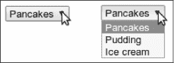

# 第十九章：`HTTP`与表单

超文本传输协议（`HyperText Transfer Protocol`），在第十三章中介绍，是在万维网上请求和提供数据的机制。本章更详细地描述了该协议，并解释了浏览器`JavaScript`如何访问它。

### 协议

如果你在浏览器的地址栏中输入`[eloquentjavascript.net/18_http.xhtml](http://eloquentjavascript.net/18_http.xhtml)`，浏览器首先查找与`eloquent [javascript.net](http://javascript.net)`关联的服务器地址，并尝试在端口`80`（`HTTP`流量的默认端口）上打开一个`TCP`连接。如果服务器存在并接受连接，浏览器可能会发送类似这样的内容：

```js
GET /18_http.xhtml HTTP/1.1
Host: eloquentjavascript.net
User-Agent: Your browser's name
```

然后服务器通过相同的连接进行响应。

```js
HTTP/1.1 200 OK
Content-Length: 87320
Content-Type: text/html
Last-Modified: Fri, 13 Oct 2023 10:05:41 GMT

<!doctype html>
--snip--
```

浏览器获取空行后响应的部分，即它的`主体`（不要与`HTML <body>`标签混淆），并将其显示为`HTML`文档。

客户端发送的信息称为`请求`。它以这一行开始：

```js
GET /18_http.xhtml HTTP/1.1
```

第一个词是请求的`方法`。`GET`意味着我们想要`获取`指定的资源。其他常见的方法有`DELETE`用于删除资源，`PUT`用于创建或替换资源，`POST`用于向其发送信息。请注意，服务器并不一定有义务执行它收到的每一个请求。如果你走到一个随机网站并告诉它删除其主页，它可能会拒绝。

方法名称之后的部分是请求应用于的`资源`的路径。在最简单的情况下，资源只是服务器上的一个文件，但协议并不要求它必须是。资源可以是任何可以被转移`好像`它是一个文件的东西。许多服务器生成的响应是动态生成的。例如，如果你打开`[`github.com/marijnh`](https://github.com/marijnh)`，服务器会在其数据库中查找名为`marijnh`的用户，如果找到了，它会为该用户生成一个个人资料页面。

在资源路径之后，请求的第一行提到`HTTP/1.1`，以指示它使用的`HTTP`协议的版本。

实际上，许多网站使用`HTTP`版本`2`，它支持与版本`1.1`相同的概念，但更加复杂，因此可以更快。浏览器在与特定服务器交互时会自动切换到适当的协议版本，无论使用哪个版本，请求的结果都是相同的。由于版本`1.1`更加简单且更易于操作，我们将使用它来说明该协议。

服务器的响应也会以一个版本开头，后面跟着响应的状态，首先是一个三位数的状态代码，然后是一个可读的字符串。

```js
HTTP/1.1 200 OK
```

以`2`开头的状态码表示请求成功。以`4`开头的代码意味着请求存在问题。最著名的`HTTP`状态码可能是`404`，表示找不到该资源。以`5`开头的代码表示服务器发生了错误，请求没有错。

请求或响应的第一行后面可以跟随任意数量的`头部`。这些是形如`name: value`的行，指定有关请求或响应的额外信息。这些头部是示例响应的一部分：

```js
Content-Length: 87320
Content-Type: text/html
Last-Modified: Fri, 13 Oct 2023 10:05:41 GMT
```

这告诉我们响应文档的大小和类型。在这种情况下，它是一个`87,320`字节的`HTML`文档。它还告诉我们该文档最后一次修改的时间。

客户端和服务器可以自由决定在请求或响应中包含哪些头部。但其中一些对于正常工作是必要的。例如，如果响应中没有`Content-Type`头部，浏览器将不知道如何显示该文档。

在头部之后，请求和响应都可能包含一个空行，后面跟着一个`主体`，其中包含实际发送的文档。`GET`和`DELETE`请求不发送任何数据，但`PUT`和`POST`请求会发送。一些响应类型，如错误响应，也不需要主体。

### 浏览器和`HTTP`

正如我们所见，当我们在地址栏中输入`URL`时，浏览器会发起请求。当生成的`HTML`页面引用其他文件，例如图像和`JavaScript`文件时，它也会检索这些文件。

一个中等复杂的网站可以轻松包含`10`到`200`个资源。为了能够快速获取这些资源，浏览器会同时发起多个`GET`请求，而不是一个个等待响应。

HTML页面可以包含`表单`，允许用户填写信息并将其发送到服务器。这是一个表单的示例：

```js
<form method="GET" action="example/message.xhtml">
  <p>Name: <input type="text" name="name"></p>
  <p>Message:<br><textarea name="message"></textarea></p>
  <p><button type="submit">Send</button></p>
</form>
```

这段代码描述了一个包含两个字段的表单：一个小字段用于输入名字，一个大字段用于写消息。当你点击发送按钮时，表单被`提交`，这意味着其字段的内容被打包成一个`HTTP`请求，浏览器会导航到该请求的结果。

当`<form>`元素的`method`属性为`GET`（或被省略）时，表单中的信息将作为`查询字符串`添加到动作`URL`的末尾。浏览器可能会向这个`URL`发起请求：

```js
GET /example/message.xhtml?name=Jean&message=Yes%3F HTTP/1.1
```

问号表示`URL`路径部分的结束和查询的开始。它后面跟随名称和值的对，分别对应于表单字段元素的`name`属性和这些元素的内容。一个`&`符号用于分隔这些对。

URL中编码的实际消息是“`Yes?`”，但问号被一个奇怪的代码替换。一些查询字符串中的字符必须被转义。问号（以`%3F`表示）就是其中之一。似乎有一种不成文的规则，即每种格式都需要自己的一种字符转义方式。这种称为`URL编码`的方式使用一个百分号，后跟两个十六进制（基数为16）数字来编码字符代码。在这种情况下，`3F`在十进制中是`63`，是问号字符的代码。`JavaScript`提供了`encodeURIComponent`和`decodeURIComponent`函数来编码和解码这种格式。

```js
console.log(encodeURIComponent("Yes?"));
// → Yes%3F
console.log(decodeURIComponent("Yes%3F"));
// → Yes?
```

如果我们将之前看到的`HTML`表单的`method`属性更改为`POST`，提交表单时发出的`HTTP`请求将使用`POST`方法，并将查询字符串放入请求的主体中，而不是将其添加到`URL`中。

```js
POST /example/message.xhtml HTTP/1.1
Content-length: 24
Content-type: application/x-www-form-urlencoded

name=Jean&message=Yes%3F
```

`GET`请求应当用于没有副作用的请求，仅仅是请求信息。例如，创建新账户或发布消息等更改服务器内容的请求，应使用其他方法，例如`POST`。客户端软件（例如浏览器）知道不应盲目发送`POST`请求，但通常会隐式发送`GET`请求——例如，预取用户可能很快需要的资源。

我们稍后将在本章中回到表单以及如何通过`JavaScript`与它们进行交互。

### `Fetch`

浏览器`JavaScript`可以进行`HTTP`请求的接口称为`fetch`。

```js
fetch("example/data.txt").then(response => {
  console.log(response.status);
  // → 200
 console.log(response.headers.get("Content-Type"));
  // → text/plain
});
```

调用`fetch`返回一个`Promise`，该`Promise`解析为一个`Response`对象，包含有关服务器响应的信息，例如其状态码和响应头。响应头被封装在一个类似`Map`的对象中，该对象将其键（头部名称）视为不区分大小写，因为头部名称不应区分大小写。这意味着`headers.get("Content-Type")`和`headers.get("content-TYPE")`将返回相同的值。

请注意，即使服务器返回了错误代码，`fetch`返回的`Promise`仍然会成功解决。如果发生网络错误或请求所针对的服务器无法找到，`Promise`也可能被拒绝。

`fetch`的第一个参数是应该请求的`URL`。当该`URL`不以协议名称（例如`http:`）开头时，它被视为`相对`的，这意味着它相对于当前文档进行解释。当它以斜杠（`/`）开头时，它将替换当前路径，即服务器名称之后的部分。当它没有斜杠时，当前路径中直到最后一个斜杠的部分将放在相对`URL`之前。

要获取响应的实际内容，您可以使用其`text`方法。因为初始`Promise`一旦接收到响应的头部就会解决，而读取响应主体可能需要更长的时间，所以这再次返回一个`Promise`。

```js
fetch("example/data.txt")
  .then(resp => resp.text())
  .then(text => console.log(text));
// → This is the content of data.txt
```

一种类似的方法，称为`json`，返回一个解析为`JSON`时的值的`promise`，如果不是有效的`JSON`，则会拒绝。

默认情况下，`fetch`使用`GET`方法发出请求，并且不包含请求主体。你可以通过将带有额外选项的对象作为第二个参数传递来配置它。例如，这个请求试图删除`example/data.txt`：

```js
fetch("example/data.txt", {method: "DELETE"}).then(resp => {
  console.log(resp.status);
  // → 405
});
```

`405`状态码表示“方法不被允许”，这是`HTTP`服务器表明“抱歉，我无法做到”的方式。

要为`PUT`或`POST`请求添加请求主体，可以包含一个`body`选项。要设置头部，可以使用`headers`选项。例如，这个请求包含一个`Range`头部，指示服务器仅返回文档的一部分。

```js
fetch("example/data.txt", {headers: {Range: "bytes=8-19"}})
  .then(resp => resp.text())
  .then(console.log);
// → The content
```

浏览器会自动添加一些请求头，例如“`Host`”和服务器确定主体大小所需的那些。但是，添加你自己的头部通常是有用的，以包含诸如身份验证信息或告诉服务器你希望接收的文件格式等内容。

### `HTTP`沙箱

在网页脚本中发出`HTTP`请求再次引发了安全性方面的担忧。控制脚本的人可能与其运行的计算机上的人没有相同的利益。更具体地说，如果我访问`themafia.org`，我不希望它的脚本能够请求`mybank.com`，使用我浏览器中的识别信息，并指示转移我所有的钱。

因此，浏览器通过禁止脚本向其他域（如`themafia.org`和`mybank.com`）发出`HTTP`请求来保护我们。

当构建希望出于合法理由访问多个域的系统时，这可能是一个烦人的问题。幸运的是，服务器可以在其响应中包含这样的头部，以明确向浏览器指示请求可以来自另一个域：

```js
Access-Control-Allow-Origin: *
```

### 理解`HTTP`

当构建一个需要在浏览器中运行的`JavaScript`程序（客户端）与服务器上的程序（服务器端）之间进行通信的系统时，有几种不同的方式来建模这种通信。

一种常用的模型是`远程过程调用`。在这个模型中，通信遵循正常函数调用的模式，只不过函数实际上是在另一台机器上运行。调用它涉及向服务器发出请求，包括函数的名称和参数。对此请求的响应包含返回的值。

在考虑远程过程调用时，`HTTP`只是一个通信的载体，你很可能会编写一个完全隐藏它的抽象层。

另一种方法是围绕资源和`HTTP`方法的概念构建你的通信。你使用`PUT`请求而不是远程过程`addUser`，针对`/users/larry`。你不再在函数参数中编码用户的属性，而是定义一个`JSON`文档格式（或使用现有格式）来表示用户。然后，用于创建新资源的`PUT`请求的主体就是这样的文档。通过向资源的`URL`（例如，`/users/larry`）发出`GET`请求来获取资源，这又会返回表示该资源的文档。

这种第二种方法使得使用`HTTP`提供的一些特性变得更加容易，比如支持资源缓存（在客户端保留资源副本以便快速访问）。`HTTP`中的概念设计良好，可以为设计你的服务器接口提供一套有用的原则。

### 安全性和`HTTPS`

在互联网上传输的数据往往要经历一条漫长而危险的道路。为了到达目的地，它必须穿越从咖啡店`Wi-Fi`热点到各种公司和国家控制的网络。在其路线的任何点，它都可能被检查甚至被修改。

如果某些东西保持秘密很重要，比如你的电子邮件账户密码，或者它需要在传输到目的地时不被修改，比如你通过银行网站转账的账户号码，那么普通`HTTP`就不够安全。

安全`HTTP`协议用于以`https://`开头的`URL`，以一种更难以阅读和篡改的方式封装`HTTP`流量。在交换数据之前，客户端通过要求服务器证明其拥有浏览器识别的证书颁发机构颁发的加密证书，来验证服务器的身份。接下来，通过连接传输的所有数据都以一种应该能防止窃听和篡改的方式进行加密。

因此，当它正常工作时，`HTTPS`可以防止其他人冒充你想要交流的网站`并且`监视你的通信。它并不完美，也发生过由于伪造或盗用证书和软件故障导致`HTTPS`失败的各种事件，但它比普通`HTTP`安全`得多`。

### 表单字段

表单最初是为预`JavaScript`网页设计的，目的是允许网站通过`HTTP`请求发送用户提交的信息。这个设计假设与服务器的交互总是通过导航到新页面来进行。

然而，表单元素是`DOM`的一部分，就像页面的其余部分一样，表示表单字段的`DOM`元素支持许多其他元素所不具备的属性和事件。这使得使用`JavaScript`程序检查和控制这些输入字段成为可能，并且可以进行诸如向表单添加新功能或在`JavaScript`应用程序中将表单和字段作为构建块等操作。

一个网页表单由任意数量的输入字段组成，这些字段被分组在一个`<form>`标签中。`HTML`允许多种不同样式的字段，从简单的开关复选框到下拉菜单和文本输入字段。本书不会试图全面讨论所有字段类型，但我们将首先提供一个粗略的概述。

许多字段类型使用`<input>`标签。该标签的`type`属性用于选择字段的样式。以下是一些常用的`<input>`类型：

| `text` | 单行文本字段 |
| --- | --- |
| `password` | 与文本相同，但隐藏输入的文本 |
| `checkbox` | 开/关切换开关 |
| `color` | 一种颜色 |
| `date` | 日历日期 |
| `radio` | (部分) 多选字段 |
| `file` | 允许用户从他们的计算机中选择一个文件 |

表单字段不一定要出现在`<form>`标签中。你可以将它们放置在页面的任何位置。这种无表单字段不能被提交（只有整个表单可以），但在使用`JavaScript`响应输入时，我们通常不希望正常提交我们的字段。

```js
<p><input type="text" value="abc"> (text)</p>
<p><input type="password" value="abc"> (password)</p>
<p><input type="checkbox" checked> (checkbox)</p>
<p><input type="color" value="orange"> (color)</p>
<p><input type="date" value="2023-10-13"> (date)</p>
<p><input type="radio" value="A" name="choice">
   <input type="radio" value="B" name="choice" checked>
   <input type="radio" value="C" name="choice"> (radio)</p>
<p><input type="file"> (file)</p>
```

使用此`HTML`代码创建的字段看起来是这样的：


这些元素的`JavaScript`接口根据元素的类型而有所不同。

多行文本字段有自己的标签`<textarea>`，主要是因为使用属性指定多行起始值会显得尴尬。`<textarea>`标签需要一个匹配的`</textarea>`结束标签，并使用这两个标签之间的文本作为起始文本，而不是值属性。

```js
<textarea>
one
two
three
</textarea>
```

最后，`<select>`标签用于创建一个字段，允许用户从多个预定义选项中进行选择。

```js
<select>
  <option>Pancakes</option>
  <option>Pudding</option>
  <option>Ice cream</option>
</select>
```

这样的字段看起来是这样的：



每当表单字段的值发生变化时，它将触发一个`“change”`事件。

### 焦点

与 HTML 文档中的大多数元素不同，表单字段可以获得`键盘焦点`。当点击、通过`TAB`移动或以其他方式激活时，它们将成为当前活动元素并接收键盘输入。

因此，你只能在文本字段获得焦点时输入内容。其他字段对键盘事件的响应方式不同。例如，`<select>`菜单会尝试移动到包含用户输入文本的选项，并通过上下箭头键移动选择。

我们可以通过JavaScript使用`focus`和`blur`方法控制焦点。第一个方法将焦点移动到调用的DOM元素，第二个方法则移除焦点。`document.activeElement`的值对应于当前获得焦点的元素。

```js
<input type="text">
<script>
  document.querySelector("input").focus();
  console.log(document.activeElement.tagName);
  // → INPUT
  document.querySelector("input").blur();
  console.log(document.activeElement.tagName);
  // → BODY
</script>
```

对于某些页面，用户期望立即与表单字段进行交互。JavaScript可以在文档加载时聚焦该字段，但HTML也提供了`autofocus`属性，该属性在让浏览器知道我们想要实现什么的同时产生相同的效果。这让浏览器在不适当的情况下有机会禁用这一行为，比如当用户将焦点放在其他地方时。

浏览器允许用户通过按`TAB`移动焦点到下一个可聚焦元素，按`SHIFT-TAB`返回到上一个元素。默认情况下，元素按照它们在文档中出现的顺序被访问。可以使用`tabindex`属性来改变这个顺序。以下示例文档将允许焦点从文本输入跳转到`OK`按钮，而不是先经过帮助链接：

```js
<input type="text" tabindex=1> <a href=".">(help)</a>
<button onclick="console.log('ok')" tabindex=2>OK</button>
```

默认情况下，大多数类型的HTML元素不能被聚焦。你可以给任何元素添加`tabindex`属性使其可聚焦。`tabindex`为`0`的元素可以被聚焦而不影响聚焦顺序。

### 禁用字段

所有表单字段都可以通过其`disabled`属性被禁用。这是一个可以不带值指定的属性——只要存在，元素就会被禁用。

```js
<button>I'm all right</button>
<button disabled>I'm out</button>
```

被禁用的字段无法聚焦或更改，浏览器会使其看起来呈灰色和褪色。


当一个程序正在处理由某个按钮或其他控件引起的可能需要与服务器通信并因此耗时的操作时，禁用该控件直到操作完成是个好主意。这样，当用户不耐烦再次点击时，他们不会不小心重复他们的操作。

### 整个表单

当一个字段包含在`<form>`元素中时，其DOM元素将有一个`form`属性链接回该表单的DOM元素。反过来，`<form>`元素有一个名为`elements`的属性，包含了内部字段的类似数组的集合。

表单字段的`name`属性决定了在提交表单时其值的识别方式。它也可以在访问表单的`elements`属性时用作属性名称，该属性既可以作为类似数组的对象（通过数字访问），也可以作为映射（通过名称访问）。

```js
<form action="example/submit.xhtml">
  Name: <input type="text" name="name"><br>
  Password: <input type="password" name="password"><br>
  <button type="submit">Log in</button>
</form>
<script>
  let form = document.querySelector("form");
  console.log(form.elements[1].type);
  // → password
  console.log(form.elements.password.type);
  // → password
  console.log(form.elements.name.form == form);
  // → true
</script>
```

当一个具有提交类型属性的按钮被按下时，会导致表单被提交。在表单字段聚焦时按下`ENTER`键也会产生相同的效果。

正常提交表单意味着浏览器导航到由表单的`action`属性指示的页面，使用`GET`或`POST`请求。但在这之前，会触发一个“`submit`”事件。你可以用JavaScript处理这个事件，并通过在事件对象上调用`preventDefault`来阻止这种默认行为。

```js
<form>
  Value: <input type="text" name="value">
  <button type="submit">Save</button>
</form>
<script>
  let form = document.querySelector("form");
  form.addEventListener("submit", event => {
    console.log("Saving value", form.elements.value.value);
    event.preventDefault();
  });
</script>
```

在JavaScript中拦截“`submit`”事件有多种用途。我们可以编写代码来验证用户输入的值是否合理，并立即显示错误信息，而不是提交表单。或者，我们可以完全禁用常规的提交表单方式，如示例所示，让我们的程序处理输入，可能使用`fetch`将其发送到服务器而无需重新加载页面。

### 文本字段

由`<textarea>`标签或类型为文本或密码的`<input>`标签创建的字段共享一个公共接口。它们的DOM元素具有一个`value`属性，该属性作为字符串值持有当前内容。将此属性设置为另一个字符串会更改字段的内容。

文本字段的`selectionStart`和`selectionEnd`属性提供了关于光标和文本选择的信息。当没有选中任何内容时，这两个属性的值相同，指示光标的位置。例如，`0`表示文本的开始，`10`表示光标位于第`10`个字符之后。当字段的部分内容被选中时，这两个属性的值会不同，显示所选文本的起始和结束位置。与值一样，这些属性也可以被写入。

想象一下，你正在写一篇关于哈塞克赫姆维（`Khasekhemwy`），第二王朝的最后一位法老的文章，但在拼写他的名字时遇到了一些困难。以下代码连接了一个`<textarea>`标签，并添加了一个事件处理程序，当你按下`F2`时，会为你插入字符串“`Khasekhemwy`”。

```js
<textarea></textarea>
<script>
  let textarea = document.querySelector("textarea");
  textarea.addEventListener("keydown", event => {
    if (event.key == "F2") {
      replaceSelection(textarea, "Khasekhemwy");
      event.preventDefault();
    }
  });
  function replaceSelection(field, word) {
    let from = field.selectionStart, to = field.selectionEnd;
    field.value = field.value.slice(0, from) + word +
                  field.value.slice(to);
    // Put the cursor after the word
    field.selectionStart = from + word.length;
    field.selectionEnd = from + word.length;
  }
</script>
```

`replaceSelection`函数将文本字段内容中当前选中的部分替换为给定的词，并将光标移动到该词后，以便用户可以继续输入。

文本字段的“`change`”事件并不会在每次输入时触发。而是在字段内容更改后失去焦点时触发。要立即响应文本字段中的更改，你应该注册“`input`”事件的处理程序，该事件在用户每次输入字符、删除文本或以其他方式操作字段内容时都会触发。

以下示例展示了一个文本字段和一个计数器，显示该字段中文本的当前长度：

```js
<input type="text"> length: <span id="length">0</span>
<script>
  let text = document.querySelector("input");
  let output = document.querySelector("#length");
 text.addEventListener("input", () => {
    output.textContent = text.value.length;
  });
</script>
```

### 复选框和单选按钮

复选框字段是一个二元切换。它的值可以通过其`checked`属性提取或更改，该属性持有布尔值。

```js
<label>
  <input type="checkbox" id="purple"> Make this page purple
</label>
<script>
  let checkbox = document.querySelector("#purple");
  checkbox.addEventListener("change", () => {
    document.body.style.background =
      checkbox.checked ? "mediumpurple" : "";
  });
</script>
```

`<label>`标签将文档中的一部分与输入字段关联。点击标签上的任何地方将激活该字段，使其获得焦点，并在其为复选框或单选按钮时切换其值。

单选按钮类似于复选框，但它隐式地与其他具有相同`name`属性的单选按钮关联，以确保在任何时候只有一个可以处于激活状态。

```js
Color:
<label>
  <input type="radio" name="color" value="orange"> Orange
</label>
<label>
  <input type="radio" name="color" value="lightgreen"> Green
</label>
<label>
  <input type="radio" name="color" value="lightblue"> Blue
</label>
<script>
  let buttons = document.querySelectorAll("[name=color]");
  for (let button of Array.from(buttons)) {
    button.addEventListener("change", () => {
      document.body.style.background = button.value;
    });
  }
</script>
```

在传递给`querySelectorAll`的CSS查询中的方括号用于匹配属性。它选择`name`属性为“color”的元素。

### 选择字段

选择字段在概念上类似于单选按钮——它们也允许用户从一组选项中选择。但是，单选按钮的选项布局由我们控制，而`<select>`标签的外观则由浏览器决定。

选择字段也有一个更像复选框而不是单选框的变体。当给定`multiple`属性时，`<select>`标签将允许用户选择任意数量的选项，而不仅仅是单个选项。常规选择字段被绘制为`下拉`控件，只有在打开时才会显示非活动选项，而启用`multiple`的字段则同时显示多个选项，允许用户单独启用或禁用它们。

每个`<option>`标签都有一个值。这个值可以通过`value`属性定义。当没有给出该属性时，选项内的文本将作为其值。`<select>`元素的`value`属性反映当前选定的选项。然而，对于多个字段来说，这个属性并不太有意义，因为它只会给出当前所选选项中的`一个`的值。

`<select>`字段的`<option>`标签可以通过字段的`options`属性作为类数组对象访问。每个选项都有一个名为`selected`的属性，指示该选项当前是否被选中。该属性也可以被写入，以选择或取消选择一个选项。

此示例从多个选择字段中提取所选值，并利用这些值组成一个二进制数字。按住`CTRL`（或在Mac上按`COMMAND`）以选择多个选项。

```js
<select multiple>
  <option value="1">0001</option>
  <option value="2">0010</option>
  <option value="4">0100</option>
  <option value="8">1000</option>
</select> = <span id="output">0</span>
<script>
  let select = document.querySelector("select");
  let output = document.querySelector("#output");
  select.addEventListener("change", () => {
    let number = 0;
    for (let option of Array.from(select.options)) {
      if (option.selected) {
        number += Number(option.value);
      }
    }
    output.textContent = number;
  });
</script>
```

### 文件字段

文件字段最初被设计为一种通过表单从用户的计算机上传文件的方式。在现代浏览器中，它们还提供了一种从JavaScript程序读取此类文件的方法。该字段充当一种守门人。脚本不能简单地开始从用户的计算机读取私有文件，但如果用户在这样的字段中选择了一个文件，浏览器会将该操作解释为脚本可以读取该文件。

文件字段通常看起来像一个带有“选择文件”或“浏览”之类标签的按钮，旁边有所选文件的信息。

```js
<input type="file">
<script>
  let input = document.querySelector("input");
  input.addEventListener("change", () => {
    if (input.files.length > 0) {
      let file = input.files[0];
      console.log("You chose", file.name);
      if (file.type) console.log("It has type", file.type);
    }
  });
</script>
```

文件字段元素的`files`属性是一个类数组对象（再次强调，不是真正的数组），包含在字段中选择的文件。它最初是空的。没有简单的`file`属性的原因在于文件字段还支持`multiple`属性，这使得可以同时选择多个文件。

文件中的对象具有诸如`name`（文件名）、`size`（文件的字节大小，8位的块）和`type`（文件的媒体类型，例如`text/plain`或`image/jpeg`）等属性。

它没有的属性是包含文件内容的属性。获取该内容的过程稍微复杂一些。由于从磁盘读取文件可能需要时间，因此接口是异步的，以避免冻结窗口。

```js
<input type="file" multiple>
<script>
  let input = document.querySelector("input");
  input.addEventListener("change", () => {
    for (let file of Array.from(input.files)) {
      let reader = new FileReader();
      reader.addEventListener("load", () => {
        console.log("File", file.name, "starts with",
                    reader.result.slice(0, 20));
      });
      reader.readAsText(file);
    }
  });
</script>
```

读取文件是通过创建一个`FileReader`对象，为其注册一个“加载”事件处理程序，并调用其`readAsText`方法，同时传入我们想要读取的文件。一旦加载完成，读取器的`result`属性将包含文件的内容。

`FileReaders`在读取文件失败的任何原因时也会触发“错误”事件。错误对象本身将最终出现在阅读器的`error`属性中。这个接口在承诺成为语言的一部分之前设计。你可以像这样将其封装在一个承诺中：

```js
function readFileText(file) {
  return new Promise((resolve, reject) => {
    let reader = new FileReader();
    reader.addEventListener(
      "load", () => resolve(reader.result));
    reader.addEventListener(
      "error", () => reject(reader.error));
    reader.readAsText(file);
  });
}
```

### 客户端数据存储

带有一些JavaScript的简单HTML页面可以成为“迷你应用程序”的一种很好的格式——小型辅助程序，自动化基本任务。通过将几个表单字段与事件处理程序连接，你可以完成从厘米和英寸之间转换到根据主密码和网站名称计算密码的任何事情。

当这样的应用程序需要在会话之间记住某些内容时，你不能使用JavaScript绑定——每次关闭页面时，这些绑定都会被丢弃。你可以设置一个服务器，将其连接到互联网，并让你的应用程序在那里存储某些内容（我们将在第二十章中看到如何做到这一点）。但那是很多额外的工作和复杂性。有时候，仅仅将数据保存在浏览器中就足够了。

`localStorage`对象可以用于以在页面重载后仍然存在的方式存储数据。该对象允许你根据名称存储字符串值。

```js
localStorage.setItem("username", "marijn");
console.log(localStorage.getItem("username"));
// → marijn
localStorage.removeItem("username");
```

`localStorage`中的值会一直存在，直到被覆盖、使用`removeItem`移除，或用户清除他们的本地数据。

不同域名的网站获得不同的存储空间。这意味着由特定网站存储在`localStorage`中的数据，原则上只能被该网站上的脚本读取（和覆盖）。

浏览器确实对网站可以在`localStorage`中存储的数据大小施加限制。这种限制，加上填满用户硬盘垃圾数据并不盈利的事实，防止了该功能占用过多空间。

以下代码实现了一个粗略的记事本应用程序。它保持一组命名的笔记，并允许用户编辑笔记和创建新笔记。

```js
Notes: <select></select> <button>Add</button><br>
<textarea style="width: 100%"></textarea>

<script>
  let list = document.querySelector("select");
  let note = document.querySelector("textarea");

  let state;
  function setState(newState) {
    list.textContent = "";
    for (let name of Object.keys(newState.notes)) {
      let option = document.createElement("option");
      option.textContent = name;
      if (newState.selected == name) option.selected = true;
      list.appendChild(option);
    }
    note.value = newState.notes[newState.selected];

    localStorage.setItem("Notes", JSON.stringify(newState));
    state = newState;
  }
  setState(JSON.parse(localStorage.getItem("Notes")) ?? {
    notes: {"shopping list": "Carrots\nRaisins"},
    selected: "shopping list"
  });

  list.addEventListener("change", () => {
    setState({notes: state.notes, selected: list.value});
  });
  note.addEventListener("change", () => {
    let {selected} = state;
    setState({
      notes: {...state.notes, [selected]: note.value},
      selected
    });
  });
  document.querySelector("button")
    .addEventListener("click", () => {
      let name = prompt("Note name");
      if (name) setState({
        notes: {...state.notes, [name]: ""},
        selected: name
      });
 });
</script>
```

脚本从`localStorage`中的`Notes`值获取其初始状态，或者如果缺少该值，则创建一个只有购物清单的示例状态。从`localStorage`读取不存在的字段将返回`null`。将`null`传递给`JSON.parse`将使其解析字符串“null”并返回`null`。因此，`??`运算符可以用于在这种情况下提供默认值。

`setState`方法确保 DOM 显示给定状态，并将新状态存储到`localStorage`。事件处理程序调用此函数以移动到新状态。

示例中的`...`语法用于创建一个新的对象，该对象是旧状态`.notes`的克隆，但添加或覆盖了一个属性。它首先使用扩展语法添加旧对象中的属性，然后设置一个新属性。对象字面量中的方括号语法用于创建一个属性，其名称基于某个动态值。

还有一个对象，类似于`localStorage`，称为`sessionStorage`。两者之间的区别在于`sessionStorage`的内容在每个`会话`结束时会被遗忘，对于大多数浏览器而言，这意味着每当浏览器关闭时。

### 概要

在这一章中，我们讨论了 HTTP 协议的工作原理。`客户端`发送一个请求，该请求包含一个方法（通常是`GET`）和一个标识资源的路径。然后`服务器`决定如何处理该请求，并以状态码和响应体进行响应。请求和响应都可以包含提供附加信息的头。

浏览器 JavaScript 进行 HTTP 请求的接口称为`fetch`。发起请求的方式如下：

```js
fetch("/18_http.xhtml").then(r => r.text()).then(text => {
  console.log(`The page starts with ${text.slice(0, 15)}`);
});
```

浏览器通过发起`GET`请求来获取显示网页所需的资源。页面还可以包含表单，当表单被提交时，用户输入的信息会作为新页面请求发送。

HTML 可以表示多种类型的表单字段，如文本字段、复选框、多选字段和文件选择器。这些字段可以通过 JavaScript 进行检查和操作。字段变化时会触发“变化”事件，输入文本时会触发“输入”事件，并在具有键盘焦点时接收键盘事件。像`value`（对于文本和选择字段）或`checked`（对于复选框和单选按钮）这样的属性用于读取或设置字段的内容。

当表单被提交时，会在其上触发“提交”事件。JavaScript 处理程序可以在该事件上调用`preventDefault`来禁用浏览器的默认行为。表单字段元素也可以出现在表单标签之外。

当用户在文件选择字段中从本地文件系统选择一个文件时，可以使用`FileReader`接口在 JavaScript 程序中访问该文件的内容。

`localStorage`和`sessionStorage`对象可以用来以在页面重载时仍然保留信息的方式保存数据。第一个对象会永久保存数据（或者直到用户决定清除它），而第二个则在浏览器关闭之前保存数据。

### 练习

#### `内容协商`

HTTP 的一项功能称为`内容协商`。`Accept`请求头用于告诉服务器客户端希望获得哪种类型的文档。许多服务器会忽略该头，但当服务器知道有多种方式对资源进行编码时，它可以查看该头并发送客户端所偏好的格式。

URL`[eloquentjavascript.net/author](https://eloquentjavascript.net/author)`被配置为根据客户端请求的内容返回纯文本、HTML 或 JSON。这些格式通过标准化的`媒体类型`text/plain、text/html和application/json来识别。

发送请求以获取此资源的所有三种格式。使用传递给`fetch`的选项对象中的`headers`属性，将名为`Accept`的头设置为所需的媒体类型。

最后，尝试请求媒体类型`application/rainbows+unicorns`，看看会产生哪个状态码。

#### `一个 JavaScript 工作台`

构建一个接口，允许用户输入和运行 JavaScript 代码片段。

在`<textarea>`字段旁边放一个按钮，当按下时，使用我们在第十章中看到的`Function`构造函数将文本包装在一个函数中并调用它。将函数的返回值或它引发的任何错误转换为字符串并显示在文本字段下方。

#### `康威的生命游戏`

康威的生命游戏是一个简单的模拟，它在一个网格上创建人工“生命”，每个单元格要么是活的，要么是死的。在每一代（轮次）中，应用以下规则：

+   任何活细胞如果邻居少于两个或多于三个活邻居则死亡。

+   任何活细胞如果有两个或三个活邻居，则可以存活到下一代。

+   任何有恰好三个活邻居的死细胞变为活细胞。

`邻居`被定义为任何相邻的单元格，包括对角相邻的单元格。

请注意，这些规则是同时应用于整个网格，而不是逐个方格。这意味着邻居的计数是基于这一代开始时的情况，而在这一代中邻居单元格的变化不应影响给定单元格的新状态。

使用你认为合适的数据结构来实现这个游戏。使用`Math.random`最初以随机模式填充网格。将其显示为复选框字段的网格，并在旁边放置一个按钮以推进到下一代。当用户勾选或取消勾选复选框时，他们的更改应在计算下一代时考虑在内。

`我看着眼前的各种颜色。我看着我的空白画布。然后，我尝试像塑造诗句的词语一样应用颜色，像塑造音乐的音符一样。`

—胡安·米罗


