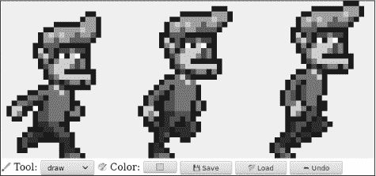
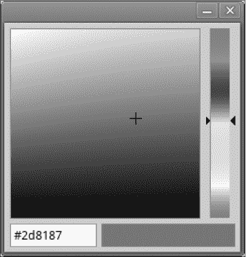
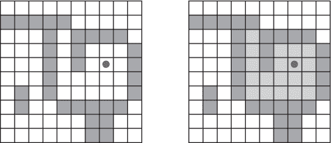
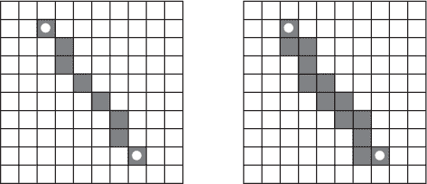

# 第二十章：项目：一个像素艺术编辑器

之前章节的材料为你构建一个基本的`web`应用程序提供了所有必要的元素。在这一章，我们将正是这样做。

我们的应用程序将是一个像素绘制程序，允许你通过操控放大的图像视图逐个像素地修改图像，图像视图显示为一个有色方块的网格。你可以使用该程序打开图像文件，用鼠标或其他指针设备在其上涂鸦，并保存它们。这就是它的外观：



在计算机上绘画是很棒的。你不需要担心材料、技巧或天赋。你只需开始涂抹，看看最终会得到什么。

### 组件

应用程序的界面上方显示一个大的`<canvas>`元素，下面有多个表单字段。用户通过从`<select>`字段中选择一个工具，然后在画布上点击、触摸或拖动来绘制图像。有用于绘制单个像素或矩形的工具、填充区域的工具以及从图像中选取颜色的工具。

我们将把编辑器界面结构化为多个`组件`，这些对象负责`DOM`的一部分，并且可以包含其他组件。

应用程序的状态由当前图像、选定工具和选定颜色组成。我们将设置这样一个环境，使得状态存在于一个单一的值中，而界面组件始终根据当前状态来决定它们的外观。

为了理解这点的重要性，让我们考虑另一种选择——在整个界面中分散状态的片段。在某种程度上，这更容易编程。我们可以直接放入一个颜色字段，并在需要知道当前颜色时读取其值。

但随后我们添加了颜色选择器——一个工具，允许你点击图像以选择给定像素的颜色。为了保持颜色字段显示正确的颜色，该工具必须知道颜色字段的存在，并在每次选择新颜色时更新它。如果你再添加另一个地方使颜色可见（也许鼠标光标可以显示它），你也必须更新你的颜色更改代码，以保持同步。

实际上，这会造成一个问题，即界面中的每个部分都需要了解所有其他部分，这并不是很模块化。对于像本章中的小型应用程序，这可能不是问题。对于更大的项目，这可能会变成一个真正的噩梦。

为了原则上避免这个噩梦，我们将严格遵循`数据流`。有一个状态，界面是基于该状态绘制的。界面组件可以通过更新状态来响应用户的操作，此时这些组件有机会与这个新状态同步。

在实践中，每个组件被设置为在接收到新状态时，也会通知其子组件，前提是那些需要被更新。设置这个有点麻烦。使其更方便是许多浏览器编程库的主要卖点。但对于像这样的一个小应用，我们可以在没有这种基础设施的情况下完成。

对状态的更新以对象形式表示，我们称之为`动作`。组件可以创建这样的`动作`并`分发`它们——将其交给中心状态管理函数。该函数计算下一个状态，然后界面组件更新为这个新状态。

我们正在将运行用户界面的杂乱任务进行结构化。尽管与`DOM`相关的部分仍然充满了副作用，但它们由一个概念上简单的主干支撑：状态更新周期。状态决定了`DOM`的外观，`DOM`事件改变状态的唯一方式是通过向状态分发`动作`。

这种方法有`许多`变体，每种都有其自身的优点和问题，但它们的核心思想是相同的：状态变化应通过单一的、明确的通道进行，而不是随处发生。

我们的组件将是符合接口的类。它们的构造函数接受一个状态——这可能是整个应用状态或较小的值（如果不需要访问所有内容）——并利用它构建一个`dom`属性。这是表示组件的`DOM`元素。大多数构造函数还将接受一些不会随时间变化的其他值，例如它们可以用于分发`动作`的函数。

每个组件都有一个`syncState`方法，用于将其同步到新的状态值。该方法接受一个参数，即状态，其类型与构造函数的第一个参数相同。

### 状态

应用状态将是一个具有`picture`、`tool`和`color`属性的对象。`picture`本身是一个对象，存储图片的宽度、高度和像素内容。像素按行存储在一个单一数组中，从上到下。

```js
class Picture {
  constructor(width, height, pixels) {
    this.width = width;
    this.height = height;
    this.pixels = pixels;
  }
  static empty(width, height, color) {
    let pixels = new Array(width * height).fill(color);
    return new Picture(width, height, pixels);
  }
  pixel(x, y) {
    return this.pixels[x + y * this.width];
  }
  draw(pixels) {
    let copy = this.pixels.slice();
    for (let {x, y, color} of pixels) {
      copy[x + y * this.width] = color;
    }
    return new Picture(this.width, this.height, copy);
  }
}
```

我们希望能够将图片视为一个不可变的值，原因将在本章后面再提到。但我们有时也需要一次更新一大堆像素。为此，该类具有一个`draw`方法，期望接收一个更新的像素数组——包含`x`、`y`和颜色属性的对象——并使用这些像素覆盖创建一张新图片。此方法使用没有参数的`slice`来复制整个像素数组——切片的开始默认为`0`，结束默认为数组的长度。

空方法使用了我们之前未见过的两种数组功能。数组构造函数可以用一个数字调用，以创建一个给定长度的空数组。然后可以使用`fill`方法将该数组填充为给定的值。这些用于创建一个所有像素都具有相同颜色的数组。

颜色以字符串形式存储，包含传统的`CSS`颜色代码，由井号(`#`)后跟六个十六进制（基数`16`）数字组成——两个用于红色成分，两个用于绿色成分，两个用于蓝色成分。这是一种相对隐晦且不方便的书写颜色方式，但这是`HTML`颜色输入字段使用的格式，并且可以在画布绘制上下文的`fillStyle`属性中使用，因此在我们将在此程序中使用颜色的方式上，这足够实用。

黑色，所有组件均为零，写作`#000000`，而亮粉色看起来像`#ff00ff`，其中红色和蓝色成分的最大值为255，以十六进制数字（使用`a`到`f`表示数字10到15）表示为`ff`。

我们将允许接口以对象的形式分发动作，这些对象的属性会覆盖之前状态的属性。当用户更改颜色字段时，可以分发一个对象，如`{color: field.value}`，从中这个更新函数可以计算出一个新的状态。

```js
function updateState(state, action) {
  return {...state, ...action};
}
```

这种模式中，使用对象扩展先添加现有对象的属性，然后覆盖其中一些属性，在使用不可变对象的JavaScript代码中很常见。

### DOM构建

界面组件的主要功能之一是创建DOM结构。我们同样不想直接使用冗长的DOM方法，因此这里是稍微扩展版的`elt`函数：

```js
function elt(type, props, ...children) {
  let dom = document.createElement(type);
  if (props) Object.assign(dom, props);
  for (let child of children) {
    if (typeof child != "string") dom.appendChild(child);
    else dom.appendChild(document.createTextNode(child));
  }
  return dom;
}
```

这个版本与我们在第十六章中使用的版本之间的主要区别在于，它将`属性`分配给DOM节点，而不是`属性值`。这意味着我们不能用它来设置任意属性，但我们`可以`用它来设置值不是字符串的属性，例如`onclick`，可以设置为一个函数以注册点击事件处理程序。

这允许我们以这种方便的方式注册事件处理程序：

```js
<body>
  <script>
    document.body.appendChild(elt("button", {
      onclick: () => console.log("click")
    }, "The button"));
  </script>
</body>
```

### 画布

我们将定义的第一个组件是界面的一部分，它将图片显示为一个彩色方块的网格。这个组件负责两件事：显示一张图片并将该图片上的指针事件传递给应用程序的其余部分。

因此，我们可以将其定义为一个只知道当前图片的组件，而不是整个应用程序状态。因为它不知道整个应用程序的工作方式，所以不能直接分发动作。相反，在响应指针事件时，它调用由创建它的代码提供的回调函数，该函数将处理特定于应用程序的部分。

```js
const scale = 10;

class PictureCanvas {
  constructor(picture, pointerDown) {
    this.dom = elt("canvas", {
      onmousedown: event => this.mouse(event, pointerDown),
      ontouchstart: event => this.touch(event, pointerDown)
    });
    this.syncState(picture);
  }
  syncState(picture) {
    if (this.picture == picture) return;
    this.picture = picture;
    drawPicture(this.picture, this.dom, scale);
  }
}
```

我们将每个像素绘制为10x10的方块，具体由比例常量决定。为了避免不必要的工作，组件跟踪其当前图片，仅在`syncState`获得新图片时进行重绘。

实际的绘制函数根据比例和图片大小设置画布的大小，并用一系列方块填充，每个方块对应一个像素。

```js
function drawPicture(picture, canvas, scale) {
  canvas.width = picture.width * scale;
  canvas.height = picture.height * scale;
  let cx = canvas.getContext("2d");

  for (let y = 0; y < picture.height; y++) {
    for (let x = 0; x < picture.width; x++) {
      cx.fillStyle = picture.pixel(x, y);
      cx.fillRect(x * scale, y * scale, scale, scale);
    }
  }
}
```

当鼠标左键在图片画布上被按下时，组件调用`pointerDown`回调，传递被点击的像素位置——以图片坐标表示。这将用于实现鼠标与图片的交互。回调可以返回另一个回调函数，以在按钮按下时，指针移动到不同的像素时收到通知。

```js
PictureCanvas.prototype.mouse = function(downEvent, onDown) {
  if (downEvent.button != 0) return;
  let pos = pointerPosition(downEvent, this.dom);
  let onMove = onDown(pos);
  if (!onMove) return;
  let move = moveEvent => {
    if (moveEvent.buttons == 0) {
      this.dom.removeEventListener("mousemove", move);
    } else {
      let newPos = pointerPosition(moveEvent, this.dom);
      if (newPos.x == pos.x && newPos.y == pos.y) return;
      pos = newPos;
      onMove(newPos);
    }
  };
  this.dom.addEventListener("mousemove", move);
};

function pointerPosition(pos, domNode) {
  let rect = domNode.getBoundingClientRect();
  return {x: Math.floor((pos.clientX - rect.left) / scale),
          y: Math.floor((pos.clientY - rect.top) / scale)};
}
```

由于我们知道像素的大小，并且可以使用`getBoundingClientRect`找到画布在屏幕上的位置，因此可以将鼠标事件坐标（`clientX`和`clientY`）转换为图片坐标。这些坐标总是向下取整，以便指向特定的像素。

对于触摸事件，我们需要做类似的事情，但使用不同的事件，并确保在“touchstart”事件上调用`preventDefault`以防止平移。

```js
PictureCanvas.prototype.touch = function(startEvent, onDown) {
  let pos = pointerPosition(startEvent.touches[0], this.dom);
  let onMove = onDown(pos);
  startEvent.preventDefault();
  if (!onMove) return;
  let move = moveEvent => {
    let newPos = pointerPosition(moveEvent.touches[0], this.dom);
    if (newPos.x == pos.x && newPos.y == pos.y) return;
    pos = newPos;
    onMove(newPos);
  };
  let end = () => {
    this.dom.removeEventListener("touchmove", move);
    this.dom.removeEventListener("touchend", end);
  };
  this.dom.addEventListener("touchmove", move);
  this.dom.addEventListener("touchend", end);
};
```

对于触摸事件，`clientX`和`clientY`在事件对象上并不可用，但我们可以使用`touches`属性中第一个触摸对象的坐标。

### 应用程序

为了能够逐步构建应用程序，我们将主组件实现为围绕图片画布和动态工具与控件集合的外壳，并将其传递给构造函数。

`控件`是出现在图片下方的界面元素。它们将作为组件构造函数的数组提供。

`工具`用于绘制像素或填充区域。应用程序将可用工具的集合显示为一个`<select>`字段。当前选择的工具决定用户使用指针设备与图片互动时会发生什么。可用工具的集合作为一个对象提供，该对象将下拉字段中显示的名称映射到实现这些工具的函数。这些函数接收图片位置、当前应用程序状态和分发函数作为参数。它们可能返回一个移动处理函数，当指针移动到不同的像素时，以新的位置和当前状态作为参数被调用。

```js
class PixelEditor {
  constructor(state, config) {
    let {tools, controls, dispatch} = config;
    this.state = state;

 this.canvas = new PictureCanvas(state.picture, pos => {
      let tool = tools[this.state.tool];
      let onMove = tool(pos, this.state, dispatch);
      if (onMove) return pos => onMove(pos, this.state);
    });
    this.controls = controls.map(
      Control => new Control(state, config));
    this.dom = elt("div", {}, this.canvas.dom, elt("br"),
                   ...this.controls.reduce(
                     (a, c) => a.concat(" ", c.dom), []));
  }
  syncState(state) {
    this.state = state;
    this.canvas.syncState(state.picture);
    for (let ctrl of this.controls) ctrl.syncState(state);
  }
}
```

传递给`PictureCanvas`的指针处理程序使用适当的参数调用当前选定的工具，并且如果返回一个移动处理程序，则还会调整它以接收状态。

所有控件都在`this.controls`中构建并存储，以便在应用程序状态变化时进行更新。对`reduce`的调用在控件的DOM元素之间引入空格。这样，它们看起来不会那么紧凑。

第一个控件是工具选择菜单。它创建一个`<select>`元素，为每个工具设置一个选项，并设置一个“change”事件处理程序，当用户选择不同工具时更新应用程序状态。

```js
class ToolSelect {
  constructor(state, {tools, dispatch}) {
    this.select = elt("select", {
      onchange: () => dispatch({tool: this.select.value})
    }, ...Object.keys(tools).map(name => elt("option", {
      selected: name == state.tool
    }, name)));
    this.dom = elt("label", null, " Tool: ", this.select);
  }
  syncState(state) { this.select.value = state.tool; }
}
```

通过将标签文本和字段包装在`<label>`元素中，我们告诉浏览器该标签属于该字段，这样你可以点击标签来聚焦该字段。

我们还需要能够更改颜色，因此让我们添加一个控制项。具有颜色类型属性的HTML`<input>`元素为我们提供了一个专门用于选择颜色的表单字段。这样的字段值始终是`#RRGGBB`格式的CSS颜色代码（红、绿和蓝组件，每种颜色两个数字）。当用户与之互动时，浏览器将显示颜色选择器界面。

根据浏览器的不同，颜色选择器可能看起来像这样：



此控件创建一个这样的区域，并将其与应用程序状态的颜色属性保持同步。

```js
class ColorSelect {
  constructor(state, {dispatch}) {
    this.input = elt("input", {
      type: "color",
      value: state.color,
      onchange: () => dispatch({color: this.input.value})
    });
    this.dom = elt("label", null, " Color: ", this.input);
  }
  syncState(state) { this.input.value = state.color; }
}
```

### 绘图工具

在我们能够绘制任何内容之前，我们需要实现控制画布上鼠标或触摸事件功能的工具。

最基本的工具是绘图工具，它将你点击或轻触的任何像素更改为当前选定的颜色。它派发一个操作，将图片更新为一个版本，其中所指向的像素被赋予当前选定的颜色。

```js
function draw(pos, state, dispatch) {
  function drawPixel({x, y}, state) {
    let drawn = {x, y, color: state.color};
    dispatch({picture: state.picture.draw([drawn])});
  }
  drawPixel(pos, state);
  return drawPixel;
}
```

函数立即调用`drawPixel`函数，但也返回它，以便在用户拖动或滑动图片时，对新触摸的像素再次调用。

为了绘制更大的形状，快速创建矩形是很有用的。矩形工具在你开始拖动的点和你拖动到的点之间绘制一个矩形。

```js
function rectangle(start, state, dispatch) {
  function drawRectangle(pos) {
    let xStart = Math.min(start.x, pos.x);
    let yStart = Math.min(start.y, pos.y);
    let xEnd = Math.max(start.x, pos.x);
    let yEnd = Math.max(start.y, pos.y);
    let drawn = [];
    for (let y = yStart; y <= yEnd; y++) {
      for (let x = xStart; x <= xEnd; x++) {
        drawn.push({x, y, color: state.color});
      }
    }
    dispatch({picture: state.picture.draw(drawn)});
  }
  drawRectangle(start);
  return drawRectangle;
}
```

这个实现中的一个重要细节是，在拖动时，矩形是在`原始`状态下在图片上重新绘制的。这样，你可以在创建矩形时将其变大或变小，而不会在最终图片中留下中间的矩形。这是不可变图片对象有用的原因之一——稍后我们将看到另一个原因。

实现填充功能稍微复杂一些。这是一个工具，可以填充指针下的像素以及所有具有相同颜色的相邻像素。“相邻”意味着直接水平或垂直相邻，而不是对角线相邻。这张图片展示了在标记像素处使用填充工具时上色的像素集合：



有趣的是，我们将要做的方式有点像第七章中的路径查找代码。尽管那段代码在图形中搜索以找到路线，这段代码则在网格中搜索以找到所有“连接”的像素。跟踪一组分支可能路线的问题是类似的。

```js
const around = [{dx: -1, dy: 0}, {dx: 1, dy: 0},
                {dx: 0, dy: -1}, {dx: 0, dy: 1}];

function fill({x, y}, state, dispatch) {
  let targetColor = state.picture.pixel(x, y);
  let drawn = [{x, y, color: state.color}];
  let visited = new Set();
  for (let done = 0; done < drawn.length; done++) {
    for (let {dx, dy} of around) {
      let x = drawn[done].x + dx, y = drawn[done].y + dy;
      if (x >= 0 && x < state.picture.width &&
          y >= 0 && y < state.picture.height &&
          !visited.has(x + "," + y) &&
          state.picture.pixel(x, y) == targetColor) {
        drawn.push({x, y, color: state.color});
        visited.add(x + "," + y);
      }
    }
  }
  dispatch({picture: state.picture.draw(drawn)});
}
```

绘制的像素数组同时充当函数的工作列表。对于每个到达的像素，我们必须查看是否有任何相邻像素具有相同的颜色并且尚未被覆盖。随着新像素的添加，循环计数器落后于绘制数组的长度。它前面的任何像素仍需要被探索。当它追上长度时，就没有未探索的像素了，函数也就完成了。

最终的工具是一个颜色选择器，它允许你在图片上指向一个颜色，以将其用作当前绘图颜色。

```js
function pick(pos, state, dispatch) {
  dispatch({color: state.picture.pixel(pos.x, pos.y)});
}
```

### 保存与加载

当我们完成了我们的杰作时，我们会想把它保存下来。我们应该添加一个按钮，用于将当前图片作为图像文件下载。这个控件提供了这个按钮：

```js
class SaveButton {
  constructor(state) {
    this.picture = state.picture;
    this.dom = elt("button", {
      onclick: () => this.save()
    }, " Save");
  }
  save() {
    let canvas = elt("canvas");
    drawPicture(this.picture, canvas, 1);
    let link = elt("a", {
      href: canvas.toDataURL(),
      download: "pixelart.png"
    });
    document.body.appendChild(link);
    link.click();
    link.remove();
  }
  syncState(state) { this.picture = state.picture; }
}
```

该组件跟踪当前图片，以便在保存时可以访问它。为了创建图像文件，它使用一个`<canvas>`元素，在其上绘制图片（每个像素按一比一的比例）。

`canvas`元素上的`toDataURL`方法创建一个使用`data:`方案的URL。与`http:`和`https:` URL不同，数据 URL在URL中包含整个资源。它们通常非常长，但它们允许我们在浏览器中创建指向任意图片的有效链接。

为了让浏览器实际下载图片，我们接着创建一个链接元素，指向这个 URL，并带有`download`属性。这样的链接在被点击时，会使浏览器显示文件保存对话框。我们将该链接添加到文档中，模拟一次点击，然后再将其移除。你可以用浏览器技术做很多事情，但有时候实现方式相当奇怪。

而且情况还会更糟。我们还希望能够将现有的图像文件加载到我们的应用程序中。为此，我们再次定义一个按钮组件。

```js
class LoadButton {
  constructor(_, {dispatch}) {
    this.dom = elt("button", {
      onclick: () => startLoad(dispatch)
    }, " Load");
  }
  syncState() {}
}

function startLoad(dispatch) {
  let input = elt("input", {
    type: "file",
    onchange: () => finishLoad(input.files[0], dispatch)
  });
  document.body.appendChild(input);
  input.click();
  input.remove();
}
```

要访问用户计算机上的文件，我们需要用户通过文件输入字段选择文件。但我们不希望加载按钮看起来像文件输入字段，因此我们在按钮点击时创建文件输入，然后假装这个文件输入被点击了。

当用户选择一个文件时，我们可以使用`FileReader`来访问其内容，再次以数据 URL 的形式。该 URL 可以用来创建一个``元素，但由于我们无法直接访问该图像中的像素，因此无法从中创建`Picture`对象。

```js
function finishLoad(file, dispatch) {
  if (file == null) return;
  let reader = new FileReader();
  reader.addEventListener("load", () => {
    let image = elt("img", {
      onload: () => dispatch({
        picture: pictureFromImage(image)
      }),
      src: reader.result
    });
  });
  reader.readAsDataURL(file);
}
```

为了访问像素，我们必须首先将图片绘制到`<canvas>`元素上。`canvas`上下文具有`getImageData`方法，允许脚本读取其像素。因此，一旦图片在`canvas`上，我们就可以访问它并构建一个`Picture`对象。

```js
function pictureFromImage(image) {
  let width = Math.min(100, image.width);
  let height = Math.min(100, image.height);
  let canvas = elt("canvas", {width, height});
  let cx = canvas.getContext("2d");
  cx.drawImage(image, 0, 0);
  let pixels = [];
  let {data} = cx.getImageData(0, 0, width, height);

 function hex(n) {
    return n.toString(16).padStart(2, "0");
  }
  for (let i = 0; i < data.length; i += 4) {
    let [r, g, b] = data.slice(i, i + 3);
    pixels.push("#" + hex(r) + hex(g) + hex(b));
  }
  return new Picture(width, height, pixels);
}
```

我们将把图像的大小限制在`100*×*100`像素，因为任何更大的图片在我们的显示器上看起来都会显得`巨大`，并可能会减慢界面速度。

`getImageData`返回的对象的数据属性是一个颜色分量数组。对于由参数指定的矩形中的每个像素，它包含四个值，代表像素颜色的红、绿、蓝和`alpha`分量，数值范围在0到255之间。`alpha`部分表示不透明度——当它为0时，像素完全透明，而当它为255时，像素完全不透明。对于我们的目的，我们可以忽略它。

每个组件的两个十六进制数字，如我们在颜色标记法中使用的，正好对应于0到255的范围——两个基数为16的数字可以表示16² = 256个不同的数字。数字的`toString`方法可以接受一个基数作为参数，因此`n.toString(16)`会生成一个基数为16的字符串表示。我们必须确保每个数字占用两个数字，因此十六进制辅助函数调用`padStart`在必要时添加前导0。

我们现在可以加载和保存了！这只剩下一个功能，我们就完成了。

### 撤销历史

因为编辑过程的一半是犯小错误并纠正它们，绘图程序中的一个重要功能是撤销历史。

为了能够撤销更改，我们需要存储图像的先前版本。由于图像是不可变值，这很简单。但这确实需要在应用程序状态中添加一个额外的字段。

我们将添加一个`done`数组来保留图像的先前版本。维护这个属性需要一个更复杂的状态更新函数，以将图像添加到数组中。

不过，我们并不想存储`每个`更改——只存储时间间隔一定的更改。为了做到这一点，我们需要一个第二个属性`doneAt`，用来跟踪我们上次在历史中存储图像的时间。

```js
function historyUpdateState(state, action) {
  if (action.undo == true) {
    if (state.done.length == 0) return state;
    return {
      ...state,
      picture: state.done[0],
 done: state.done.slice(1),
      doneAt: 0
    };
  } else if (action.picture &&
             state.doneAt < Date.now() - 1000) {
    return {
      ...state,
      ...action,
      done: [state.picture, ...state.done],
      doneAt: Date.now()
    };
  } else {
    return {...state, ...action};
  }
}
```

当操作是撤销操作时，函数从历史记录中获取最近的图像，并将其设为当前图像。它将`doneAt`设置为零，以确保下一个更改将图像存回历史中，让你在需要时可以恢复到这个图像。

否则，如果操作包含新图像，而我们上次存储的时间超过了一秒（1,000毫秒），则`done`和`doneAt`属性会更新以存储之前的图像。

撤销按钮组件并没有太多功能。它在被点击时分发撤销操作，当没有可以撤销的内容时则禁用自身。

```js
class UndoButton {
  constructor(state, {dispatch}) {
    this.dom = elt("button", {
      onclick: () => dispatch({undo: true}),
      disabled: state.done.length == 0
    }, " Undo");
  }
  syncState(state) {
    this.dom.disabled = state.done.length == 0;
  }
}
```

### 让我们绘图。

为了设置应用程序，我们需要创建一个状态、一组工具、一组控件和一个调度函数。我们可以将它们传递给`PixelEditor`构造函数来创建主要组件。由于我们在练习中需要创建多个编辑器，我们首先定义一些绑定。

```js
const startState = {
  tool: "draw",
  color: "#000000",
 picture: Picture.empty(60, 30, "#f0f0f0"),
  done: [],
  doneAt: 0
};

const baseTools = {draw, fill, rectangle, pick};

const baseControls = [
  ToolSelect, ColorSelect, SaveButton, LoadButton, UndoButton
];

function startPixelEditor({state = startState,
                           tools = baseTools,
                           controls = baseControls}) {
  let app = new PixelEditor(state, {
    tools,
    controls,
    dispatch(action) {
      state = historyUpdateState(state, action);
      app.syncState(state);
    }
  });
  return app.dom;
}
```

在解构对象或数组时，可以在绑定名称后使用`=`来为绑定提供默认值，当属性缺失或为`undefined`时使用。`startPixelEditor`函数利用这一点接受一个具有多个可选属性的对象作为参数。例如，如果你不提供`tools`属性，`tools`将绑定到`baseTools`。

这就是我们如何在屏幕上获得实际编辑器的方式：

```js
<div></div>
<script>
  document.querySelector("div").appendChild(startPixelEditor({}));
</script>
```

### 为什么这会如此困难？

浏览器技术真是令人惊叹。它提供了一套强大的接口构建块、样式和操作它们的方法，以及检查和调试应用程序的工具。你为浏览器编写的软件可以在地球上几乎每台计算机和手机上运行。

与此同时，浏览器技术非常荒谬。你必须学习大量愚蠢的技巧和晦涩的事实才能掌握它，而它提供的默认编程模型问题重重，以至于大多数程序员宁愿用几层抽象来掩盖它，而不是直接处理它。

尽管情况确实在改善，但主要以添加更多元素来解决不足的形式进行——这创造了更多的复杂性。被一百万个网站使用的功能是无法真正替代的。即使可以替代，也很难决定用什么来替代。

技术从来不会在真空中存在——我们受限于我们的工具以及产生这些工具的社会、经济和历史因素。这可能让人感到恼火，但一般来说，努力建立对`现有`技术现实如何运作及其原因的良好理解，比愤怒抗争或期待另一种现实要更具生产力。

新的抽象`可以`是有帮助的。我在本章中使用的组件模型和数据流约定是一种粗略的形式。如前所述，有一些库试图使用户界面编程变得更愉快。在写作时，`React`和`Svelte`是流行的选择，但还有一整套这样的框架。如果你对编写网页应用感兴趣，我建议你调查一下其中的一些，以了解它们是如何运作的，以及它们提供了什么好处。

### 练习

我们的程序仍然有改进的空间。让我们增加一些功能作为练习。

#### `键盘绑定`

为应用程序添加键盘快捷键。工具名称的首字母选择该工具，而`CTRL-Z`或`COMMAND-Z`则激活撤销。

通过修改`PixelEditor`组件来做到这一点。在包裹的`<div>`元素中添加一个`tabIndex`属性值为`0`，以便它可以接收键盘焦点。注意，`属性`对应于`tabindex` `属性`被称为`tabIndex`，`I`大写，而我们的`elt`函数期望属性名称。直接在该元素上注册键盘事件处理程序。这意味着你必须点击、触摸或通过标签切换到应用程序，然后才能用键盘与之交互。

请记住，键盘事件有`ctrlKey`和`metaKey`（在Mac上为`COMMAND`）属性，你可以使用它们来查看这些键是否被按下。

#### `高效绘图`

在绘图过程中，我们的应用程序大部分工作都发生在`drawPicture`中。创建一个新状态并更新其余的DOM并不太昂贵，但重绘画布上的所有像素则需要相当多的工作。

找到一种方法，通过仅重绘实际改变的像素来加速`PictureCanvas`的`syncState`方法。

请记住，`drawPicture`也被保存按钮使用，因此如果你更改它，请确保更改不会破坏旧的使用方式，或者创建一个不同名称的新版本。

还要注意，通过设置`<canvas>`元素的宽度或高度属性来更改其大小，会清除它，使其再次完全透明。

#### `圆形`

定义一个名为`圆形`的工具，当你拖动时绘制一个填充的圆。圆心位于拖动或触摸手势开始的点，其半径由拖动的距离决定。

#### `适当的线条`

这比前面的三个练习要复杂，需要你设计一个解决非平凡问题的方案。在开始这个练习之前，确保你有足够的时间和耐心，并且不要因为最初的失败而气馁。

在大多数浏览器中，当你选择绘图工具并快速拖动图像时，你不会得到一条闭合的线条。而是会得到带有间隙的点，因为`"mousemove"`或`"touchmove"`事件没有足够快地触发以击中每个像素。

改进绘图工具，使其绘制完整的线条。这意味着你需要让动作处理函数记住上一个位置，并将其与当前的位置连接起来。

为此，由于像素之间的距离可以是任意的，你需要编写一个通用的绘线函数。

两个像素之间的线条是一个连接的像素链，尽可能地直，从起点到终点。对角相邻的像素算作连接。倾斜的线条应该像左侧的图片，而不是右侧的图片。



最后，如果我们有一段代码可以在两个任意点之间绘制一条线，我们也可以用它来定义一个线条工具，该工具在拖动的起点和终点之间绘制一条直线。
