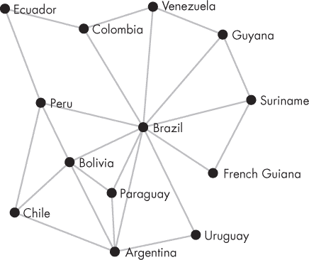
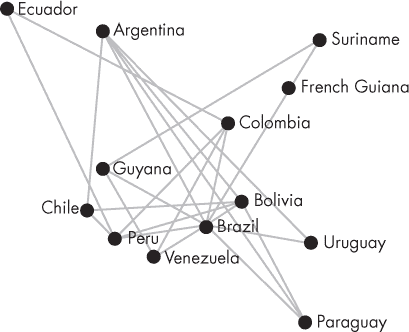
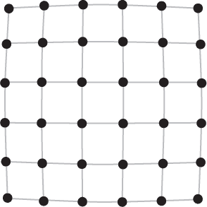

# 第二十三章：`JAVASCRIPT`和性能

在机器上运行计算机程序需要弥合编程语言与机器自身指令格式之间的差距。这可以通过编写一个`解释`其他程序的程序来实现，正如我们在第十一章中所做的，但通常是通过将程序`编译`（翻译）为机器代码来完成。

一些语言，如`C`和`Rust`编程语言，旨在表达机器擅长的那些东西。这使得它们易于高效编译。`JavaScript`的设计方式则截然不同，注重简单性和易用性。几乎没有它允许你表达的操作与机器的特性直接对应。这使得`JavaScript`的编译变得更加困难。

然而，现代`JavaScript` `引擎`（编译和运行`JavaScript`的程序）确实能够以令人印象深刻的速度执行程序。可以编写的`JavaScript`程序，其速度仅比等效的`C`或`Rust`程序慢几倍。尽管这听起来差距很大，但较旧的`JavaScript`引擎（以及类似设计的语言的当代实现，如`Python`和`Ruby`）往往比`C`慢接近`100`倍。与这些语言相比，现代`JavaScript`的速度令人瞩目——如此之快，以至于你很少会因为性能问题而被迫切换到另一种语言。

不过，你可能需要调整代码以避免语言中较慢的方面。作为这一过程的例子，本章将通过一个对速度要求高的程序来使其更快。在这个过程中，我们将讨论`JavaScript`引擎如何编译你的程序。

### 分阶段编译

首先，你必须理解`JavaScript`编译器并不只是像经典编译器那样一次性编译一个程序。相反，代码在程序运行时根据需要编译和重新编译。

对于大多数语言，编译大型程序需要一段时间。这通常是可以接受的，因为程序是提前编译并以编译形式分发的。

对于`JavaScript`，情况有所不同。一个网站可能包含大量以文本形式检索的代码，每次打开网站时都必须编译。如果这个过程花费五分钟，用户肯定不会满意。`JavaScript`编译器必须能够几乎瞬间开始运行程序——即使是大型程序。

为此，这些编译器具有多种编译策略。当网站首次打开时，脚本首先以一种廉价、表面的方式编译。这并不会导致非常快的执行，但允许脚本快速启动。函数可能在第一次被调用之前根本不会被编译。

在一个典型的程序中，大多数代码只会运行少数几次（或者根本不运行）。对于程序的这些部分，廉价的编译策略就足够了——反正它们不会花费太多时间。但是，频繁调用的函数或包含大量工作循环的函数必须以不同的方式对待。在运行程序时，`JavaScript`引擎会观察每段代码运行的频率。当某段代码似乎可能耗费大量时间时（这通常被称为`热点代码`），它会用一个更高级但更慢的编译器重新编译。这种编译器会进行更多的`优化`以生成更快的代码。甚至可能会有超过两种编译策略，对`非常`热点的代码应用更昂贵的优化。

交替运行和编译代码意味着在聪明的编译器开始处理一段代码时，它已经被运行多次。这使得能够`观察`运行中的代码并收集有关它的信息。在本章后面，我们将看到这如何使编译器能够生成更高效的代码。

### 图布局

本章的示例问题再次与图有关。图的图片可以用于描述道路系统、网络、控制在计算机程序中的流动等。下图显示了一个表示南美国家和领土的图，其中边表示共享陆地边界的国家：



从图的定义推导出这样的图像被称为`图布局`。它涉及为每个节点分配一个位置，使得相连的节点彼此接近，同时节点不会相互拥挤。相同图的随机布局则更难以解读。



为给定图找到一个好看的布局是一个众所周知的困难问题。对于任意图，没有已知的解决方案能够可靠地做到这一点。大型、密集连接的图尤其具有挑战性。但对于某些特定类型的图，例如`平面`图（可以画出而不让边相互交叉），有效的方法是存在的。

为了布局一个不太复杂的小图，我们可以应用一种叫做`基于力的图布局`的方法。这在图的节点上运行一个简化的物理模拟，将边视为弹簧，并让节点之间相互排斥，就像带电一样。

在本章中，我们将实现一个基于力的图布局系统并观察其性能。我们可以通过反复计算作用在每个节点上的力并根据这些力移动节点来运行这样的模拟。这样的程序性能很重要，因为达到一个好看的布局可能需要很多次迭代，而每次迭代都会计算大量的力。

### 定义图

我们可以使用类似这样的类来表示图。每个节点都有一个编号，从`0`开始，并存储一组连接的节点。

```js
class Graph {
  #nodes = [];

  get size() {
    return this.#nodes.length;
  }

  addNode() {
    let id = this.#nodes.length;
    this.#nodes.push(new Set());
    return id;
  }

  addEdge(nodeA, nodeB) {
    this.#nodes[nodeA].add(nodeB);
    this.#nodes[nodeB].add(nodeA);
  }

  neighbors(node) {
    return this.#nodes[node];
  }
}
```

在构建图时，你调用`addNode`来定义一个新节点，调用`addEdge`将两个节点连接在一起。与图一起工作的代码可以使用`neighbors`，返回一组连接的节点 ID，以读取有关边的信息。

为了表示图的布局，我们将使用之前章节中的熟悉的`Vec`类。图的布局是一个长度为`graph.size`的向量数组，为每个节点保存一个位置。

```js
function randomLayout(graph) {
  let layout = [];
  for (let i = 0; i < graph.size; i++) {
    layout.push(new Vec(Math.random() * 1000,
                        Math.random() * 1000));
  }
  return layout;
}
```

`gridGraph`函数构建一个只是节点的方形网格的图，这是图布局程序的一个有用测试用例。它创建`size * size`个节点，并将每个节点与其上方或左侧的节点连接（如果存在这样的节点）。

```js
function gridGraph(size) {
  let grid = new Graph();
  for (let y = 0; y < size; y++) {
    for (let x = 0; x < size; x++) {
      let id = grid.addNode();
      if (x > 0) grid.addEdge(id, id - 1);
      if (y > 0) grid.addEdge(id, id - size);
    }
  }
  return grid;
}
```

这就是一个网格布局的样子：



为了让我们检查代码生成的布局，我定义了一个`drawGraph`函数，将图形绘制到画布上。这个函数在`[eloquentjavascript.net/code/draw_layout.js](http://eloquentjavascript.net/code/draw_layout.js)`的代码中定义，并且在在线沙箱中可用。

### 力导向布局

我们将一次移动一个节点，计算作用于当前节点的力，并立即将该节点移动到这些力的总和方向。

（理想化的）弹簧施加的力可以用胡克定律来近似，该定律指出，这个力与弹簧的静止长度和当前长度之间的差值成正比。绑定弹簧长度定义了我们边缘弹簧的静止长度。弹簧的刚度由`springStrength`定义，我们将通过长度差乘以该值来确定结果力。

为了模拟节点之间的排斥力，我们使用另一个物理公式，即库仑定律，它表明两个带电粒子之间的排斥力与它们之间距离的平方成反比。当两个节点几乎重叠时，平方距离很小，结果力是巨大的。随着节点远离，平方距离迅速增大，从而排斥力迅速减弱。

我们将乘以一个实验确定的常数，排斥力强度，该常数控制节点之间排斥的强度。

这个函数计算作用于节点的力的强度，因为在给定距离下存在另一个节点。它始终包括排斥力，并在节点连接时将其与弹簧的力相结合。

```js
const springLength = 20;
const springStrength = 0.1;
const repulsionStrength = 1500;

function forceSize(distance, connected) {
  let repulse = -repulsionStrength / (distance * distance);
  let spring = 0;
  if (connected) {
    spring = (distance - springLength) * springStrength;
  }
  return spring + repulse;
}
```

节点移动的方式是通过结合所有其他节点施加在它上的力来决定的。对于每对节点，我们的函数需要知道它们之间的距离。我们可以通过减去节点的位置并计算结果向量的长度来计算这个距离。当距离小于一时，我们将其设为一，以防止除以零或非常小的数，因为这样会产生`NaN`值或产生巨大的力，将节点抛入太空。

使用这个距离以及节点之间连接边的存在与否，我们可以计算作用于它们之间的力的大小。要从这个大小得到力向量，我们可以将大小乘以一个标准化的分离向量。`标准化`一个向量意味着创建一个方向相同但长度为一的向量。我们可以通过将向量除以其自身的长度来实现。将这个值添加到节点的位置会使其朝着力的方向移动。

```js
function forceDirected_simple(layout, graph) {
  for (let a = 0; a < graph.size; a++) {
    for (let b = 0; b < graph.size; b++) {
      if (a == b) continue;
      let apart = layout[b].minus(layout[a]);
      let distance = Math.max(1, apart.length);
 let connected = graph.neighbors(a).has(b);
      let size = forceSize(distance, connected);
      let force = apart.times(1 / distance).times(size);
      layout[a] = layout[a].plus(force);
    }
  }
}
```

我们将使用以下函数来测试我们图形布局系统的给定实现。它从随机布局开始，并运行模型三秒钟。完成后，它记录每秒处理的迭代次数。为了让我们在代码运行时有所观察，它在每`100`次迭代后绘制当前图形的布局。

```js
function pause() {
  return new Promise(done => setTimeout(done, 0))
}

async function runLayout(implementation, graph) {
  let time = 0, iterations = 0;
  let layout = randomLayout(graph);
  while (time < 3000) {
    let start = Date.now();
    for (let i = 0; i < 100; i++) {
      implementation(layout, graph);
      iterations++;
    }
    time += Date.now() - start;
    drawGraph(graph, layout);
    await pause();
  }
  let perSecond = Math.round(iterations / (time / 1000));
  console.log(`${perSecond} iterations per second`);
}
```

为了让浏览器有机会实际显示图形，该函数在每次绘制图形时将控制权短暂地返回给事件循环。该函数是异步的，以便能够等待超时。

我们可以运行这个第一个实现，看看需要多少时间。

```js
runLayout(forceDirected_simple, gridGraph(12));
```

在我的机器上，这个版本每秒处理约`1,600`次迭代。这已经相当多了。但让我们看看是否可以做得更好。

### 避免工作

完成某件事情最快的方法就是避免去做它——或者至少部分避免。通过思考代码的作用，你通常可以发现不必要的冗余或可以更快完成的操作。

在我们示例项目的情况下，存在减少工作量的机会。每对节点之间的力计算了两次，一次是在移动第一个节点时，另一次是在移动第二个节点时。由于节点`X`施加于节点`Y`的力恰好是节点`Y`施加于节点`X`的力的相反数，因此我们不需要计算这些力两次。

函数的下一个版本将内部循环更改为只遍历当前节点之后的节点，以便每对节点仅被查看一次。在计算一对节点之间的力之后，函数更新两个节点的位置。

```js
function forceDirected_noRepeat(layout, graph) {
  for (let a = 0; a < graph.size; a++) {
    for (let b = a + 1; b < graph.size; b++) {
      let apart = layout[b].minus(layout[a]);
      let distance = Math.max(1, apart.length);
      let connected = graph.neighbors(a).has(b);
      let size = forceSize(distance, connected);
      let force = apart.times(1 / distance).times(size);
      layout[a] = layout[a].plus(force);
      layout[b] = layout[b].minus(force);
    }
  }
}
```

除了循环结构以及调整两个节点的事实外，这个版本与之前的版本完全相同。测量这段代码显示出显著的速度提升——在`Chrome`上快约`45%`，在`Firefox`上快约`55%`。

不同的`JavaScript`引擎工作方式不同，可能以不同的速度运行程序。因此，在一个引擎中使代码运行更快的更改，在另一个引擎中可能无效（甚至可能有害）——甚至在同一引擎的不同版本中也是如此。这很烦人，但考虑到这些系统的复杂性，这并不意外。

如果我们仔细看看程序的运行情况，比如通过调用`console.log`输出大小，就会发现大多数节点对之间产生的力微乎其微，实际上并没有影响布局。具体来说，当节点未连接且相距较远时，它们之间的力几乎可以忽略不计。然而我们仍然为它们计算向量并稍微移动节点。如果我们不这样做会怎样呢？

下一个版本定义了一个距离，超过该距离的（未连接）节点将不再计算和应用力。设置该距离为`175`时，忽略低于`0.05`的力。

```js
const skipDistance = 175;

function forceDirected_skip(layout, graph) {
  for (let a = 0; a < graph.size; a++) {
    for (let b = a + 1; b < graph.size; b++) {
      let apart = layout[b].minus(layout[a]);
      let distance = Math.max(1, apart.length);
      let connected = graph.neighbors(a).has(b);
      if (distance > skipDistance && !connected) continue;
      let size = forceSize(distance, connected);
      let force = apart.times(1 / distance).times(size);
      layout[a] = layout[a].plus(force);
      layout[b] = layout[b].minus(force);
    }
  }
}
```

这使得速度又提高了`75%`，而布局没有明显的退化。我们省了一些麻烦，结果也不错。

### 性能分析

通过对程序的推理，我们能够相当大幅度地加快程序的运行速度。但在`微优化`方面——即通过稍微不同的方式来提高速度——通常很难预测哪些更改会有帮助，哪些不会。在这种情况下，我们不能再依赖推理，我们必须`观察`。

我们的`runLayout`函数测量程序当前的运行时间。这是一个好的开始。要改善某件事，必须对其进行测量。不进行测量，你就无法知道你的更改是否达到了预期效果。

现代浏览器中的开发者工具提供了一种更好的方法来测量程序的速度。这个工具被称为`性能分析器`。在程序运行时，它会收集程序各个部分所用时间的信息。

如果你的浏览器有性能分析器，它将在开发者工具界面中可用，可能在一个名为“性能”的标签上。当我让`Chrome`记录`3,000`次`forceDirected_skip`的迭代时，性能分析器输出以下表格：

```js
Activity             Self Time        Total Time
forceDirected_skip   74.0ms  82.4%    769.5ms  94.1%
Minor GC             48.2ms   5.9%     48.2ms   5.9%
Vec                  44.8ms   5.5%     46.9ms   5.7%
plus                  4.6ms   0.6%      5.5ms   0.7%
Optimize Code         0.1ms   0.0%      0.1ms   0.0%
```

这列出了耗时较长的函数（或其他任务）。对于每个函数，它报告执行该函数所花费的时间，包括毫秒和总时间的百分比。第一列只显示控制实际上在函数中的时间，而第二列包括在该函数调用的函数中花费的时间。

就性能分析而言，这个非常简单，因为程序`没有`很多函数。对于更复杂的程序，列表将会更长。由于耗时最长的函数显示在顶部，因此通常仍然容易找到有趣的信息。

从这个表中，我们可以看出，大部分时间花费在物理仿真函数上。这并不意外。但在第二行，我们看到了“Minor GC”。`GC`代表“垃圾收集”—释放程序不再使用的值所占用的内存空间的过程。第三行的时间类似，测量的是向量构造函数。这些表明程序在创建和清理`Vec`对象上花费了相当多的时间。

再次想象内存是一排排长长的比特。当程序启动时，它可能会接收一块空的内存，并开始逐个放入它创建的对象。但在某个时刻，空间满了，其中的一些对象不再使用。`JavaScript`引擎必须弄清楚哪些对象正在使用，哪些对象没有使用，以便能够重用未使用的内存块。

我们循环的每次迭代都会创建五个对象。引擎创建和回收所有这些对象的速度已经相当惊人。因为许多 JavaScript 程序创建大量对象，而管理这些对象的内存可能会导致程序变慢，因此在提高这方面的效率上花费了很多精力。

但尽管效率如此，它仍然是必须进行的工作。让我们尝试一个不创建新向量的代码版本。

```js
function forceDirected_noVector(layout, graph) {
  for (let a = 0; a < graph.size; a++) {
    let posA = layout[a];
    for (let b = a + 1; b < graph.size; b++) {
      let posB = layout[b];
      let apartX = posB.x - posA.x
      let apartY = posB.y - posA.y;
      let distance = Math.sqrt(apartX * apartX +
                               apartY * apartY);
      let connected = graph.neighbors(a).has(b);
      if (distance > skipDistance && !connected) continue;
      let size = forceSize(distance, connected);
      let forceX = (apartX / distance) * size;
      let forceY = (apartY / distance) * size;
      posA.x += forceX;
      posA.y += forceY;
      posB.x -= forceX;
      posB.y -= forceY;
 }
  }
}
```

新代码更加冗长和重复，但如果我进行测量，这种改进足够大，值得在对性能敏感的代码中考虑进行这种手动对象扁平化。在`Firefox`和`Chrome`上，新版本的速度比之前的版本快了大约`50%`。

综合这些步骤，我们使得程序比最初版本快了大约四倍。这是一个相当大的改进。但请记住，进行这项工作仅对那些实际消耗大量时间的代码是有用的。试图立即优化所有内容只会让你变得更加缓慢，并留下大量不必要的复杂代码。

### `函数内联`

一些向量方法（例如`times`）在我们看到的分析中没有出现，尽管它们被大量使用。这是因为编译器对它们进行了`内联`。与其让内部函数中的代码调用实际方法来相乘向量，不如将向量乘法代码直接放入函数内部，编译后的代码中没有实际的方法调用。

内联帮助代码变快的方式有很多。函数和方法在机器级别上是通过一种协议调用的，这需要将参数和返回地址（当函数返回时执行需要继续的地方）放在函数可以找到的位置。当函数调用将控制权交给程序的其他部分时，通常还需要保存一些处理器的状态，以便被调用的函数可以使用处理器而不干扰调用者仍然需要的数据。当函数被内联时，所有这些都变得不必要。

此外，一个好的编译器会尽力寻找简化其生成代码的方法。如果将函数视为可能做任何事情的黑箱，编译器就没有太多可供利用的内容。另一方面，如果它能够在分析中看到并包含函数体，可能会找到更多优化代码的机会。

例如，`JavaScript`引擎可以完全避免在我们的代码中创建一些向量对象。在像下面这样的表达式中，如果我们可以透视这些方法，很明显，结果向量的坐标是将`force`的坐标与`normalized`和`forceSize`绑定的乘积相加的结果。因此，没有必要创建由`times`方法生成的中间对象。

```js
pos.plus(normalized.times(forceSize))
```

但是`JavaScript`允许我们通过操纵原型对象在任何时候替换方法。编译器如何确定这个`times`方法实际上是哪一个函数呢？如果之后有人更改了`Vec.prototype.times`中存储的值会怎样？下次运行已内联该函数的代码时，它可能会继续使用旧的定义，从而违反程序员对程序行为的假设。

这里是执行和编译交错开始发挥作用的地方。当一个热点函数被编译时，它已经运行了多次。如果在这些运行中，它总是调用同一个函数，那么尝试内联这个函数是合理的。代码是乐观地编译的，假设将来会在这里调用同一个函数。

为了处理悲观的情况，即调用了另一个函数，编译器插入了一个测试，比较被调用的函数和内联的函数。如果两者不匹配，乐观编译的代码就是错误的，JavaScript引擎必须`反优化`，这意味着它回退到一个不那么优化的代码版本。在之后的某个时刻，它可能会根据现在所知道的内容尝试以不同的方式再次优化。

### 动态类型

像`graph.size`这样的JavaScript表达式，从对象中获取属性，并非易事。在许多语言中，`绑定`是有类型的，因此当你对它们持有的值执行操作时，编译器已经知道你需要什么样的操作。在JavaScript中，只有`值`有类型，而一个绑定可能会持有不同类型的值。

这意味着最初编译器对代码可能尝试访问的属性了解不多，必须生成处理所有可能类型的代码。如果`graph`持有未定义的值，代码必须抛出一个错误。如果它持有一个字符串，则必须在`String.prototype`中查找`size`。如果它持有一个对象，则从中提取`size`属性的方式取决于对象的形状。依此类推。

幸运的是，尽管JavaScript不要求如此，但大多数程序中的绑定`确实`只有一种类型。如果编译器知道这个类型，它可以利用这些信息生成高效的代码。如果图形至今一直是`Graph`的一个实例，那么优化编译器可以创建内联从该类获取大小的方法的代码。

再次强调，过去观察到的事件并不能保证未来将会发生的事件。某些尚未运行的代码仍可能向我们的函数传递另一种类型的值——例如，另一种图形对象，其大小属性的工作方式不同。

这意味着编译的代码仍然需要`检查`其假设是否成立，并在不成立时采取适当的行动。引擎可以完全去优化，退回到未优化的函数版本。或者它可以编译一个新的函数版本，以处理新观察到的类型。

你可以通过故意破坏输入对象的一致性来观察因无法预测对象类型而导致的性能下降。例如，我们可以用一个版本替换`randomLayout`，该版本为每个向量添加一个随机名称的属性。

```js
function randomLayout(graph) {
  let layout = [];
  for (let i = 0; i < graph.size; i++) {
    let vector = new Vec(Math.random() * 1000,
                         Math.random() * 1000);
    vector[`p${Math.floor(Math.random() * 999)}`] = true;
    layout.push(vector);
  }
  return layout;
}

runLayout(forceDirected_noVector, gridGraph(12));
```

如果我们在结果图上运行我们的快速模拟代码，它在Firefox上会变得慢大约三倍，而在Chrome上则变慢五倍。现在对象类型不再一致，与向量交互的代码必须在没有事先了解对象形状的情况下查找属性，这样做的成本要高得多。

有趣的是，在运行此代码后，即使在常规的、未损坏的布局向量上运行`forceDirected_noVector`也变得缓慢。混乱的类型在某种程度上“毒害”了编译的代码——在某个时刻，浏览器往往会丢弃编译的代码并重新从头编译，消除这种影响。

类似的技术也用于其他非属性访问的情况。例如，`+`运算符的意义取决于它应用于什么类型的值。聪明的JavaScript编译器不会每次都运行处理所有这些含义的完整代码，而是会利用先前的观察构建对运算符可能应用类型的某种预期。如果它仅应用于数字，则可以生成一个更简单的机器代码来处理它。但同样，这种假设必须在每次函数运行时进行检查。

这里的教训是，如果一段代码需要快速执行，你可以通过提供一致的类型来帮助它。JavaScript引擎能够相对较好地处理少量不同类型的情况——它们会生成处理所有这些类型的代码，并且仅在看到新类型时才会进行去优化。但即便如此，生成的代码仍然比单一类型时的代码慢。

### 摘要

多亏了大量资金投入到网络中，以及不同浏览器之间的竞争，JavaScript编译器在其工作中表现出色：使代码运行得更快。但有时你需要稍微帮助它们，重写你的内循环，以避免更昂贵的JavaScript特性。创建更少的对象（以及数组和字符串）通常会有所帮助。

在你开始修改代码以提高速度之前，先考虑如何减少代码的工作量。优化的最大机会通常在于这个方向。

JavaScript引擎会多次编译热点代码，并利用之前执行过程中收集的信息来编译更高效的代码。为你的绑定提供一致的类型有助于实现这种类型的优化。

### 练习

#### `质数`

编写一个生成器（见 第十一章）`primes`，生成源源不断的`质数`。质数是大于 1 的整数，不能被任何小于它们且大于 1 的整数整除。例如，前五个质数是 2、3、5、7 和 11。现在先不考虑速度。

设置一个函数`measurePrimes`，使用`Date.now()`来测量你的质数函数找到前一万个质数所需的时间。

#### `更快的质数`

现在你有了一个测量过的测试用例，想办法让你的质数函数更快。考虑减少你需要执行的余数检查的次数。
