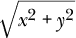

# 附录：练习提示

以下提示可能会在你遇到本书中的某个练习时帮助你。它们并没有给出完整的解决方案，而是尝试帮助你自己找到解决方案。

### 第二章：程序结构

#### `循环三角形`

你可以从一个打印`1`到`7`的程序开始，你可以通过对本章前面给出的偶数打印示例进行一些修改来得到这个程序，其中介绍了`for`循环。

现在考虑数字与哈希字符字符串之间的等价性。你可以通过增加`1`（`+= 1`）从`1`变为`2`。你可以通过增加一个字符（`+= “#”`）从`"#"`变为`"##"`。因此，你的解决方案可以紧密跟随数字打印程序。

#### `FizzBuzz`

遍历数字显然是一个循环任务，选择要打印的内容是条件执行的问题。记住使用余数（`%`）运算符来检查一个数字是否能被另一个数字整除（余数为零）的技巧。

在第一个版本中，每个数字有三个可能的结果，因此你需要创建一个`if/else if/else`链。

程序的第二个版本有一个直接的解决方案和一个巧妙的解决方案。简单的解决方案是添加另一个条件“分支”来精确测试给定条件。对于巧妙的解决方案，构建一个包含要输出的单词或词语的字符串，如果没有单词，则打印这个单词或数字，可能通过充分利用`||`运算符。

#### `棋盘`

你可以通过从一个空字符串（`""`）开始，反复添加字符来构建字符串。换行符写作`\n`。

要处理二维，您需要在一个循环内嵌套另一个循环。在两个循环的主体周围加上大括号，以便清楚地看到它们的开始和结束位置。尝试正确缩进这些主体。循环的顺序必须遵循我们构建字符串的顺序（逐行，从左到右，从上到下）。因此，外层循环处理行，内层循环处理行中的字符。

你需要两个绑定来跟踪你的进度。要知道在给定位置放置空格还是哈希符号，可以测试两个计数器的和是否为偶数（`% 2`）。

通过添加换行符来结束一行必须在这一行构建完成后进行，因此在内层循环后但在外层循环内执行此操作。

### 第三章：函数

#### `最小值`

如果你在正确放置大括号和括号以获得有效的函数定义时遇到困难，可以先复制本章中的一个示例并进行修改。

一个函数可以包含多个返回语句。

#### `递归`

你的函数可能看起来有些类似于本章递归`findSolution`示例中的内部`find`函数，带有`if/else if/else`链条来测试三种情况中的哪一种适用。最终的`else`对应于第三种情况，执行递归调用。每个分支都应包含一个返回语句，或以其他方式安排返回特定值。

当给定一个负数时，函数会不断递归，传递给自己一个越来越负的数字，从而越来越远离返回结果。最终它会耗尽栈空间并中止。

#### `豆子计数`

你的函数需要一个循环来查看字符串中的每个字符。它可以从零运行到比其长度小一的索引（< `string.length`）。如果当前索引位置的字符与函数正在查找的字符相同，则将计数变量加`1`。循环结束后，可以返回计数。

确保在函数中将所有绑定声明为`局部`变量，通过使用`let`或`const`关键字正确声明它们。

### 第四章：数据结构：对象和数组

#### `范围的总和`

构建数组最简单的方法是首先将绑定初始化为`[]`（一个新的空数组），然后重复调用其`push`方法添加值。别忘了在函数末尾返回数组。

由于结束边界是包含的，因此你需要使用`<=`操作符而不是`<`来检查循环的结束。

步长参数可以是一个可选参数，默认（使用`=`操作符）为`1`。

让范围理解负步长值最好是通过编写两个独立的循环来实现——一个用于递增计数，一个用于递减计数——因为检查循环是否完成的比较在递减计数时需要使用`>=`而不是`<=`。

当范围的结束点小于起始点时，使用默认步长`–1`可能也值得考虑。这样，`range(5, 2)`会返回有意义的结果，而不是陷入无限循环。可以在参数的默认值中引用先前的参数。

#### `反转数组`

实现`reverseArray`有两种明显的方法。第一种是简单地从前到后遍历输入数组，并在新数组上使用`unshift`方法在其开始插入每个元素。第二种是向后遍历输入数组并使用`push`方法。向后遍历数组需要一个（有点尴尬的）`for`循环，例如`(let i = array.length - 1; i >= 0; i--)`。

就地反转数组更为复杂。你必须小心不要覆盖稍后需要的元素。使用`reverseArray`或其他方法复制整个数组（`array.slice()`是复制数组的好方法）有效，但这算是作弊。

诀窍是`交换`第一个和最后一个元素，然后第二个和倒数第二个元素，以此类推。您可以通过循环数组长度的一半来实现（使用`Math.floor`向下取整——在具有奇数个元素的数组中，您无需触碰中间元素），并将位置`i`的元素与位置`array.length - 1 - i`的元素进行交换。您可以使用局部绑定暂时保存其中一个元素，将该元素覆盖为其镜像，然后将局部绑定中的值放回镜像曾在的位置。

#### `列表`

从后向前构建`列表`更容易。因此，`arrayToList`可以反向遍历数组（参见前面的练习），并为每个元素向列表中添加一个对象。您可以使用局部绑定来保持迄今为止构建的列表部分，并使用像`list = {value: X, rest: list}`的赋值来添加一个元素。

要遍历一个列表（在`listToArray`和`nth`中），可以使用这样的`for`循环规范：

```js
for (let node = list; node; node = node.rest) {}
```

您能看出这是如何工作的？在循环的每次迭代中，`node`指向当前子列表，主体可以读取其`值`属性以获取当前元素。在一次迭代结束时，`node`移动到下一个子列表。当它为`null`时，我们已到达列表末尾，循环结束。

`nth`的递归版本同样会查看列表“尾部”的越来越小的部分，同时将索引计数递减，直到它达到零，此时可以返回它所查看节点的`值`属性。要获取列表的零索引元素，只需取其头节点的`值`属性。要获取元素`N + 1`，您需要取该列表在其`rest`属性中的第`N`个元素。

#### `深比较`

您测试是否在处理真实对象的方法大致如下：`typeof x == "object" && x != null`。要小心，仅在`两个`参数都是对象时进行属性比较。在所有其他情况下，您可以立即返回`===`的结果。

使用`Object.keys`遍历属性。您需要测试两个对象是否具有相同的属性名称集合，以及这些属性是否具有相同的值。确保两个对象具有相同数量的属性（属性列表的长度相同）是一种方法。然后，在循环其中一个对象的属性以进行比较时，始终首先确保另一个对象实际上具有该名称的属性。如果它们具有相同数量的属性，并且一个中的所有属性也存在于另一个中，那么它们具有相同的属性名称集合。

从函数返回正确的值，最好是在发现不匹配时立即返回`false`，并在函数结束时返回`true`。

### 第五章：高阶函数

#### `一切`

与`&&`运算符类似，`every`方法可以在找到第一个不匹配的元素后停止评估后续元素。因此，基于循环的版本可以在遇到谓词函数返回`false`的元素时使用`break`或`return`跳出循环。如果循环在没有找到这样的元素的情况下运行到结束，我们就知道所有元素都匹配，应该返回`true`。

为了在某些基础上构建`every`，我们可以应用`德摩根定律`，该定律表明`a && b`等于`!(!a || !b)`。这可以推广到数组，在数组中，如果没有不匹配的元素，则所有元素都匹配。

#### `主导书写方向`

你的解决方案可能与`textScripts`示例的前半部分非常相似。你再次需要根据`characterScript`的标准来计算字符，然后过滤掉结果中与不感兴趣（无脚本）字符相关的部分。

使用`reduce`可以找到字符计数最高的方向。如果不清楚如何做，请参考本章早些时候的示例，其中使用`reduce`找到字符最多的脚本。

### 第六章：对象的秘密生活

#### `向量类型`

如果你不确定类声明的样子，请回顾一下`Rabbit`类示例。

向构造函数添加`getter`属性可以通过在方法名前加上`get`来实现。要计算从`(0, 0)`到`(x, y)`的距离，可以使用勾股定理，勾股定理表明我们所寻找的距离的平方等于`x`坐标的平方加上`y`坐标的平方。因此，就是你想要的数字。`Math.sqrt`是计算平方根的方法，而`x ** 2`可以用来求一个数的平方。

#### `组`

最简单的方法是将组成员的数组存储在实例属性中。可以使用`includes`或`indexOf`方法检查给定值是否在数组中。

你的类的构造函数可以将成员集合设置为空数组。当调用`add`时，它必须检查给定值是否在数组中，或者添加它，可能使用`push`。

从数组中删除一个元素在`delete`中不太直接，但你可以使用`filter`创建一个不包含该值的新数组。别忘了用新过滤的数组版本覆盖保存成员的属性。

`from`方法可以使用`for/of`循环从可迭代对象中提取值，并调用`add`将它们放入新创建的组中。

#### `可迭代组`

可能值得定义一个新的类`GroupIterator`。迭代器实例应该有一个属性，用于跟踪当前在组中的位置。每次调用`next`时，它都会检查是否完成，如果没有，则跳过当前值并返回它。

`Group`类本身会有一个名为`Symbol.iterator`的方法，当调用时，它会返回该组的迭代器类的新实例。

### 第七章：项目：一个机器人

#### `测量机器人`

你需要编写一个`runRobot`函数的变体，该函数不是将事件记录到控制台，而是返回机器人完成任务所需的步骤数。

你的测量函数可以在循环中生成新状态，并计算每个机器人所需的步骤数。当它生成足够的测量值时，可以使用`console.log`输出每个机器人的平均值，即总步骤数除以测量值的数量。

#### `机器人效率`

`goalOrientedRobot`的主要限制是它一次只考虑一个包裹。它经常会在村庄中来回走动，因为它所关注的包裹恰好在地图的另一侧，即使还有其他包裹更近。

一种可能的解决方案是计算所有包裹的路线，然后选择最短的一条。如果有多条最短路线，优先选择那些去取包裹而不是送包裹的路线，可以获得更好的结果。

#### `持久化组`

表示成员值集合最方便的方法仍然是作为数组，因为数组易于复制。

当一个值被添加到组中时，你可以创建一个新组，包含添加了该值的原始数组的副本（例如，使用`concat`）。当一个值被删除时，你从数组中过滤掉它。

类的构造函数可以将这样的数组作为参数，并将其存储为实例的（唯一）属性。这个数组不会被更新。

要将空属性添加到构造函数中，可以将其声明为静态属性。

你只需要一个空实例，因为所有空组都是相同的，类的实例不会改变。你可以从那个单一的空组中创建许多不同的组，而不影响它。

### 第八章：错误和故障

#### `重试`

对原始乘法的调用应在`try`块中进行。对应的`catch`块应在异常不是`MultiplicatorUnitFailure`的实例时重新抛出异常，并确保在异常是实例时重试调用。

要进行重试，你可以使用一个仅在调用成功时停止的循环—如本章早些时候的示例，或者使用递归并希望不会出现过长的失败字符串，以至于溢出栈（这通常是相当安全的假设）。

#### `锁定的盒子`

这个练习需要一个`finally`块。你的函数应首先解锁盒子，然后在`try`块内部调用参数函数。之后的`finally`块应再次锁定盒子。

为确保我们不会在未锁定时锁定盒子，请在函数开始时检查其锁定状态，并仅在它最初被锁定时进行解锁和锁定。

### 第九章：正则表达式

#### `引用风格`

最明显的解决方案是仅用非字母字符替换引号，至少在一侧—像这样`/\P{L}’|’\P{L}/u`。但你还必须考虑行的开始和结束。

此外，您还必须确保替换内容也包含由`\P{L}`模式匹配的字符，以免将其丢弃。这可以通过将它们包裹在括号中并在替换字符串中包括它们的组（`$1, $2`）来实现。未匹配的组将被替换为空。

#### `数字再次`

首先，不要忘记在句点前加上反斜杠。

匹配数字前的可选符号，以及指数前的符号，可以用`[+\-]?`或`(\+|-|)`来实现（加号、减号或无符号）。

本练习更复杂的部分是匹配“5.”和“.5”，而不匹配“.”。为此，一个好的解决方案是使用`|`操作符将这两种情况分开——要么是一个或多个数字后可选跟一个点和零个或多个数字，要么是一个点后跟一个或多个数字。

最后，为了使`e`不区分大小写，可以向正则表达式添加一个`i`选项，或者使用`[eE]`。

### 第十章：模块

#### `模块化机器人`

这是我会做的事情（但再次强调，没有单一的`正确`方法来设计一个给定模块）：

用于构建道路图的代码位于`graph.js`模块中。因为我宁愿使用NPM中的`dijkstrajs`，而不是我们自己的路径查找代码，所以我们将构建`dijkstrajs`所期望的那种图数据。该模块导出一个单一的函数`buildGraph`。我会让`buildGraph`接受一个由两个元素数组构成的数组，而不是包含连字符的字符串，以减少模块对输入格式的依赖。

`roads.js`模块包含原始道路数据（道路数组）和道路图绑定。该模块依赖于`./graph.js`并导出道路图。

`VillageState`类位于`state.js`模块中。它依赖于`./roads.js`模块，因为它需要验证给定的道路是否存在。它还需要`randomPick`。由于这是一个三行函数，我们可以将其作为内部助手函数放入`state.js`模块中。但`randomRobot`也需要它。因此我们要么重复它，要么将其放入自己的模块。由于这个函数恰好存在于NPM的`random-item`包中，一个合理的解决方案是让两个模块都依赖于它。我们还可以将`runRobot`函数添加到这个模块中，因为它小且与状态管理密切相关。该模块导出了`VillageState`类和`runRobot`函数。

最后，`机器人`及其依赖的值，例如`mailRoute`，可以放入`example-robots.js`模块中，该模块依赖于`./roads.js`并导出`机器人`函数。为了使`goalOrientedRobot`能够进行路径寻找，这个模块还依赖于`dijkstrajs`。

通过将一些工作卸载到`NPM`模块，代码变得稍微小了一些。每个独立模块执行的任务相对简单，并且可以单独阅读。将代码划分为模块通常还会建议对程序设计的进一步改进。在这种情况下，`VillageState`和`机器人`依赖于特定的`道路图`似乎有些奇怪。将图作为状态构造函数的一个参数，并让`机器人`从状态对象中读取，这可能是个更好的主意——这减少了依赖（这总是好的），并使得在不同地图上运行模拟成为可能（这更好）。

使用我们本可以自己编写的`NPM`模块是个好主意吗？原则上是的——对于像路径寻找函数这样的非平凡事物，你很可能会犯错误并浪费时间自己编写。对于像`random-item`这样的小函数，自己编写是相对简单的。但在需要它们的地方添加它们确实会使模块变得杂乱。

然而，你也不应低估`寻找`合适的`NPM`包所涉及的工作。即使你找到了一个，它可能也不够好，或者缺少你需要的一些功能。此外，依赖于`NPM`包意味着你必须确保它们已安装，必须将它们与程序一起分发，并且可能需要定期升级它们。

所以这又是一个权衡，你可以根据特定包对你实际帮助的程度决定是否使用。

#### `道路模块`

由于这是一个`ES`模块，你必须使用`import`来访问图形模块。那被描述为导出一个`buildGraph`函数，你可以通过解构`const`声明从其接口对象中提取出来。

要导出`roadGraph`，你需要在其定义前加上关键字`export`。由于`buildGraph`接受的数据结构与`roads`并不完全匹配，因此必须在你的模块中拆分道路字符串。

#### `循环依赖`

诀窍在于`require`在开始加载模块`之前`将模块的接口对象添加到其缓存中。这样，如果在其运行时发出的任何`require`调用尝试加载它，它已经被识别，并且将返回当前接口，而不是再次开始加载模块（这最终会导致栈溢出）。

### 第十一章：异步编程

#### `安静的时光`

你需要将这些文件的内容转换为数组。最简单的方法是对`textFile`生成的字符串使用`split`方法。请注意，对于日志文件，这仍会给你一个字符串数组，在将它们传递给`new Date`之前，你必须将其转换为数字。

将所有时间点汇总到一个小时的表中，可以通过创建一个数组来完成，该数组为一天中的每个小时保存一个数字。然后可以遍历所有时间戳（遍历日志文件及每个日志文件中的数字），对于每一个，如果它发生在正确的日期，就取出发生的小时，并将对应的数字加一。

确保在对异步函数的结果进行任何操作之前使用`await`，否则你会得到一个`Promise`，而你预期的是一个字符串。

#### `真实的承诺`

编写此函数的最简单方法是使用一系列的`then`调用。第一个承诺是通过读取日志文件列表生成的。第一个回调可以拆分此列表，并在其上映射`textFile`，以获取一个承诺数组，传递给`Promise.all`。它可以返回`Promise.all`返回的对象，这样无论返回什么，都会成为第一个`then`的返回值。

我们现在有一个返回日志文件数组的承诺。我们可以再次在其上调用`then`，并将时间戳计数逻辑放在其中。类似这样的：

```js
function activityTable(day) {
  return textFile("camera_logs.txt").then(files => {
    return Promise.all(files.split("\n").map(textFile));
  }).then(logs => {
    // Analyze...
  });
}
```

或者，为了更好的工作调度，可以将每个文件的分析放入`Promise.all`中，以便可以在第一个从磁盘返回的文件上启动该工作，即使在其他文件返回之前。

```js
function activityTable(day) {
  let table = []; // Init...
  return textFile("camera_logs.txt").then(files => {
    return Promise.all(files.split("\n").map(name => {
      return textFile(name).then(log => {
        // Analyze...
      });
    }));
  }).then(() => table);
}
```

这表明你结构化承诺的方式确实会对工作的调度方式产生影响。一个简单的循环加上`await`将使过程完全线性——它在继续之前等待每个文件加载。`Promise.all`使得多个任务在概念上可以同时处理，允许它们在文件仍在加载时取得进展。这可能更快，但也使得事情发生的顺序变得不那么可预测。在这种情况下，我们只是要在表中递增数字，这样做并不困难。对于其他类型的问题，这可能会更加复杂。

当列表中的某个文件不存在时，`textFile`返回的承诺将被拒绝。因为如果给定的任何承诺失败，`Promise.all`就会拒绝，所以传递给第一个`then`的回调的返回值也将是一个被拒绝的承诺。这使得由`then`返回的承诺失败，因此传递给第二个`then`的回调甚至不会被调用，函数返回一个被拒绝的承诺。

#### `构建 Promise.all`

传递给`Promise`构造函数的函数必须对给定数组中的每个承诺调用`then`。当其中一个成功时，需要发生两件事。结果值需要存储在结果数组的正确位置，并且我们必须检查这是否是最后一个待处理的承诺，如果是的话就完成我们自己的承诺。

后者可以通过一个计数器来完成，该计数器初始化为输入数组的长度，每当一个承诺成功时我们就减去`1`。当它达到`0`时，我们完成了。确保考虑输入数组为空的情况（因此没有承诺会被解析）。

处理失败需要一些思考，但实际上非常简单。只需将包装承诺的`reject`函数传递给数组中每个承诺作为`catch`处理程序或作为`then`的第二个参数，以便其中一个的失败触发整个包装承诺的拒绝。

### 第十二章：项目：一种编程语言

#### `数组`

最简单的方法是用JavaScript数组表示`Egg`数组。

添加到顶层作用域的值必须是函数。通过使用`rest`参数（三个点表示法），数组的定义可以是`非常`简单的。

#### `闭包`

我们再次借助JavaScript机制在`Egg`中获得等效功能。特殊形式被传递到它们被评估的本地作用域，以便它们能够在该作用域中评估其子表单。由`fun`返回的函数可以访问其封闭函数传递的作用域参数，并利用它在调用时创建函数的本地作用域。

这意味着本地作用域的原型将是创建函数时的作用域，这使得可以从该函数访问该作用域中的绑定。这就是实现闭包的全部内容（尽管要以实际高效的方式编译它，你需要做更多工作）。

#### `评论`

确保你的解决方案能够处理连续多个注释，且可能在它们之间或之后有空格。

正则表达式可能是解决此问题的最简单方法。编写一个匹配“空格或注释，零次或多次”的表达式。使用`exec`或`match`方法，并查看返回数组中第一个元素的长度（整个匹配）以找出需要截断多少个字符。

#### `修复作用域`

你必须一次循环遍历一个作用域，使用`Object.getPrototypeOf`转到下一个外部作用域。对于每个作用域，使用`Object.hasOwn`查找由`set`的第一个参数的名称属性指示的绑定是否存在于该作用域中。如果存在，将其设置为评估`set`的第二个参数的结果，然后返回该值。

如果到达最外层作用域（`Object.getPrototypeOf`返回`null`）而我们仍未找到绑定，则表示该绑定不存在，应抛出错误。

### 第十四章：文档对象模型

#### `构建表格`

你可以使用`document.createElement`创建新的元素节点，使用`document.createTextNode`创建文本节点，并使用`appendChild`方法将节点放入其他节点中。

你需要遍历一次键名以填充顶行，然后对数组中的每个对象再次遍历以构造数据行。要从第一个对象获取键名数组，`Object.keys`将会非常有用。

要将表格添加到正确的父节点，可以使用`document.getElementById`或`document.querySelector`与`#mountains`一起找到该节点。

#### `按标签名获取元素`

解决方案最容易用递归函数表达，类似于本章早些时候定义的`talksAbout`函数。

你可以递归地调用`byTagname`，连接结果数组以生成输出。或者，你可以创建一个内部函数，它可以递归调用自己，并且可以访问在外部函数中定义的数组绑定，以便将找到的匹配元素添加进去。别忘了从外部函数调用一次内部函数以启动这个过程。

递归函数必须检查节点类型。这里我们只关注节点类型`1`（`Node.ELEMENT_NODE`）。对于这样的节点，我们必须循环访问它们的子节点，并且对于每个子节点，检查它是否匹配查询，同时对其进行递归调用以检查其子节点。

#### `猫的帽子`

`Math.cos`和`Math.sin`以弧度测量角度，其中完整的圆为`2*π`。对于给定的角度，你可以通过加上这个角度的一半（即`Math.PI`）来获取相对角度。这对于将帽子放在轨道的另一侧是很有用的。

### 第十五章：处理事件

#### `气球`

你需要为`keydown`事件注册一个处理程序，并查看`event.key`以确定是按下了上箭头还是下箭头。

当前大小可以保存在一个绑定中，以便你可以基于此大小来调整新大小。定义一个更新大小的函数——同时更新绑定和DOM中气球的样式——将是有帮助的，以便你可以从事件处理程序中调用它，并可能在开始时也调用一次，以设置初始大小。

你可以通过用另一个文本节点替换文本节点（使用`replaceChild`）或将其父节点的`textContent`属性设置为一个新字符串，将气球更改为爆炸效果。

#### `鼠标轨迹`

创建元素最好用循环来完成。将它们附加到文档中以使其显示。为了能在之后访问它们以更改其位置，你需要将元素存储在一个数组中。

通过保持一个计数变量并在“mousemove”事件触发时每次加1，可以循环访问它们。然后可以使用余数运算符（`% elements.length`）来获取有效的数组索引，以便在给定事件中选择你想要定位的元素。

通过建模一个简单的物理系统可以实现另一个有趣的效果。仅使用“mousemove”事件来更新一对跟踪鼠标位置的绑定。然后使用`requestAnimationFrame`来模拟后续元素被吸引到鼠标指针位置。在每个动画步骤中，根据它们相对于指针的位置（并且，选用时，基于每个元素存储的速度）更新它们的位置。找出一个好的方法来做到这一点由你决定。

#### `标签`

你可能会遇到的一个陷阱是，不能直接将节点的`childNodes`属性作为标签节点的集合使用。首先，当你添加按钮时，它们也会成为子节点并最终进入这个对象，因为这是一个实时数据结构。其次，为节点之间的空白创建的文本节点也在`childNodes`中，但不应该有自己的标签。你可以使用`children`而不是`childNodes`来忽略文本节点。

你可以先构建一个标签数组，以便轻松访问它们。要实现按钮的样式，你可以存储包含标签面板和其按钮的对象。

我建议为更改标签编写一个单独的函数。你可以存储之前选择的标签，并仅更改需要隐藏的样式以显示新的标签，或者每次选择新标签时更新所有标签的样式。

你可能想立即调用这个函数，以使界面从第一个标签开始可见。

### 第十六章：项目：一个平台游戏

#### `暂停游戏`

通过从传递给`runAnimation`的函数返回`false`，可以中断动画。通过再次调用`runAnimation`，可以继续动画。

所以我们需要向`runAnimation`中提供的函数传达我们正在暂停游戏的事实。为此，你可以使用一个绑定，既可以被事件处理程序访问，也可以被那个函数访问。

在寻找注销由`trackKeys`注册的处理程序的方法时，记住必须传递与`addEventListener`传递的`完全相同`的函数值给`removeEventListener`，以成功移除处理程序。因此，在`trackKeys`中创建的处理程序函数值必须在注销处理程序的代码中可用。

你可以给`trackKeys`返回的对象添加一个属性，包含该函数值或一个直接处理注销的方法。

#### `一个怪物`

如果你想实现一种有状态的运动类型，例如弹跳，确保在演员对象中存储必要的状态——将其作为构造函数参数并添加为属性。

记住，`update`返回的是一个`新的`对象，而不是更改旧的对象。

在处理碰撞时，找到状态中的玩家`state.actors`，并将其位置与怪物的位置进行比较。要获得玩家的`底部`，你需要将其垂直尺寸加到其垂直位置上。更新状态的创建将类似于`Coin`的碰撞方法（移除演员）或`Lava`的（将状态更改为“失去”），这取决于玩家的位置。

### 第十七章：在画布上绘图

#### `形状`

梯形（1）的绘制最简单的方法是使用路径。选择合适的中心坐标，并在中心周围添加四个角落。

菱形（2）可以用简单的方法绘制，使用路径，或者用有趣的方法，使用旋转变换。要使用旋转，你必须应用类似于我们在`flipHorizontally`函数中所做的技巧。因为你想围绕矩形的中心旋转，而不是围绕点（0, 0），所以你必须先平移到那里，然后旋转，最后再平移回来。

确保在绘制任何会产生变换的形状后重置变换。

对于锯齿形（3），为每个线段写一个新的`lineTo`调用变得不切实际。相反，你应该使用一个循环。你可以让每次迭代绘制两个线段（先向右，然后再向左），或者只绘制一个，在这种情况下，必须使用循环索引的偶数性（`% 2`）来确定是向左还是向右。

你还需要为螺旋（4）使用一个循环。如果你绘制一系列点，每个点沿着螺旋中心周围的圆移动得更远，你将得到一个圆。如果在循环中，你改变放置当前点的圆的半径，并且转圈超过一次，结果就是一个螺旋。

星形（5）是由`quadraticCurveTo`线条构建的。你也可以用直线画一个。将一个圆分成八个部分来绘制一个八角星，或者你想要的任何数量的部分。在这些点之间画线，使它们向星的中心弯曲。使用`quadraticCurveTo`时，可以将中心作为控制点。

#### `饼图`

你需要调用`fillText`并设置上下文的`textAlign`和`textBaseline`属性，以确保文本最终出现在你想要的位置。

放置标签的合理方法是将文本放在从饼图中心到切片中间的直线上。你不想将文本直接放在饼图的一侧，而是要将文本向饼图的一侧移动一定数量的像素。

这条线的角度是`currentAngle + 0.5 * sliceAngle`。以下代码找到从中心起120像素的该线上的位置：

```js
let middleAngle = currentAngle + 0.5 * sliceAngle;
let textX = Math.cos(middleAngle) * 120 + centerX;
let textY = Math.sin(middleAngle) * 120 + centerY;
```

对于`textBaseline`，在使用这种方法时，值“middle”可能是合适的。`textAlign`的使用取决于我们位于圆的哪一侧。在左侧时，它应该是“right”，在右侧时，它应该是“left”，以便文本远离饼图。

如果你不确定如何找出给定角度位于圆的哪一侧，可以查看第十四章中`Math.cos`的解释。一个角度的余弦值告诉我们它对应的 x 坐标，从而告诉我们确切位于圆的哪一侧。

#### `一个弹跳的球`

用`strokeRect`绘制一个矩形很简单。定义一个绑定来保持其大小，或者如果矩形的宽度和高度不同，可以定义两个绑定。要创建一个圆球，首先开始一个路径并调用`arc(x, y, radius, 0, 7)`，这会创建一个从零到超过一个完整圆的弧。然后填充路径。

要建模球的位置和速度，可以使用第十六章中的`Vec`类。给它一个起始速度，最好是非纯垂直或水平的速度，并且在每一帧中将该速度乘以经过的时间。当球靠近垂直墙壁时，反转其速度中的`x`分量。同样，当它撞到水平墙时，反转`y`分量。

找到球的新位置和速度后，使用`clearRect`删除场景，并使用新位置重新绘制它。

#### `预计算镜像`

解决方案的关键在于我们可以在使用`drawImage`时将`canvas`元素用作源图像。可以创建一个额外的`<canvas>`元素，而不将其添加到文档中，并将我们的反转精灵绘制到上面一次。在绘制实际帧时，我们只需将已反转的精灵复制到主画布上。

需要一些注意，因为图像不会立即加载。我们只进行一次反转绘制，如果在图像加载之前进行绘制，它不会绘制任何内容。图像上的“load”处理程序可以用来将反转图像绘制到额外的画布上。此画布可以立即用作绘图源（在我们将字符绘制到其上之前，它将保持空白）。

### 第十八章：HTTP 与表单

#### `内容协商`

将你的代码基于本章之前的`fetch`示例。

请求一个虚假的媒体类型将返回状态码`406`，“不可接受”，这是服务器在无法满足`Accept`头时应该返回的代码。

#### `JavaScript 工作台`

使用`document.querySelector`或`document.getElementById`来访问你在HTML中定义的元素。为按钮上的“click”或“mousedown”事件添加事件处理程序，可以获取文本字段的`value`属性并调用`Function`。

确保将对`Function`的调用和对其结果的调用都包裹在`try`块中，以便捕获它产生的异常。在这种情况下，我们真的不知道要捕获什么类型的异常，因此要捕获所有异常。

输出元素的`textContent`属性可用于填充字符串消息。或者，如果你想保留旧内容，可以使用`document.createTextNode`创建一个新的文本节点并将其附加到该元素上。记得在末尾添加一个换行符，以便所有输出不会出现在同一行上。

#### `康威的生命游戏`

为了解决概念上同时发生变化的问题，尝试将一代的计算视为一个纯函数，它接收一个网格并生成一个表示下一回合的新网格。

表示矩阵可以用一个宽度`×`高度元素的单一数组来完成，按行存储值，因此，例如，第五行的第三个元素（使用零基索引）存储在位置`4 × 宽度 + 2`。你可以使用两个嵌套循环来计算活邻居，循环遍历两个维度的相邻坐标。要注意不要计算场外的单元格，并且忽略中心的单元格，我们正在计算其邻居。

确保复选框的更改在下一代中生效可以通过两种方式完成。事件处理程序可以注意到这些更改并更新当前网格以反映它们，或者你可以在计算下一轮之前从复选框中的值生成一个新的网格。

如果你选择使用事件处理程序，可能希望附加标识每个复选框对应位置的属性，以便容易找到要更改的单元格。

要绘制复选框的网格，你可以使用`<table>`元素（见第十四章），或者将它们全部放在同一元素中，并在行之间放置`<br>`（换行）元素。

### 第十九章：项目：像素艺术编辑器

#### `键盘绑定`

对于字母键事件，关键属性将是小写字母本身，如果没有按住`SHIFT`。我们这里不关心按住`SHIFT`的键事件。

“keydown”处理程序可以检查其事件对象，以查看它是否匹配任何快捷键。你可以自动从工具对象中获取首字母列表，这样就不必手动写出来。

当关键事件与快捷键匹配时，调用`preventDefault`并派发适当的动作。

#### `高效绘制`

这个练习是一个很好的例子，说明不可变数据结构如何使代码`更快`。因为我们同时拥有旧图像和新图像，我们可以比较它们并重新绘制仅改变颜色的像素，在大多数情况下节省超过`99%`的绘图工作。

你可以编写一个新函数`updatePicture`，或者让`drawPicture`接受一个额外的参数，该参数可能是未定义的或是之前的图像。对于每个像素，该函数检查在此位置是否传递了具有相同颜色的前一个图像，如果是，则跳过该像素。

由于当我们更改画布大小时，画布会被清空，因此在旧图像和新图像大小相同时，应该避免触碰其宽度和高度属性。如果它们不同，例如在加载新图像时，会发生这种情况，你可以在更改画布大小后将绑定旧图像的变量设置为`null`，因为在更改画布大小后不应跳过任何像素。

#### `圆形`

你可以从矩形工具中获得一些灵感。与该工具一样，当指针移动时，你希望继续在`起始`图像上绘制，而不是当前图像。

要确定哪些像素需要上色，你可以使用勾股定理。首先，通过对`x`坐标差的平方（`x ** 2`）与`y`坐标差的平方之和取平方根（`Math.sqrt`），计算当前指针位置和起始位置之间的距离。然后在起始位置周围的像素正方形上循环，其边长至少为半径的两倍，并对在圆的半径内的像素上色，再次使用勾股公式来计算它们与中心的距离。

确保你不要尝试上色超出图像边界的像素。

#### `适当的线条`

绘制像素化线条的问题在于它实际上是四个相似但略有不同的问题。从左到右绘制一条水平线很简单——你只需循环遍历`x`坐标并在每一步上色一个像素。如果线条有轻微的斜率（小于 45 度或``弧度），你可以沿着斜率插值`y`坐标。你仍然需要每个`x`位置一个像素，这些像素的`y`位置由斜率决定。

但是一旦你的斜率超过 45 度，你需要改变处理坐标的方式。现在你需要每个`y`位置一个像素，因为线条上升的幅度大于向左移动的幅度。然后，当你越过 135 度时，你必须回到沿`x`坐标循环，但从右到左。

你实际上不需要写四个循环。因为从`A`到`B`绘制一条线与从`B`到`A`绘制一条线是一样的，你可以交换从右到左的起始和结束位置，并将它们视为从左到右。

所以你需要两个不同的循环。你的线条绘制函数的第一件事应该是检查`x`坐标之间的差值是否大于`y`坐标之间的差值。如果是，这是一条水平线；如果不是，则是一条垂直线。

确保你比较`x`和`y`差值的`绝对`值，你可以使用`Math.abs`来获得。

一旦你知道将要沿哪个轴进行循环，就可以检查起点在该轴上的坐标是否高于终点，如果有必要可以交换它们。使用解构赋值在 JavaScript 中交换两个绑定的值可以用简洁的方式实现：

```js
[start, end] = [end, start];
```

然后你可以计算这条线的斜率，它决定了你在主轴上每走一步，另一个轴上的坐标变化量。有了这个，你可以沿主轴运行一个循环，同时跟踪另一个轴上对应的位置，并在每次迭代时绘制像素。确保你对非主轴坐标进行四舍五入，因为它们可能是小数，而绘制方法对小数坐标反应不佳。

### 第二十章：`Node.js`

#### `搜索工具`

你的第一个命令行参数，即正则表达式，可以在`process.argv[2]`中找到。输入文件在之后。你可以使用`RegExp`构造函数将字符串转换为正则表达式对象。

以同步方式使用`readFileSync`更简单，但如果你使用`node:fs/promises`获取返回`Promise`的函数并编写异步函数，代码看起来也相似。

要判断某个东西是否为目录，你可以再次使用`stat`（或`statSync`）和`stats`对象的`isDirectory`方法。

探索目录是一个分支过程。你可以通过使用递归函数或保持一个待处理的文件数组来实现这一点。要查找目录中的文件，可以调用`readdir`或`readdirSync`。注意这种奇怪的大小写——Node 的文件系统函数命名大致基于标准 Unix 函数，例如`readdir`，它们都是小写的，但然后它增加了一个大写的`Sync`。

要将通过`readdir`读取的文件名转换为完整路径名，你必须将其与目录名称结合起来，可以在它们之间放置`node:path`的`sep`，或者使用该包中的`join`函数。

#### `目录创建`

你可以使用实现`DELETE`方法的函数作为`MKCOL`方法的蓝图。当未找到文件时，尝试使用`mkdir`创建一个目录。当该路径上存在一个目录时，你可以返回`204`响应，以确保目录创建请求是幂等的。如果这里存在一个非目录文件，则返回错误代码`400`（“错误请求”）将是合适的。

#### `网络上的公共空间`

你可以创建一个`<textarea>`元素来保存正在编辑的文件内容。使用`fetch`的`GET`请求可以检索文件的当前内容。你可以使用相对 URL，例如`index.xhtml`，而不是`http://localhost:8000/index.xhtml`，来引用与运行脚本位于同一服务器上的文件。

然后，当用户点击按钮时（你可以使用`<form>`元素和“submit”事件），向相同的URL发送PUT请求，请求体为`<textarea>`的内容，以保存文件。

然后，你可以添加一个`<select>`元素，包含服务器顶级目录中的所有文件，通过添加`<option>`元素，内容是通过GET请求到URL`/*`返回的行。当用户选择另一个文件（字段上的“change”事件）时，脚本必须获取并显示该文件。保存文件时，使用当前选定的文件名。

### 第二十一章：项目：技能共享网站

#### `磁盘持久性`

我能想到的最简单的解决方案是将整个`talks`对象编码为JSON并使用`writeFile`将其写入文件。每当服务器的数据发生变化时，都会调用一个名为`(updated)`的方法。它可以扩展为将新数据写入磁盘。

选择一个文件名，例如`./talks.json`。当服务器启动时，它可以尝试使用`readFile`读取该文件，如果成功，服务器可以将文件的内容作为其起始数据。

#### `评论字段重置`

最好的做法可能是将演讲组件定义为一个对象，并包含一个`syncState`方法，这样它们可以被更新以显示修改后的演讲版本。在正常操作中，演讲变化的唯一方式是添加更多评论，因此`syncState`方法可以相对简单。

难点在于，当一份更改后的演讲列表出现时，我们必须将现有的DOM组件列表与新列表中的演讲进行调和——删除那些演讲已删除的组件，更新那些演讲已更改的组件。

为此，保留一个数据结构以存储演讲标题下的演讲组件可能会很有帮助，这样你就可以轻松确定给定演讲是否存在某个组件。然后你可以遍历新的演讲数组，对于每个演讲，或者同步一个现有的组件，或者创建一个新的组件。要删除已删除演讲的组件，你还需要遍历这些组件，并检查相应的演讲是否仍然存在。

### 第二十二章：JavaScript与性能

#### `素数`

你可以通过使用`function*`声明定义一个生成器，在循环中使用`yield`来生成数字。你会想继续检查越来越大的数字，跳过那些可以被较小数字整除的数字，返回那些不能被整除的数字。

```js
function primes*() {
  for (let n = 1;; n++) {
    // ...
  }
}
```

测试一个数字是否可以被另一个数字整除可以使用余数运算符：`n % i == 0`仅在`n`能被`i`整除时为真。

为了测试生成器的运行结果，你可以使用一个在一万条结果后停止的`for/of`循环，或者直接调用迭代器返回的`next`方法。

#### `更快的素数`

识别和避免这个函数中无用余数测试的方式有两种。第一种利用了这样一个事实：如果一个数字可以被另一个数字整除，那么这个因子要么是素数，要么是某个素数的倍数，因为所有的合数都是某个素数的倍数。因此，没有必要测试合数。如果函数保持一个已找到的素数数组，它只需检查这些素数，而不是检查`2`到下一个潜在素数之间的所有数字。

第二个技巧利用了这样的观察：如果一个数字`N`是`A`和`B`的乘积，那么`A`和`B`中较小的那个小于或等于`N`的平方根。如果我们从较小的因子开始测试，我们就不需要检查任何大于这个平方根的数字，因为`如果`我们的潜在素数是两个整数的乘积，那么在测试较小的那个时，我们就会注意到这一点。
